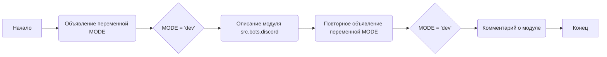

## Анализ кода `hypotez/src/endpoints/bots/discord/__init__.py`

### 1. <алгоритм>

1. **Инициализация:**
   -  Объявляется переменная `MODE` и присваивается значение `'dev'`.
   - **Пример:** `MODE` = `'dev'`

2. **Описание модуля:**
   -  Документация модуля описывает его как `src.bots.discord`.
   -  Также присутствуют описания для различных платформ (`Windows, Unix`) и синопсисы (краткие описания), но они не содержат конкретного кода.

3. **Повторение:**
     -  Переменная `MODE` переопределяется, ей присваивается снова значение `'dev'`. Это повторение может быть излишним.
     
4. **Комментарий:**
   -  В конце документации добавляется комментарий  `module: src.bots.discord`
   - **Пример:** `'module: src.bots.discord'`
   
**Поток данных:**

-  В данном коде нет явного потока данных между функциями или классами.
-  Переменная `MODE` инициализируется и перезаписывается, но не используется для каких-либо вычислений или операций в представленном коде.

### 2. <mermaid>

**Анализ зависимостей:**
- В коде нет импортов, поэтому нет внешних зависимостей.
- Диаграмма отображает последовательность инициализации переменной и описания модуля, а не зависимости между компонентами.
- `A` - Начало процесса инициализации.
- `B` -  Шаг объявления переменной `MODE`.
- `C` -  Шаг присвоения переменной `MODE` значения `'dev'`.
- `D` -  Описание модуля `src.bots.discord`.
- `E` -  Шаг повторного объявления переменной `MODE`.
- `F` -  Шаг повторного присвоения переменной `MODE` значения `'dev'`.
- `G` -  Добавление комментария о модуле.
- `H` - Конец процесса.

### 3. <объяснение>

**Импорты:**

- В данном файле нет импортов. Это означает, что он не использует никаких внешних модулей или пакетов из проекта `src`.

**Классы:**
- В коде не определены классы.

**Функции:**
- В коде не определены функции.

**Переменные:**
- `MODE` (тип: `str`):
   -  Инициализируется со значением `'dev'` для определения режима работы (вероятно, разработки).
   -  Повторно инициализируется с тем же значением, что является избыточным.
   - **Пример**:  `MODE = 'dev'`

**Объяснения:**

-   Файл `__init__.py` обычно используется для инициализации пакета. В данном случае, он просто устанавливает значение переменной `MODE` и содержит документацию.
-   Переменная `MODE`, вероятно, используется для определения, работает ли код в режиме разработки или в продакшн.
-   Повторная инициализация `MODE` с тем же значением является избыточной и может быть удалена.
-   Файл содержит только документацию и инициализацию переменной. Он не выполняет каких-либо конкретных действий.

**Потенциальные ошибки и области для улучшения:**

-   **Избыточность**: Повторная инициализация переменной `MODE` является избыточной.
-   **Отсутствие функциональности**: Файл содержит только объявление переменной и документацию, но не выполняет никаких конкретных действий.  Он не импортирует никаких модулей, не объявляет классов и функций, и его функциональность ограничена определением переменной.
-   **Неоднозначность синопсисов**: Синопсисы повторяются и не дают никакой дополнительной информации о модуле, что является плохой практикой документирования.
-   **Неиспользуемая переменная**: Переменная `MODE` объявлена, но нигде не используется. Если предполагается её использование, то нужно добавить её обработку в код.

**Взаимосвязи с другими частями проекта:**

-   Данный файл является частью пакета `src.bots.discord`, что подразумевает его связь с функциональностью ботов Discord в проекте.
-   В отсутствие импортов, связь с другими частями проекта неявная и, возможно, устанавливается через другие модули пакета `src.bots.discord`.
-   Переменная `MODE` потенциально может использоваться другими частями проекта для управления логикой в зависимости от окружения (разработка/продакшн).