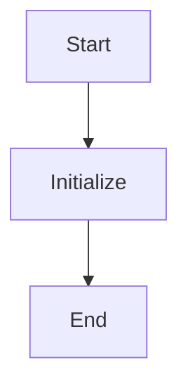

## Анализ кода `hypotez/src/endpoints/bots/discord/__init__.py`

### 1. <алгоритм>

Код представляет собой файл инициализации пакета `discord` в директории `src/bots/`.

1. **Объявление переменной `MODE`**:
   - Переменная `MODE` устанавливается в значение `'dev'`. Эта переменная, вероятно, используется для определения режима работы приложения (разработка, тестирование, продакшн).
   - _Пример_: ``. Значение `'dev'` указывает на режим разработки.

2.  **Комментарии**:
    -  Присутствуют комментарии, указывающие на платформы Windows и Unix.
    -  Также присутствуют комментарии `:synopsis:`, которые остаются пустыми, предполагается что в дальнейшем в них будет добавлено описание модуля.
    -  Комментарии в стиле docstring `"module: src.bots.discord"` предназначены для автоматической документации.
    -  Присутствуют множественные повторения комментариев, что не имеет никакой логической нагрузки.

3. **Пустой файл**:
   - В остальном файл инициализации пуст и не содержит никаких дополнительных классов, функций или импортов.
   - Функция `__init__.py` по сути ничего не делает, кроме объявления переменной `MODE` и пустых комментариев.

### 2. <mermaid>

**Объяснение диаграммы `mermaid`:**

- `Start`: Начало выполнения кода.
- `InitializeMode`: Инициализация переменной `MODE` значением `'dev'`. Это определяет режим работы приложения (в данном случае, режим разработки).
- `End`: Конец выполнения кода.

**Зависимости:**

Диаграмма не демонстрирует каких-либо внешних зависимостей или импортов, так как данный файл `__init__.py` является минимальным и не взаимодействует с другими модулями или пакетами напрямую.

### 3. <объяснение>

**Импорты:**
- В данном файле нет импортов. `__init__.py` файл предназначен для инициализации пакета, но в этом случае он не требует никаких импортов.

**Классы:**
- В файле нет объявленных классов.

**Функции:**
- В файле нет объявленных функций.

**Переменные:**
- `MODE`: Строковая переменная, заданная значением `'dev'`. Предположительно используется для определения режима работы приложения.

**Детали:**

- Файл `__init__.py` является файлом инициализации пакета `discord`. Наличие этого файла позволяет Python интерпретировать директорию `discord` как пакет, который может содержать модули и другие пакеты.
- В данном примере, файл `__init__.py` выполняет минимальную роль, устанавливая переменную `MODE` в значение `'dev'`. Это может использоваться для настройки поведения приложения, например, при различных режимах работы.
- Пустые комментарии `:synopsis:` стоит заполнить в будущем, для добавления информативных описаний пакета.
- Наличие повторяющихся комментариев, не является хорошей практикой и должно быть исправлено.

**Потенциальные ошибки и области для улучшения:**

- **Пустые комментарии `:synopsis:`:** Необходимо добавить осмысленные описания для пакета `discord`.
- **Повторяющиеся комментарии:** Лишние комментарии должны быть удалены, так как они не несут никакой логической нагрузки.
- **Использование `MODE`**: Необходимо убедиться, что переменная `MODE` используется во всем проекте последовательно. Если есть другие места, где этот режим настраивается, нужно убедиться, что они соответствуют этому определению.
- **Недостаточная функциональность**: В настоящий момент, файл `__init__.py` имеет минимальную функциональность, и его можно расширить, добавляя импорты, начальные настройки, или объявления классов для пакета `discord`.
- **Отсутствие docstring**: Отсутствует docstring для самого файла `__init__.py`.
- **`#! venv/Scripts/python.exe` и `#! venv/bin/python/python3.12`**: Это Shebang. Избыточные и не актуальные для `__init__.py`

**Цепочка взаимосвязей с другими частями проекта:**

- Данный файл `__init__.py` находится в пакете `discord`, который, вероятно, является частью более крупного модуля для интеграции с Discord.
- Переменная `MODE` вероятно, может быть использована другими модулями проекта для определения режима работы приложения.
- Этот файл инициализирует пакет, и другие модули внутри этого пакета могут использовать значения или настройки, заданные в этом файле.