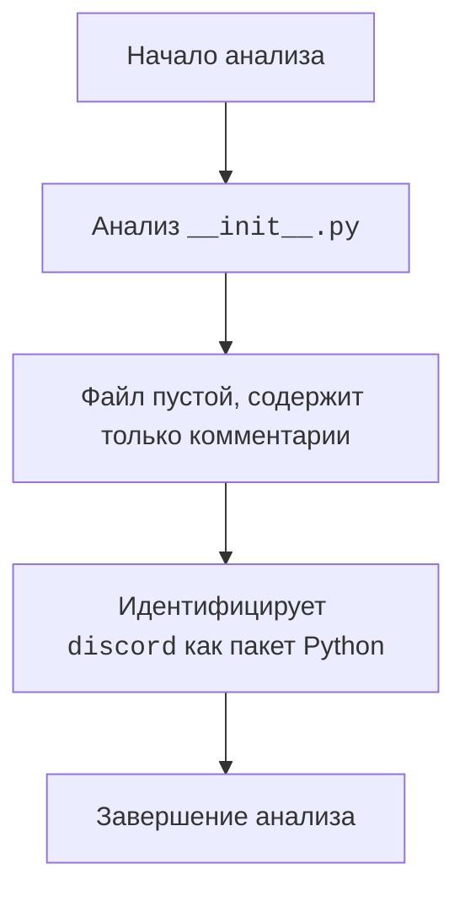

## ИНСТРУКЦИЯ:

Анализируй предоставленный код подробно и объясни его функциональность. Ответ должен включать три раздела:  

1.  **<алгоритм>**: Опиши рабочий процесс в виде пошаговой блок-схемы, включая примеры для каждого логического блока, и проиллюстрируй поток данных между функциями, классами или методами.  
2.  **<mermaid>**: Напиши код для диаграммы в формате `mermaid`, проанализируй и объясни все зависимости, 
    которые импортируются при создании диаграммы. 
    **ВАЖНО!** Убедитесь, что все имена переменных, используемые в диаграмме `mermaid`, 
    имеют осмысленные и описательные имена. Имена переменных вроде `A`, `B`, `C`, и т.д., не допускаются!  
    
    **Дополнительно**: Если в коде есть импорт `import header`, добавьте блок `mermaid` flowchart, объясняющий `header.py`:\
    ```mermaid
    flowchart TD
        Start --> Header[<code>header.py</code><br> Determine Project Root]
    
        Header --> import[Import Global Settings: <br><code>from src import gs</code>] 
    ```

3.  **<объяснение>**: Предоставьте подробные объяснения:  
    -   **Импорты**: Их назначение и взаимосвязь с другими пакетами `src.`.  
    -   **Классы**: Их роль, атрибуты, методы и взаимодействие с другими компонентами проекта.  
    -   **Функции**: Их аргументы, возвращаемые значения, назначение и примеры.  
    -   **Переменные**: Их типы и использование.  
    -   Выделите потенциальные ошибки или области для улучшения.  

Дополнительно, постройте цепочку взаимосвязей с другими частями проекта (если применимо).  

Это обеспечивает всесторонний и структурированный анализ кода.
## Формат ответа: `.md` (markdown)
**КОНЕЦ ИНСТРУКЦИИ**

### <алгоритм>
1. **Начало**: Анализ файла `__init__.py` в директории `src/bots/discord`.
2. **Идентификация**: Файл содержит только комментарии и не имеет исполняемого кода.
3. **Завершение**:  Файл используется для обозначения каталога `discord` как пакета Python.

**Пример:**
- Файл `__init__.py` в пакете `src/bots/discord` не содержит никакого исполняемого кода.
- Он действует как маркер для интерпретатора Python, указывая, что директория `discord` является пакетом, который может содержать другие модули Python.

### <mermaid>



**Объяснение `mermaid`:**
-   `Start`: Начало процесса анализа кода.
-   `CheckFile`: Проверка файла `__init__.py` на наличие исполняемого кода.
-   `Empty`: Указывает, что файл не содержит исполняемого кода, а только комментарии.
-   `Package`: Показывает роль файла как маркера, обозначающего директорию `discord` как пакет Python.
-   `End`: Завершение процесса анализа.

### <объяснение>

**Импорты**:

Файл `__init__.py` в данном коде не содержит никаких импортов. Он служит для того, чтобы Python распознавал директорию `src/bots/discord` как пакет, содержащий модули. 

**Классы**:

В данном коде нет определения классов.

**Функции**:

В данном коде нет определения функций.

**Переменные**:

В данном коде нет переменных.

**Объяснения:**

-   Файл `__init__.py` необходим для того, чтобы Python считал директорию `discord` пакетом. Без этого файла импорт модулей из этой директории не был бы возможен.
-   В данном случае файл пустой, содержащий только комментарии, и его основная функция - идентификация директории `discord` как пакета.
-   Отсутствие исполняемого кода означает, что этот файл не выполняет никаких действий, кроме как позволяет импортировать другие модули из директории `discord`.

**Цепочка взаимосвязей с другими частями проекта:**
-   Файл `__init__.py` позволяет другим частям проекта импортировать модули и пакеты, находящиеся в директории `src/bots/discord`.
-   Это означает, что другие части проекта могут взаимодействовать с ботами для Discord, используя модули, определенные в этом пакете.

**Потенциальные ошибки или области для улучшения:**
-   В данном файле нет ошибок, так как его основная функция заключается только в определении пакета.
-   Так как файл пуст, нет областей для улучшения. Он выполняет свое назначение в текущем состоянии.