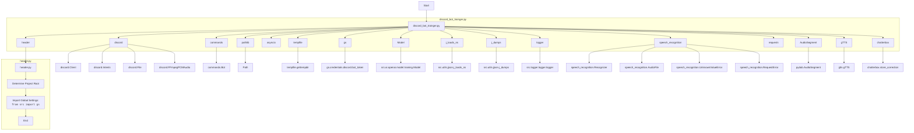

## ИНСТРУКЦИЯ:

Анализируй предоставленный код подробно и объясни его функциональность. Ответ должен включать три раздела:  

1. **<алгоритм>**: Опиши рабочий процесс в виде пошаговой блок-схемы, включая примеры для каждого логического блока, и проиллюстрируй поток данных между функциями, классами или методами.  
2. **<mermaid>**: Напиши код для диаграммы в формате `mermaid`, проанализируй и объясни все зависимости, 
    которые импортируются при создании диаграммы. 
    **ВАЖНО!** Убедитесь, что все имена переменных, используемые в диаграмме `mermaid`, 
    имеют осмысленные и описательные имена. Имена переменных вроде `A`, `B`, `C`, и т.д., не допускаются!  
    
    **Дополнительно**: Если в коде есть импорт `import header`, добавьте блок `mermaid` flowchart, объясняющий `header.py`:\
    ```mermaid
    flowchart TD
        Start --> Header[<code>header.py</code><br> Determine Project Root]
    
        Header --> import[Import Global Settings: <br><code>from src import gs</code>] 
    ```

3. **<объяснение>**: Предоставьте подробные объяснения:  
   - **Импорты**: Их назначение и взаимосвязь с другими пакетами `src.`.  
   - **Классы**: Их роль, атрибуты, методы и взаимодействие с другими компонентами проекта.  
   - **Функции**: Их аргументы, возвращаемые значения, назначение и примеры.  
   - **Переменные**: Их типы и использование.  
   - Выделите потенциальные ошибки или области для улучшения.  

Дополнительно, постройте цепочку взаимосвязей с другими частями проекта (если применимо).  

Это обеспечивает всесторонний и структурированный анализ кода.
## Формат ответа: `.md` (markdown)
**КОНЕЦ ИНСТРУКЦИИ**
```markdown
## <алгоритм>

```mermaid
graph LR
    A[Начало работы бота] --> B{Бот готов?};
    B -- Да --> C[Событие on_ready];
    C --> D[Логирование: Бот готов];
    B -- Нет --> B;
    A --> E{Получено сообщение?};
    E -- Да --> F{Сообщение от бота?};
    F -- Да --> E;
    F -- Нет --> G{Начинается с префикса?};
    G -- Да --> H[Обработка команды];
    H --> E;
    G -- Нет --> I{Есть вложения?};
    I -- Да --> J{Вложение - аудио?};
    J -- Да --> K[Распознавание речи];
    K --> L[Отправка сообщения в модель];
    I -- Нет --> L;
    L --> M{Пользователь в голосовом канале?};
    M -- Да --> N[Синтез речи и воспроизведение];
    M -- Нет --> O[Отправка ответа в текстовый канал];
    N --> E;
    O --> E;
    
    subgraph Команды бота
        H --> H1[hi: Приветствие];
        H --> H2[join: Присоединиться к голосовому каналу];
        H --> H3[leave: Покинуть голосовой канал];
        H --> H4[train: Тренировка модели];
         H --> H5[test: Тестирование модели];
         H --> H6[archive: Архивирование файлов];
        H --> H7[select_dataset: Выбор датасета];
        H --> H8[instruction: Инструкция];
        H --> H9[correct: Исправление сообщения];
        H --> H10[feedback: Обратная связь];
        H --> H11[getfile: Получение файла];
    end
    
    subgraph Модель
        L --> L1[Model.send_message];
        H4 --> L2[Model.train];
        H5 --> L3[Model.predict];
        H6 --> L4[Model.archive_files];
         H7 --> L5[Model.select_dataset_and_archive];
        
    end
    
    subgraph Обработка команд
      H1 --> send1[Ответ "HI!"];
      H2 --> send2[Ответ "Joined {channel}"];
      H3 --> send3[Ответ "Disconnected from the voice channel."];
       H4 --> send4[Ответ "Model training started. Job ID: {job_id}"];
       H5 --> send5[Ответ "Test complete. Predictions: {predictions}"];
       H6 --> send6[Ответ "Files in {directory} have been archived."];
       H7 --> send7[Ответ "Dataset selected and archived. Dataset: {dataset}"];
       H8 --> send8[Ответ Инструкция из файла];
       H9 --> send9[Ответ "Correction received: {correction}"];
        H10 --> send10[Ответ "Thank you for your feedback."];
        H11 --> send11[Ответ "Here is the file you requested:" or "File not found: {file_path}"];
      end
```

**Примеры для каждого логического блока:**

*   **A: Начало работы бота:** Бот запускается, инициализируются все необходимые компоненты.
*   **B: Бот готов?:** Проверка, готов ли бот к работе после запуска.
*   **C: Событие on_ready:** Вызывается, когда бот успешно подключен к Discord.
    *   *Пример:* Логируется сообщение "Logged in as {bot.user}".
*   **D: Логирование: Бот готов:** Запись в лог о готовности бота.
*   **E: Получено сообщение?:** Проверка наличия нового сообщения в Discord.
*   **F: Сообщение от бота?:** Проверка, является ли автор сообщения ботом.
    *   *Пример:* Если сообщение отправлено самим ботом, оно игнорируется.
*   **G: Начинается с префикса?:** Проверка, начинается ли сообщение с префикса бота (`!`).
    *   *Пример:* Сообщение "!hi" будет распознано как команда.
*   **H: Обработка команды:** Вызов соответствующей функции для обработки команды.
    *   *Пример:* Если сообщение "!train data.txt", вызывается функция `train`.
*   **I: Есть вложения?:** Проверка наличия вложений в сообщении.
*  **J: Вложение - аудио?:** Проверка, является ли вложение аудиофайлом.
    *   *Пример:* Если вложение - файл формата .mp3 или .ogg, то распознаем речь.
*   **K: Распознавание речи:** Вызов функции распознавания речи для извлечения текста из аудио.
    *   *Пример:* Из аудиофайла извлекается текст "Привет, как дела?".
*   **L: Отправка сообщения в модель:** Передача текста сообщения или распознанного текста в модель.
    *   *Пример:* Текст "Привет, как дела?" отправляется в модель для обработки.
*   **M: Пользователь в голосовом канале?:** Проверка, находится ли отправитель сообщения в голосовом канале.
*   **N: Синтез речи и воспроизведение:** Вызов функции для преобразования текста в речь и её воспроизведения в голосовом канале.
    *   *Пример:* Ответ "У меня все хорошо" озвучивается в голосовом канале.
*   **O: Отправка ответа в текстовый канал:** Отправка текстового ответа в чат.
    *  *Пример:* Ответ "У меня все хорошо" отправляется в текстовый канал.

**Подробности о командах:**

*   **H1: hi:** Отправляет приветственное сообщение.
*   **H2: join:** Подключает бота к голосовому каналу пользователя.
*   **H3: leave:** Отключает бота от голосового канала.
*   **H4: train:** Запускает обучение модели с предоставленными данными.
*   **H5: test:** Тестирует модель с предоставленными данными.
*   **H6: archive:** Архивирует файлы в указанной директории.
*   **H7: select_dataset:** Выбирает датасет для обучения и архивирует его.
*   **H8: instruction:** Отправляет инструкцию из внешнего файла.
*   **H9: correct:** Принимает исправления к предыдущим сообщениям.
*   **H10: feedback:** Принимает обратную связь от пользователей.
*    **H11: getfile:** Отправляет файл по указанному пути.

**Подробности о модели:**

*   **L1: Model.send_message:** Обрабатывает входящий текст и возвращает ответ от модели.
*   **L2: Model.train:** Запускает процесс обучения модели.
*   **L3: Model.predict:** Получает предсказание от модели на основе входных данных.
*    **L4: Model.archive_files:** Архивирует указанные файлы
*    **L5: Model.select_dataset_and_archive:** Выбирает датасет и архивирует.

**Подробности об отправке ответов:**
    
*   **send1: Ответ "HI!":** Отправляет приветствие в чат.
*   **send2: Ответ "Joined {channel}":** Уведомление о присоединении к каналу.
*   **send3: Ответ "Disconnected from the voice channel.":** Уведомление об отключении от канала.
*   **send4: Ответ "Model training started. Job ID: {job_id}":** Уведомление о начале тренировки модели.
*   **send5: Ответ "Test complete. Predictions: {predictions}":** Уведомление о завершении тестирования модели.
*    **send6: Ответ "Files in {directory} have been archived.":** Уведомление об архивировании файлов.
*   **send7: Ответ "Dataset selected and archived. Dataset: {dataset}":** Уведомление о выборе датасета.
*   **send8: Ответ Инструкция из файла:** Отправка инструкции.
*   **send9: Ответ "Correction received: {correction}":** Уведомление о получении исправления.
*   **send10: Ответ "Thank you for your feedback.":** Уведомление о получении фидбека.
*    **send11: Ответ "Here is the file you requested:" or "File not found: {file_path}":** Отправка файла по запросу или уведомление о неудаче.

## <mermaid>


**Анализ зависимостей:**

*   **`discord`**: Основная библиотека для работы с Discord API.
    *   `discord.Client`: Базовый класс для создания Discord-бота.
    *   `discord.Intents`: Определяет, какие события бот будет получать.
    *   `discord.File`: Используется для отправки файлов через Discord.
    *   `discord.FFmpegPCMAudio`: Используется для воспроизведения аудио в голосовом канале.
*   **`discord.ext.commands`**: Расширение библиотеки `discord` для создания командных ботов.
    *   `commands.Bot`: Основной класс для создания командного бота.
*   **`pathlib`**: Библиотека для работы с путями файлов.
    *   `Path`: Класс для представления пути к файлу или директории.
*   **`tempfile`**: Библиотека для создания временных файлов и директорий.
    *   `tempfile.gettempdir`: Функция для получения пути к временной директории.
*   **`asyncio`**: Библиотека для асинхронного программирования.
*   **`header`**: Кастомный модуль для определения корня проекта.
     *  `header.py`: Содержит логику определения корня проекта.
*   **`src.gs`**: Глобальные настройки проекта, включая токен бота.
    *   `gs.credentials.discord.bot_token`: Токен Discord-бота.
*   **`src.ai.openai.model.training.Model`**: Модель для обучения и предсказания.
*   **`src.utils.jjson`**: Кастомный модуль для работы с JSON.
    *   `src.utils.jjson.j_loads_ns`: Функция для загрузки данных из JSON.
    *   `src.utils.jjson.j_dumps`: Функция для сериализации данных в JSON.
*   **`src.logger.logger`**: Кастомный модуль для логирования.
    *   `src.logger.logger.logger`: Объект для записи логов.
*    **`speech_recognition`**: Библиотека для распознавания речи.
     *  `speech_recognition.Recognizer`: Класс для распознавания речи.
     *  `speech_recognition.AudioFile`: Класс для работы с аудио файлами.
     *  `speech_recognition.UnknownValueError`: Исключение, выбрасываемое при неудачном распознавании речи.
     *  `speech_recognition.RequestError`: Исключение, выбрасываемое при ошибке запроса к сервису распознавания.
*   **`requests`**: Библиотека для выполнения HTTP-запросов.
*   **`pydub`**: Библиотека для работы с аудио.
    *   `pydub.AudioSegment`: Класс для загрузки и обработки аудиофайлов.
*   **`gtts`**: Библиотека для преобразования текста в речь.
    *   `gtts.gTTS`: Класс для создания объектов gTTS.
*   **`src.endpoints.bots.discord.chatterbox`**: Кастомный модуль.
     *   `chatterbox.store_correction`: Функция для сохранения исправлений.

**Зависимости `header.py`:**
* **`header.py`**: Определяет корень проекта для корректной работы с относительными путями.
    *   Содержит логику для определения корневой директории проекта.
    *   Импортирует `gs` для доступа к глобальным настройкам.

## <объяснение>

**Импорты:**

*   `discord`: Библиотека для работы с Discord API. Позволяет боту подключаться к Discord-серверам, читать сообщения, отправлять ответы и управлять голосовыми каналами.
*   `discord.ext.commands`: Расширение библиотеки `discord`, которое упрощает создание ботов с командным интерфейсом.
*   `pathlib`:  Модуль для работы с путями файлов, обеспечивающий кроссплатформенную совместимость.
*   `tempfile`:  Модуль для создания временных файлов и директорий. Используется для сохранения аудиофайлов при распознавании речи.
*   `asyncio`: Библиотека для асинхронного программирования, позволяющая выполнять задачи параллельно.
*   `header`: Кастомный модуль для определения корня проекта. Обеспечивает корректную работу с относительными путями.
*   `src.gs`: Глобальные настройки проекта, включая токен бота и пути к файлам.
*   `src.ai.openai.model.training.Model`: Класс модели для обучения и предсказания.
*   `src.utils.jjson`: Модуль для работы с JSON, позволяющий сохранять и загружать данные в формате JSON.
*   `src.logger.logger`: Модуль для логирования, предназначен для записи событий, ошибок и другой полезной информации о работе бота.
*   `speech_recognition`: Библиотека для распознавания речи.
*   `requests`: Библиотека для отправки HTTP-запросов, используется для скачивания аудиофайлов.
*   `pydub`: Библиотека для работы с аудиофайлами, позволяющая конвертировать форматы.
*   `gtts`: Библиотека для преобразования текста в речь.
*   `src.endpoints.bots.discord.chatterbox`: Кастомный модуль, содержащий функцию `store_correction` для сохранения исправлений.

**Классы:**

*   `commands.Bot`: Представляет бота Discord. Управляет обработкой сообщений и команд.
    *   `command_prefix`: Префикс, используемый для вызова команд бота (по умолчанию `!`).
    *   `intents`: Разрешения, необходимые боту для работы.
*  `Model`: Класс, отвечающий за обучение и работу модели машинного обучения.
    *   `train(data, data_dir, positive)`: Метод для обучения модели на основе входных данных.
    *   `predict(test_data)`: Метод для получения предсказаний от модели.
    *   `archive_files(directory)`: Метод для архивации файлов в заданной директории.
    *    `select_dataset_and_archive(path_to_dir_positive, positive)`: Метод для выбора датасета и архивации.
    *   `send_message(text)`: Метод для отправки сообщения в модель и получения ответа.
    *    `save_job_id(job_id, message)`: Метод для сохранения ID задачи.
    *    `handle_errors(predictions, test_data)`: Метод для обработки ошибок.
*   `discord.FFmpegPCMAudio`: Используется для воспроизведения аудио в голосовом канале.

**Функции:**

*   `on_ready()`: Асинхронная функция, вызывается при успешном подключении бота к Discord.
    *   Не принимает аргументов.
    *   Логирует сообщение о готовности бота.
*   `hi(ctx)`: Асинхронная функция, команда для приветствия.
    *   `ctx`: Контекст команды, содержит информацию о канале и пользователе.
    *   Отправляет приветственное сообщение "HI!" в чат.
    *   Возвращает `True` при успешном выполнении.
*   `join(ctx)`: Асинхронная функция, команда для подключения бота к голосовому каналу.
    *   `ctx`: Контекст команды.
    *   Подключает бота к голосовому каналу пользователя и отправляет уведомление об этом.
*   `leave(ctx)`: Асинхронная функция, команда для отключения бота от голосового канала.
    *   `ctx`: Контекст команды.
    *   Отключает бота от голосового канала и отправляет уведомление.
*   `train(ctx, data, data_dir, positive, attachment)`: Асинхронная функция, команда для обучения модели.
    *   `ctx`: Контекст команды.
    *   `data`: Путь к файлу с данными для обучения.
    *   `data_dir`: Путь к директории с данными для обучения.
    *   `positive`: Флаг, указывающий, является ли датасет положительным.
    *    `attachment`: Прикрепленный файл.
    *   Запускает обучение модели и отправляет уведомление.
*   `test(ctx, test_data)`: Асинхронная функция, команда для тестирования модели.
    *   `ctx`: Контекст команды.
    *   `test_data`: Данные для тестирования в формате JSON.
    *   Получает предсказания от модели и отправляет результат.
*   `archive(ctx, directory)`: Асинхронная функция, команда для архивации файлов.
    *    `ctx`: Контекст команды.
    *   `directory`: Путь к директории, которую нужно заархивировать.
    *   Архивирует файлы в указанной директории.
*   `select_dataset(ctx, path_to_dir_positive, positive)`: Асинхронная функция, команда для выбора датасета.
    *    `ctx`: Контекст команды.
    *   `path_to_dir_positive`: Путь к директории с положительными данными.
    *   `positive`: Флаг, указывающий, является ли датасет положительным.
    *   Выбирает датасет и архивирует его.
*   `instruction(ctx)`: Асинхронная функция, команда для вывода инструкций.
    *   `ctx`: Контекст команды.
    *   Читает инструкции из файла и отправляет их в чат.
*   `correct(ctx, message_id, correction)`: Асинхронная функция, команда для исправления предыдущих ответов.
    *   `ctx`: Контекст команды.
    *   `message_id`: ID сообщения, которое нужно исправить.
    *   `correction`: Текст исправления.
    *   Сохраняет исправления.
*   `store_correction(original_text, correction)`: Функция для сохранения исправлений.
    *    `original_text`: Оригинальный текст.
    *    `correction`: Исправленный текст.
    *   Сохраняет исправления в файл.
*   `feedback(ctx, feedback_text)`: Асинхронная функция, команда для отправки обратной связи.
    *   `ctx`: Контекст команды.
    *   `feedback_text`: Текст обратной связи.
    *   Сохраняет обратную связь.
*   `getfile(ctx, file_path)`: Асинхронная функция, команда для получения файла.
    *   `ctx`: Контекст команды.
    *   `file_path`: Путь к файлу.
    *   Отправляет файл в чат.
*   `text_to_speech_and_play(text, channel)`: Асинхронная функция для преобразования текста в речь и воспроизведения в голосовом канале.
    *   `text`: Текст для преобразования.
    *   `channel`: Голосовой канал для воспроизведения.
    *   Преобразует текст в речь и воспроизводит его в голосовом канале.
*  `on_message(message)`: Асинхронная функция, вызывается при получении нового сообщения.
    *  `message`: Объект сообщения.
    *   Обрабатывает сообщения, распознает голосовые сообщения, отправляет ответы в текстовый или голосовой канал.
*   `recognizer(audio_url, language)`: Функция для распознавания речи.
    *   `audio_url`: Ссылка на аудиофайл.
    *   `language`: Язык распознавания.
    *   Распознает речь из аудиофайла и возвращает текст.

**Переменные:**

*   `MODE`: Режим работы (по умолчанию `dev`).
*   `path_to_ffmpeg`: Путь к исполняемому файлу ffmpeg.
*   `PREFIX`: Префикс для вызова команд бота (по умолчанию `!`).
*   `intents`: Объекты `discord.Intents`, определяющие, какие события бот будет получать.
*   `bot`: Объект бота типа `commands.Bot`.
*   `model`: Экземпляр класса `Model` для работы с моделью машинного обучения.
*   `instructions_path`: Путь к файлу с инструкциями.
*   `correction_file`: Путь к файлу, куда сохраняются исправления.
*   `audio_file_path`: Путь ко временному аудиофайлу.
*   `wav_file_path`: Путь к конвертированному аудиофайлу.
*    `tts`: Объект gTTS, используется для синтеза речи.
*    `response`: Ответ от модели.
*   `job_id`: ID задачи обучения.
*   `dataset`: Данные датасета.
*    `predictions`: Результаты предсказаний модели.
*   `logger`: Объект logger для логирования.

**Потенциальные ошибки и области для улучшения:**

*   **Обработка ошибок:**  В коде присутствует базовая обработка ошибок, но её можно улучшить, добавив более подробные сообщения об ошибках и журналирование исключений.
*   **Распознавание речи:** Функцию `recognizer` можно улучшить, добавив возможность выбора разных движков распознавания речи, поддержку разных форматов аудио, а также возможность обрабатывать аудиофайлы локально без скачивания.
*    **`text_to_speech_and_play`:** Функция может вызывать ошибки при длительной генерации речи, стоит добавить проверку и обработку этого.
*   **`on_message`:**  Можно расширить функциональность обработки сообщений, добавив обработку различных типов вложений, а также предусмотреть обработку сообщений в разных каналах.
*   **Асинхронность:**  В некоторых функциях можно использовать `async with` для более эффективного управления файловыми операциями.
*    **Сообщения об ошибках:** Сообщения об ошибках можно сделать более информативными для пользователя.
*    **Хранение данных:** Использовать базу данных для хранения исправлений и других данных для более удобного доступа.

**Взаимосвязь с другими частями проекта:**

*   Бот взаимодействует с `src.ai.openai.model.training.Model` для обучения, тестирования и предсказаний.
*   Использует `src.utils.jjson` для работы с JSON-данными.
*   Использует `src.logger.logger` для логирования событий.
*   Использует `src.gs` для получения глобальных настроек, таких как токен бота.
*   Использует `chatterbox.store_correction` для сохранения исправлений.
*    `header.py`  обеспечивает корректную работу с путями в проекте.

Этот код представляет собой Discord-бота, который может подключаться к голосовым каналам, отвечать на команды, обучать модель машинного обучения, распознавать речь, воспроизводить текст в речь и выполнять другие полезные функции.