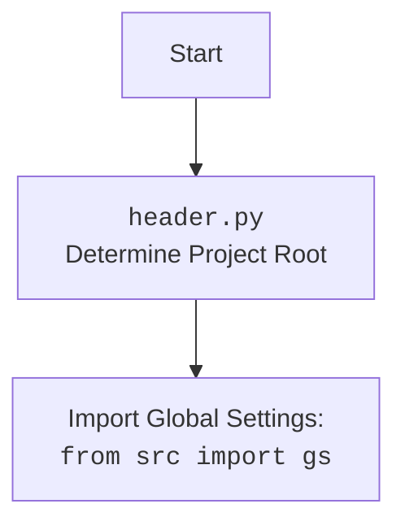

## ИНСТРУКЦИЯ:

Анализируй предоставленный код подробно и объясни его функциональность. Ответ должен включать три раздела:

1.  **<алгоритм>**: Опиши рабочий процесс в виде пошаговой блок-схемы, включая примеры для каждого логического блока, и проиллюстрируй поток данных между функциями, классами или методами.
2.  **<mermaid>**: Напиши код для диаграммы в формате `mermaid`, проанализируй и объясни все зависимости,
    которые импортируются при создании диаграммы.
    **ВАЖНО!** Убедитесь, что все имена переменных, используемые в диаграмме `mermaid`,
    имеют осмысленные и описательные имена. Имена переменных вроде `A`, `B`, `C`, и т.д., не допускаются!

    **Дополнительно**: Если в коде есть импорт `import header`, добавьте блок `mermaid` flowchart, объясняющий `header.py`:
    ```mermaid
    flowchart TD
        Start --> Header[<code>header.py</code><br> Determine Project Root]

        Header --> import[Import Global Settings: <br><code>from src import gs</code>]
    ```

3.  **<объяснение>**: Предоставьте подробные объяснения:
    -   **Импорты**: Их назначение и взаимосвязь с другими пакетами `src.`.
    -   **Классы**: Их роль, атрибуты, методы и взаимодействие с другими компонентами проекта.
    -   **Функции**: Их аргументы, возвращаемые значения, назначение и примеры.
    -   **Переменные**: Их типы и использование.
    -   Выделите потенциальные ошибки или области для улучшения.

Дополнительно, постройте цепочку взаимосвязей с другими частями проекта (если применимо).

Это обеспечивает всесторонний и структурированный анализ кода.
## Формат ответа: `.md` (markdown)
**КОНЕЦ ИНСТРУКЦИИ**

### 1. <алгоритм>
**Пошаговый алгоритм работы кода:**

1.  **Инициализация:**
    -   Устанавливается переменная `MODE` в значение `'dev'`.
    -   Импортируются необходимые модули: `sys`, `json`, `Version` из `packaging.version`, `Path` из `pathlib`.
2.  **Определение корневой директории проекта (`set_project_root`):**
    -   Функция `set_project_root` ищет корневую директорию проекта, поднимаясь по дереву каталогов от текущего файла (`__file__`).
    -   В качестве маркеров для определения корня используются файлы/каталоги, указанные в `marker_files` (по умолчанию `'__root__'`).
        -   Пример:
            -   Пусть структура проекта:
                ```
                project/
                    __root__/
                    src/
                        bots/
                            discord/
                                header.py
                ```
            -   `set_project_root` начнет с `project/src/bots/discord`, проверит наличие `__root__` в этой директории.
            -   Если не найдет, поднимется в `project/src/bots` и проверит.
            -   Так будет продолжаться, пока не найдет `__root__` в `project/`.
    -   Если корневая директория найдена, её путь добавляется в `sys.path`, чтобы импорт модулей работал корректно.
    -   Возвращается путь к корневой директории.
3.  **Получение корневой директории:**
    -   Вызывается `set_project_root`, результат сохраняется в глобальной переменной `__root__`.
4.  **Загрузка глобальных настроек (`gs`):**
    -   Из пакета `src` импортируется модуль `gs` (глобальные настройки).
5.  **Загрузка настроек из файла `settings.json`:**
    -   Пытается открыть и загрузить JSON-файл `settings.json`, находящийся в директории `src` относительно корня проекта.
    -   В случае успеха загруженные настройки сохраняются в словаре `settings`.
    -   Если файл не найден или JSON некорректен, исключение обрабатывается, `settings` остается `None`.
6.  **Загрузка документации из файла `README.MD`:**
    -   Пытается открыть и прочитать файл `README.MD`, находящийся в директории `src` относительно корня проекта.
    -   Содержимое файла сохраняется в строке `doc_str`.
    -    Если файл не найден или возникает ошибка чтения, исключение обрабатывается, `doc_str` остается `None`.
7.  **Инициализация глобальных переменных:**
    -   Из словаря `settings` (если он загружен) извлекаются:
        -   `__project_name__` (имя проекта), по умолчанию `'hypotez'`.
        -   `__version__` (версия), по умолчанию `''`.
        -   `__author__` (автор), по умолчанию `''`.
        -   `__copyright__` (копирайт), по умолчанию `''`.
        -   `__cofee__` (сообщение для поддержки разработчика), по умолчанию "Treat the developer to a cup of coffee for boosting enthusiasm in development: https://boosty.to/hypo69".
    -   `__doc__` устанавливается равным содержимому `doc_str`, если оно есть, иначе `''`.
    -    `__details__` устанавливается в `''` .

### 2. <mermaid>
```mermaid
flowchart TD
    Start --> FindRoot[set_project_root(): <br>Find Project Root Directory]
    FindRoot --> CheckMarker[Check for marker files: <br>('__root__')]
    CheckMarker -- Found --> SetRoot[Set project root]
    CheckMarker -- Not Found --> CheckParent[Check parent directory]
    CheckParent --Has Parent -->CheckMarker
    CheckParent --No Parent --> SetRoot
    SetRoot --> AddPath[Add to sys.path]
    AddPath --> GetSettings[Get Global Settings: <br>from src import gs]    
    GetSettings --> LoadSettings[Load settings from settings.json]
    LoadSettings --> LoadReadme[Load documentation from README.MD]
    LoadReadme --> SetVariables[Set global variables]
    SetVariables --> End
    
    subgraph "header.py"
        Start
        FindRoot
        CheckMarker
        CheckParent
        SetRoot
        AddPath
        GetSettings
        LoadSettings
        LoadReadme
        SetVariables
        End
    end
```


**Описание диаграммы `mermaid`:**

*   **`flowchart TD`**: Указывает, что это диаграмма потока (flowchart) с направлением сверху вниз (TD - Top Down).
*   **`Start --> FindRoot`**: Начало процесса, переходит к блоку, который определяет корневую директорию проекта.
*   **`FindRoot --> CheckMarker`**: Определение корневой директории переходит к проверке наличия маркерных файлов в текущем каталоге.
*   **`CheckMarker -- Found --> SetRoot`**: Если маркерные файлы найдены, то устанавливается корневая директория.
*    **`CheckMarker -- Not Found --> CheckParent`**: Если маркерные файлы не найдены, то переходим к проверке родительского каталога.
*   **`CheckParent --Has Parent -->CheckMarker`**: Если у каталога есть родительский каталог, то повторяем проверку маркерных файлов в родительском каталоге.
*   **`CheckParent --No Parent --> SetRoot`**: Если родительского каталога нет, то устанавливаем корневой каталог.
*   **`SetRoot --> AddPath`**: После установки корневой директории, добавляем её в `sys.path`.
*   **`AddPath --> GetSettings`**: Далее импортируем глобальные настройки из пакета `src` (модуль `gs`).
*   **`GetSettings --> LoadSettings`**: Пытаемся загрузить настройки из файла `settings.json`.
*   **`LoadSettings --> LoadReadme`**: Загружаем документацию из файла `README.MD`.
*   **`LoadReadme --> SetVariables`**: Инициализируем глобальные переменные с настройками.
*   **`SetVariables --> End`**: Конец процесса.
*   **`subgraph "header.py" ... end`**: Обозначает, что все блоки внутри являются частью файла `header.py`.

### 3. <объяснение>

#### Импорты:
*   **`import sys`**: Модуль `sys` используется для взаимодействия с интерпретатором Python. В данном случае он используется для добавления корневой директории проекта в `sys.path`, что позволяет импортировать модули из этой директории.
*   **`import json`**: Модуль `json` используется для работы с данными в формате JSON. В этом коде он используется для загрузки настроек из файла `settings.json`.
*   **`from packaging.version import Version`**: Импортирует класс `Version` из пакета `packaging.version`. Этот класс предназначен для работы с версиями пакетов, но в данном коде он не используется. Импорт может быть избыточным.
*   **`from pathlib import Path`**: Импортирует класс `Path` из модуля `pathlib`. Класс `Path` используется для представления путей к файлам и каталогам и упрощает работу с ними.

    **Связь с пакетами `src`**:
    *   `from src import gs`: Импортирует модуль `gs` из пакета `src`. Предполагается, что `gs` содержит глобальные настройки или пути, используемые в проекте. Зависимость от `gs` означает, что `header.py` ожидает, что `gs` уже настроен и доступен.

#### Классы:
*   **`pathlib.Path`**: Используется для работы с путями к файлам. Методы этого класса применяются для поиска корневой директории проекта и формирования путей к файлам настроек и документации.

#### Функции:
*   **`set_project_root(marker_files=('__root__')) -> Path`**:
    *   **Аргументы**:
        *   `marker_files`: кортеж строк, которые служат маркерами для определения корня проекта. По умолчанию это `('__root__')`.
    *   **Возвращаемое значение**: Объект типа `Path`, представляющий путь к корневой директории проекта.
    *   **Назначение**: Находит корневую директорию проекта, поднимаясь по дереву каталогов от текущего файла. Функция обеспечивает кросс-платформенность поиска корня проекта, так как использует `pathlib.Path`.
    *   **Примеры**:
        -   Если текущий файл находится в `project/src/bots/discord/header.py` и маркер `__root__` находится в `project`, то функция вернёт `Path("project")`.
        -   Если маркер не найден, то функция вернет путь к директории, где находится файл, это `Path("project/src/bots/discord/")`.
        -   В случаи, если маркер `__root__` не найден, вернет путь к текущей директории
            , `Path("project/src/bots/discord/")`.

#### Переменные:
*   **``**: Строковая переменная, указывающая режим работы приложения. В данном случае установлено значение `'dev'`, что может означать режим разработки.
*   **`__root__ : Path`**: Глобальная переменная типа `Path`, хранящая путь к корневой директории проекта, полученный из функции `set_project_root()`.
*  **`settings: dict = None`**: Словарь, в который загружаются настройки из файла `settings.json`. Изначально устанавливается в `None` и может быть перезаписан при успешной загрузке.
*  **`doc_str: str = None`**: Строка, в которую загружается текст из файла `README.MD`. Изначально устанавливается в `None` и может быть перезаписана при успешной загрузке.
*   **`__project_name__: str`**: Строка, содержащая имя проекта. Инициализируется значением из `settings` или по умолчанию `'hypotez'`.
*   **`__version__: str`**: Строка, содержащая версию проекта. Инициализируется значением из `settings` или по умолчанию `''`.
*   **`__doc__: str`**: Строка, содержащая документацию проекта. Инициализируется содержимым `doc_str` или по умолчанию `''`.
*   **`__details__: str`**: Строка, содержащая подробную информацию о проекте, инициализируется пустой строкой `''`.
*   **`__author__: str`**: Строка, содержащая имя автора проекта. Инициализируется значением из `settings` или по умолчанию `''`.
*   **`__copyright__: str`**: Строка, содержащая информацию о копирайте проекта. Инициализируется значением из `settings` или по умолчанию `''`.
*   **`__cofee__: str`**: Строка, содержащая сообщение о поддержке разработчика. Инициализируется значением из `settings` или сообщением по умолчанию.

#### Потенциальные ошибки и области для улучшения:

1.  **Обработка исключений:**
    *   Исключения при открытии и загрузке файлов `settings.json` и `README.MD` обрабатываются пустым блоком `...`. Это может привести к трудностям при отладке, так как ошибки не логируются.
    *   **Рекомендация**:  Следует добавить логирование ошибок (с использованием модуля `logging`) или поднимать исключения для дальнейшей обработки.
2.  **Избыточный импорт**:
    *   Импорт `from packaging.version import Version` не используется в коде.
    *   **Рекомендация**: Удалить неиспользуемый импорт.
3.  **Глобальные переменные:**
    *   Использование большого количества глобальных переменных может усложнить понимание кода.
    *   **Рекомендация**:  Рассмотреть возможность инкапсуляции глобальных переменных в класс или модуль.
4. **Недостаточно информативное имя переменной**:
    *   Переменная `__cofee__` написана с ошибкой `cofee`, это не критично, но стоит исправить
    *  **Рекомендация**: Исправить имя переменной на `__coffee__`.
5. **Недостаточно проверок**:
   *   Не проверяется тип данных, полученных из `settings.json`
   *   **Рекомендация**: Добавить проверки, например, чтобы `project_name` было строкой.

#### Взаимосвязи с другими частями проекта:

*   `header.py` зависит от наличия файла `__root__`, `settings.json` и `README.MD` в определенной структуре директорий проекта.
*   `header.py` устанавливает глобальные переменные, которые могут использоваться другими частями проекта.
*   Импорт `from src import gs` указывает на то, что `header.py` использует глобальные настройки, определенные в модуле `gs` пакета `src`.
*   Данный файл выполняет роль "заголовка" проекта, устанавливая необходимые переменные окружения, которые затем могут использоваться другими модулями проекта.

В целом, `header.py` является важным файлом в проекте, так как он определяет корневую директорию и загружает основные настройки, которые используются в других модулях. Однако, существует несколько областей для улучшения, включая обработку ошибок, избыточный импорт, использование глобальных переменных и проверки типов данных.