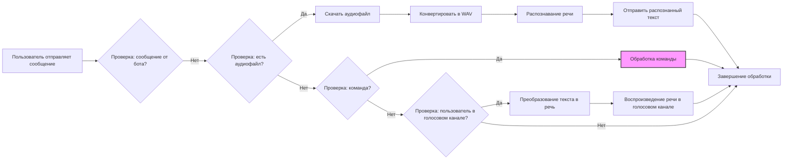

## Анализ кода модуля Discord-бота

### <алгоритм>

1.  **Инициализация бота:**
    *   Бот Discord инициализируется с заданным префиксом команд (`!`) и необходимыми интентами для доступа к событиям Discord.
    *   Пример: `bot = commands.Bot(command_prefix='!', intents=intents)`.
2.  **Обработка сообщений:**
    *   Бот ожидает входящие сообщения.
    *   Проверяет, не является ли сообщение от самого бота.
    *   **Аудиосообщение:**
        *   Если сообщение содержит аудиофайл:
            *   Скачивает аудиофайл.
            *   Конвертирует аудиофайл в формат WAV.
            *   Распознает речь с помощью Google Speech Recognition (функция `recognizer`).
            *   Отправляет распознанный текст в текстовый канал.
    *   **Текстовое сообщение:**
        *   Если пользователь находится в голосовом канале:
            *   Преобразует текст в речь (функция `text_to_speech_and_play`).
            *   Воспроизводит речь в голосовом канале.
3.  **Обработка команд:**
    *   Бот обрабатывает команды, начинающиеся с префикса `!`.
    *   `!hi`: Отправляет приветственное сообщение.
    *   `!join`: Присоединяется к голосовому каналу пользователя.
    *   `!leave`: Покидает голосовой канал.
    *   `!train`: Запускает обучение модели, принимает данные из файла или текста.
    *   `!test`: Запускает тестирование модели, принимает данные из файла или текста.
    *   `!archive`: Архивирует файлы в указанной директории.
    *   `!select_dataset`: Позволяет выбрать датасет для обучения.
    *   `!instruction`: Отправляет инструкции из файла.
    *   `!correct`: Позволяет исправить предыдущее сообщение бота.
    *   `!feedback`: Собирает обратную связь от пользователя.
    *   `!getfile`: Отправляет файл из указанного пути.
4.  **Распознавание речи (`recognizer`):**
    *   Принимает путь к аудиофайлу.
    *   Скачивает аудиофайл.
    *   Конвертирует в формат WAV.
    *   Использует Google Speech Recognition для распознавания речи.
    *   Возвращает распознанный текст.
5.  **Преобразование текста в речь (`text_to_speech_and_play`):**
    *   Принимает текст.
    *   Преобразует текст в речь с помощью `gTTS`.
    *   Воспроизводит аудио в голосовом канале.
6.  **Логирование:**
    *   Модуль `logger` используется для записи событий и ошибок.

**Пример потока данных:**

1. Пользователь отправляет голосовое сообщение в Discord.
2. Бот получает сообщение и определяет, что есть аудиофайл.
3.  Аудиофайл скачивается и передается в функцию `recognizer`.
4.  Функция `recognizer` обрабатывает аудио и возвращает распознанный текст.
5.  Распознанный текст отправляется в текстовый канал Discord.

### <mermaid>

**Объяснение `mermaid`:**

*   **`graph LR`**: Определяет тип диаграммы как направленный граф (Left to Right).
*   **`A[Пользователь отправляет сообщение]`**:  Начальный узел, представляющий действие пользователя.
*   **`B{Проверка: сообщение от бота?}`**: Узел-решение, проверяющий, является ли сообщение исходящим от бота.
*   **`C{Проверка: есть аудиофайл?}`**: Узел-решение, проверяющий наличие аудиофайла в сообщении.
*   **`D[Скачать аудиофайл]`**: Узел процесса, загружающий аудиофайл.
*  **`E[Конвертировать в WAV]`**: Узел процесса, конвертирующий аудио в формат WAV.
*   **`F[Распознавание речи]`**: Узел процесса, использующий `recognizer` для преобразования речи в текст.
*   **`G[Отправить распознанный текст]`**: Узел процесса, отправляющий распознанный текст в текстовый канал.
 *   **`H{Проверка: команда?}`**: Узел-решение, проверяющий наличие команды в сообщении.
    *   **`I[Обработка команды]`**: Узел процесса, обрабатывающий команду бота.
    *  **`J{Проверка: пользователь в голосовом канале?}`**: Узел-решение, проверяющий, находится ли пользователь в голосовом канале.
   *  **`K[Преобразование текста в речь]`**: Узел процесса, использующий `text_to_speech_and_play` для преобразования текста в речь.
    *  **`L[Воспроизведение речи в голосовом канале]`**: Узел процесса, воспроизводящий речь в голосовом канале.
*   **`M[Завершение обработки]`**: Конечный узел, завершающий обработку сообщения.
*  **`classDef command fill:#f9f,stroke:#333,stroke-width:2px`**: Определение стиля для узлов, представляющих обработку команд.
*   **`class I command`**: Применение стиля `command` к узлу `I`.

### <объяснение>

**Импорты:**

*   `discord.py`: Основная библиотека для взаимодействия с Discord API, включает в себя классы и функции для работы с ботами, событиями, каналами, сообщениями и т.д.
*   `speech_recognition`: Библиотека для распознавания речи, позволяет конвертировать аудио в текст с использованием различных сервисов (в данном случае Google Speech Recognition).
*   `pydub`: Библиотека для работы с аудиофайлами, в основном для конвертации форматов (например, из MP3 в WAV).
*   `gtts`: Библиотека для преобразования текста в речь, используется для генерации аудио из текстовых данных.
*   `requests`: Библиотека для выполнения HTTP-запросов, используется для скачивания файлов по URL.
*   `pathlib`: Библиотека для работы с путями файлов, обеспечивает объектно-ориентированный подход к работе с файловой системой.
*   `tempfile`: Библиотека для создания временных файлов и директорий.
*   `asyncio`: Библиотека для асинхронного программирования, позволяет выполнять несколько операций параллельно.
*   `src.config.settings as gs`: Импортирует глобальные настройки приложения, включая токен Discord-бота.
*   `src.utils.logger as logger`:  Импортирует модуль для логирования событий и ошибок.
*   `src.utils.archive as archive`:  Импортирует модуль для архивации файлов.

**Классы:**

*   `discord.Client` (из `discord.py`): Базовый класс для создания ботов Discord. В данном коде используется класс `discord.commands.Bot`, который является подклассом `discord.Client`, с расширенной функциональностью для обработки команд.

**Функции:**

*   `recognizer(audio_path)`:
    *   **Аргументы**: `audio_path` - путь к аудиофайлу.
    *   **Возвращаемое значение**: Распознанный текст (строка).
    *   **Назначение**: Скачивает аудиофайл, конвертирует его в WAV формат, и распознает речь с помощью Google Speech Recognition.
    *   **Пример**: `recognizer("audio.mp3")` вернет строку с распознанным текстом из аудиофайла.
*   `text_to_speech_and_play(text, voice_channel)`:
    *   **Аргументы**: `text` - текст для преобразования в речь, `voice_channel` - голосовой канал, в котором будет воспроизводиться речь.
    *   **Возвращаемое значение**: Нет (функция выполняет действие, а не возвращает значение).
    *   **Назначение**: Преобразует текст в речь с помощью `gTTS` и воспроизводит его в указанном голосовом канале.
    *   **Пример**: `text_to_speech_and_play("Привет", voice_channel)` воспроизведет фразу "Привет" в указанном канале.

**Переменные:**

*   `bot`: Экземпляр класса `discord.commands.Bot`, представляет собой бот Discord.
*   `intents`: Объект класса `discord.Intents`, определяет разрешения бота на доступ к событиям Discord.
*   `guild`: Экземпляр класса `discord.Guild`, представляет сервер Discord, в котором бот работает.
*   `voice_client`: Экземпляр класса `discord.VoiceClient`, представляет подключение бота к голосовому каналу.
*   `audio_path`: Строка, представляющая путь к скачанному аудиофайлу.
*   `text`: Строка, представляющая распознанный текст или текст для преобразования в речь.
*   `channel`: Экземпляр класса `discord.TextChannel`, текстовый канал, в который бот отправляет сообщения.

**Потенциальные ошибки и области для улучшения:**

*   **Обработка ошибок:** В коде отсутствует детальная обработка исключений (например, при скачивании файла, распознавании речи, преобразовании текста в речь). Необходимо добавить `try-except` блоки для обработки возможных ошибок и логировать их с помощью `logger`.
*   **Асинхронность:** Некоторые операции (например, скачивание файла, обработка аудио) могут быть ресурсоемкими и занимать продолжительное время. Следует проверить, выполняются ли все эти операции асинхронно, чтобы бот не блокировался при их выполнении.
*   **Безопасность:** Токен Discord-бота не должен храниться в открытом виде. Рекомендуется использовать переменные окружения или другие безопасные методы хранения секретных данных.
*   **Код ревью:**  Код должен быть разбит на модули и классы, чтобы упростить его поддержку и расширение. Например, код для обработки команд можно вынести в отдельный модуль.
*  **Масштабируемость:** При росте функциональности бота, необходимо уделить внимание проектированию архитектуры, чтобы обеспечить возможность добавления новых функций и команд без значительных изменений в существующем коде.

**Взаимосвязи с другими частями проекта:**

*   Модуль `src.config.settings` предоставляет токен Discord-бота и другие настройки.
*   Модуль `src.utils.logger` используется для логирования событий, что позволяет отслеживать работу бота и выявлять ошибки.
*   Модуль `src.utils.archive` используется для архивации файлов, что может быть полезно для хранения обучающих данных.
*   Модуль может использовать другие модули проекта для взаимодействия с моделью машинного обучения.

Этот анализ предоставляет подробное описание работы Discord-бота, его функциональности, а также предложения по улучшению и рефакторингу кода.