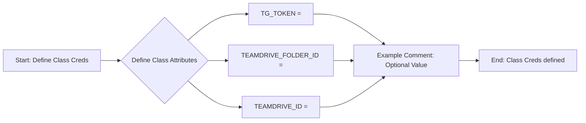
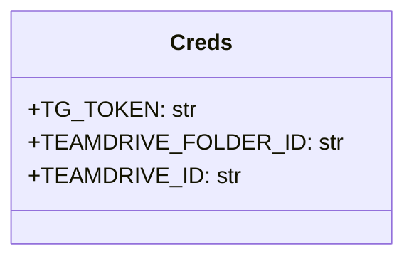

## АНАЛИЗ КОДА: `hypotez/src/endpoints/bots/google_dirve/creds.py`

### 1. <алгоритм>

**Блок-схема:**

**Описание:**

1.  **Start: Define Class `Creds`:**  Начинается определение класса с именем `Creds`. Этот класс предназначен для хранения учетных данных (кредов) для работы с Telegram ботом и Google Drive.
2.  **Define Class Attributes:** Внутри класса определяются три атрибута.
3.  **`TG_TOKEN = ""`:** Атрибут `TG_TOKEN`, который будет содержать токен Telegram бота. Изначально установлен как пустая строка.
    *   **Пример:** `TG_TOKEN = "1234567890:AbCdEfGhIjKlMnOpQrStUvWxYz"`
4.  **`TEAMDRIVE_FOLDER_ID = ""`:** Атрибут `TEAMDRIVE_FOLDER_ID`, который будет содержать идентификатор папки в Team Drive. Изначально установлен как пустая строка.
    *   **Пример:** `TEAMDRIVE_FOLDER_ID = "abcdefghijklmnopqrstuvwxyz12345"`
5.  **`TEAMDRIVE_ID = ""`:** Атрибут `TEAMDRIVE_ID`, который будет содержать идентификатор Team Drive. Изначально установлен как пустая строка.
    *   **Пример:** `TEAMDRIVE_ID = "0abcdefghijklmnopqrstuvwxyz12345"`
6.  **Example Comment: Optional Value:** Код содержит комментарии с примерами значений для всех трех атрибутов.
7.  **End: Class `Creds` defined:** Завершается определение класса `Creds`.

### 2. <mermaid>

**Объяснение:**

*   `classDiagram`: Объявляет, что это диаграмма классов.
*   `class Creds`: Объявляет класс с именем `Creds`.
*   `+TG_TOKEN: str`: Объявляет публичный атрибут `TG_TOKEN` типа `str` (строка).
*   `+TEAMDRIVE_FOLDER_ID: str`: Объявляет публичный атрибут `TEAMDRIVE_FOLDER_ID` типа `str` (строка).
*   `+TEAMDRIVE_ID: str`: Объявляет публичный атрибут `TEAMDRIVE_ID` типа `str` (строка).

**Зависимости:**
В данном коде отсутствуют импорты, и поэтому нет внешних зависимостей. Класс `Creds` сам по себе не зависит от других частей проекта. Он является моделью для хранения настроек и используется как часть конфигурации для Google Drive и Telegram бота.

### 3. <объяснение>

**Импорты:**

*   В данном файле нет явных импортов, что означает, что код не зависит от каких-либо внешних библиотек или модулей на уровне этого файла.

**Классы:**

*   **`Creds`**:
    *   **Роль:** Класс `Creds` представляет собой контейнер для хранения учетных данных, необходимых для взаимодействия с Telegram ботом и Google Drive.
    *   **Атрибуты:**
        *   `TG_TOKEN` (str):  Предназначен для хранения токена Telegram бота. По умолчанию пустая строка.
        *   `TEAMDRIVE_FOLDER_ID` (str):  Предназначен для хранения ID папки в Team Drive. По умолчанию пустая строка.
        *   `TEAMDRIVE_ID` (str):  Предназначен для хранения ID Team Drive. По умолчанию пустая строка.
    *   **Методы:** Класс не имеет методов, он служит исключительно для хранения данных.
    *   **Взаимодействие:** Этот класс используется для предоставления необходимых значений в других частях проекта, где требуется аутентификация бота и работа с Google Drive. Он является частью глобальной конфигурации.

**Функции:**

*   В данном файле нет функций.

**Переменные:**

*   `TG_TOKEN` (str): Хранит токен Telegram бота.  Инициализируется пустой строкой, значение должно быть задано до использования.
*   `TEAMDRIVE_FOLDER_ID` (str): Хранит ID папки в Team Drive. Инициализируется пустой строкой, значение должно быть задано до использования.
*   `TEAMDRIVE_ID` (str): Хранит ID Team Drive. Инициализируется пустой строкой, значение должно быть задано до использования.

**Потенциальные ошибки и области для улучшения:**

*   **Отсутствие проверок:** Нет проверок на то, что значения токенов и идентификаторов не являются пустыми или недопустимыми до их использования, что может привести к ошибкам во время выполнения программы.
*   **Безопасность:** Хранение токенов в виде открытого текста в коде не является безопасным. Рекомендуется использовать переменные окружения или более безопасные способы хранения учетных данных.
*   **Отсутствие документации:** Недостаточно комментариев для объяснения цели каждого атрибута и его важности. Это может затруднить понимание и использование кода другими разработчиками.

**Цепочка взаимосвязей:**

Этот файл является частью более крупного проекта и служит для предоставления настроек. Его данные, вероятно, используются в других частях проекта, например, в коде, который взаимодействует с API Telegram и Google Drive. Его можно рассматривать как модель конфигурации, которая применяется в различных модулях.

*   **`hypotez/src/endpoints/bots/telegram_bot.py`:** может использовать `Creds.TG_TOKEN` для аутентификации бота.
*   **`hypotez/src/endpoints/bots/google_drive.py`:** может использовать `Creds.TEAMDRIVE_FOLDER_ID` и `Creds.TEAMDRIVE_ID` для доступа к Google Drive.