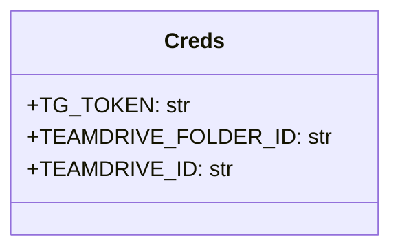

## Анализ кода `hypotez/src/endpoints/bots/google_dirve/creds.py`

### 1. <алгоритм>

**Описание:**

Код определяет класс `Creds`, который предназначен для хранения учетных данных (credentials) для взаимодействия с Telegram ботом и Google Drive. Он включает в себя токен Telegram бота, ID папки на Google Team Drive, и ID самого Team Drive. 

**Пошаговая блок-схема:**

1. **Начало:** Объявление класса `Creds`.
2. **Объявление TG_TOKEN:**
   - Создание атрибута класса `TG_TOKEN` типа `str`.
   - Изначально устанавливается в пустую строку `""`.
   - *Пример*: `TG_TOKEN = "your_telegram_bot_token"` (если токен известен).
   - *Логика:* Хранит токен, необходимый для аутентификации бота в Telegram.
3. **Объявление TEAMDRIVE_FOLDER_ID:**
   - Создание атрибута класса `TEAMDRIVE_FOLDER_ID` типа `str`.
   - Изначально устанавливается в пустую строку `""`.
   - *Пример*: `TEAMDRIVE_FOLDER_ID = "folder_id_on_teamdrive"` (если ID известен).
   - *Логика:* Хранит ID папки на Team Drive, куда будут загружаться файлы.
4. **Объявление TEAMDRIVE_ID:**
   - Создание атрибута класса `TEAMDRIVE_ID` типа `str`.
   - Изначально устанавливается в пустую строку `""`.
   - *Пример*: `TEAMDRIVE_ID = "teamdrive_id"` (если ID известен).
   - *Логика:* Хранит ID Team Drive для операций с ним.
5. **Конец:** Завершение определения класса `Creds`.

### 2. <mermaid>

**Объяснение зависимостей:**

- **Creds:** Представляет класс, который содержит все необходимые учетные данные. Атрибуты `TG_TOKEN`, `TEAMDRIVE_FOLDER_ID` и `TEAMDRIVE_ID` являются строками, предназначенными для хранения токена Telegram бота, ID папки и ID Team Drive соответственно.
  
    -   `TG_TOKEN`:  Строка для хранения токена Telegram бота.
    -   `TEAMDRIVE_FOLDER_ID`: Строка для хранения ID папки в Google Team Drive.
    -   `TEAMDRIVE_ID`: Строка для хранения ID Google Team Drive.

### 3. <объяснение>

**Импорты:**
  - В данном файле нет импортов. Он представляет собой простой класс для хранения настроек.

**Классы:**

- **`Creds`:**
    - **Роль:** Класс предназначен для хранения учетных данных, необходимых для работы с Telegram ботом и Google Team Drive.
    - **Атрибуты:**
        - `TG_TOKEN`: Строка, хранящая токен Telegram-бота. По умолчанию пустая.
        - `TEAMDRIVE_FOLDER_ID`: Строка, хранящая ID папки в Team Drive. По умолчанию пустая.
        - `TEAMDRIVE_ID`: Строка, хранящая ID Team Drive. По умолчанию пустая.
    - **Методы:** В классе не определено никаких методов.
    - **Взаимодействие:** Этот класс предназначен для использования другими частями проекта, которым необходимо иметь доступ к учетным данным для Telegram и Google Drive.

**Функции:**

  - В данном коде нет функций.

**Переменные:**

  - `TG_TOKEN`, `TEAMDRIVE_FOLDER_ID`, `TEAMDRIVE_ID` - строковые переменные, которые предназначены для хранения учетных данных.

**Потенциальные ошибки и области для улучшения:**

1.  **Безопасность:** Хранение токенов и ID напрямую в коде не является безопасной практикой. Рекомендуется использовать переменные окружения или более безопасные методы хранения учетных данных.
2.  **Отсутствие валидации:** Код не проводит валидацию введенных данных. Необходимо добавить проверки на корректность форматов токена и ID, чтобы избежать ошибок в дальнейшем.
3.  **Отсутствие документации:** Код не имеет подробных комментариев, которые бы объясняли назначение каждого атрибута.
4.  **Жесткое кодирование (hardcoding):** Использование пустых строк в качестве дефолтных значений может привести к ошибкам, если разработчик забудет их заполнить перед запуском.

**Цепочка взаимосвязей с другими частями проекта:**

- Этот файл является частью модуля `google_drive` внутри директории `bots`, которая находится внутри `endpoints`.
- Вероятно, другие части проекта, которые используют API Google Drive, будут импортировать этот класс `Creds`, чтобы получить доступ к необходимым учетным данным. Например, файл `google_drive.py` может использовать этот класс для аутентификации и операций с Google Drive.
- Данные из этого файла используются модулем для доступа к Google Drive и Telegram bot, что является важной частью интеграции с внешними сервисами.

**Заключение:**

Файл `creds.py` является ключевым для хранения настроек аутентификации. Однако, он нуждается в улучшениях в области безопасности и обработки ошибок. Использование переменных окружения и валидации данных сделает код более надежным и безопасным.