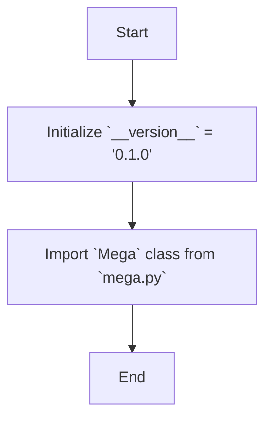

## Анализ кода `hypotez/src/endpoints/bots/google_dirve/mega/__init__.py`

### <алгоритм>

1.  **Инициализация версии:**
    *   Устанавливается переменная `__version__` со строковым значением `'0.1.0'`. Это используется для отслеживания версии пакета или модуля.

2.  **Импорт класса `Mega`:**
    *   Выполняется импорт класса `Mega` из модуля `mega.py`, находящегося в том же каталоге.
    *   `# NOQA` указывает инструменту проверки кода (например, flake8), что эта строка не должна вызывать предупреждений о неиспользуемом импорте. В данном случае, вероятно, класс `Mega` используется где-то в другом месте этого пакета, даже если явно не используется в `__init__.py`.

**Примеры:**

*   `__version__ = '0.1.0'`: Пример инициализации переменной версии.
*   `from .mega import Mega`: Пример импорта класса `Mega` из модуля `mega.py`.

### <mermaid>

**Объяснение зависимостей `mermaid`:**

*   **Start**: Начало процесса.
*   **InitVersion**: Инициализация переменной `__version__` со строковым значением `'0.1.0'`. Эта переменная, как правило, хранит информацию о версии текущего пакета или модуля.
*   **ImportMega**: Импорт класса `Mega` из модуля `mega.py` в том же каталоге. Это делает класс `Mega` доступным для использования в текущем пакете.
*   **End**: Конец процесса инициализации.

### <объяснение>

**Импорты:**

*   `from .mega import Mega`:
    *   **Назначение:** Этот импорт делает класс `Mega` доступным для использования в текущем пакете `google_drive.mega`. Точка `.` в `from .mega` означает, что модуль `mega.py` находится в том же каталоге, что и файл `__init__.py`.
    *   **Взаимосвязь с `src`:** Класс `Mega`, вероятно, предоставляет функциональность для взаимодействия с Google Drive через API, возможно, через какой-либо API. Пакет `google_drive` входит в структуру `src/endpoints/bots`.

**Переменные:**

*   `__version__ = '0.1.0'`:
    *   **Тип:** Строка (`str`).
    *   **Использование:** Переменная `__version__` обычно используется для хранения версии текущего пакета. Она может быть использована для отображения версии пакета, проверки совместимости или для других целей, связанных с версионированием.

**Функции/Классы:**

*   `Mega`:
    *   **Роль:** Класс `Mega`  определен в файле `mega.py` и представляет основную логику работы с Google Drive API. Детали о его атрибутах и методах не видны в этом файле и требуют анализа `mega.py`.
    *   **Взаимодействие с другими компонентами проекта:**  Класс `Mega`, вероятно, используется другими частями проекта для загрузки, скачивания файлов, создания папок и других взаимодействий с Google Drive.

**Потенциальные ошибки и области для улучшения:**

*   **Отсутствие документации:** В данном файле нет docstring, который бы объяснял назначение модуля. Желательно добавить docstring к файлу, объясняющий его назначение.
*   **`# NOQA`:** Использование `# NOQA` может скрыть потенциальную проблему. Нужно убедиться, что класс `Mega` действительно используется где-то еще, если его нет в `__init__.py`. Лучше было бы явно импортировать то, что требуется.
*   **Мало информации:** Для полного понимания работы нужно анализировать `mega.py`.

**Цепочка взаимосвязей:**

1.  `hypotez/src/endpoints/bots/google_dirve/mega/__init__.py` является точкой входа для пакета `google_drive.mega`.
2.  Импортирует класс `Mega` из `hypotez/src/endpoints/bots/google_dirve/mega/mega.py`.
3.  Пакет `google_drive` вероятно используется в `hypotez/src/endpoints/bots/`,  для обработки взаимодействий с Google Drive в контексте ботов.
4.  Эти боты, в свою очередь, скорее всего, вызываются через endpoint'ы, реализованные в `src/endpoints/`.
5.  Все это является частью проекта `hypotez`.