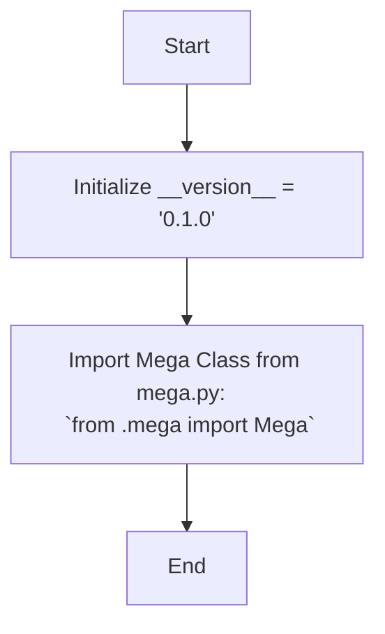

## <алгоритм>

1. **Инициализация версии**:
   - Устанавливается переменная `__version__` в значение `'0.1.0'`. Эта переменная обычно используется для отслеживания версии пакета.
   - Пример: `__version__ = '0.1.0'` устанавливает версию текущего модуля.
2. **Импорт класса `Mega`**:
   - Импортируется класс `Mega` из модуля `mega.py`, расположенного в текущей директории.
   - `from .mega import Mega` означает, что класс `Mega` будет доступен для использования в этом модуле.
   - Пример: Если в файле `mega.py` есть класс `Mega`, то он будет импортирован.
   - NOQA: # NOQA указывает на то, что линтер должен проигнорировать эту строку, например, если он считает, что импорт не используется, хотя это не так.
3. **Конец**:
   - Код заканчивается после импорта.

## <mermaid>

## <объяснение>

**Импорты**:
- `from .mega import Mega`:
    - `from .mega` означает, что импорт происходит из модуля `mega.py`, расположенного в той же директории, что и текущий файл `__init__.py`.
    - `import Mega` импортирует класс `Mega` из `mega.py`, что позволяет использовать его в текущем модуле.
    - NOQA: `# NOQA` указывает на то, что линтер должен проигнорировать эту строку.
    - **Взаимосвязь**: Данный импорт устанавливает связь между текущим модулем и модулем `mega.py`, позволяя использовать функциональность класса `Mega` в текущем модуле.

**Классы**:
- Класс `Mega`:
  - Судя по импорту, класс `Mega` должен находиться в файле `mega.py`, однако данный код не предоставляет информации о его реализации.
  - Вероятно, он используется для работы с Google Drive.

**Функции**:
- В данном коде отсутствуют функции, но предполагается, что класс `Mega` содержит методы, которые обеспечивают необходимую функциональность.

**Переменные**:
- `__version__`:
  - Тип: Строка (`str`).
  - Используется для хранения версии текущего модуля.

**Цепочка взаимосвязей**:
- Данный файл `__init__.py` является частью пакета `mega` в каталоге `google_dirve`.  `__init__.py` файл делает папку `mega` пакетом Python, позволяя импортировать модули и классы из нее.
- Предполагается, что класс `Mega`  используется для работы с Google Drive API, и  взаимодействует с другими частями проекта, вероятно, обрабатывая файлы и папки в Google Drive.

**Потенциальные ошибки и области для улучшения**:
-   Код не включает подробностей об  `Mega`.  
-   Отсутствуют подробные комментарии о назначении `Mega`, его атрибутах и методах.
-   Нет информации о том, как используется версия и в каких случаях.