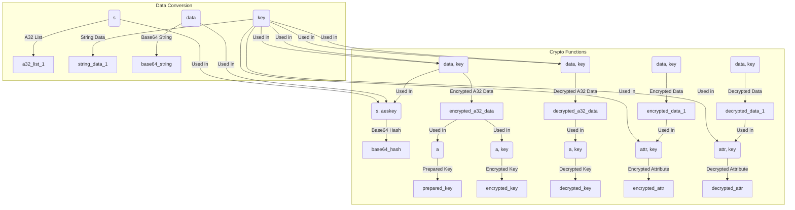

## <алгоритм>

**1. `aes_cbc_encrypt(data, key)`:**
   - **Вход:** `data` (строка байтов), `key` (байтовая строка - ключ шифрования).
   - **Действие:** Создаёт объект шифрования AES в режиме CBC с заданным ключом и IV (вектор инициализации, равный 16 нулевым байтам). Шифрует входные данные с помощью созданного объекта.
   - **Выход:** Зашифрованные данные (байтовая строка).
   - **Пример:** `aes_cbc_encrypt(b'test data', b'secretkey1234567')`

**2. `aes_cbc_decrypt(data, key)`:**
   - **Вход:** `data` (зашифрованная байтовая строка), `key` (байтовая строка - ключ шифрования).
   - **Действие:** Создаёт объект дешифрования AES в режиме CBC с заданным ключом и IV (вектор инициализации, равный 16 нулевым байтам). Дешифрует входные данные с помощью созданного объекта.
   - **Выход:** Дешифрованные данные (байтовая строка).
   - **Пример:** `aes_cbc_decrypt(b'\\xf1\\x03...', b'secretkey1234567')`

**3. `aes_cbc_encrypt_a32(data, key)`:**
   - **Вход:** `data` (список 32-битных целых чисел), `key` (список 32-битных целых чисел).
   - **Действие:** Преобразует `data` и `key` в строки, вызывает `aes_cbc_encrypt` и возвращает результат, преобразованный обратно в список 32-битных целых чисел.
   - **Выход:** Зашифрованные данные (список 32-битных целых чисел).
   - **Пример:** `aes_cbc_encrypt_a32([123, 456, 789, 101], [987, 654, 321, 101])`

**4. `aes_cbc_decrypt_a32(data, key)`:**
    - **Вход:** `data` (список 32-битных целых чисел), `key` (список 32-битных целых чисел).
    - **Действие:** Преобразует `data` и `key` в строки, вызывает `aes_cbc_decrypt` и возвращает результат, преобразованный обратно в список 32-битных целых чисел.
    - **Выход:** Дешифрованные данные (список 32-битных целых чисел).
    - **Пример:** `aes_cbc_decrypt_a32([987, 654, 321, 101], [123, 456, 789, 101])`

**5. `stringhash(s, aeskey)`:**
   - **Вход:** `s` (строка), `aeskey` (список 32-битных целых чисел).
   - **Действие:**
        1. Преобразует входную строку `s` в список 32-битных целых чисел.
        2. Создаёт список `h32` из четырех нулей.
        3. Побайтово XORит список целых чисел от строки `s` в `h32`.
        4. 0x4000 раз шифрует `h32` с помощью `aes_cbc_encrypt_a32` с ключом `aeskey`.
        5. Возвращает первые два элемента `h32` (h32[0], h32[2]), закодированные в base64.
   - **Выход:** Хэш в формате base64 (строка).
   - **Пример:** `stringhash("example", [123, 456, 789, 101])`

**6. `prepare_key(a)`:**
   - **Вход:** `a` (список 32-битных целых чисел).
   - **Действие:**
        1. Инициализирует `pkey` четырьмя константами.
        2. В цикле 0x10000 раз, для каждого 4-элементного среза списка `a`, создаёт `key` из этого среза и шифрует `pkey` с помощью `aes_cbc_encrypt_a32` с ключом `key`.
   - **Выход:** `pkey` (список 32-битных целых чисел).
   - **Пример:** `prepare_key([1, 2, 3, 4, 5, 6, 7, 8])`

**7. `encrypt_key(a, key)`:**
   - **Вход:** `a` (список 32-битных целых чисел), `key` (список 32-битных целых чисел).
   - **Действие:** Шифрует каждый 4-элементный срез списка `a` с помощью `aes_cbc_encrypt_a32` с ключом `key` и объединяет результаты в один список.
   - **Выход:** Зашифрованный ключ (список 32-битных целых чисел).
   - **Пример:** `encrypt_key([1, 2, 3, 4, 5, 6, 7, 8], [9, 10, 11, 12])`

**8. `decrypt_key(a, key)`:**
    - **Вход:** `a` (список 32-битных целых чисел), `key` (список 32-битных целых чисел).
    - **Действие:** Дешифрует каждый 4-элементный срез списка `a` с помощью `aes_cbc_decrypt_a32` с ключом `key` и объединяет результаты в один список.
    - **Выход:** Дешифрованный ключ (список 32-битных целых чисел).
    - **Пример:** `decrypt_key([9, 10, 11, 12, 13, 14, 15, 16], [1, 2, 3, 4])`

**9. `enc_attr(attr, key)`:**
   - **Вход:** `attr` (словарь), `key` (список 32-битных целых чисел).
   - **Действие:**
       1. Преобразует словарь `attr` в строку JSON, добавляет префикс 'MEGA'.
       2. Дополняет строку нулевыми байтами, если длина не кратна 16.
       3. Шифрует строку с помощью `aes_cbc_encrypt`.
   - **Выход:** Зашифрованный атрибут (байтовая строка).
   - **Пример:** `enc_attr({"name": "test"}, [123, 456, 789, 101])`

**10. `dec_attr(attr, key)`:**
    - **Вход:** `attr` (зашифрованная байтовая строка), `key` (список 32-битных целых чисел).
    - **Действие:**
         1. Дешифрует входную строку с помощью `aes_cbc_decrypt`.
         2. Удаляет нулевые байты и префикс "MEGA".
         3. Преобразует строку в словарь JSON.
    - **Выход:** Дешифрованный атрибут (словарь).
    - **Пример:** `dec_attr(b'\\xf1\\x03...', [123, 456, 789, 101])`

## <mermaid>

**Импорты и их зависимости:**

1.  **`import json`**: Используется для сериализации и десериализации словарей в JSON-строку в функциях `enc_attr` и `dec_attr`. Этот модуль является частью стандартной библиотеки Python и не зависит от `src`.
2.  **`from Crypto.Cipher import AES`**: Импортирует класс `AES` из библиотеки `pycryptodome`, который используется для шифрования и дешифрования данных с помощью алгоритма AES в режиме CBC. Эта библиотека является сторонней и должна быть установлена.
3.  **`from mega.utils import a32_to_str, str_to_a32, a32_to_base64`**: Импортирует три функции:
    *   `a32_to_str`: Преобразует список 32-битных целых чисел в строку.
    *   `str_to_a32`: Преобразует строку в список 32-битных целых чисел.
    *   `a32_to_base64`: Преобразует список 32-битных целых чисел в строку base64.
    Эти функции находятся в модуле `mega.utils` внутри проекта `src` и служат для преобразования типов данных, используемых в функциях шифрования и хэширования.

## <объяснение>

**Импорты:**

*   `import json`: Модуль `json` используется для работы с JSON-данными, в частности, для сериализации словарей в строки и наоборот. Это необходимо для хранения и передачи атрибутов в зашифрованном виде.
*   `from Crypto.Cipher import AES`:  Из модуля `Crypto.Cipher` импортируется класс `AES`, который предоставляет реализацию алгоритма шифрования AES (Advanced Encryption Standard). Это основной инструмент для шифрования и дешифрования данных.
*   `from mega.utils import a32_to_str, str_to_a32, a32_to_base64`: Импортирует три функции из модуля `mega.utils` внутри проекта:
    *   `a32_to_str`: Конвертирует список 32-битных целых чисел в строку, необходима для работы с криптографией.
    *   `str_to_a32`: Конвертирует строку в список 32-битных целых чисел, используется для подготовки данных к шифрованию.
    *   `a32_to_base64`: Конвертирует список 32-битных целых чисел в base64 строку, для получения хэша.

**Функции:**

1.  **`aes_cbc_encrypt(data, key)`**:
    *   Аргументы:
        *   `data`: Данные для шифрования в виде байтовой строки.
        *   `key`: Ключ шифрования в виде байтовой строки.
    *   Возвращает: Зашифрованные данные в виде байтовой строки.
    *   Назначение: Выполняет шифрование данных с использованием алгоритма AES в режиме CBC. IV (Initialization Vector) здесь жестко задан как 16 нулевых байтов.
2.  **`aes_cbc_decrypt(data, key)`**:
    *   Аргументы:
        *   `data`: Зашифрованные данные в виде байтовой строки.
        *   `key`: Ключ шифрования в виде байтовой строки.
    *   Возвращает: Дешифрованные данные в виде байтовой строки.
    *   Назначение: Выполняет дешифрование данных, зашифрованных алгоритмом AES в режиме CBC, с тем же IV, что и при шифровании.
3.  **`aes_cbc_encrypt_a32(data, key)`**:
    *   Аргументы:
        *   `data`: Данные для шифрования в виде списка 32-битных целых чисел.
        *   `key`: Ключ шифрования в виде списка 32-битных целых чисел.
    *   Возвращает: Зашифрованные данные в виде списка 32-битных целых чисел.
    *   Назначение: Выполняет шифрование данных, представленных в виде списка 32-битных целых чисел. Сначала преобразует данные в строку, затем шифрует и преобразует обратно в список 32-битных целых чисел.
4.  **`aes_cbc_decrypt_a32(data, key)`**:
    *   Аргументы:
        *   `data`: Зашифрованные данные в виде списка 32-битных целых чисел.
        *   `key`: Ключ шифрования в виде списка 32-битных целых чисел.
    *   Возвращает: Дешифрованные данные в виде списка 32-битных целых чисел.
    *   Назначение: Выполняет дешифрование данных, зашифрованных функцией `aes_cbc_encrypt_a32`, преобразовывая данные из списка целых чисел в строку, затем расшифрует и преобразует обратно в список 32-битных целых чисел.
5.  **`stringhash(s, aeskey)`**:
    *   Аргументы:
        *   `s`: Строка для хэширования.
        *   `aeskey`: Ключ AES в виде списка 32-битных целых чисел.
    *   Возвращает: Хэш строки в формате base64.
    *   Назначение: Вычисляет хэш строки `s`, используя алгоритм AES-CBC в цикле.
6.  **`prepare_key(a)`**:
    *   Аргументы:
        *   `a`: Список 32-битных целых чисел.
    *   Возвращает: Подготовленный ключ в виде списка 32-битных целых чисел.
    *   Назначение: Подготавливает ключ `pkey`, многократно шифруя его с помощью данных из списка `a`. Это итеративный процесс, использующий AES для генерации ключа.
7.  **`encrypt_key(a, key)`**:
    *   Аргументы:
        *   `a`: Список 32-битных целых чисел.
        *   `key`: Ключ шифрования в виде списка 32-битных целых чисел.
    *   Возвращает: Зашифрованный ключ в виде списка 32-битных целых чисел.
    *   Назначение: Шифрует блоки данных из списка `a` с помощью ключа `key` и объединяет результаты.
8.  **`decrypt_key(a, key)`**:
    *   Аргументы:
        *   `a`: Зашифрованный ключ в виде списка 32-битных целых чисел.
        *   `key`: Ключ шифрования в виде списка 32-битных целых чисел.
    *   Возвращает: Расшифрованный ключ в виде списка 32-битных целых чисел.
    *   Назначение: Расшифровывает блоки зашифрованных данных из списка `a` с помощью ключа `key` и объединяет результаты.
9.  **`enc_attr(attr, key)`**:
    *   Аргументы:
        *   `attr`: Словарь, представляющий атрибуты.
        *   `key`: Ключ шифрования в виде списка 32-битных целых чисел.
    *   Возвращает: Зашифрованные атрибуты в виде байтовой строки.
    *   Назначение: Шифрует атрибуты, представленные словарем `attr`. Сериализует атрибуты в JSON, добавляет префикс 'MEGA', дополняет до кратности 16 байтам и шифрует.
10. **`dec_attr(attr, key)`**:
    *   Аргументы:
        *   `attr`: Зашифрованные атрибуты в виде байтовой строки.
        *   `key`: Ключ шифрования в виде списка 32-битных целых чисел.
    *   Возвращает: Дешифрованные атрибуты в виде словаря.
    *   Назначение: Дешифрует атрибуты, зашифрованные функцией `enc_attr`. Удаляет префикс 'MEGA', убирает padding, и десериализует JSON в словарь.

**Переменные:**

*   `data`: Данные для шифрования/дешифрования (строка байтов или список 32-битных целых чисел).
*   `key`: Ключ шифрования (строка байтов или список 32-битных целых чисел).
*   `encryptor`, `decryptor`: Объекты AES для шифрования/дешифрования.
*   `s32`, `h32`: Списки 32-битных целых чисел для хэширования.
*   `pkey`: Подготовленный ключ в виде списка 32-битных целых чисел.
*   `attr`: Атрибуты для шифрования/дешифрования (словарь).

**Потенциальные ошибки и области для улучшения:**

*   **Фиксированный IV**: Использование фиксированного IV в `aes_cbc_encrypt` и `aes_cbc_decrypt` делает шифрование уязвимым. Рекомендуется использовать случайный IV для каждого шифрования, передавая его вместе с зашифрованными данными.
*   **Отсутствие проверки длины ключа**: Не проверяется длина ключа, что может привести к ошибке при создании объекта `AES`.
*   **Обработка ошибок**: В коде отсутствуют явные блоки обработки исключений.
*   **Использование '0' в качестве IV**: IV должен быть случайным и не секретным. Использование нулевого IV снижает криптостойкость алгоритма.
*   **Зависимость от `mega.utils`**: Код напрямую зависит от функций из `mega.utils`, что может ограничивать его переиспользование в других проектах. Лучше обернуть код в класс, что сделает код более переносимым и поддерживаемым.
*   **Жёстко закодированные константы**: Константы вроде `0x4000` и `0x10000` могут быть вынесены в константы для большей читаемости и лёгкости настройки.

**Цепочка взаимосвязей:**

Данный модуль `crypto.py` является частью модуля `mega` и предоставляет криптографические функции. Функции `a32_to_str`, `str_to_a32` и `a32_to_base64` импортируются из `mega.utils`. Этот модуль используется для шифрования и дешифрования различных данных, включая ключи и атрибуты, которые могут применяться в других частях проекта для взаимодействия с API Mega.

Взаимосвязи можно описать так:
1. **`mega.utils` -> `crypto.py`**: функции преобразования типов используются в криптографических функциях.
2. **`crypto.py` -> Другие части `mega`**: (предположительно) используются для шифрования и дешифрования данных, например при загрузке или скачивании файлов с Mega.

Этот анализ обеспечивает детальное понимание функциональности предоставленного кода, его зависимостей, а также выявляет потенциальные проблемы и возможности для улучшения.