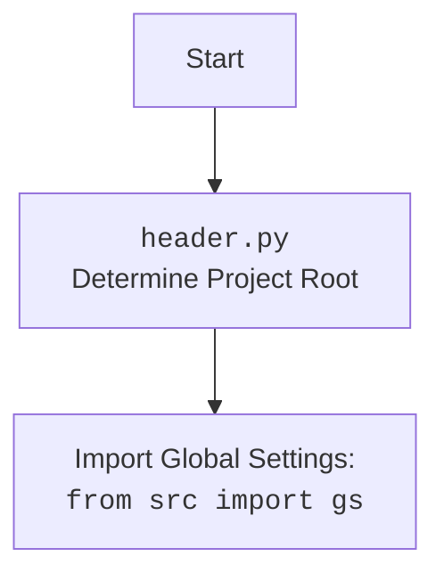

## ИНСТРУКЦИЯ:

Анализируй предоставленный код подробно и объясни его функциональность. Ответ должен включать три раздела:

1.  **<алгоритм>**: Опиши рабочий процесс в виде пошаговой блок-схемы, включая примеры для каждого логического блока, и проиллюстрируй поток данных между функциями, классами или методами.
2.  **<mermaid>**: Напиши код для диаграммы в формате `mermaid`, проанализируй и объясни все зависимости,
    которые импортируются при создании диаграммы.
    **ВАЖНО!** Убедитесь, что все имена переменных, используемые в диаграмме `mermaid`,
    имеют осмысленные и описательные имена. Имена переменных вроде `A`, `B`, `C`, и т.д., не допускаются!

    **Дополнительно**: Если в коде есть импорт `import header`, добавьте блок `mermaid` flowchart, объясняющий `header.py`:
    ```mermaid
    flowchart TD
        Start --> Header[<code>header.py</code><br> Determine Project Root]

        Header --> import[Import Global Settings: <br><code>from src import gs</code>]
    ```

3.  **<объяснение>**: Предоставьте подробные объяснения:
    -   **Импорты**: Их назначение и взаимосвязь с другими пакетами `src.`.
    -   **Классы**: Их роль, атрибуты, методы и взаимодействие с другими компонентами проекта.
    -   **Функции**: Их аргументы, возвращаемые значения, назначение и примеры.
    -   **Переменные**: Их типы и использование.
    -   Выделите потенциальные ошибки или области для улучшения.

Дополнительно, постройте цепочку взаимосвязей с другими частями проекта (если применимо).

Это обеспечивает всесторонний и структурированный анализ кода.
## Формат ответа: `.md` (markdown)
**КОНЕЦ ИНСТРУКЦИИ**

## <алгоритм>

**1. `set_project_root(marker_files)`:**

   *   **Начало**: Функция принимает кортеж `marker_files` (например, `('__root__', '.git')`) для поиска корневого каталога проекта.
   *   **Инициализация**:
      *   `current_path` - Получает абсолютный путь к директории, где расположен файл.
      *   `__root__` - Изначально устанавливается равным `current_path`.
   *   **Поиск родительских директорий**:
      *   Перебирает текущую директорию и все её родительские директории.
      *   Для каждой родительской директории `parent` проверяет, существует ли хотя бы один из файлов `marker_files` (например, `parent/__root__` или `parent/.git`).
      *   **Пример**: Если `marker_files` это `('__root__', '.git')` и в директории `some_path/project_root/.git` существует, то `project_root` является корнем.
      *   Если маркерный файл найден, устанавливает `__root__` равным `parent` и прерывает цикл.
   *   **Добавление в `sys.path`**:
      *   Проверяет, находится ли `__root__` в списке путей поиска модулей `sys.path`.
      *   Если нет, добавляет `__root__` в начало списка `sys.path`.
   *   **Возврат**: Возвращает `__root__` - путь к корню проекта.
      * **Пример:** Если скрипт запущен в `some_path/project_root/src/endpoints/bots/header.py`, то вернет `some_path/project_root`, если там будет найден `.git` или `__root__`.

**2. Инициализация переменных проекта:**

   *   `__root__` - Вызывается функция `set_project_root()` для определения корневого каталога проекта.
   *   **Импорт настроек**:  `from src import gs` - импортируются глобальные настройки из модуля `gs` пакета `src`.
   *   **Чтение настроек из JSON**:
      *   Пытается открыть и прочитать файл `settings.json` из каталога `src` относительно корня проекта.
      *   Если файл найден, загружает его содержимое как словарь в переменную `settings`.
      *   В случае ошибки (файла нет или ошибка чтения JSON)  продолжает выполнение.
      *   **Пример**: Читает `some_path/project_root/src/settings.json`
   *   **Чтение README.MD**:
      *   Пытается открыть и прочитать файл `README.MD` из каталога `src` относительно корня проекта.
      *   Если файл найден, загружает его содержимое как строку в переменную `doc_str`.
      *   В случае ошибки (файла нет или ошибка чтения)  продолжает выполнение.
        *   **Пример**: Читает `some_path/project_root/src/README.MD`
   *   **Инициализация метаданных проекта**:
      *   `__project_name__`, `__version__`, `__doc__`, `__details__`, `__author__`, `__copyright__`, `__cofee__` - извлекаются из словаря `settings`, если он был успешно загружен,  иначе используется значение по умолчанию.
         *   **Пример**: `__project_name__`  будет равно "hypotez", если в `settings.json` нет ключа `project_name` или словарь не был создан.

## <mermaid>

```mermaid
flowchart TD
    Start[Start] --> FindRoot[<code>set_project_root()</code><br>Find Project Root Directory]
    FindRoot --> RootPath[Return Project Root Path: <br><code>__root__</code>]
    RootPath --> AddToSysPath[Add Project Root to <code>sys.path</code>]
    AddToSysPath --> ImportGS[Import Global Settings: <br><code>from src import gs</code>]
    ImportGS --> ReadSettings[Read Settings from <code>settings.json</code>]
    ReadSettings --> ReadReadme[Read Documentation from <code>README.MD</code>]
    ReadReadme --> InitMetaData[Initialize Project Meta Data: <br><code>__project_name__</code>, <code>__version__</code>, <code>__doc__</code>, etc.]
    InitMetaData --> End[End]

    style Start fill:#f9f,stroke:#333,stroke-width:2px
    style End fill:#ccf,stroke:#333,stroke-width:2px
```



**Объяснение зависимостей `mermaid`:**

1.  `Start`: Начальная точка процесса.
2.  `FindRoot`: Вызов функции `set_project_root()`.
3.  `RootPath`: Переменная `__root__` хранит результат выполнения `set_project_root()` - путь к корню проекта.
4.  `AddToSysPath`: Добавление `__root__` в `sys.path` для возможности импорта модулей из проекта.
5. `ImportGS`:  Импорт глобальных настроек проекта из `src.gs`.
6. `ReadSettings`: Чтение и разбор файла `settings.json` для получения настроек.
7. `ReadReadme`: Чтение и разбор файла `README.MD` для получения документации.
8. `InitMetaData`: Инициализация переменных проекта, таких как имя, версия и документация.
9. `End`: Завершение процесса инициализации.

## <объяснение>

**Импорты:**

*   `sys`: Используется для работы с системными параметрами, в частности, для модификации `sys.path`.
*   `json`: Используется для работы с JSON файлами (чтение настроек из `settings.json`).
*   `packaging.version.Version`: Используется для работы с версиями пакетов (не используется в данном коде, но импортируется, возможно для дальнейшего использования).
*   `pathlib.Path`: Используется для работы с путями к файлам и каталогам.
*   `src`: Импортируется пакет `gs` для доступа к глобальным настройкам проекта. Это подразумевает наличие структуры проекта, где `src` является корневым каталогом, а `gs` - модулем в нем.

**Функции:**

*   `set_project_root(marker_files: tuple) -> Path`:
    *   **Аргументы**:
        *   `marker_files` (tuple): Кортеж с именами файлов или каталогов, которые служат маркерами корневого каталога.
    *   **Возвращаемое значение**:
        *   `Path`: Объект `Path` из `pathlib` - путь к корню проекта.
    *   **Назначение**:  Находит корневой каталог проекта, начиная от текущего файла, проверяя наличие маркерных файлов в родительских каталогах. Это позволяет запускать скрипты из разных поддиректорий без необходимости явно указывать путь к корню проекта.
    *   **Пример**:
        ```python
        root_path = set_project_root(marker_files=('__root__', '.git'))
        print(root_path) # Output: /path/to/project_root
        ```

**Переменные:**

*   `__root__` (Path): Содержит путь к корневому каталогу проекта, определенный функцией `set_project_root()`. Эта переменная важна для доступа к другим частям проекта.
*   `settings` (dict or None): Содержит загруженные настройки из файла `settings.json` в виде словаря. Может быть `None`, если файл не удалось прочитать или JSON имеет неверный формат.
*   `doc_str` (str or None): Содержит строку с содержимым файла `README.MD`, может быть `None`, если файл не был найден.
*   `__project_name__`, `__version__`, `__doc__`, `__details__`, `__author__`, `__copyright__`, `__cofee__` (str): Содержат метаданные проекта. Загружаются из `settings`, если `settings` не `None`. Иначе используются значения по умолчанию.

**Объяснение:**

Этот код предназначен для инициализации проекта, определения его корневой директории и загрузки основных настроек и документации.  Он также добавляет корень проекта в `sys.path`, чтобы можно было импортировать модули из него.

**Взаимосвязи с другими частями проекта:**

*   Этот файл является частью `src.endpoints.bots` и, скорее всего, будет импортироваться другими модулями проекта, чтобы обеспечить доступ к  `__root__` и метаданным проекта.
*   Зависимость от `src.gs` указывает на то, что данный код является частью более крупного проекта.
*   Код читает и использует `settings.json` и `README.MD`, подразумевая их наличие в каталоге `src`.

**Потенциальные ошибки и улучшения:**

*   Обработка ошибок чтения файлов `settings.json` и `README.MD`  ограничена. Можно добавить логирование или выбрасывание более конкретных исключений.
*   Использование `...` в блоке `except` для пропуска ошибок - не очень хорошая практика, следует явно обрабатывать исключения или делать логирование.
*   Стоит добавить валидацию загруженных настроек из `settings.json`, чтобы избежать ошибок при обращении к отсутствующим ключам.
*   Импорт `Version` не используется. Убрать лишний импорт.
*   `__details__` всегда пустая строка. Возможно, стоит убрать или добавить функциональность.
*   `__cofee__`  скорее всего относится к метаданным, нужно рассмотреть возможность перемещения в `settings.json`.
*   В `__copyright__` опечатка, вместо `copyrihgnt` нужно `copyright`.