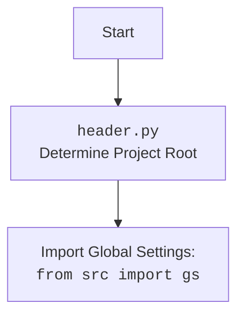

## <алгоритм>

1. **Начало:**
   - Устанавливается переменная `MODE` в значение `'dev'`.
   - Импортируются необходимые модули: `sys`, `json`, `Version` из `packaging.version`, и `Path` из `pathlib`.

2. **`set_project_root` Функция:**
   - На вход принимает кортеж `marker_files`, по умолчанию `('__root__',)`.
   - Определяет путь к директории текущего файла.
   - Инициализирует переменную `__root__` с путем к текущей директории.
   - Проходит по всем родительским директориям, начиная с текущей, проверяя наличие в них файлов или директорий из `marker_files`.
   - Если файл или директория из `marker_files` найдены в родительской директории, то `__root__` переопределяется путем к этой директории и цикл прерывается.
   - Проверяет, если `__root__` отсутствует в путях поиска модулей (`sys.path`), добавляет его в начало списка.
   - Возвращает путь `__root__`.
   - *Пример:* Если `marker_files` это `("__root__",)` и файл `__root__` находится в директории `../hypotez`, то `set_project_root()` вернет путь к `../hypotez`.
   
3. **Определение корневой директории:**
   - Вызывает `set_project_root()` для определения корневой директории проекта и сохраняет результат в переменную `__root__`.
   -  *Пример*:  Пусть `__root__` это `/path/to/project/hypotez`, тогда все дальнейшие обращения к файлам будут вестись от этой директории.

4. **Импорт `gs`:**
   - Импортирует модуль `gs` из пакета `src`.
      *Пример:*  `from src import gs`.

5. **Загрузка `settings` из `settings.json`:**
   - Пытается открыть файл `settings.json` расположенный по пути `gs.path.root / 'src' / 'settings.json'` в режиме чтения.
   - Если открытие удачно, читает JSON данные из файла и сохраняет их в переменную `settings` как словарь.
   - При возникновении ошибок `FileNotFoundError` или `json.JSONDecodeError`, игнорирует исключение ( `...`).
     *Пример:* если `gs.path.root` это `/path/to/project/hypotez`, то путь к файлу будет `/path/to/project/hypotez/src/settings.json`.

6. **Загрузка `doc_str` из `README.MD`:**
    - Пытается открыть файл `README.MD` расположенный по пути `gs.path.root / 'src' / 'README.MD'` в режиме чтения.
    - Если открытие удачно, читает содержимое файла и сохраняет его в переменную `doc_str` как строку.
    - При возникновении ошибок `FileNotFoundError` или `json.JSONDecodeError`, игнорирует исключение.
      *Пример:* если `gs.path.root` это `/path/to/project/hypotez`, то путь к файлу будет `/path/to/project/hypotez/src/README.MD`.

7. **Извлечение информации из `settings`:**
   - Извлекает значения `project_name`, `version`, `author`, `copyrihgnt`, `cofee` из словаря `settings`, если он не `None`, иначе устанавливает значения по умолчанию.
   -  Если `settings` это `{"project_name": "hypotez_new", "version": "1.0.0", ...}`, тогда переменная `__project_name__` будет равна `"hypotez_new"`, `__version__` будет `1.0.0` и т.д.

8. **Установка значений:**
    - Устанавливает `__doc__` значение `doc_str` если оно не `None` иначе пустой строкой.
    - `__details__` устанавливается в пустую строку.

9. **Конец:**
   - В результате получаем глобальные переменные, такие как:  `__project_name__`, `__version__`, `__doc__`, `__details__`, `__author__`, `__copyright__`, `__cofee__`.

## <mermaid>

```mermaid
flowchart TD
    Start[Начало] --> SetMode[Установить ]
    SetMode --> ImportModules[Импорт модулей: sys, json, Version, Path]
    ImportModules --> SetProjectRootFunc[Определение функции set_project_root]
    SetProjectRootFunc --> CallSetProjectRoot[Вызов set_project_root()]
    CallSetProjectRoot --> SetRootVariable[Установка __root__]
    SetRootVariable --> ImportGS[Импорт модуля gs из src]
    ImportGS --> LoadSettings[Попытка загрузить settings.json]
    LoadSettings -- Успешно --> SetSettingsVariable[Установка переменной settings]
    LoadSettings -- Ошибка --> SetSettingsVariable[Установка переменной settings = None]
    SetSettingsVariable --> LoadDocString[Попытка загрузить README.MD]
     LoadDocString -- Успешно --> SetDocStringVariable[Установка переменной doc_str]
    LoadDocString -- Ошибка --> SetDocStringVariable[Установка переменной doc_str = None]
    SetDocStringVariable --> ExtractSettingsInfo[Извлечение настроек из settings]
    ExtractSettingsInfo --> SetGlobalVariables[Установка глобальных переменных: __project_name__, __version__, __doc__, и др.]
    SetGlobalVariables --> End[Конец]

    subgraph set_project_root()
        StartSetRoot[Начало функции] --> GetCurrentPath[Получить путь к текущей директории]
         GetCurrentPath --> InitRootVariable[Инициализация __root__ = current_path]
        InitRootVariable --> LoopParents[Перебор родительских директорий]
        LoopParents -- Файл/директория найден --> SetRootAndBreak[Переопределить __root__ и прервать цикл]
        SetRootAndBreak --> CheckSysPath[Проверка __root__ в sys.path]
         LoopParents -- Файл/директория не найден --> CheckSysPath
        CheckSysPath --> InsertSysPath[Добавить __root__ в sys.path]
        CheckSysPath -- __root__ in sys.path --> ReturnRoot[Возврат __root__]
        InsertSysPath --> ReturnRoot
        ReturnRoot --> EndSetRoot[Конец функции]
    end
```


**Объяснение диаграммы `mermaid`:**

1. **`flowchart TD`**: Объявляет начало блок-схемы (top-down).

2.  **Узлы (Nodes):**
   - `Start`: Начало выполнения скрипта.
   - `SetMode`: Установка переменной `MODE` в значение `'dev'`.
   - `ImportModules`: Импорт необходимых модулей `sys`, `json`, `Version` из `packaging.version`, `Path` из `pathlib`.
   - `SetProjectRootFunc`: Определение функции `set_project_root`, которая находит корневую директорию проекта.
   - `CallSetProjectRoot`: Вызов функции `set_project_root` для определения корневой директории.
   - `SetRootVariable`: Установка значения переменной `__root__`, хранящей путь к корневой директории.
   - `ImportGS`: Импорт модуля `gs` из пакета `src`.
   - `LoadSettings`: Попытка загрузить настройки из файла `settings.json`.
   - `SetSettingsVariable`: Установка значения переменной `settings` в зависимости от результата загрузки (словарь или `None`).
   - `LoadDocString`: Попытка загрузить документацию из файла `README.MD`.
   - `SetDocStringVariable`: Установка значения переменной `doc_str` в зависимости от результата загрузки (строка или `None`).
   - `ExtractSettingsInfo`: Извлечение данных (название проекта, версия и т.д.) из `settings` для присвоения глобальным переменным.
   - `SetGlobalVariables`: Установка глобальных переменных, таких как `__project_name__`, `__version__`, `__doc__` и т.д.
   - `End`: Конец выполнения скрипта.
    
3. **Подграф `set_project_root()`**:
   - `StartSetRoot`: Начало функции `set_project_root()`.
   - `GetCurrentPath`: Получение пути к директории текущего файла.
   - `InitRootVariable`: Инициализация переменной `__root__` путем к текущей директории.
   - `LoopParents`: Цикл перебора родительских директорий.
   - `SetRootAndBreak`: Если найден маркер, переопределить `__root__` и выйти из цикла.
   - `CheckSysPath`: Проверка наличия `__root__` в `sys.path`.
   - `InsertSysPath`: Добавление `__root__` в `sys.path`, если его нет.
   - `ReturnRoot`: Возврат значения `__root__` (пути к корневой директории).
   - `EndSetRoot`: Конец функции `set_project_root()`.

4. **Связи (Edges):**
    - Стрелки `-->` показывают последовательность выполнения операций.
    - Ветвление `-->` с подписями `Успешно` и `Ошибка` указывает на разные пути выполнения в зависимости от результата операции.

5. **Взаимосвязи с `header.py`:**

    - Дополнительный блок `mermaid` показывает зависимость от `header.py`, который находит корневую директорию проекта и импортирует глобальные настройки из файла `src/settings.json`.

**Объяснение `mermaid` кода**:

-   Код `mermaid` описывает последовательность операций в скрипте, включая вызовы функций, загрузки файлов и установку глобальных переменных.
-  На диаграмме наглядно представлен поток данных от начала скрипта до его конца, включая обработку ошибок при чтении файлов и условное выполнение блоков.
-  Код `mermaid` структурирован так, чтобы выделить как основную логику скрипта, так и внутреннюю работу функции `set_project_root`.
-  Особое внимание уделено взаимосвязи между блоками, показывая, как данные передаются и обрабатываются между ними.
-  Дополнительный блок `mermaid` подчеркивает, что `header.py` определяет корневую директорию проекта и импортирует модуль `gs` для доступа к путям.

## <объяснение>

**Импорты:**

- `sys`: Модуль `sys` используется для взаимодействия с системными переменными и функциями. Здесь используется для добавления корневой директории проекта в путь поиска модулей (`sys.path`), чтобы можно было импортировать модули из проекта.
- `json`: Модуль `json` используется для работы с данными в формате JSON. В этом коде он используется для загрузки настроек из файла `settings.json`.
- `packaging.version.Version`: Используется для работы с версиями. В данном случае не используется, но, возможно, планируется использование в будущем.
- `pathlib.Path`: Модуль `pathlib` используется для работы с путями в файловой системе. `Path` является объектом для представления пути, что облегчает манипуляции с путями.
-  `from src import gs`: Импортирует модуль `gs` из пакета `src`. Этот модуль, вероятно, содержит глобальные настройки и пути, используемые в проекте.

**Функции:**

- `set_project_root(marker_files=("__root__",))`:
    - **Аргументы:**
        - `marker_files`: Кортеж строк, представляющих имена файлов или директорий, которые используются для определения корневой директории проекта. По умолчанию используется `("__root__",)`.
    - **Возвращаемое значение:**
        - `Path`: Объект `Path`, представляющий путь к корневой директории проекта.
    - **Назначение:**
        - Функция находит корневую директорию проекта, идя вверх по дереву директорий от текущей директории скрипта до тех пор, пока не встретится один из файлов, указанных в `marker_files`. Затем она добавляет найденный путь в список путей поиска Python (`sys.path`).
   -  **Пример**:
      ```python
      project_root = set_project_root(marker_files = ("__root__", ".git"))
      print(project_root) # например, /path/to/project/
      ```

**Переменные:**

- ``: Глобальная переменная, определяющая режим работы приложения.
- `__root__`: Глобальная переменная типа `Path`, которая хранит путь к корневой директории проекта.
- `settings`: Глобальная переменная типа `dict`, которая хранит настройки проекта, загруженные из `settings.json`.
- `doc_str`: Глобальная переменная типа `str`, которая хранит содержимое файла `README.MD`.
- `__project_name__`: Глобальная переменная типа `str`, которая хранит название проекта. Значение по умолчанию - 'hypotez'.
- `__version__`: Глобальная переменная типа `str`, которая хранит версию проекта. Значение по умолчанию - пустая строка.
- `__doc__`: Глобальная переменная типа `str`, которая хранит документацию проекта из файла `README.MD`.
- `__details__`: Глобальная переменная типа `str`, которая в данном коде пустая строка.
- `__author__`: Глобальная переменная типа `str`, которая хранит имя автора проекта. Значение по умолчанию - пустая строка.
- `__copyright__`: Глобальная переменная типа `str`, которая хранит информацию об авторских правах. Значение по умолчанию - пустая строка.
- `__cofee__`: Глобальная переменная типа `str`, которая хранит сообщение о возможности поддержать разработчика чашкой кофе.
    
**Объяснения:**

1.  **Определение корневой директории проекта (`set_project_root`)**:
    - Функция `set_project_root` критически важна для правильной работы проекта, так как она определяет, где находится корень проекта, от которого будут отсчитываться пути к другим файлам.
    - Поиск родительских директорий до нахождения маркера (`marker_files`) позволяет запускать скрипт из любой поддиректории проекта.
    - Добавление корневой директории в `sys.path` позволяет импортировать модули, находящиеся в проекте, без использования относительных путей.

2. **Загрузка настроек и документации:**
    - Код пытается загрузить настройки из файла `settings.json` и документацию из `README.MD`.
    - Используется блок `try-except` для обработки исключений, если файлы не существуют или имеют неверный формат.
    - При неуспешной загрузке соответствующие переменные `settings` и `doc_str` останутся равными `None`.

3. **Извлечение глобальной информации:**
    -  Извлечение информации из словаря `settings` с проверкой на `None`.
    - Если `settings` имеет данные, используется их значения, иначе устанавливаются значения по умолчанию.
    - Установка глобальных переменных `__project_name__`, `__version__`, `__doc__` и других.

4. **Использование глобальных переменных:**
   - Глобальные переменные, такие как `__project_name__`, `__version__`, `__doc__` и другие, могут использоваться в других модулях проекта.
    
**Потенциальные ошибки и области для улучшения:**
   -  Обработка исключений: В блоках `try-except` используется `...`, что может затруднить отладку. Лучше явно обрабатывать конкретные исключения (например, выводить сообщение об ошибке или записывать их в лог).
   -  Отсутствие проверок на тип: Код не проверяет типы данных, извлекаемых из `settings.json`, что может привести к ошибкам.
   -  Жестко заданные пути к файлам: Пути к файлам `settings.json` и `README.MD` жестко заданы. Можно сделать их более гибкими, используя конфигурационные переменные.
   -  Использование глобальных переменных: Глобальные переменные могут затруднить отслеживание состояния программы. Можно использовать объект конфигурации для хранения этих данных.
   -  Модульность: Можно вынести логику загрузки настроек и документации в отдельные функции.

**Взаимосвязь с другими частями проекта:**

- `header.py` является важной частью инфраструктуры проекта. Он определяет корневую директорию и загружает общие настройки, которые могут использоваться другими модулями.
- Модуль `gs` (глобальные настройки) зависит от `header.py`, так как `header.py` определяет корневой каталог, который использует `gs` для определения путей к ресурсам.
-  Другие модули проекта могут зависеть от глобальных переменных, определенных в `header.py`, таких как `__project_name__`, `__version__` и др.

**Заключение:**

`header.py` выполняет важную роль в инициализации проекта, устанавливая корневую директорию, загружая настройки и документацию. Код имеет некоторые недочеты в плане обработки ошибок и гибкости, но в целом выполняет свою задачу. Для улучшения кода следует обратить внимание на более детальную обработку исключений, проверку типов данных, гибкость путей и уменьшение использования глобальных переменных.