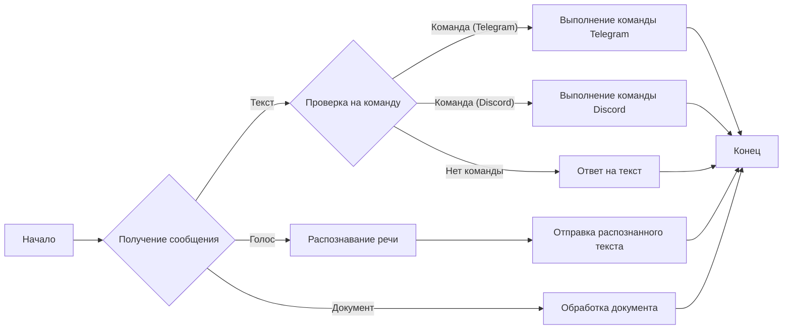
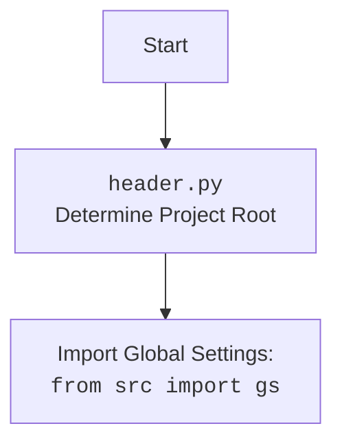

## АНАЛИЗ КОДА: Модуль Ботов для Telegram и Discord

### 1. <алгоритм>

**Общий процесс модуля ботов:**

1.  **Инициализация:**
    *   **Telegram Bot:**
        *   Получение токена бота из базы данных `credentials.kdbx`.
        *   Инициализация Telegram-бота с использованием полученного токена.
    *   **Discord Bot:**
        *   Получение токена бота из базы данных `credentials.kdbx`.
        *   Инициализация Discord-бота с использованием полученного токена.

2.  **Обработка сообщений (оба бота):**
    *   Бот постоянно слушает новые сообщения.
    *   **Текстовые сообщения:**
        *   Проверка наличия команд (начинаются с `/` для Telegram и `!` для Discord).
        *   Выполнение соответствующих команд или стандартный ответ на текст.
    *   **Голосовые сообщения:**
        *   Распознавание речи с использованием API (например, Speech-to-Text).
        *   Отправка распознанного текста пользователю.
    *   **Документы:**
        *   Обработка полученных файлов (например, сохранение или анализ).

3.  **Выполнение команд:**
    *   **Telegram Bot:**
        *   `/start`: Выводит приветствие.
        *   `/help`: Выводит список доступных команд.
        *   `/sendpdf`: Запрашивает файл PDF и отправляет его.
    *   **Discord Bot:**
        *   `!hi`: Выводит приветствие.
        *   `!join`: Подключается к голосовому каналу.
        *   `!leave`: Отключается от голосового канала.
        *   `!train`: Запускает обучение модели машинного обучения.
        *   `!test`: Запускает тестирование модели машинного обучения.
        *   `!archive`: Архивирует файлы в указанной директории.
        *   `!select_dataset`: Выбирает датасет для обучения модели.
        *   `!instruction`: Читает инструкцию из внешнего файла.
        *   `!correct`: Исправляет предыдущий ответ.
        *   `!feedback`: Получает и сохраняет отзыв.
        *   `!getfile`: Прикрепляет файл к сообщению.

4.  **Логирование:**
    *   Запись всех действий и ошибок в лог-файл.

**Пример для Telegram Bot:**

```
graph LR
    A[Начало] --> B{Получение сообщения};
    B -- Текст --> C{Проверка на команду};
    C -- Команда (/start) --> D[/start: Приветствие];
    C -- Команда (/help) --> E[/help: Список команд];
    C -- Команда (/sendpdf) --> F[/sendpdf: Запрос PDF];
     C -- Нет команды --> G[Ответ на текст];
    B -- Голос --> H[Распознавание речи];
    H --> I[Отправка распознанного текста];
    B -- Документ --> J[Обработка документа];
    D --> K[Конец];
    E --> K;
    F --> K;
    G --> K;
    I --> K;
     J --> K;
```

**Пример для Discord Bot:**

```
graph LR
    A[Начало] --> B{Получение сообщения};
    B -- Текст --> C{Проверка на команду};
    C -- Команда (!hi) --> D[!hi: Приветствие];
    C -- Команда (!join) --> E[!join: Подключение к каналу];
    C -- Команда (!leave) --> F[!leave: Отключение от канала];
    C -- Команда (!train) --> G[!train: Обучение модели];
    C -- Команда (!test) --> H[!test: Тестирование модели];
    C -- Команда (!archive) --> I[!archive: Архивирование файлов];
    C -- Команда (!select_dataset) --> J[!select_dataset: Выбор датасета];
    C -- Команда (!instruction) --> K[!instruction: Чтение инструкции];
    C -- Команда (!correct) --> L[!correct: Исправление];
     C -- Команда (!feedback) --> M[!feedback: Отзыв];
     C -- Команда (!getfile) --> N[!getfile: Прикрепление файла];
    C -- Нет команды --> O[Ответ на текст];
    B -- Голос --> P[Распознавание речи];
    P --> Q[Отправка распознанного текста];
    B -- Документ --> R[Обработка документа];

    D --> S[Конец];
    E --> S;
    F --> S;
    G --> S;
    H --> S;
    I --> S;
    J --> S;
    K --> S;
    L --> S;
     M --> S;
     N --> S;
    O --> S;
    Q --> S;
    R --> S;
```

### 2. <mermaid>



**Объяснение `mermaid` диаграммы:**

*   **A[Начало]:** Начальная точка обработки сообщений.
*   **B{Получение сообщения}:** Бот получает сообщение от пользователя (текст, голос, документ).
*   **C{Проверка на команду}:** Проверяется, является ли сообщение командой для Telegram или Discord.
*   **D[Выполнение команды Telegram]:** Если сообщение является командой Telegram, вызывается соответствующая функция обработки.
*   **E[Выполнение команды Discord]:** Если сообщение является командой Discord, вызывается соответствующая функция обработки.
*   **F[Ответ на текст]:** Если сообщение не является командой, отправляется стандартный текстовый ответ.
*   **G[Распознавание речи]:** Если сообщение является голосовым, выполняется распознавание речи.
*   **H[Отправка распознанного текста]:** После распознавания речи, распознанный текст отправляется пользователю.
*   **I[Обработка документа]:** Если сообщение содержит документ, он обрабатывается соответствующим образом.
*   **J[Конец]:** Конечная точка обработки.

**Зависимости:**

В диаграмме не отображены импорты напрямую. Однако, исходя из описания, можно предположить, что для работы ботов и их функций используются различные библиотеки.

Для Telegram:
-  `telegram`  библиотека для работы с telegram bot API,  `credentials.kdbx` - для безопастного хранения токена.

Для Discord:
-  `discord` библиотека для работы с discord API,  `credentials.kdbx` - для безопастного хранения токена.



### 3. <объяснение>

**Импорты:**

*   В данном документе отсутствуют явные импорты. Однако, согласно описанию, боты используют библиотеки для работы с Telegram и Discord:
    *   Для **Telegram**: библиотека `telegram`. Также используется `credentials.kdbx` для безопасного хранения токена бота.
    *   Для **Discord**: библиотека `discord`. Также используется `credentials.kdbx` для безопасного хранения токена бота.
*   Также используется модуль `src.logger` для логирования событий.
*   `header.py` устанавливает корень проекта и импортирует глобальные настройки из `src.gs`.

**Классы:**

*   В предоставленном описании отсутствуют детали о классах. Однако можно предположить, что как минимум есть классы для представления ботов (`TelegramBot`, `DiscordBot`) и возможно, для обработки сообщений и команд.

**Функции:**

*   Функции, описанные в разделе "Использование", представляют собой обработчики команд для ботов.
    *   **Telegram Bot:**
        *   `/start`:  Функция для начальной обработки команды `/start`.
        *   `/help`: Функция для показа доступных команд.
        *   `/sendpdf`: Функция для обработки запроса отправки PDF.
    *   **Discord Bot:**
        *   `!hi`: Функция для приветствия.
        *   `!join`: Функция для подключения к голосовому каналу.
        *   `!leave`: Функция для отключения от голосового канала.
        *   `!train`: Функция для запуска обучения модели.
        *   `!test`: Функция для запуска тестирования модели.
        *   `!archive`: Функция для архивации файлов.
        *   `!select_dataset`: Функция для выбора датасета.
        *   `!instruction`: Функция для чтения инструкции.
        *   `!correct`: Функция для исправления ответа.
        *   `!feedback`: Функция для обработки отзыва.
         *  `!getfile`: Функция для прикрепления файла.
*   Также есть функции для обработки голосовых сообщений (распознавание речи) и документов.

**Переменные:**

*   В описании нет явных переменных, но можно предположить, что есть как минимум переменные для хранения токенов ботов (получаемых из `credentials.kdbx`), экземпляров ботов, и путей к необходимым файлам.

**Цепочка взаимосвязей с другими частями проекта:**

1.  **`src.logger`**: Этот модуль используется для логирования событий и ошибок, что обеспечивает возможность отладки и мониторинга работы ботов.
2.  **`credentials.kdbx`**: Этот файл используется для безопасного хранения токенов ботов, что обеспечивает защиту от несанкционированного доступа.
3.  **`header.py`**:  устанавливает корень проекта и импортирует глобальные настройки из `src.gs`.
4.  **Модели машинного обучения** (только для Discord Bot): Discord бот взаимодействует с модулями для обучения и тестирования моделей.
5.  **База данных**: Для сохранения данных, возможно используется база данных

**Потенциальные ошибки и области для улучшения:**

*   **Обработка ошибок:** Не указано как обрабатываются ошибки, которые могут возникнуть во время работы ботов (например, проблемы с доступом к API, ошибки распознавания речи).
*   **Безопасность:** Необходимо обеспечить безопасное хранение и использование токенов, чтобы предотвратить утечку.
*   **Масштабируемость:** Неизвестно, как боты будут обрабатывать большое количество сообщений и пользователей.
*   **Тестирование:** Необходимо добавить автоматизированные тесты для проверки функциональности ботов.
*   **Управление ресурсами:** Необходимо контролировать потребление ресурсов (память, CPU), особенно при обработке голосовых сообщений и обучении моделей.

**Дополнительные заметки:**

*   В описании не хватает конкретики по реализации, что затрудняет глубокий анализ.
*   Для более полного понимания необходимо изучить код самих ботов (файлы `bot.py` для Telegram и `discord_bot_trainger.py` для Discord).
*   Нужно исследовать взаимодействие с внешними сервисами и базами данных.