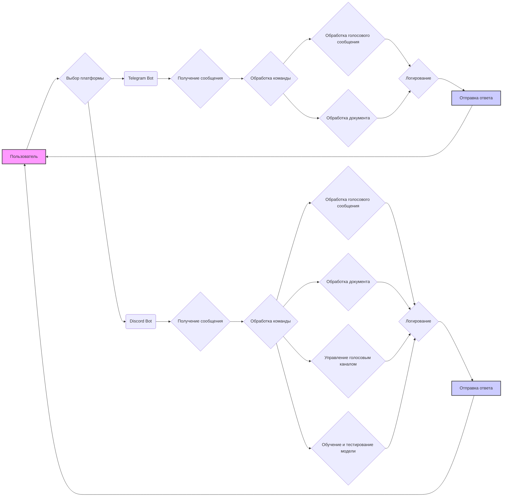

## Анализ модуля ботов для Telegram и Discord

### <алгоритм>

1.  **Начало**: Пользователь взаимодействует с ботом через Telegram или Discord.
2.  **Выбор платформы**: В зависимости от платформы (Telegram или Discord), запрос направляется соответствующему боту.
3.  **Telegram Bot**:
    *   **Получение сообщения**: Бот получает текстовое сообщение, голосовое сообщение или документ от пользователя.
        *   *Пример*: Пользователь отправляет текстовое сообщение `/start`.
        *   *Пример*: Пользователь отправляет голосовое сообщение.
        *   *Пример*: Пользователь отправляет PDF-файл.
    *   **Обработка команды**: Если сообщение является командой (например, `/start`, `/help`, `/sendpdf`), выполняется соответствующая операция.
        *   *Пример*: Для команды `/start` бот отправляет приветственное сообщение.
        *   *Пример*: Для команды `/help` бот отправляет список доступных команд.
        *   *Пример*: Для команды `/sendpdf` бот обрабатывает и отправляет PDF-файл.
    *   **Обработка голосового сообщения**: Если сообщение является голосовым, бот распознает речь и отправляет текстовое сообщение.
    *   **Обработка документа**: Если сообщение является документом, бот обрабатывает его.
    *   **Логирование**: Все действия и ошибки логируются.
    *   **Отправка ответа**: Бот отправляет ответ пользователю.
4.  **Discord Bot**:
    *   **Получение сообщения**: Бот получает текстовое сообщение, голосовое сообщение или документ от пользователя.
        *   *Пример*: Пользователь отправляет текстовое сообщение `!hi`.
        *   *Пример*: Пользователь отправляет голосовое сообщение.
        *   *Пример*: Пользователь отправляет аудиофайл.
    *   **Обработка команды**: Если сообщение является командой (например, `!hi`, `!join`, `!train`), выполняется соответствующая операция.
        *   *Пример*: Для команды `!hi` бот отправляет приветственное сообщение.
        *   *Пример*: Для команды `!join` бот подключается к голосовому каналу.
        *   *Пример*: Для команды `!train` бот запускает процесс обучения модели.
    *   **Обработка голосового сообщения**: Если сообщение является голосовым, бот распознает речь и отправляет текстовое сообщение.
    *   **Обработка документа**: Если сообщение является документом, бот обрабатывает его.
    *   **Управление голосовым каналом**: Бот может подключаться и отключаться от голосовых каналов.
    *   **Обучение и тестирование модели**: Бот может обучать и тестировать модели машинного обучения.
    *   **Логирование**: Все действия и ошибки логируются.
    *   **Отправка ответа**: Бот отправляет ответ пользователю.
5.  **Завершение**: Бот ожидает следующего запроса от пользователя.

### <mermaid>

**Зависимости:**
-   Диаграмма иллюстрирует поток управления между пользователем, выбором платформы и обработкой в конкретном боте.
-   Telegram Bot обрабатывает команды, голосовые сообщения и документы, логирует действия и отправляет ответы.
-   Discord Bot также обрабатывает команды, голосовые сообщения, документы, управляет голосовым каналом, обучает и тестирует модели, логирует действия и отправляет ответы.

### <объяснение>

**Импорты**:

-   Модуль `src.endpoints.bots` не импортирует ничего явно, но полагается на структуры и модули внутри проекта `src`.
-   Логирование осуществляется с помощью модуля `src.logger`, что предполагает его наличие и доступность.

**Классы**:
-   В описании не указаны конкретные классы, но подразумевается, что каждый бот (Telegram и Discord) реализован в виде класса или набора классов. Это необходимо для инкапсуляции логики обработки сообщений, команд и управления.
-   **Предполагаемые классы**:
    *   `TelegramBot`:  управляет взаимодействием с Telegram API, обрабатывает сообщения, отправляет ответы, и т.д.
    *   `DiscordBot`: управляет взаимодействием с Discord API, обрабатывает сообщения, управляет голосовыми каналами, обучает и тестирует модели и т.д.
-   Атрибуты и методы классов будут специфичными для каждой платформы, но будут включать методы для приема и отправки сообщений, распознавания голоса, обработки документов, управления голосовыми каналами и пр.

**Функции**:

-   В описании не указаны конкретные функции, но можно выделить общие функциональные блоки, которые, вероятно, будут представлены в виде функций:
    -   **Обработка команд:** Функции для обработки команд, таких как `/start`, `!hi`, `!train`, и пр.
        -   Аргументы: сообщение пользователя, контекст бота.
        -   Возвращаемое значение: ответное сообщение или выполнение действия.
        -   Пример: Функция, обрабатывающая команду `/start` может отправлять приветственное сообщение.
    -   **Распознавание речи:** Функции для преобразования голосовых сообщений в текст.
        -   Аргументы: голосовое сообщение.
        -   Возвращаемое значение: текст распознанной речи.
        -   Пример: Функция, распознающая речь пользователя,  возвращает строку с текстом.
    -   **Обработка документов:** Функции для обработки документов, включая сохранение, чтение и отправку.
        -   Аргументы: документ пользователя.
        -   Возвращаемое значение: результат обработки (например, подтверждение загрузки).
        -   Пример: Функция, обрабатывающая PDF-файл, сохраняет его на сервере.
    -   **Управление голосовыми каналами:** Функции для подключения и отключения бота от голосовых каналов.
        -   Аргументы: голосовой канал.
        -   Возвращаемое значение: результат операции (например, подтверждение подключения).
        -   Пример: Функция, подключающая бота к голосовому каналу, уведомляет об успешном подключении.
    -  **Обучение и тестирование моделей**: Функции для работы с машинным обучением
         - Аргументы: входные данные для обучения и тестирования
         - Возвращаемое значение: результат обучения и/или тестирования
         - Пример: Функция, которая принимает путь к датасету, загружает его и тренирует ML модель.
-  **Логирование**:  Функции для логирования важных событий и ошибок.
    -  Аргументы: сообщение для логирования, уровень лога (debug, info, error и тд)
    -  Возвращаемое значение: нет.
    - Пример: Функция, которая записывает ошибку подключения к голосовому каналу в лог файл.

**Переменные**:

-   `credentials.kdbx`: База данных паролей для хранения токенов ботов.
-   `requirements.txt`: Файл со списком необходимых библиотек.
-   `токен`:  Строка, представляющая токен бота Telegram или Discord.
-   `модели машинного обучения`: Объекты машинного обучения, созданные с помощью соответствующих библиотек.
-    `лог-файлы`: Файлы, куда записываются логи.
-   `путь к файлам`: Строка, содержащая путь к файлу.
-   `датасет`:  Объект, содержащий данные для обучения модели.

**Цепочка взаимосвязей с другими частями проекта**:

1.  **`src.logger`**: Модуль логирования используется обоими ботами для записи событий и ошибок.
2.  **`credentials.kdbx`**: Используется для хранения секретных токенов, что обеспечивает безопасность.
3.  **`requirements.txt`**: Определяет зависимости, необходимые для работы ботов, обеспечивая целостность окружения.
4.  **`hypotez/src/endpoints/bots/telegram/bot.py` и `hypotez/src/bots/discord/discord_bot_trainger.py`**: Это основные файлы, содержащие логику ботов, которые напрямую взаимодействуют с API платформ и обрабатывают запросы пользователей.
5.   **Модели машинного обучения**: Боты используют обученные модели для обработки данных и ответов. В зависимости от архитектуры проекта, эти модели могут лежать в других директориях, а бот будет обращаться к ним.

**Потенциальные ошибки и области для улучшения**:

1.  **Обработка ошибок:** Необходимо тщательно продумать обработку ошибок при взаимодействии с API Telegram и Discord, обработку голосовых сообщений, документов и пр.
2.  **Асинхронность**: Реализовать асинхронную обработку сообщений, чтобы боты могли обрабатывать множество запросов одновременно.
3.  **Масштабируемость**: Продумать архитектуру для масштабирования, если потребуется увеличить количество ботов или нагрузку.
4.  **Безопасность**: Усилить меры безопасности, особенно при хранении и использовании токенов ботов.
5.  **Тестирование**: Добавить более детальное тестирование, чтобы убедиться в корректной работе всех функций.
6. **Зависимости**: Обозначить явные зависимости каждого бота. Например, Discord бот может зависеть от библиотек для работы с ML. Telegram бот будет зависеть от других библиотек для работы с телеграм.

**Дополнительные замечания:**

-   Представленная информация является обзором и не углубляется в детали реализации.
-   Для более точного анализа необходим доступ к исходному коду ботов.
-  Использование `credentials.kdbx` для хранения токенов является хорошей практикой с точки зрения безопасности, но следует убедиться, что доступ к этому файлу защищен.