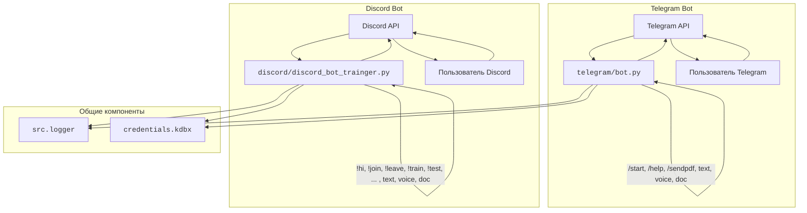

## АНАЛИЗ README.RU.MD

### 1. <алгоритм>

**Общая структура модуля ботов:**

1.  **Инициализация:**
    *   Установка необходимых библиотек и создание виртуального окружения.
    *   Получение и установка токенов для Telegram и Discord ботов из защищенного хранилища (`credentials.kdbx`).
2.  **Telegram Bot:**
    *   **Запуск:** Запускается скрипт `hypotez/src/endpoints/bots/telegram/bot.py`.
    *   **Обработка сообщений:**
        *   **`/start`**: Бот приветствует пользователя.
        *   **`/help`**: Бот выводит список доступных команд.
        *   **`/sendpdf`**: Бот отправляет PDF-файл.
        *   **Текстовые сообщения**: Бот отвечает на текстовые сообщения.
        *   **Голосовые сообщения**: Бот распознает речь и отправляет распознанный текст.
        *   **Документы**: Бот обрабатывает полученные документы.
    *   **Логирование**: Все события и ошибки записываются в лог.
3.  **Discord Bot:**
    *   **Запуск:** Запускается скрипт `hypotez/src/bots/discord/discord_bot_trainger.py`.
    *   **Обработка сообщений:**
        *   **`!hi`**: Бот приветствует пользователя.
        *   **`!join`**: Бот подключается к голосовому каналу.
        *   **`!leave`**: Бот отключается от голосового канала.
        *   **`!train`**: Бот запускает процесс обучения модели машинного обучения.
        *   **`!test`**: Бот запускает тестирование обученной модели.
        *   **`!archive`**: Бот архивирует файлы в указанной директории.
        *   **`!select_dataset`**: Бот позволяет выбрать датасет для обучения.
        *   **`!instruction`**: Бот выводит инструкцию из внешнего файла.
        *   **`!correct`**: Бот исправляет предыдущий ответ по ID сообщения.
        *   **`!feedback`**: Бот отправляет отзыв о работе.
        *   **`!getfile`**: Бот прикрепляет файл по указанному пути.
        *    **Текстовые сообщения**: Бот отвечает на текстовые сообщения.
        *   **Голосовые сообщения**: Бот распознает речь и отправляет распознанный текст.
        *   **Документы**: Бот обрабатывает полученные документы.
    *   **Логирование**: Все события и ошибки записываются в лог.
4.  **Логирование:**
    *   Используется модуль `src.logger`.
    *   Запись всех важных событий и ошибок в лог-файл.
5.  **Тестирование:**
    *   Проверка работы ботов с помощью тестовых команд на соответствующих платформах.
6. **Вклад в проект**:
    *   Создание pull request с изменениями.
    *   Код должен соответствовать стилю кодирования и проходить тесты.

**Примеры потока данных:**

*   **Telegram Bot:** Пользователь отправляет `/sendpdf` -> Telegram API -> `bot.py` -> Обработка -> Отправка PDF-файла -> Telegram API -> Пользователь.
*   **Discord Bot:** Пользователь отправляет `!train` -> Discord API -> `discord_bot_trainer.py` -> Запуск обучения модели -> Возврат результата -> Discord API -> Пользователь.

### 2. <mermaid>

**Анализ зависимостей:**

*   `telegram/bot.py`: Зависит от Telegram API для взаимодействия с Telegram ботом, от `credentials.kdbx` для получения токена, и от `src.logger` для логирования.
*   `discord/discord_bot_trainger.py`: Зависит от Discord API для взаимодействия с Discord ботом, от `credentials.kdbx` для получения токена, и от `src.logger` для логирования.
*   `src.logger`: Используется обоими ботами для логирования событий и ошибок.
*   `credentials.kdbx`: Используется обоими ботами для безопасного хранения токенов доступа.
*   **Telegram API**: Используется Telegram ботом для приема и отправки сообщений.
*   **Discord API**: Используется Discord ботом для приема и отправки сообщений.

### 3. <объяснение>

**Общее описание:**

Модуль предоставляет реализацию двух ботов для платформ Telegram и Discord. Оба бота имеют схожую архитектуру: обрабатывают команды, текстовые сообщения, голосовые сообщения и документы, а также используют логгер `src.logger`. Основное различие заключается в специфике каждой платформы и наборе команд. Telegram бот ориентирован на отправку PDF-файлов и базовое взаимодействие с пользователем. Discord бот, в свою очередь, имеет расширенный набор команд, включая обучение и тестирование моделей машинного обучения, управление голосовыми каналами и другие функции, связанные с машинным обучением.

**Импорты:**

В данном документе `README.RU.MD` отсутствуют импорты, так как он является инструкцией для пользователя, а не кодом. Однако, в файлах `telegram/bot.py` и `discord/discord_bot_trainger.py` будут присутствовать импорты.

*   **`src.logger`:** Модуль для логирования, используемый для записи важных событий и ошибок в лог-файл. Это помогает в отслеживании работы ботов и выявлении проблем.
*   **`credentials.kdbx`:** База данных паролей, используемая для безопасного хранения токенов доступа к ботам. Это обеспечивает защиту конфиденциальных данных.
*   **Telegram API**: Библиотека для взаимодействия с Telegram API, позволяющая отправлять и получать сообщения, обрабатывать команды и др.
*    **Discord API**: Библиотека для взаимодействия с Discord API, позволяющая отправлять и получать сообщения, управлять каналами и др.
    
**Классы:**

В данном `README.RU.MD` классы не представлены. Классы будут определены в файлах `telegram/bot.py` и `discord/discord_bot_trainger.py`. Например, там могут быть классы для:
*   Обработки сообщений (классы обработчики для каждого типа сообщений).
*   Взаимодействия с API (классы для работы с API Telegram и Discord).
*   Управления ботом (классы для контроля над действиями бота).
*   Моделей машинного обучения.
*   Управления файлами и архивами.

**Функции:**

В `README.RU.MD` явно функции не описаны, но логически они будут присутствовать в `telegram/bot.py` и `discord/discord_bot_trainger.py`.

*   **Обработка команд**: функции для обработки команд пользователей (например, `/start`, `!join` и другие).
*   **Обработка сообщений**: функции для обработки текстовых, голосовых сообщений и документов.
*   **Взаимодействие с API**: функции для отправки и получения данных от Telegram API и Discord API.
*   **Управление голосовыми каналами** (Discord): функции для подключения, отключения бота и обработки аудио.
*   **Обучение и тестирование моделей** (Discord): функции для запуска процессов обучения и тестирования.
*   **Работа с файлами**: функции для архивирования и получения файлов.
*   **Логирование**: функции для записи событий в лог.

**Переменные:**

В `README.RU.MD` переменные явно не описаны. В коде будут использоваться следующие переменные:
*   **Токены**: переменные для хранения токенов доступа к ботам.
*   **ID пользователей/каналов**: переменные для идентификации пользователей и каналов.
*   **Пути к файлам**: переменные для хранения путей к файлам.
*   **Настройки**: переменные для хранения различных параметров работы ботов.
*   **Логгеры**: переменные для записи и форматирования логов.
*   **Модели ML**: переменные для хранения обученных моделей машинного обучения.
*   **Состояния**: переменные для отслеживания состояний бота (например, в голосовом канале или нет).

**Потенциальные ошибки и области для улучшения:**

*   **Безопасность хранения токенов**: Необходимо убедиться, что токены хранятся безопасно и не утекают в открытый доступ (используется `credentials.kdbx`).
*   **Обработка ошибок**: Добавить более тщательную обработку ошибок в коде для предотвращения сбоев.
*   **Масштабируемость**: Продумать архитектуру таким образом, чтобы боты могли обрабатывать большое количество запросов.
*   **Тестирование**: Необходимы автоматизированные тесты для более надежной работы ботов.
*   **Управление памятью**: Убедиться, что боты не потребляют слишком много памяти, особенно при обработке больших файлов и обучении моделей.
*   **Конфигурация**: Вынести часть настроек в файл конфигурации для упрощения изменения параметров без редактирования кода.

**Взаимосвязи с другими частями проекта:**

*   Модуль ботов зависит от модуля `src.logger` для логирования.
*   Модуль ботов использует базу данных паролей `credentials.kdbx` для хранения токенов.
*   Модуль ботов может взаимодействовать с другими модулями проекта, если это потребуется для выполнения определенных задач. Например, для обучения моделей машинного обучения может использоваться отдельный модуль.
*   Модули ботов взаимодействуют с API Telegram и Discord соответственно.
*   Модули ботов являются частью общей структуры проекта, которая описана в корневом `README.MD`.