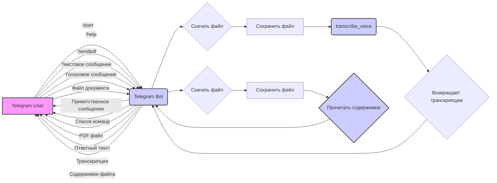

# Анализ кода `src/endpoints/bots/telegram/README.MD`

## <алгоритм>

1.  **Инициализация бота:**
    *   Бот инициализируется с токеном, полученным от Telegram API.
    *   Регистрируются обработчики команд и сообщений.
    *   Пример: `TelegramBot(token="YOUR_TELEGRAM_BOT_TOKEN")`

2.  **Обработка команды `/start`:**
    *   Бот отправляет приветственное сообщение пользователю.
    *   Пример: Пользователь отправляет `/start`. Бот отвечает: "Привет! Я бот. Чем могу помочь?".

3.  **Обработка команды `/help`:**
    *   Бот отправляет список доступных команд.
    *   Пример: Пользователь отправляет `/help`. Бот отвечает: "Список команд:\n/start - Приветственное сообщение\n/help - Список команд\n/sendpdf - Отправить PDF".

4.  **Обработка команды `/sendpdf`:**
    *   Бот отправляет пользователю PDF файл.
    *   Пример: Пользователь отправляет `/sendpdf`. Бот отправляет PDF файл.

5.  **Обработка текстовых сообщений:**
    *   Бот просто возвращает текст, полученный от пользователя.
    *   Пример: Пользователь отправляет "Привет, бот!". Бот отвечает: "Привет, бот!".

6.  **Обработка голосовых сообщений:**
    *   Бот скачивает голосовое сообщение, сохраняет его локально.
    *   Затем бот пытается транскрибировать аудио в текст (в текущей реализации — заглушка).
    *   Пример: Пользователь отправляет голосовое сообщение. Бот скачивает файл, сохраняет, и вызывает функцию `transcribe_voice`, которая ничего не делает (заглушка).

7.  **Обработка файлов документов:**
    *   Бот скачивает файл документа, сохраняет его локально.
    *   Если файл текстовый, то бот читает его содержимое.
    *   Пример: Пользователь отправляет TXT файл. Бот скачивает файл, сохраняет, читает содержимое и возвращает его.

## <mermaid>

**Объяснение:**

*   `Telegram User` - Представляет пользователя Telegram, который взаимодействует с ботом.
*   `Telegram Bot` - Представляет экземпляр телеграм бота, обрабатывающего входящие сообщения и команды.
*   `Скачать файл` - Процесс загрузки файла (голосового сообщения или документа) из Telegram API.
*   `Сохранить файл` - Процесс сохранения скачанного файла на локальное хранилище.
*   `transcribe_voice` - Функция, которая должна транскрибировать голосовое сообщение в текст. (В текущей реализации placeholder).
*   `Возвращает транскрипцию` - Результат работы функции `transcribe_voice`, т.е. текст транскрипции.
*   `Прочитать содержимое` - Функция для чтения содержимого текстового документа.
*   `Содержимое файла` -  Текстовое содержимое документа.
*   Стрелки показывают поток данных и вызовы функций между пользователем и ботом, а также внутри бота.
*   classDef `command`: Описывает класс для пользователя, отправляющего команды
*   classDef `message`: Описывает класс для функций, обрабатывающих сообщения

## <объяснение>

### Импорты

*   **`python-telegram-bot`**: Основная библиотека для работы с Telegram API. Она предоставляет классы и методы для создания ботов, отправки сообщений, обработки команд и т. д.
*   **`pathlib`**: Используется для работы с путями к файлам и директориям в кроссплатформенном стиле.
*   **`tempfile`**: Используется для создания временных файлов и директорий, которые автоматически удаляются после завершения работы.
*   **`asyncio`**: Библиотека для работы с асинхронным программированием, позволяющая выполнять операции ввода-вывода без блокировки основного потока.
*   **`requests`**: Используется для отправки HTTP запросов, в частности для скачивания файлов из интернета.
*   **`src.utils.convertors.tts`**: Этот модуль предназначен для преобразования текста в речь и наоборот (Text-To-Speech и Speech-To-Text). В данном контексте используется для транскрибации голоса, хотя в текущей реализации  это заглушка.
*   **`src.utils.file`**: Модуль содержит функции для работы с файлами, например, чтения текстовых файлов.

### Классы

*   **`TelegramBot`**: Основной класс, представляющий Telegram бота.
    *   **`__init__(self, token: str)`**: Конструктор класса. Принимает токен бота в качестве аргумента, инициализирует бота с токеном и регистрирует все обработчики.
    *   **`register_handlers(self)`**: Регистрирует обработчики команд и сообщений. Это связывает определенные команды Telegram (например, `/start`, `/help`) с методами класса `TelegramBot`, которые будут вызываться при получении таких команд. Также регистрируются обработчики текстовых сообщений, голосовых сообщений и документов.
    *   **`start(self, update: Update, context: CallbackContext)`**: Обработчик команды `/start`. При вызове отправляет приветственное сообщение пользователю.
    *   **`help_command(self, update: Update, context: CallbackContext)`**: Обработчик команды `/help`. Отправляет список доступных команд.
    *   **`send_pdf(self, pdf_file: str | Path)`**: Обработчик команды `/sendpdf`. Отправляет PDF файл пользователю.
    *   **`handle_voice(self, update: Update, context: CallbackContext)`**: Обработчик голосовых сообщений. Скачивает голосовое сообщение, сохраняет его, и вызывает метод `transcribe_voice`.
    *   **`transcribe_voice(self, file_path: Path) -> str`**: Метод для транскрибации голосовых сообщений в текст. В текущей реализации является заглушкой и возвращает пустую строку.
    *   **`handle_document(self, update: Update, context: CallbackContext) -> str`**: Обработчик файлов документов. Скачивает документ, сохраняет его локально, и читает содержимое текстового файла, если это txt файл.
    *   **`handle_message(self, update: Update, context: CallbackContext) -> str`**: Обработчик текстовых сообщений. Возвращает текст полученного сообщения.

### Функции

*   **`main()`**: Главная функция, которая инициализирует и запускает бота. Создает экземпляр `TelegramBot`, регистрирует все обработчики и запускает бесконечный цикл приема входящих запросов от Telegram с помощью `run_polling()`.

### Переменные

*   **`token`**: Строка, представляющая токен Telegram бота. Используется для аутентификации бота.
*   **`pdf_file`**:  Строка или объект Path, представляющий путь к PDF файлу, который отправляется пользователю по команде `/sendpdf`.

### Потенциальные ошибки и области для улучшения

1.  **Обработка ошибок:** В коде отсутствуют полноценные механизмы обработки ошибок. Например, при скачивании файлов, может возникнуть ошибка. Нужно добавить try-except блоки для обработки таких случаев.
2.  **Транскрибация голоса:** Метод `transcribe_voice` является заглушкой и не выполняет транскрибацию. Нужно интегрировать реальный сервис для распознавания речи, что вероятно будет включать в себя асинхронные операции.
3.  **Обработка документов:** Сейчас обрабатываются только текстовые файлы. Нужно расширить функциональность для работы с другими форматами документов.
4.  **Логирование:** Необходимо добавить логирование для отслеживания ошибок и событий.
5.  **Безопасность:** Токен бота не должен храниться в открытом виде в коде. Лучше использовать переменные окружения.
6.  **Модульность:** Можно улучшить структуру, разделив код на более мелкие модули для лучшей читаемости и поддержки.
7. **Асинхронность:** Можно  улучшить код, используя  `async`  и `await` там, где это возможно, для более эффективной обработки запросов.

### Взаимосвязи с другими частями проекта

*   **`src.utils.convertors.tts`**: Этот модуль предоставляет функциональность для транскрибации голосовых сообщений и преобразования текста в речь.
*   **`src.utils.file`**:  Используется для чтения содержимого текстовых файлов.

Этот анализ предоставляет подробное объяснение кода, его функциональности и взаимосвязи с другими частями проекта.