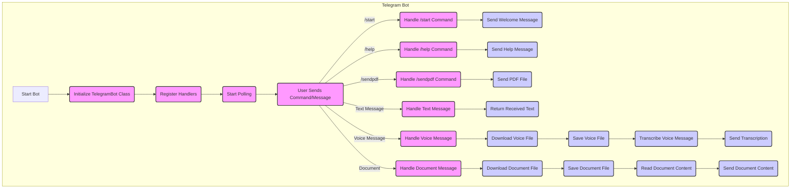

## ИНСТРУКЦИЯ:

Анализируй предоставленный код подробно и объясни его функциональность. Ответ должен включать три раздела:  

1. **<алгоритм>**: Опиши рабочий процесс в виде пошаговой блок-схемы, включая примеры для каждого логического блока, и проиллюстрируй поток данных между функциями, классами или методами.  
2. **<mermaid>**: Напиши код для диаграммы в формате `mermaid`, проанализируй и объясни все зависимости, 
    которые импортируются при создании диаграммы. 
    **ВАЖНО!** Убедитесь, что все имена переменных, используемые в диаграмме `mermaid`, 
    имеют осмысленные и описательные имена. Имена переменных вроде `A`, `B`, `C`, и т.д., не допускаются!  
    
    **Дополнительно**: Если в коде есть импорт `import header`, добавьте блок `mermaid` flowchart, объясняющий `header.py`:\
    ```mermaid
    flowchart TD
        Start --> Header[<code>header.py</code><br> Determine Project Root]
    
        Header --> import[Import Global Settings: <br><code>from src import gs</code>] 
    ```

3. **<объяснение>**: Предоставьте подробные объяснения:  
   - **Импорты**: Их назначение и взаимосвязь с другими пакетами `src.`.  
   - **Классы**: Их роль, атрибуты, методы и взаимодействие с другими компонентами проекта.  
   - **Функции**: Их аргументы, возвращаемые значения, назначение и примеры.  
   - **Переменные**: Их типы и использование.  
   - Выделите потенциальные ошибки или области для улучшения.  

Дополнительно, постройте цепочку взаимосвязей с другими частями проекта (если применимо).  

Это обеспечивает всесторонний и структурированный анализ кода.
## Формат ответа: `.md` (markdown)
**КОНЕЦ ИНСТРУКЦИИ**
```

## <алгоритм>

1. **Инициализация бота:**
   - Создается экземпляр класса `TelegramBot`, передавая токен бота.
   - В конструкторе вызывается метод `register_handlers` для установки обработчиков команд и сообщений.
   - **Пример:** `bot = TelegramBot(token="YOUR_BOT_TOKEN")`

2. **Регистрация обработчиков:**
   - `register_handlers` устанавливает обработчики для `/start`, `/help`, `/sendpdf`, текстовых сообщений, голосовых сообщений и документов.
   - **Пример:** Обработчик `/start` привязан к методу `start`, обработчик текстовых сообщений к `handle_message`.

3. **Обработка команды `/start`:**
   - При получении команды `/start` вызывается метод `start`.
   - Бот отправляет приветственное сообщение пользователю.
   - **Пример:** Пользователь отправляет `/start`. Бот отвечает: "Привет! Я телеграм-бот."

4. **Обработка команды `/help`:**
   - При получении команды `/help` вызывается метод `help_command`.
   - Бот отправляет список доступных команд.
   - **Пример:** Пользователь отправляет `/help`. Бот отвечает: "Доступные команды: /start, /help, /sendpdf."

5. **Обработка команды `/sendpdf`:**
   - При получении команды `/sendpdf` вызывается метод `send_pdf`.
   - Бот отправляет PDF файл пользователю.
   - **Пример:** Пользователь отправляет `/sendpdf`. Бот отправляет заранее определенный PDF файл.

6. **Обработка текстового сообщения:**
   - При получении текстового сообщения вызывается метод `handle_message`.
   - Бот возвращает текст полученного сообщения.
   - **Пример:** Пользователь отправляет "Привет, бот!". Бот отвечает: "Привет, бот!"

7. **Обработка голосового сообщения:**
    - При получении голосового сообщения вызывается метод `handle_voice`.
    - Бот скачивает голосовое сообщение.
    - Сохраняет голосовое сообщение во временный файл.
    - Вызывает метод `transcribe_voice` для преобразования голосового сообщения в текст.
    - Бот отправляет полученный текст пользователю.
    - **Пример:** Пользователь отправляет голосовое сообщение. Бот отправляет расшифрованный текст (на данный момент заглушка).

8.  **Обработка документа:**
    - При получении документа вызывается метод `handle_document`.
    - Бот скачивает документ.
    - Сохраняет документ во временный файл.
    - Бот читает содержимое текстового документа.
    - Бот отправляет содержимое документа пользователю.
    - **Пример:** Пользователь отправляет текстовый документ. Бот отправляет содержимое файла.

9. **Запуск бота:**
    - В функции `main` создается экземпляр бота.
    - Вызывается метод `run_polling` для запуска бота в режиме прослушивания.
    - Бот готов принимать команды и сообщения.

## <mermaid>


**Анализ зависимостей Mermaid:**

Диаграмма `mermaid` показывает поток управления и данных внутри телеграм-бота. Вот основные зависимости:

-   **Telegram Bot:** Это основная область, представляющая все компоненты бота.
-   **TelegramBot Class:** Класс, который управляет логикой бота. Его методы используются для обработки команд и сообщений.
-   **Handlers (Register Handlers):** Механизм регистрации функций-обработчиков на определенные команды или типы сообщений.
-   **Polling (Start Polling):** Процесс ожидания и обработки входящих сообщений от Telegram API.
-   **User Sends Command/Message:** Взаимодействие пользователя с ботом, когда отправляется команда или сообщение.
-   **Command Handlers (`/start`, `/help`, `/sendpdf`):** Специализированные функции для обработки определенных команд.
-  **Message Handlers (текстовые, голосовые, документы):** Функции для обработки различных типов сообщений.
-  **Functions (различные):** Функции, которые выполняют конкретные задачи (отправка сообщений, загрузка файлов, преобразование текста, чтение контента документов).

Все имена переменных являются осмысленными и описательными, например, `InitBot`, `RegisterHandlers`, `HandleTextMessage`, `SendWelcomeMessage`, что позволяет легко понять их роль в контексте диаграммы.

## <объяснение>

**Импорты:**

-   `python-telegram-bot`:  Основная библиотека для создания Telegram ботов. Предоставляет классы и методы для взаимодействия с Telegram API. Взаимодействует с Telegram API для отправки и получения сообщений.
-   `pathlib`: Модуль для работы с путями файлов. Обеспечивает удобный объектно-ориентированный способ работы с файловой системой.
-   `tempfile`: Модуль для создания временных файлов и каталогов. Используется для сохранения загруженных файлов, таких как голосовые сообщения и документы.
-   `asyncio`: Библиотека для асинхронного программирования. Позволяет выполнять операции параллельно и эффективно использовать ресурсы.
-   `requests`: Библиотека для выполнения HTTP-запросов. Используется для скачивания файлов из интернета, например, голосовых сообщений и документов.
-   `src.utils.convertors.tts`:  Модуль для преобразования речи в текст и обратно (на данный момент это заглушка). Планируется использовать для преобразования голоса в текст.
-    `src.utils.file`:  Модуль для работы с файлами. Используется для чтения содержимого текстовых файлов.

**Классы:**

-   `TelegramBot`:
    -   **Роль:** Основной класс, представляющий телеграм-бота. Инициализирует бота, регистрирует обработчики и обрабатывает различные типы сообщений и команд.
    -   **Атрибуты:** `token` - токен для доступа к Telegram API.
    -   **Методы:**
        -   `__init__(self, token: str)`: Конструктор класса. Инициализирует бота с заданным токеном и вызывает метод `register_handlers`.
        -   `register_handlers(self)`: Регистрирует обработчики для различных команд и типов сообщений.
        -   `start(self, update: Update, context: CallbackContext)`: Обрабатывает команду `/start`, отправляя приветственное сообщение.
        -   `help_command(self, update: Update, context: CallbackContext)`: Обрабатывает команду `/help`, отправляя список доступных команд.
        -   `send_pdf(self, pdf_file: str | Path)`: Обрабатывает команду `/sendpdf`, отправляя PDF-файл пользователю.
        -   `handle_voice(self, update: Update, context: CallbackContext)`: Обрабатывает голосовые сообщения, загружает их, сохраняет и вызывает метод `transcribe_voice`.
        -   `transcribe_voice(self, file_path: Path) -> str`: Преобразует голосовое сообщение в текст (на данный момент это заглушка).
        -   `handle_document(self, update: Update, context: CallbackContext) -> str`: Обрабатывает документ, загружает, сохраняет, и читает содержимое текстового документа.
        -   `handle_message(self, update: Update, context: CallbackContext) -> str`: Обрабатывает текстовые сообщения, возвращая полученный текст.
    -   **Взаимодействие:**  Класс `TelegramBot` взаимодействует с библиотекой `python-telegram-bot` для отправки и получения сообщений, а также с модулями `pathlib`, `tempfile`, `requests`, `src.utils.convertors.tts` и `src.utils.file` для работы с файловой системой, загрузкой данных и обработки контента.

**Функции:**

-   `main()`:
    -   **Аргументы:** Нет.
    -   **Возвращаемое значение:** Нет.
    -   **Назначение:** Создает экземпляр `TelegramBot`, регистрирует обработчики и запускает бота в режиме прослушивания (polling).
    -   **Пример:** Вызов `main()` запускает бота.

-   `start(self, update: Update, context: CallbackContext)`:
    -   **Аргументы:** `update` - объект, представляющий входящее обновление от Telegram; `context` - объект контекста.
    -   **Возвращаемое значение:** Нет.
    -   **Назначение:** Обрабатывает команду `/start`, отправляя приветственное сообщение.
    -   **Пример:** При вызове команды `/start` бот отправляет сообщение "Привет! Я телеграм-бот.".

-   `help_command(self, update: Update, context: CallbackContext)`:
    -   **Аргументы:** `update` - объект, представляющий входящее обновление от Telegram; `context` - объект контекста.
    -   **Возвращаемое значение:** Нет.
    -   **Назначение:** Обрабатывает команду `/help`, отправляя список доступных команд.
    -   **Пример:** При вызове команды `/help` бот отправляет сообщение "Доступные команды: /start, /help, /sendpdf.".

-   `send_pdf(self, pdf_file: str | Path)`:
    -   **Аргументы:** `pdf_file` - путь к PDF файлу.
    -   **Возвращаемое значение:** Нет.
    -   **Назначение:** Обрабатывает команду `/sendpdf`, отправляя PDF-файл.
    -   **Пример:** При вызове команды `/sendpdf` бот отправляет заранее определенный PDF файл.

-   `handle_voice(self, update: Update, context: CallbackContext)`:
    -   **Аргументы:** `update` - объект, представляющий входящее обновление от Telegram; `context` - объект контекста.
    -   **Возвращаемое значение:** Нет.
    -   **Назначение:** Обрабатывает голосовые сообщения, загружая и сохраняя их, затем вызывая `transcribe_voice`.
    -   **Пример:** Когда пользователь отправляет голосовое сообщение, этот метод обрабатывает его и пытается преобразовать в текст (пока это заглушка).

-    `transcribe_voice(self, file_path: Path) -> str`:
    -   **Аргументы:** `file_path` - путь к файлу с голосовым сообщением.
    -   **Возвращаемое значение:** Строка с преобразованным текстом (на данный момент это заглушка).
    -   **Назначение:** Преобразует голосовое сообщение в текст. На данный момент это заглушка, которая должна быть реализована позже.
    -   **Пример:** Функция должна была бы возвращать текст сообщения, но сейчас возвращает "Транскрибация не работает".

-    `handle_document(self, update: Update, context: CallbackContext) -> str`:
     -   **Аргументы:** `update` - объект, представляющий входящее обновление от Telegram; `context` - объект контекста.
     -   **Возвращаемое значение:** Текст из документа.
     -  **Назначение:** Обрабатывает входящие документы, загружает их, сохраняет, и читает содержимое текстового документа.
     -   **Пример:** Пользователь отправляет текстовый документ, бот возвращает его содержимое.

-   `handle_message(self, update: Update, context: CallbackContext) -> str`:
    -   **Аргументы:** `update` - объект, представляющий входящее обновление от Telegram; `context` - объект контекста.
    -   **Возвращаемое значение:** Строка с текстом сообщения.
    -   **Назначение:** Обрабатывает текстовые сообщения, возвращая полученный текст.
    -   **Пример:** Пользователь отправляет "Привет", бот возвращает "Привет".

**Переменные:**

-   `token`: Строка, представляющая токен для аутентификации бота в Telegram API.
-   `pdf_file`: Строка или `Path`, представляющая путь к PDF файлу, который будет отправлен пользователю.
-   `update`: Объект, представляющий входящее обновление от Telegram.
-   `context`: Объект контекста, предоставляющий дополнительную информацию о текущем взаимодействии.
-   `file_path`: Объект `Path`, представляющий путь к файлу (голосового сообщения, документа).

**Потенциальные ошибки и области для улучшения:**

-   **Отсутствие реальной транскрибации:** Функция `transcribe_voice` является заглушкой и не выполняет фактическое преобразование голоса в текст. Необходимо реализовать механизм транскрибации с помощью внешнего сервиса.
-   **Обработка ошибок:** В текущей реализации отсутствует обработка ошибок при скачивании файлов, их обработке, или при обращении к внешним сервисам. Необходимо добавить блоки try-except для обработки ошибок.
-   **Безопасность:** Токен бота должен быть защищен и не должен храниться в открытом виде. Рекомендуется использовать переменные окружения или другие безопасные способы хранения секретов.
-   **Расширение функциональности:** Функциональность бота может быть расширена путем добавления новых команд и возможностей, таких как использование баз данных, интеграция с другими сервисами и т. д.
-    **Ограничения по размеру файлов:** Отсутствует обработка больших файлов. Необходимо реализовать асинхронную загрузку для больших файлов.
-    **Отсутствие обработки других типов документов:** Обрабатываются только текстовые документы. Необходимо добавить обработку других типов файлов, таких как изображения, аудио, видео.
-   **Отсутствие логирования:** Нет логирования работы бота. Необходимо добавить логирование для отслеживания ошибок и работы бота.

**Цепочка взаимосвязей с другими частями проекта:**

-   Бот использует модули из `src.utils` для выполнения специфических задач:
    -   `src.utils.convertors.tts` для преобразования речи в текст (планируется).
    -   `src.utils.file` для чтения текстовых файлов.
-   Бот является частью проекта `hypotez` и расположен в `src/endpoints/bots/telegram`, что свидетельствует о его роли как одного из конечных компонентов системы.
-   Бот может взаимодействовать с другими частями проекта, например, с модулем `src.core`, для выполнения основных задач, если это будет необходимо в будущем.

В целом, данный код представляет собой базовую структуру для создания телеграм-бота, который может обрабатывать команды, текстовые сообщения, голосовые сообщения и документы. Для полноценного использования необходимо реализовать недостающие функции и добавить обработку ошибок.