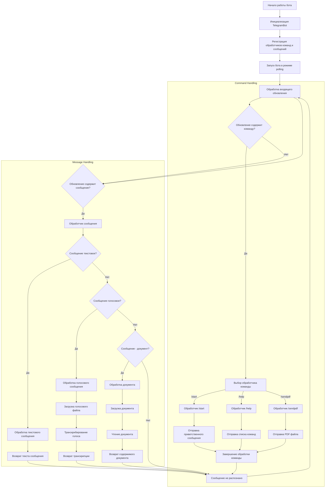

## <алгоритм>

**1. Инициализация бота:**
   - Бот инициализируется с токеном, полученным от Telegram API.
   - Регистрируются обработчики команд и сообщений.

**2. Обработка команд:**
   - `/start`: Бот отправляет приветственное сообщение пользователю.
   - `/help`: Бот отправляет список доступных команд.
   - `/sendpdf`: Бот отправляет PDF-файл пользователю (в коде не реализован).

**3. Обработка сообщений:**
   - **Текстовые сообщения:**
        - Бот получает текстовое сообщение.
        - Бот возвращает полученный текст.

   - **Голосовые сообщения:**
        - Бот получает голосовое сообщение.
        - Бот загружает голосовое сообщение в файл (временный).
        - Бот пытается транскрибировать аудио (пока что заготовка).
        - Возвращает транскрибированный текст.

   - **Файлы документов:**
        - Бот получает файл документа (текстовый).
        - Бот загружает файл в временное хранилище.
        - Бот считывает содержимое файла.
        - Возвращает содержимое файла.
**Примеры:**

   - `/start`:
     - Пользователь отправляет `/start`.
     - Бот получает команду `/start`.
     - Бот отправляет "Привет! Я бот. Введите /help для списка команд."
   - `/help`:
     - Пользователь отправляет `/help`.
     - Бот получает команду `/help`.
     - Бот отправляет "Доступные команды: /start, /help, /sendpdf"
   - Текстовое сообщение:
     - Пользователь отправляет "Привет бот".
     - Бот получает сообщение "Привет бот".
     - Бот возвращает "Привет бот".
   - Голосовое сообщение:
     - Пользователь отправляет голосовое сообщение.
     - Бот получает голосовое сообщение.
     - Бот сохраняет голосовое сообщение во временный файл.
     - Бот вызывает функцию транскрибирования.
     - Бот возвращает транскрибированный текст "тестовый текст"
   - Файл документа:
     - Пользователь отправляет документ (текстовый).
     - Бот получает файл документа.
     - Бот сохраняет файл во временное хранилище.
     - Бот читает содержимое документа.
     - Бот возвращает содержимое документа "Содержимое документа."

**Поток данных:**
   - Пользователь -> Telegram API -> Бот (TelegramBot)
   - Бот -> Telegram API -> Пользователь
   - Голосовое сообщение -> Бот -> Временный файл -> Функция транскрибирования -> Транскрибированный текст
   - Документ -> Бот -> Временный файл -> Функция чтения файла -> Содержимое файла

## <mermaid>

**Описание зависимостей `mermaid`:**

1.  **Start:** Начальная точка процесса работы бота.
2.  **BotInit:** Инициализация экземпляра класса `TelegramBot` с передачей токена бота.
3.  **RegisterHandlers:** Регистрация обработчиков сообщений и команд, которые будут вызваны при наступлении соответствующих событий.
4.  **StartPolling:** Запуск бота в режиме прослушивания обновлений от Telegram API через метод `run_polling`.
5.  **HandleUpdate:** Центральный узел, отвечающий за получение входящих обновлений от Telegram API.
6.  **CommandCheck:** Условие, проверяющее, является ли обновление командой (начинается с `/`).
7.  **CommandHandler:** Выбор конкретного обработчика для выполнения соответствующей команды.
8. **StartCommand, HelpCommand, SendPdfCommand:** Конкретные обработчики команд `/start`, `/help` и `/sendpdf`.
9.  **SendWelcome:** Метод, отправляющий приветственное сообщение при команде `/start`.
10. **SendHelp:** Метод, отправляющий список доступных команд при команде `/help`.
11. **SendPdfFile:** Метод, отправляющий PDF-файл при команде `/sendpdf`.
12. **EndCommand:** Общая точка окончания обработки команды.
13. **MessageCheck:** Условие, проверяющее, является ли обновление обычным сообщением.
14. **MessageHandler:** Обработчик для всех типов сообщений (текст, голос, документ).
15. **TextMessageCheck:** Проверяет, является ли сообщение текстовым.
16. **HandleTextMessage:** Обработчик текстовых сообщений, который возвращает исходный текст.
17. **ReturnText:** Возврат полученного текста.
18. **VoiceMessageCheck:** Проверяет, является ли сообщение голосовым.
19. **HandleVoiceMessage:** Обработчик голосовых сообщений.
20. **DownloadVoice:** Загрузка голосового файла.
21. **TranscribeVoice:** Транскрибирование голосового сообщения в текст.
22. **ReturnTranscription:** Возврат транскрибированного текста.
23. **DocumentMessageCheck:** Проверяет, является ли сообщение документом.
24. **HandleDocumentMessage:** Обработчик сообщений с файлами документов.
25. **DownloadDocument:** Загрузка документа.
26. **ReadDocument:** Чтение содержимого документа.
27. **ReturnDocumentContent:** Возврат содержимого документа.
28. **EndUpdate:** Общая точка завершения обработки любого обновления.

## <объяснение>

**Импорты:**

1.  `python-telegram-bot`: Основная библиотека для создания Telegram ботов. Она предоставляет классы и методы для работы с Telegram API, включая отправку и получение сообщений, обработку команд и т.д.
2.  `pathlib`: Модуль для работы с файловыми путями в кроссплатформенном стиле. `Path` объекты позволяют более читабельно работать с путями, чем простые строки.
3.  `tempfile`: Модуль для создания временных файлов и директорий. Используется для временного хранения файлов (например, голосовых сообщений), которые могут быть не нужны после обработки.
4.  `asyncio`: Модуль для работы с асинхронными операциями. Позволяет выполнять операции ввода/вывода, не блокируя основной поток выполнения, что важно для ботов, обрабатывающих много запросов одновременно.
5.  `requests`: Библиотека для выполнения HTTP запросов, используется для скачивания файлов (например, голосовых сообщений, документов) с серверов Telegram.
6.  `src.utils.convertors.tts`: Предполагаемый модуль для преобразования текста в речь (text-to-speech) и наоборот. Пока не используется, но планируется для транскрибирования голосовых сообщений.
7.  `src.utils.file`: Пользовательский модуль для чтения файлов, в том числе и текстовых, предположительно.

**Класс `TelegramBot`:**

-   **`__init__(self, token: str)`:**
    -   Конструктор класса. Принимает токен Telegram бота как аргумент.
    -   Создает экземпляр класса `Updater` из `python-telegram-bot` для работы с Telegram API.
    -   Сохраняет переданный токен для дальнейшей работы.
    -   Вызывает метод `register_handlers` для регистрации обработчиков.

-   **`register_handlers(self)`:**
    -   Регистрирует обработчики команд и сообщений.
    -   `CommandHandler` связывает команду (например, `/start`) с соответствующей функцией (например, `self.start`).
    -   `MessageHandler` регистрирует обработчик для всех сообщений: текстовых, голосовых и документов, с использованием фильтров (например, `filters.TEXT`, `filters.VOICE`, `filters.Document`).

-   **`start(self, update: Update, context: CallbackContext)`:**
    -   Обработчик команды `/start`.
    -   Принимает объект `update`, содержащий информацию о событии, и `context`, для доступа к контексту взаимодействия с ботом.
    -   Отправляет приветственное сообщение пользователю.

-   **`help_command(self, update: Update, context: CallbackContext)`:**
    -   Обработчик команды `/help`.
    -   Отправляет список доступных команд.

-   **`send_pdf(self, pdf_file: str | Path)`:**
     -   Обработчик команды `/sendpdf`.
     -   Принимает путь к PDF-файлу.
     -  **Не реализован**: Должен отправлять PDF-файл пользователю.
   

-   **`handle_voice(self, update: Update, context: CallbackContext)`:**
    -   Обработчик голосовых сообщений.
    -   Извлекает голосовое сообщение из объекта `update`.
    -   Скачивает голосовой файл во временное хранилище.
    -   Вызывает `transcribe_voice` для транскрибации (на данный момент - заглушка)
    -   Возвращает транскрибированный текст пользователю.

-   **`transcribe_voice(self, file_path: Path) -> str`:**
    -   **Заглушка**: Должна реализовывать транскрибацию голосового сообщения.
    -   На данный момент просто возвращает `"тестовый текст"`.
    -   Принимает путь к голосовому файлу.
    -   Возвращает транскрибированный текст (или сообщение об ошибке).

-   **`handle_document(self, update: Update, context: CallbackContext) -> str`:**
    -   Обработчик документов.
    -    Извлекает документ из объекта `update`.
    -   Скачивает документ во временное хранилище.
    -   Читает содержимое документа с помощью модуля `file`.
    -   Возвращает содержимое документа.

-   **`handle_message(self, update: Update, context: CallbackContext) -> str`:**
    -   Обработчик текстовых сообщений.
    -   Извлекает текст из объекта `update`.
    -   Возвращает исходный текст.

**Функция `main()`:**

-   Основная функция для запуска бота.
-   Создает экземпляр класса `TelegramBot`, используя токен из переменной окружения `TELEGRAM_BOT_TOKEN`.
-   Запускает бота в режиме polling, что означает постоянное прослушивание обновлений от Telegram API.

**Переменные:**

-   `TELEGRAM_BOT_TOKEN`: Токен Telegram бота, передается как переменная окружения.
-   `pdf_file`: Переменная содержит путь к PDF файлу
    
**Потенциальные ошибки и области для улучшения:**

1.  **Отсутствие реализации транскрибирования:** Функция `transcribe_voice` является заглушкой. Необходимо интегрировать реальный сервис транскрибации.
2.  **Отсутствие обработки ошибок:** В коде отсутствуют блоки `try-except`, для отлова возможных ошибок при работе с файлами, сетью и т.д.
3.  **Отсутствие реализации `send_pdf`:** Метод `send_pdf` не отправляет PDF-файл.
4. **Отсутствие обработки разных типов документов:** Код обрабатывает только текстовые документы. Необходимо добавить поддержку других типов.
5.  **Безопасность:** Токен бота не должен храниться в коде. Безопаснее использовать переменные окружения.
6.  **Масштабируемость:** На данный момент бот работает в режиме polling, который может не подходить для высоконагруженных систем. Можно рассмотреть использование вебхуков.

**Взаимосвязи с другими частями проекта:**

-   **`src.utils.convertors.tts`:** Модуль для работы с преобразованием текста в речь и наоборот. Потенциально используется для транскрибирования.
-   **`src.utils.file`:** Модуль для работы с файлами. Используется для чтения содержимого документов.
-   Бот, как компонент `endpoints`, использует другие компоненты проекта, такие как утилиты.

Этот анализ предоставляет подробное понимание функциональности кода, его зависимостей и потенциальных областей для улучшения, предоставляя структурированное руководство для дальнейшей работы.