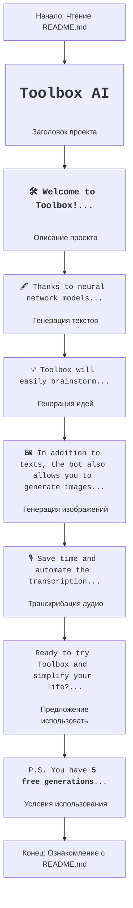

## Анализ README.md

### <алгоритм>

1.  **Начало**: Пользователь открывает файл `README.md`.
2.  **Чтение Заголовка**: Пользователь видит заголовок `<h1>Toolbox AI</h1>`, который представляет собой название проекта.
3.  **Описание**: Пользователь читает введение `<h3>🛠 Welcome to Toolbox! This is a universal assistant...</h3>` , которое описывает функциональность и цель проекта - универсальный ассистент для генерации контента.
4.  **Текстовые функции**: Пользователь узнаёт, что Toolbox генерирует тексты для различных задач (SMM, email, SEO и т.д.), используя нейросети. `🖋 Thanks to neural network models...`.
5.  **Креативные идеи**: Пользователь понимает, что бот может генерировать креативные идеи `💡 Toolbox will easily brainstorm...`.
6.  **Генерация изображений**: Пользователь видит, что Toolbox умеет создавать изображения по текстовому описанию `🖼 In addition to texts, the bot also allows you to generate images...`.
7.  **Транскрибация аудио**: Пользователь узнает, что Toolbox умеет транскрибировать аудио в текст `🎙 Save time and automate the transcription...`.
8.  **Предложение воспользоваться**: Пользователю предлагается выбрать нужную команду `Ready to try Toolbox and simplify your life?...`.
9.  **Условия использования**: Пользователь получает информацию о бесплатных генерациях и платных тарифах `P.S. You have <b>5 free generations</b>...`.
10. **Конец**: Пользователь ознакомился с файлом `README.md`.

### <mermaid>

**Объяснение зависимостей:**

В данном случае, файл `README.md` не имеет никаких импортов или зависимостей от других частей проекта. Это самостоятельный файл, предназначенный для описания проекта и его возможностей для конечного пользователя. Диаграмма `mermaid` представляет собой поток ознакомления пользователя с описанием функциональности, то есть, как пользователь последовательно читает разделы `README.md`.

### <объяснение>

**Импорты:**

Файл `README.md` не содержит никаких импортов. Это файл разметки, используемый для описания проекта и его возможностей, и он не зависит от других модулей или библиотек.

**Классы:**

Файл `README.md` не содержит определения классов. Это просто текстовый файл с HTML-разметкой.

**Функции:**

Файл `README.md` не содержит определения функций. Это статический файл, который просто отображает текст и HTML-элементы.

**Переменные:**

Файл `README.md` не содержит переменных в контексте программирования. Он использует HTML-теги (`<h1>`, `<h3>`, `
`) для форматирования текста.

**Объяснение:**

Файл `README.md` представляет собой вводную документацию к проекту "Toolbox AI". В нем описываются основные возможности бота:

*   Генерация текстов для различных задач (SMM, email, SEO).
*   Генерация креативных идей.
*   Генерация изображений на основе описаний.
*   Транскрибация аудио.

Также в `README.md` есть призыв к использованию бота и условия его бесплатного использования (5 бесплатных генераций).

**Потенциальные ошибки или области для улучшения:**

*   **Локализация**: Файл `README.md` написан на английском языке, что может быть проблемой для пользователей, не владеющих им. Возможно добавление поддержки нескольких языков.
*   **Актуальность**:  Важно поддерживать `README.md` в актуальном состоянии по мере развития проекта, чтобы пользователи всегда имели доступ к последней информации о функциях.
*   **Подробности**: Можно добавить больше конкретных примеров использования бота, чтобы у пользователя было более четкое понимание его возможностей.

**Взаимосвязи с другими частями проекта:**

Файл `README.md` является документацией, а не частью исполняемого кода, поэтому он не имеет прямых взаимосвязей с другими частями проекта в плане выполнения кода. Он описывает возможности, которые предоставляют другие части проекта (например, бот в телеграм).

В целом, `README.md` предоставляет хорошее введение в проект "Toolbox AI" и его возможности. Его можно дополнить, сделав более подробным и локализованным.