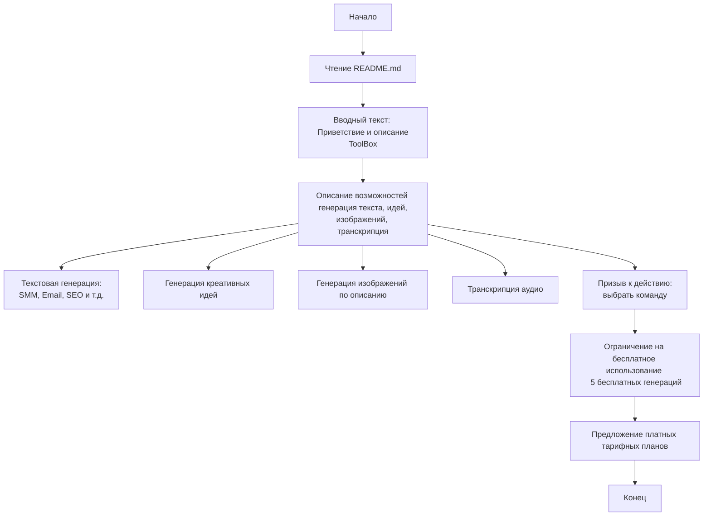

## АНАЛИЗ README.md

### <алгоритм>

1.  **Начало**: Пользователь открывает файл `README.md`.
2.  **Ознакомление**: Пользователь читает вводный текст.
    *   Пример: "Добро пожаловать в Toolbox! Это универсальный помощник, который может генерировать контент для различных рабочих задач!"
3.  **Описание возможностей**: Пользователь узнает о функциях Toolbox.
    *   Пример: "С Toolbox у вас всегда под рукой мощные инструменты на основе нейронных сетей для написания убедительных текстов, генерации креативных идей и создания визуального контента."
4.  **Текстовая генерация**: Пользователь понимает, что может создавать уникальные тексты.
    *   Пример: "Благодаря моделям нейронных сетей вы можете легко создавать уникальные тексты для SMM, рассылок по электронной почте, SEO-продвижения, рекламных кампаний и многого другого. Просто **выберите нужную задачу**, напишите **вводные данные** и получите **готовый контент** в результате."
5.  **Креативные идеи**: Пользователь узнает о возможности генерации креативных концепций.
    *   Пример: "Toolbox легко проведет мозговой штурм и предложит свежие креативные концепции для реализации."
6.  **Генерация изображений**: Пользователь понимает, что может генерировать изображения по описанию.
    *   Пример: "В дополнение к текстам бот также позволяет генерировать изображения на основе описания. Создавайте визуальный контент для постов, баннеров, иллюстраций с нуля - без фотобанков и дизайнеров."
7.  **Транскрипция**: Пользователь узнает о функции транскрипции аудио.
    *   Пример: "Экономьте время и автоматизируйте расшифровку подкастов, вебинаров и видео с помощью встроенной функции."
8.  **Призыв к действию**: Пользователь призывается начать использование Toolbox.
    *   Пример: "Готовы попробовать Toolbox и упростить свою жизнь? Просто выберите нужную команду. Я буду рад помочь с любой задачей!"
9.  **Ограничения и тарифы**: Пользователь узнает об ограничении на бесплатное использование и о платных тарифах.
    *   Пример: "У вас есть **5 бесплатных генераций** для ознакомления с сервисом. Затем вы можете выбрать тарифный план, который покрывает все ваши рабочие задачи!"
10. **Конец**: Пользователь заканчивает чтение файла `README.md`.

### <mermaid>

**Объяснение диаграммы `mermaid`:**

*   **Start**: Обозначает начало процесса чтения файла `README.md`.
*   **Readme**: Представляет собой действие чтения файла.
*   **Introduction**:  Описывает раздел, где приводится приветствие и основное описание Toolbox.
*   **Features**: Описывает блок с возможностями Toolbox, такими как генерация текста, идей, изображений и транскрипция.
*   **TextGeneration**: Описывает возможность генерации текста для SMM, email, SEO и т.д.
*   **CreativeIdeas**: Описывает возможность генерации креативных идей.
*   **ImageGeneration**: Описывает возможность генерации изображений по текстовому описанию.
*   **Transcription**: Описывает возможность транскрипции аудио.
*   **CallToAction**: Описывает призыв к действию с выбором команды для дальнейшей работы.
*   **FreeUsage**: Описывает ограничение на бесплатное использование в 5 генераций.
*   **Subscription**: Описывает предложение платных тарифных планов для дальнейшего использования.
*   **End**: Обозначает конец процесса ознакомления с файлом `README.md`.

### <объяснение>

**Общее описание:**

Файл `README.md` представляет собой вводный документ для пользователя, который впервые сталкивается с ToolBox AI. Он содержит краткое описание возможностей бота, его основные функции и преимущества. Документ предназначен для быстрого ознакомления пользователя с возможностями и принципами работы ToolBox.

**Разделы:**

1.  **Заголовок и приветствие:**
    *   Содержит заголовок "Toolbox AI" и приветствие, что создаёт дружелюбную атмосферу.
2.  **Описание возможностей:**
    *   Подробно описывает основные функции, такие как генерация текстов, идей, изображений и транскрипция.
    *   Например, отмечается, что тексты можно создавать для различных задач: SMM, email-рассылки, SEO и т.д.
3.  **Условия использования:**
    *   Информирует пользователя о наличии пробного периода (5 бесплатных генераций).
    *   Указывает на возможность выбора платного тарифного плана.
4.  **Призыв к действию:**
    *   Мотивирует пользователя начать использование ToolBox, выбирая команду.
    *   Призывает к действию, подчеркивая простоту и удобство использования.

**Ключевые преимущества ToolBox, перечисленные в `README.md`:**

*   Универсальный помощник на основе нейронных сетей.
*   Генерация уникальных текстов.
*   Генерация креативных идей.
*   Генерация изображений по описанию.
*   Транскрипция аудио.
*   Пробный период с бесплатными генерациями.

**Возможные улучшения:**

*   Добавить более конкретные примеры использования каждой функции.
*   Уточнить, какие тарифные планы доступны и их стоимость.
*   Предоставить ссылку на документацию или гайд по использованию бота.
*   Включить скриншоты интерфейса или примеры работы бота.

**Взаимосвязь с другими частями проекта:**

Этот файл является вводным материалом для всего проекта. Он объясняет пользователю, что такое ToolBox и какие возможности он предоставляет. Он связывается с другими частями проекта через понимание функциональности, которую бот предоставляет, и является точкой входа для новых пользователей.