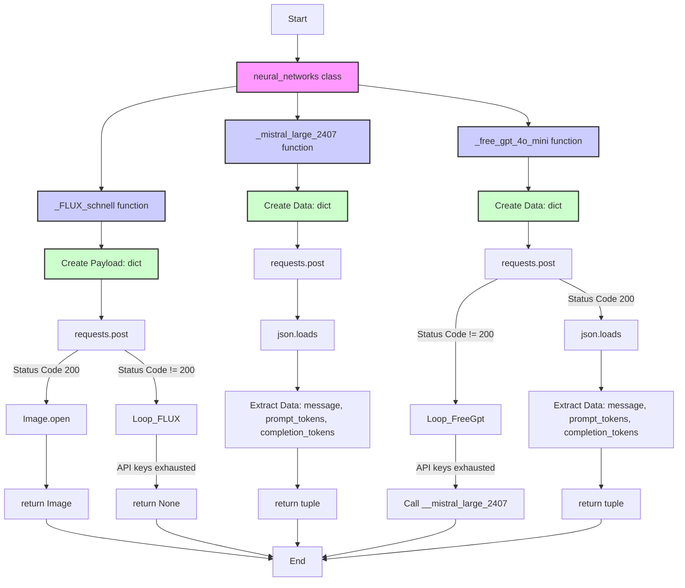

## <алгоритм>

1.  **Инициализация класса `neural_networks`**:
    *   Создается класс `neural_networks`, который будет содержать методы для взаимодействия с различными нейронными сетями.

2.  **Метод `_FLUX_schnell`**:
    *   **Входные данные:** `prompt` (текстовая строка, запрос для генерации изображения), `size` (список из двух целых чисел, определяющий размер изображения [ширина, высота]), `seed` (целое число, начальное значение для генератора случайных чисел), `num_inference_steps` (целое число, количество шагов для генерации изображения).
    *   **Создание `payload`**: Создается словарь `payload` с запросом, содержащий `prompt`, а также параметры для нейросети, включая `guidance_scale`, `num_inference_steps`, `width`, `height` и `seed`.
        *   **Пример:** `payload` = `{"inputs": "a cat in space", "parameters": {"guidance_scale": 1.5, "num_inference_steps": 50, "width": 512, "height": 512, "seed": 42}}`
    *   **Цикл по API ключам**: Цикл `for i in range(1, 7):` проходит по шести возможным API ключам, которые хранятся в переменных окружения `HF_TOKEN1`, `HF_TOKEN2` ... `HF_TOKEN6`.
    *   **POST запрос**: Выполняется `requests.post` запрос к API Hugging Face `https://api-inference.huggingface.co/models/black-forest-labs/FLUX.1-schnell` с заголовками, включающими API ключ и тип контента. В качестве данных запроса передается `payload`.
    *   **Проверка статуса**: Проверяется, что `response.status_code == 200`. Если запрос успешен (статус код 200), то:
    *   **Обработка изображения**: Извлекается бинарное изображение из `response.content` и преобразуется в объект `Image` с помощью `Image.open(io.BytesIO(...))`.
    *   **Возврат изображения**: Возвращается объект `Image`.
    *   **При неудачном запросе**: Если ни один из запросов не вернул 200, функция вернет `None`.
    *   **Выходные данные**: Объект `Image` или `None`.

3.  **Метод `__mistral_large_2407`**:
    *   **Входные данные:** `prompt` (список словарей, представляющий историю сообщений для модели).
        *   **Пример:** `prompt` = `[{"role": "user", "content": "hello"}]`
    *   **Создание `data`**:  Создается словарь `data` с запросом, включающий список сообщений `prompt`, параметры модели, такие как `temperature`, `top_p`, `max_tokens` и идентификатор модели `model`.
        *    **Пример:** `data` = `{"messages": [{"role": "user", "content": "Tell me a joke"}], "temperature": 1.0, "top_p": 1.0, "max_tokens": 1024, "model": "pixtral-12b-2409"}`
    *   **POST запрос**: Выполняется `requests.post` запрос к API Mistral AI `https://api.mistral.ai/v1/chat/completions` с заголовками, включающими API ключ и тип контента. В качестве данных запроса передается `data`.
    *   **Обработка ответа**: Ответ сервера парсится из JSON в словарь `response`.
    *   **Извлечение данных**: Извлекается сообщение из поля `response["choices"][0]["message"]`, а также количество токенов в `prompt` и в `completion` из `response["usage"]`.
    *   **Возврат данных**: Возвращается кортеж, содержащий сообщение (словарь), количество использованных токенов в `prompt`, количество использованных токенов в `completion`.
    *   **Выходные данные**: `tuple[str, int, int]` или `str`.

4.  **Метод `_free_gpt_4o_mini`**:
    *   **Входные данные:** `prompt` (список словарей, представляющий историю сообщений для модели).
        *  **Пример:** `prompt` =  `[{"role": "user", "content": "How are you?"}]`
    *   **Создание `data`**: Создается словарь `data` с запросом, включающий список сообщений `prompt`, параметры модели, такие как `temperature`, `top_p`, `max_tokens` и идентификатор модели `model`.
        *   **Пример:** `data` =  `{"messages": [{"role": "user", "content": "What is 2+2?"}], "temperature": 1.0, "top_p": 1.0, "max_tokens": 1024, "model": "gpt-4o-mini"}`
    *   **Цикл по API ключам**: Цикл `for i in range(1, 7):` проходит по шести возможным API ключам, которые хранятся в переменных окружения `GIT_TOKEN1`, `GIT_TOKEN2` ... `GIT_TOKEN6`.
    *   **POST запрос**: Выполняется `requests.post` запрос к API Azure `https://models.inference.ai.azure.com/chat/completions` с заголовками, включающими API ключ и тип контента. В качестве данных запроса передается `data`.
    *   **Проверка статуса**: Проверяется, что `response.status_code == 200`. Если запрос успешен (статус код 200), то:
    *   **Обработка ответа**: Ответ сервера парсится из JSON в словарь `response`.
    *   **Извлечение данных**: Извлекается сообщение из поля `response["choices"][0]["message"]`, а также количество токенов в `prompt` и в `completion` из `response["usage"]`.
    *   **Возврат данных**: Возвращается кортеж, содержащий сообщение (словарь), количество использованных токенов в `prompt`, количество использованных токенов в `completion`.
    *   **При неудачном запросе**: Если ни один из запросов не вернул 200, функция вызывает метод `self.__mistral_large_2407(prompt)` и возвращает его результат.
    *   **Выходные данные**: `tuple[str, int, int]` или `str`.

## <mermaid>



**Объяснение зависимостей:**

*   `requests`: Используется для отправки HTTP-запросов к API нейросетей.
*   `json`: Используется для обработки JSON-ответов от API.
*   `os`: Используется для доступа к переменным окружения, где хранятся API ключи.
*   `io`: Используется для работы с потоками байтов при обработке изображений.
*   `random.randint`: Используется для генерации случайных целых чисел (не используется в предоставленном коде, но импортирован).
*  `PIL.Image`: Используется для открытия и обработки изображений.

## <объяснение>

**Импорты:**

*   `import requests, json, os, io`:
    *   `requests`: Библиотека для отправки HTTP-запросов. Используется для взаимодействия с API нейросетей.
    *   `json`: Библиотека для работы с данными в формате JSON. Используется для обработки ответов от API.
    *   `os`: Библиотека для взаимодействия с операционной системой, в частности для получения переменных окружения, где хранятся API ключи.
    *   `io`: Модуль для работы с потоками данных, в частности используется для работы с байтовыми потоками при обработке изображений.
*   `from random import randint`:
    *   `randint`:  Функция из модуля `random` для генерации случайных целых чисел. (В представленном коде не используется, но импортируется)
*   `from PIL import Image`:
    *   `Image`: Модуль из библиотеки Pillow (PIL) для работы с изображениями. Используется для открытия и обработки изображений, полученных от API.

**Классы:**

*   `class neural_networks:`
    *   Роль: Класс, содержащий методы для взаимодействия с различными нейронными сетями. Инкапсулирует логику для отправки запросов к API и обработки ответов.
    *   Атрибуты: Не имеет явно определенных атрибутов.
    *   Методы:
        *   `_FLUX_schnell(self, prompt: str, size: list[int, int], seed: int, num_inference_steps: int) -> str|None`:
            *   Аргументы:
                *   `prompt`: Текстовый запрос для генерации изображения.
                *   `size`: Список с шириной и высотой изображения `[width, height]`.
                *   `seed`: Начальное значение для генератора случайных чисел.
                *   `num_inference_steps`: Количество шагов для генерации изображения.
            *   Возвращаемое значение: Объект `Image` при успешном запросе, иначе `None`.
            *   Назначение: Отправляет запрос к API Hugging Face для генерации изображения с помощью модели `FLUX.1-schnell`.
            *   Пример использования:
                ```python
                nn = neural_networks()
                image = nn._FLUX_schnell("a cat", [512, 512], 42, 50)
                if image:
                    image.show()
                ```
        *  `__mistral_large_2407(self, prompt: list[dict[str, str]]) -> tuple[str, int, int]|str`:
            *   Аргументы:
                 *   `prompt`: Список словарей, представляющих историю сообщений для модели. Каждый словарь имеет ключи `role` (например, `user` или `assistant`) и `content` (текст сообщения).
            *   Возвращаемое значение: Кортеж, содержащий ответ модели (сообщение в виде словаря), количество использованных токенов в `prompt` и количество использованных токенов в `completion`, или строка.
            *   Назначение: Отправляет запрос к API Mistral AI для генерации текста с помощью модели `pixtral-12b-2409`.
            *   Пример использования:
                  ```python
                nn = neural_networks()
                prompt = [{"role": "user", "content": "Write a short story about a cat"}]
                message, prompt_tokens, completion_tokens = nn.__mistral_large_2407(prompt)
                print(message, prompt_tokens, completion_tokens)
                  ```
        *   `_free_gpt_4o_mini(self, prompt: list[dict[str, str]]) -> tuple[str, int, int]|str`:
            *   Аргументы:
                *   `prompt`: Список словарей, представляющих историю сообщений для модели. Каждый словарь имеет ключи `role` (например, `user` или `assistant`) и `content` (текст сообщения).
            *   Возвращаемое значение: Кортеж, содержащий ответ модели (сообщение в виде словаря), количество использованных токенов в `prompt` и количество использованных токенов в `completion`, или строка.
            *   Назначение: Отправляет запрос к API Azure для генерации текста с помощью модели `gpt-4o-mini`. Если все запросы неудачны, вызывает `__mistral_large_2407`.
            *   Пример использования:
                   ```python
                nn = neural_networks()
                prompt = [{"role": "user", "content": "What is the capital of France?"}]
                message, prompt_tokens, completion_tokens = nn._free_gpt_4o_mini(prompt)
                print(message, prompt_tokens, completion_tokens)
                  ```
    *   Взаимодействие с другими компонентами проекта: Этот класс является самостоятельным компонентом, взаимодействующим с внешними API. Он может быть использован другими частями проекта, которым требуется функциональность для работы с нейросетями.

**Функции:**

*   Все функции внутри класса `neural_networks` являются методами и описаны выше.

**Переменные:**

*   `payload` (в `_FLUX_schnell`): Словарь, содержащий данные для запроса к API FLUX.1-schnell, включая prompt и параметры.
*   `response` (в `_FLUX_schnell`, `__mistral_large_2407`, `_free_gpt_4o_mini`): Объект ответа HTTP, полученный от сервера.
*   `image` (в `_FLUX_schnell`): Объект `Image`, представляющий сгенерированное изображение.
*    `data` (в `__mistral_large_2407`, `_free_gpt_4o_mini`): Словарь, содержащий данные для запроса к API, включая сообщения и параметры.
*   `prompt` (в `__mistral_large_2407`, `_free_gpt_4o_mini`): Список словарей, представляющий историю сообщений для модели.
*   `message` (в `__mistral_large_2407`, `_free_gpt_4o_mini`): Ответ модели (сообщение в виде словаря)
*    `prompt_tokens` (в `__mistral_large_2407`, `_free_gpt_4o_mini`): Количество использованных токенов в `prompt`
*    `completion_tokens` (в `__mistral_large_2407`, `_free_gpt_4o_mini`): Количество использованных токенов в `completion`

**Потенциальные ошибки и области для улучшения:**

*   **Обработка ошибок:** В методах `_FLUX_schnell` и `_free_gpt_4o_mini` есть проверки `response.status_code == 200`, но нет явной обработки ошибок (например, если API возвращает ошибку). Нужно добавить блок `except` для более надежной обработки ошибок сети или API.
*   **API ключи:**  Использование `os.environ` для хранения API ключей хорошо, но нужно убедиться, что эти переменные окружения правильно настроены и доступны.
*   **Логирование:** Было бы полезно добавить логирование для отслеживания запросов к API, ошибок и других важных событий.
*   **Параметризация:** Некоторые параметры, такие как `guidance_scale`, `temperature`, `top_p` и `max_tokens` заданы жестко. Было бы полезно их сделать параметрами функций.
*   **Повторные запросы:**  В случае ошибок запросы можно было бы повторять несколько раз с экспоненциальным откладыванием (exponential backoff).
*   **Разделение ответственности:** Методы `_FLUX_schnell` и `_free_gpt_4o_mini` содержат циклы для перебора API ключей. Это можно вынести в отдельную функцию для переиспользования.

**Цепочка взаимосвязей с другими частями проекта:**

*   Этот класс, вероятно, используется другими частями проекта (например, ботами), которым нужна функциональность для работы с нейросетями. Взаимодействие происходит путем вызова методов этого класса, получая данные и обрабатывая их.

Этот анализ предоставляет полное и структурированное описание данного кода.