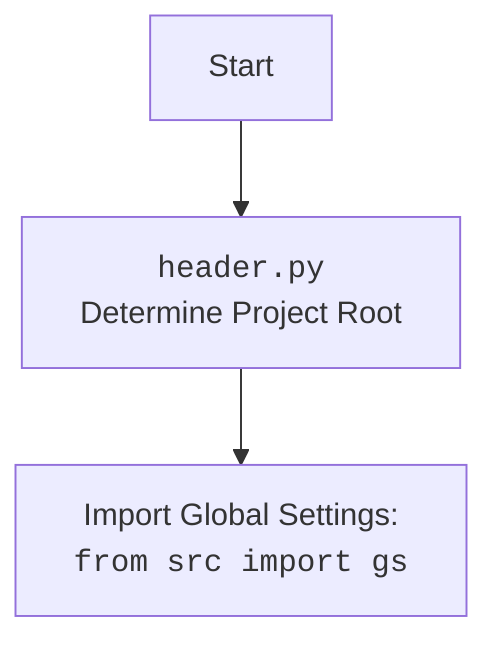

## АНАЛИЗ КОДА: `hypotez/src/endpoints/bots/telegram/ToolBoxbot-main/ToolBox/ToolBox_requests.py`

### 1. <алгоритм>

**Общий рабочий процесс:**

1.  **Инициализация:**
    *   При создании экземпляра `ToolBox` загружаются настройки, включая текстовые подсказки из `prompts.json`, и устанавливается соединение с Telegram Bot API с использованием токена из переменных окружения.
    *   Определяются лямбда-функции для создания клавиатур, отправки сообщений и управления запросами.
2.  **Обработка начального запроса:**
    *   При получении команды `/start` бот отправляет приветственное сообщение с кнопками выбора основных функций (`Текст`, `Изображения`, `Свободный режим`, `Тарифы`).
3.  **Обработка выбора меню:**
    *   В зависимости от выбора пользователя, бот отправляет соответствующие запросы:
        *   **Текст:**
            *   Запрашивает тип текста (коммерческий, SMM и т.д.).
            *   В зависимости от типа текста, запрашивает дополнительные параметры через текстовые поля, если требуется.
            *   Отправляет запрос к `gpt_4o_mini` для генерации текста.
        *   **Изображения:**
            *   Запрашивает разрешение изображения.
            *   Запрашивает текстовое описание для генерации изображения.
            *   Использует `FLUX_schnell` для генерации изображения.
            *   Предоставляет пользователю выбор: улучшить, перегенерировать или сгенерировать новое изображение.
        *   **Свободный режим:**
            *   Принимает текстовый ввод пользователя.
            *   Отправляет запрос к `gpt_4o_mini` для генерации текста.
        *   **Тарифы:**
            *   Показывает доступные тарифы (BASIC, PRO) и опции для промокода и реферальной программы.
            *   Предоставляет возможность перейти к оплате тарифа.
4.  **Обработка текстовых запросов:**
    *   Для некоторых типов текста необходимо заполнить несколько текстовых полей.
    *   Для некоторых типов текста запрашивает количество генерируемых текстов.
    *   Обрабатывает ввод пользователя и формирует промпт для модели `gpt_4o_mini`.
5.  **Обработка запросов изображений:**
    *   Генерирует изображения с использованием `FLUX_schnell`.
    *   Предлагает пользователю дополнительные действия с изображениями.
6.  **Обработка свободных запросов:**
    *   Обрабатывает свободные текстовые запросы, отправляя их в `gpt_4o_mini`
7.  **Обработка тарифов:**
    *   Показывает информацию о тарифах и возможность их покупки через `send_invoice`.
    *   Обрабатывает оплату, используя `provider_token`.

**Примеры:**

*   **Текст:** Пользователь выбирает "Текст", затем "SEO". Бот запрашивает текст, затем ключевые слова. После этого отправляет запрос на генерацию SEO текста.
*   **Изображения:** Пользователь выбирает "Изображения", затем "1024x1024". Бот запрашивает описание изображения. После генерации предлагает улучшить, перегенерировать или создать новое изображение.
*   **Свободный режим:** Пользователь выбирает "Свободный режим" и пишет "Напиши рассказ о космосе". Бот генерирует текст с помощью `gpt_4o_mini`
*   **Тарифы:** Пользователь выбирает "Тарифы", затем "BASIC". Бот предлагает оплатить тариф.

**Поток данных:**

*   `ToolBox` (экземпляр):
    *   Получает ввод от пользователя через `telebot`.
    *   Формирует текстовые промпты, используя `PromptsCompressor`.
    *   Отправляет промпты в `_free_gpt_4o_mini` для генерации текста.
    *   Отправляет промпты в `_FLUX_schnell` для генерации изображений.
    *   Отправляет и редактирует сообщения через `telebot`.
    *   Использует `concurrent.futures.ThreadPoolExecutor` для обработки нескольких текстовых запросов одновременно.
    *   Управляет клавиатурами и меню с помощью `keyboards`.
    *   Работает с токенами через `tokens`.

### 2. <mermaid>
```mermaid
flowchart TD
    Start[Start] --> LoadConfig[Load Config: <br><code>ToolBox/BaseSettings/prompts.json</code>]
    LoadConfig --> InitializeBot[Initialize Telegram Bot: <br><code>telebot.TeleBot(token=os.environ['TOKEN'])</code>]
    InitializeBot --> InitializeKeyboard[Initialize keyboard: <br><code>_keyboard_two_blank</code>, <br><code>_reply_keyboard</code>]
    InitializeKeyboard -->  MainActions[Start Menu <br>  ("Текст", "Изображения", "Свободный режим", "Тарифы")]
    MainActions --> TextOption{Text Option}
    MainActions --> ImageOption{Image Option}
    MainActions --> FreeModeOption{Free Mode}
    MainActions --> TariffOption{Tariff Option}

    TextOption -- "yes" --> TextTypeSelection[Text Type Selection: <br> <code>Text_types</code>]
    TextTypeSelection --> TextProcessing{Text Processing: <br><code>TextCommands</code>, <br><code>SomeTextsCommand</code>}
    TextProcessing --> GPTOperation[GPT-4o mini: <br><code>__gpt_4o_mini</code>]
    GPTOperation --> BackToMenuText[Back to Main Menu: <br><code>restart</code>]
    TextOption -- "no" --> MainActions
  
    ImageOption -- "yes" --> ImageSizeSelection[Image Size Selection: <br> <code>ImageSize</code>]
    ImageSizeSelection --> ImagePrompt[Image Prompt Input: <br> <code>ImageArea</code>]
    ImagePrompt --> ImageGeneration[Image Generation: <br><code>__FLUX_schnell</code>]
    ImageGeneration --> ImageOptions[Image Options: <br> <code>ImageChange</code>, <br> <code>Image_Regen_And_Upscale</code>]
    ImageOptions --> BackToMenuImage[Back to Main Menu: <br><code>restart</code>]
    ImageOption -- "no" --> MainActions

   FreeModeOption -- "yes" --> FreeModeInput[Free Mode Text Input: <br> <code>FreeArea</code>]
   FreeModeInput --> FreeModeGPT[GPT-4o mini: <br><code>__gpt_4o_mini</code>]
   FreeModeGPT --> BackToMenuFree[Back to Main Menu: <br><code>restart</code>]
   FreeModeOption -- "no" --> MainActions

    TariffOption -- "yes" --> TariffSelection[Tariff Selection: <br> <code>TariffArea</code>]
    TariffSelection --> PaymentProcess{Payment Process: <br> <code>Basic_tariff</code>, <br> <code>Pro_tariff</code>}
    PaymentProcess -->  BackToMenuTariff[Back to Main Menu: <br><code>restart</code>]
    TariffOption -- "no" --> MainActions

    classDef main fill:#f9f,stroke:#333,stroke-width:2px
    class Start,LoadConfig,InitializeBot,InitializeKeyboard,MainActions,BackToMenuText,BackToMenuImage,BackToMenuFree,BackToMenuTariff main
```

**Импортированные зависимости:**

*   `telebot`: Для взаимодействия с Telegram Bot API.
*   `os`: Для доступа к переменным окружения (например, токен бота).
*   `json`: Для загрузки данных из JSON-файла (`prompts.json`).
*   `concurrent.futures`: Для управления многопоточностью при обработке запросов.
*   `time`: Для задержек в выполнении задач (например, при ожидании ввода от пользователя).
*   `base64`: Не используется в данном коде (возможно остаток от предыдущих версий или запланированное использование)
*   `random`: Для генерации случайного seed для генерации изображений.
*   `types` из `telebot`: Для создания различных типов клавиатур и сообщений.
*   `PromptsCompressor` из `BaseSettings.AuxiliaryClasses`: Для обработки промптов.
*   `keyboards` из `BaseSettings.AuxiliaryClasses`: Для создания кастомных клавиатур.
*   `neural_networks` из `ToolBox_n_networks`: Для работы с нейронными сетями.
    
**Объяснение Mermaid диаграммы:**

1.  **Start:** Начало выполнения программы.
2.  **LoadConfig:** Загрузка конфигураций из `prompts.json`.
3.  **InitializeBot:** Инициализация Telegram бота с использованием токена из переменных окружения.
4.  **InitializeKeyboard:** Инициализация кастомных клавиатур для взаимодействия с пользователем.
5.  **MainActions:** Отображение начального меню с вариантами "Текст", "Изображения", "Свободный режим" и "Тарифы".
6.  **TextOption:** Блок выбора "Текст". Если пользователь выбрал "Текст", переходит к TextTypeSelection, иначе возвращается в MainActions.
7.  **TextTypeSelection:** Выбор типа текста (например, коммерческий, SMM).
8.  **TextProcessing:** Обработка текстовых запросов: получение дополнительных параметров и формирование промпта.
9.  **GPTOperation:** Вызов модели `gpt_4o_mini` для генерации текста.
10. **BackToMenuText:** Возврат в главное меню после обработки текстового запроса.
11. **ImageOption:** Блок выбора "Изображения". Если пользователь выбрал "Изображения", переходит к ImageSizeSelection, иначе возвращается в MainActions.
12. **ImageSizeSelection:** Выбор размера изображения.
13. **ImagePrompt:** Получение текстового запроса для генерации изображения.
14. **ImageGeneration:** Генерация изображения с помощью `FLUX_schnell`.
15. **ImageOptions:** Предложение действий с изображением (улучшить, перегенерировать).
16. **BackToMenuImage:** Возврат в главное меню после обработки запроса изображения.
17. **FreeModeOption:** Блок выбора "Свободный режим". Если пользователь выбрал "Свободный режим", переходит к FreeModeInput, иначе возвращается в MainActions.
18. **FreeModeInput:** Получение текста свободного запроса от пользователя.
19. **FreeModeGPT:** Вызов модели `gpt_4o_mini` для обработки свободного запроса.
20. **BackToMenuFree:** Возврат в главное меню после обработки свободного запроса.
21. **TariffOption:** Блок выбора "Тарифы". Если пользователь выбрал "Тарифы", переходит к TariffSelection, иначе возвращается в MainActions.
22. **TariffSelection:** Выбор тарифного плана (Basic, Pro).
23. **PaymentProcess:** Процесс оплаты выбранного тарифа.
24. **BackToMenuTariff:** Возврат в главное меню после обработки запроса тарифа.
25. **ClassDef main:** Стилизация основных блоков диаграммы.

**Header Diagram:**

**Объяснение Header Diagram:**
1.  **Start:** Начало процесса загрузки конфигурации проекта.
2.  **Header:** Блок, представляющий `header.py`, который определяет корень проекта.
3.  **import:** Импорт глобальных настроек из файла `gs` (global settings) для всего проекта.

### 3. <объяснение>

**Импорты:**

*   `telebot`: Основная библиотека для взаимодействия с Telegram Bot API. Позволяет отправлять сообщения, обрабатывать обновления и управлять ботом.
*   `os`: Модуль для работы с операционной системой. Используется для доступа к переменным окружения, где хранится токен бота `os.environ['TOKEN']` и `os.environ['PROVIDE_TOKEN']`
*   `json`: Модуль для работы с JSON-данными. Используется для загрузки текстовых подсказок из `prompts.json`.
*   `concurrent.futures`: Модуль для управления многопоточностью. Используется для асинхронной обработки запросов к GPT.
*   `time`: Модуль для работы со временем. Используется для пауз в коде.
*   `base64`: Модуль для кодирования/декодирования данных в base64 (не используется в текущей версии).
*    `random`:  Модуль для генерации случайных чисел. Используется для seed при генерации изображений
*   `types` из `telebot`: Подмодуль для создания типов клавиатур (инлайн и обычных) и других объектов для работы с телеграм ботом
*   `PromptsCompressor` из `BaseSettings.AuxiliaryClasses`: Класс для управления промптами, их сборки и форматирования, а так же проверки размера промптов.
*   `keyboards` из `BaseSettings.AuxiliaryClasses`: Класс для создания и управления кастомными клавиатурами, используемых в боте.
*   `neural_networks` из `ToolBox_n_networks`: Класс для работы с нейронными сетями, который содержит методы вызова моделей и их обработки.

**Класс `ToolBox`:**

*   **Роль:** Главный класс, управляющий логикой бота. Содержит методы для обработки различных типов запросов, работы с текстами и изображениями, а так же управляет меню и тарифами.
*   **Атрибуты:**
    *   `name`: Список названий кнопок в главном меню.
    *   `data`: Список данных кнопок в главном меню.
    *   `prompts_text`: Словарь с текстовыми подсказками, загруженный из `prompts.json`.
    *   `bot`: Экземпляр `telebot.TeleBot` для взаимодействия с Telegram API.
    *   Лямбда-функции для создания клавиатур, отправки сообщений и управления запросами.
*   **Методы:**
    *   `__init__`: Инициализация класса.
    *   `__gpt_4o_mini`: Приватный метод для отправки запроса в модель GPT-4o mini и получения ответа.
    *   `__FLUX_schnell`: Приватный метод для генерации изображений с использованием FLUX.
    *   `Text_types`: Метод для отображения типов текста.
    *   `Basic_tariff`: Метод для обработки выбора тарифа BASIC.
    *   `Pro_tariff`: Метод для обработки выбора тарифа PRO.
    *   `TextCommands`: Метод для обработки текстовых команд.
    *    `SomeTextsCommand`: Метод для обработки запросов генерации нескольких текстов.
    *   `ImageCommand`: Метод для обработки запросов генерации изображений.
    *    `Image_Regen_And_Upscale`: Метод для обработки запросов перегенерации и улучшения изображений.
    *   `FreeCommand`: Метод для обработки свободных запросов пользователя.

**Функции (лямбда-функции):**

*   **`keyboard_blank`**: Лямбда-функция для создания инлайн клавиатуры с двумя параметрами (название и callback\_data).
*   **`reply_keyboard`**: Лямбда-функция для создания обычной клавиатуры с одним параметром (название кнопок).
*   **`__delay`**: Лямбда-функция для отправки сообщения о задержке перед обработкой запроса.
*   **`start_request`**: Лямбда-функция для отправки приветственного сообщения.
*   **`restart`**: Лямбда-функция для отправки сообщения о необходимости выбрать задачу.
*    **`restart_markup`**: Лямбда-функция для редактирования сообщения с запросом выбора задачи.
*   **`OneTextArea`**: Лямбда-функция для отправки запроса с одним текстовым полем (для одного текста).
*   **`SomeTextsArea`**: Лямбда-функция для отправки запроса с несколькими текстовыми полями (для нескольких текстов).
*   **`ImageSize`**: Лямбда-функция для запроса выбора размера изображения.
*   **`ImageArea`**: Лямбда-функция для запроса описания изображения.
*   **`ImageChange`**: Лямбда-функция для запроса действий с изображением.
*   **`BeforeUpscale`**: Лямбда-функция для запроса действий перед улучшением изображения.
*   **`FreeArea`**: Лямбда-функция для запроса свободного ввода пользователя.
*    **`TariffArea`**: Лямбда-функция для отправки сообщения о тарифах.
*    **`TariffExit`**: Лямбда-функция для отправки сообщения о тарифах.
*    **`TarrifEnd`**: Лямбда-функция для отправки сообщения об окончании тарифа.
*   **`FreeTariffEnd`**: Лямбда-функция для отправки сообщения об окончании бесплатного тарифа.
*   **`SomeTexts`**: Лямбда-функция для выбора одного или нескольких текстов.

**Переменные:**

*   `self.name`, `self.data`: Списки для хранения названий кнопок и их callback\_data.
*   `self.prompts_text`: Словарь, хранящий текстовые подсказки.
*   `self.bot`: Экземпляр Telegram бота.
*   Лямбда-функции: Хранят анонимные функции для упрощения кода.
*    `info` : Временный массив, для хранения текстовой информации от пользователя.
*   `response`: Переменная для хранения ответа от GPT.
*   `incoming_tokens`, `outgoing_tokens`: Переменные для хранения количества использованных токенов.
*   `seed`: Переменная для хранения случайного seed для генерации изображений.
*   `photo`: Переменная для хранения фото-байтов изображения, полученных от `_FLUX_schnell`
*   `n`: Количество текстов при множественном запросе.
*   `ans`: Массив для хранения всех параметров при запросе нескольких текстов
*   `params`: Временная переменная, для сохранения параметров для множественного текста

**Потенциальные ошибки и улучшения:**

*   **Обработка ошибок:** В коде есть `try-except` блок в методе `__FLUX_schnell`, но он не логирует ошибки и просто продолжает цикл. Желательно добавить обработку ошибок более детально.
*   **Управление токенами:** В коде используется примитивное управление токенами, и, не очевидно, как они обновляются. Нужно пересмотреть логику списания токенов и добавить возможность их пополнения.
*   **Асинхронность:** Код частично использует многопоточность с `concurrent.futures`, но можно добавить больше асинхронности, используя `asyncio` для более эффективной обработки запросов.
*   **Обработка оплаты:** Код использует `send_invoice` для оплаты, но не обрабатывает успешное завершение оплаты. Необходимо добавить коллбеки для обработки успешной оплаты и продления тарифа.
*   **Использование `nonlocal`:**  Использование `nonlocal` может сделать код менее читаемым и более сложным для понимания. Рассмотреть возможность использования более читаемых решений, например, использовать атрибуты класса для сохранения состояния.

**Взаимосвязи с другими частями проекта:**

*   **`BaseSettings.AuxiliaryClasses`:** Классы `PromptsCompressor` и `keyboards` используются для управления промптами и клавиатурами.
*   **`ToolBox_n_networks`:** Класс `neural_networks` используется для вызова нейронных сетей.
*    **`src.gs`:** Используется для загрузки глобальных настроек.
*   `prompts.json`: Файл, содержащий текстовые промпты.
*   `os.environ`: Используется для доступа к переменным окружения (токен бота).

В целом, код предоставляет базовую структуру для работы Telegram бота, который может генерировать текст и изображения. Однако, есть несколько областей, которые можно улучшить для более стабильной и эффективной работы.