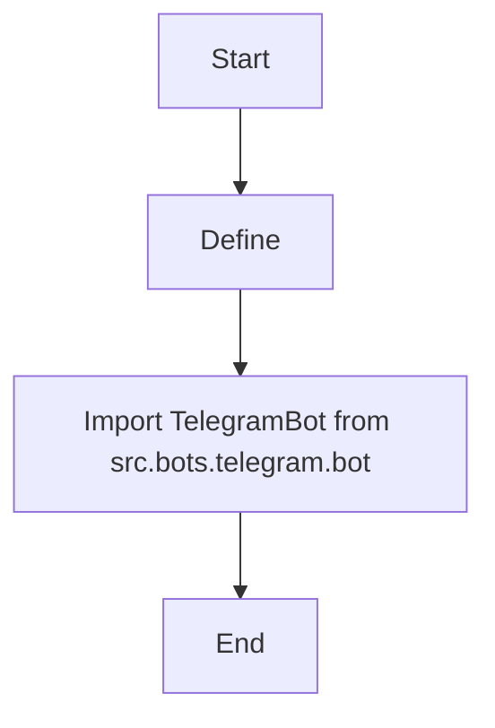

## АНАЛИЗ КОДА: `hypotez/src/endpoints/bots/telegram/__init__.py`

### 1. <алгоритм>

1. **Начало:** Инициализация модуля `src.bots.telegram`.
2. **Определение режима:** Устанавливается переменная `MODE` в значение `'dev'`. Это указывает на то, что текущий режим разработки.
   * **Пример:** ``
3. **Импорт `TelegramBot`:** Импортируется класс `TelegramBot` из модуля `src.bots.telegram.bot`. Этот класс, предположительно, содержит логику для работы с Telegram ботом.
   * **Поток данных:** Класс `TelegramBot` импортируется для использования в других частях проекта, где необходима функциональность Telegram бота.
4. **Завершение:** Завершение инициализации модуля `src.bots.telegram`.

### 2. <mermaid>

### 3. <объяснение>

#### Импорты:
-   `from .bot import TelegramBot`: Импортирует класс `TelegramBot` из модуля `bot.py`, находящегося в той же директории (`src.bots.telegram`).  Этот импорт делает класс `TelegramBot` доступным для использования в данном пакете и других частях проекта, где это необходимо.  Импорт относительный, что указывает на то, что модуль `bot` находится в том же пакете, что и текущий файл.

#### Классы:
-   `TelegramBot`: Предполагается, что этот класс инкапсулирует функциональность Telegram бота. Детали реализации класса находятся в файле `bot.py`.  Этот класс будет использоваться для инициализации и взаимодействия с Telegram API.

#### Функции:
-   В данном файле нет явных функций, он больше предназначен для инициализации и импорта необходимых компонентов.

#### Переменные:
-   ``:  Переменная `MODE` является строкой и устанавливается в значение `'dev'`. Это переменная используется для указания текущего режима работы (разработка). В зависимости от значения этой переменной, может меняться логика работы программы, например, могут использоваться различные конфигурации или выводиться дополнительная отладочная информация.

#### Дополнительные Замечания:

-   **Назначение:** Файл `__init__.py` в Python пакете используется для того, чтобы обозначить директорию как пакет, а также для инициализации этого пакета, импорта общих классов и переменных, которые будут доступны в рамках этого пакета.
-   **Потенциальные улучшения:**
    -   Возможно расширение функциональности, добавив конфигурацию, загружаемую в зависимости от значения `MODE`.
    -   Возможно добавление других общих импортов, которые будут использоваться в данном пакете.
-   **Взаимосвязи с другими частями проекта:** Пакет `src.bots.telegram` является частью более крупной структуры проекта `src`. Класс `TelegramBot`, импортированный здесь, вероятно, будет использоваться в `src.endpoints` или других частях проекта, которые отвечают за обработку команд бота.

**Взаимосвязь с другими частями проекта:**

1.  Файл `__init__.py` является частью пакета `src.bots.telegram`.
2.  Импортированный класс `TelegramBot` из `src.bots.telegram.bot` будет использоваться в других частях проекта, например, в `src.endpoints`, где будет обрабатываться логика бота.
3.  `` может быть использована для переключения между режимом разработки и продакшена, влияя на логику работы бота.