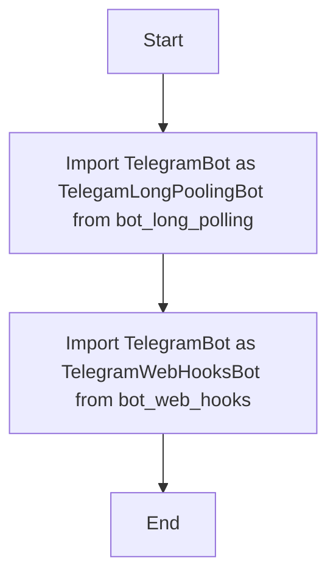

## АНАЛИЗ КОДА: `hypotez/src/endpoints/bots/telegram/__init__.py`

### 1. <алгоритм>

Файл `__init__.py` в директории `hypotez/src/endpoints/bots/telegram/` является файлом инициализации пакета `telegram`. Он не содержит сложной логики, а служит для того, чтобы сделать модули `bot_long_polling` и `bot_web_hooks` доступными при импорте пакета `telegram`.

**Блок-схема:**

```
Start --> Import_TelegramBot_LongPolling
Import_TelegramBot_LongPolling --> Import_TelegramBot_WebHooks
Import_TelegramBot_WebHooks --> End
```

**Примеры:**

1. **Start**: Начало выполнения.
2. **Import_TelegramBot_LongPolling**: Импортирует класс `TelegramBot` из модуля `bot_long_polling` и переименовывает его в `TelegamLongPoolingBot`.
   - Пример: `from .bot_long_polling import TelegramBot  as TelegamLongPoolingBot`
   - Результат: Класс `TelegramBot` из `bot_long_polling` становится доступным как `TelegamLongPoolingBot`.
3. **Import_TelegramBot_WebHooks**: Импортирует класс `TelegramBot` из модуля `bot_web_hooks` и переименовывает его в `TelegramWebHooksBot`.
   - Пример: `from .bot_web_hooks import TelegramBot as TelegramWebHooksBot`
   - Результат: Класс `TelegramBot` из `bot_web_hooks` становится доступным как `TelegramWebHooksBot`.
4. **End**: Завершение выполнения.

### 2. <mermaid>



**Объяснение зависимостей `mermaid`:**

1. **`Start`**: Начальная точка диаграммы, представляющая начало выполнения файла `__init__.py`.
2. **`ImportLongPollingBot`**: Операция импорта класса `TelegramBot` из модуля `bot_long_polling` с переименованием в `TelegamLongPoolingBot`.
   - Зависимость: `from .bot_long_polling import TelegramBot as TelegamLongPoolingBot`
   - Роль: Делает класс `TelegramBot` из `bot_long_polling` доступным как `TelegamLongPoolingBot`.
3. **`ImportWebHooksBot`**: Операция импорта класса `TelegramBot` из модуля `bot_web_hooks` с переименованием в `TelegramWebHooksBot`.
   - Зависимость: `from .bot_web_hooks import TelegramBot as TelegramWebHooksBot`
   - Роль: Делает класс `TelegramBot` из `bot_web_hooks` доступным как `TelegramWebHooksBot`.
4. **`End`**: Конечная точка диаграммы, представляющая завершение выполнения файла `__init__.py`.

### 3. <объяснение>

**Импорты:**

- `from .bot_long_polling import TelegramBot as TelegamLongPoolingBot`:
  - Импортирует класс `TelegramBot` из модуля `bot_long_polling` в текущем пакете (`.`) и присваивает ему псевдоним `TelegamLongPoolingBot`.
  - **Назначение**:  Позволяет использовать класс `TelegramBot` для реализации бота Telegram, работающего в режиме long polling.
  - **Связь с другими пакетами:** Этот импорт связывает текущий пакет (`telegram`) с модулем `bot_long_polling`, который, предположительно, содержит логику long polling для Telegram.

- `from .bot_web_hooks import TelegramBot as TelegramWebHooksBot`:
  - Импортирует класс `TelegramBot` из модуля `bot_web_hooks` в текущем пакете (`.`) и присваивает ему псевдоним `TelegramWebHooksBot`.
  - **Назначение**:  Позволяет использовать класс `TelegramBot` для реализации бота Telegram, работающего в режиме web hooks.
  - **Связь с другими пакетами:** Этот импорт связывает текущий пакет (`telegram`) с модулем `bot_web_hooks`, который, предположительно, содержит логику web hooks для Telegram.

**Классы:**

- В данном файле классы не определены. Он лишь импортирует классы из других модулей. Однако можно отметить, что импортируемые классы `TelegramBot` из `bot_long_polling` и `bot_web_hooks` представляют собой разные реализации одного и того же концептуального объекта - Telegram бота, но использующие разные методы получения обновлений (long polling и web hooks).

**Функции:**

- В данном файле функции не определены. Он лишь импортирует классы.

**Переменные:**

- В данном файле нет явных переменных, кроме псевдонимов `TelegamLongPoolingBot` и `TelegramWebHooksBot`, которые по сути являются указателями на импортированные классы.

**Цепочка взаимосвязей:**

1. Пакет `telegram` является частью пакета `endpoints` (судя по пути `hypotez/src/endpoints/bots/telegram/__init__.py`).
2. Модули `bot_long_polling` и `bot_web_hooks` являются подмодулями пакета `telegram`, и каждый из них предположительно содержит реализацию класса `TelegramBot`.
3. Весь проект, вероятно, использует эту структуру для разделения различных ботов и способов их работы.

**Потенциальные ошибки и области для улучшения:**

1. **Опечатка:** `TelegamLongPoolingBot` содержит опечатку в слове "Telegram".
2. **Разделение:** Возможно, стоит сделать базовый абстрактный класс `TelegramBot` и вынести общую логику в него.
3. **Обработка ошибок:** Код импорта не содержит обработки ошибок импорта.

В целом, файл `__init__.py` выполняет свою задачу - делает классы `TelegramBot` с разными реализациями (long polling и web hooks) доступными для использования через импорт пакета `telegram`.