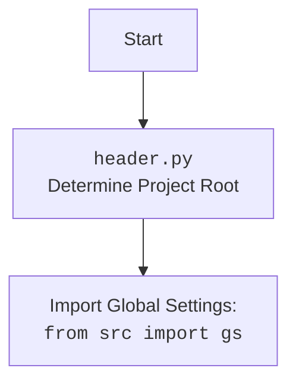

## ИНСТРУКЦИЯ:

Анализируй предоставленный код подробно и объясни его функциональность. Ответ должен включать три раздела:

1.  **<алгоритм>**: Опиши рабочий процесс в виде пошаговой блок-схемы, включая примеры для каждого логического блока, и проиллюстрируй поток данных между функциями, классами или методами.
2.  **<mermaid>**: Напиши код для диаграммы в формате `mermaid`, проанализируй и объясни все зависимости,
    которые импортируются при создании диаграммы.
    **ВАЖНО!** Убедитесь, что все имена переменных, используемые в диаграмме `mermaid`,
    имеют осмысленные и описательные имена. Имена переменных вроде `A`, `B`, `C`, и т.д., не допускаются!

    **Дополнительно**: Если в коде есть импорт `import header`, добавьте блок `mermaid` flowchart, объясняющий `header.py`:
    ```mermaid
    flowchart TD
        Start --> Header[<code>header.py</code><br> Determine Project Root]

        Header --> import[Import Global Settings: <br><code>from src import gs</code>]
    ```

3.  **<объяснение>**: Предоставьте подробные объяснения:
    - **Импорты**: Их назначение и взаимосвязь с другими пакетами `src.`.
    - **Классы**: Их роль, атрибуты, методы и взаимодействие с другими компонентами проекта.
    - **Функции**: Их аргументы, возвращаемые значения, назначение и примеры.
    - **Переменные**: Их типы и использование.
    - Выделите потенциальные ошибки или области для улучшения.

Дополнительно, постройте цепочку взаимосвязей с другими частями проекта (если применимо).

Это обеспечивает всесторонний и структурированный анализ кода.
## Формат ответа: `.md` (markdown)
**КОНЕЦ ИНСТРУКЦИИ**

```markdown
## <алгоритм>
### Блок-схема обработки сообщений Telegram ботом

```mermaid
graph LR
    A[Начало: Получение сообщения] --> B{Тип сообщения?};
    B -- Текст --> C{Команда?};
    C -- /start --> D[Вызов start()];
    C -- /help --> E[Вызов help_command()];
    C -- /sendpdf --> F[Вызов send_pdf()];
    C -- text message --> G[Вызов handle_message()];
    C -- /log --> H[Вызов handle_log()];
    C -- --next or aliases --> I[Вызов handle_next_command()];
    C -- Нет команды --> G
    B -- Голос --> J[Вызов handle_voice()];
    B -- Документ --> K[Вызов handle_document()];
    D --> L[Отправка приветственного сообщения];
    E --> M[Отправка списка команд];
    F --> N{Попытка отправки PDF};
    N -- Успех --> O[Отправка PDF];
    N -- Ошибка --> P[Отправка сообщения об ошибке];
    G --> Q[Отправка подтверждения получения сообщения];
    H --> R[Отправка подтверждения обработки log];
    J --> S[Скачивание голосовго сообщения];
    S --> T[Транскрибирование голоса];
    T --> U[Отправка распознанного текста];
    K --> V[Получение файла и его обработка];
    V --> W[Отправка результата обработки документа];
    L --> Z[Конец];
    M --> Z;
    O --> Z;
    P --> Z;
    Q --> Z;
    R --> Z;
    U --> Z;
    W --> Z;
    I --> Z;
    Z[Конец обработки сообщения];
    
style A fill:#f9f,stroke:#333,stroke-width:2px
```

**Примеры:**

1.  **`/start`**: Пользователь отправляет команду `/start`. Вызывается `start()`, бот отправляет приветственное сообщение.
2.  **`/help`**: Пользователь отправляет команду `/help`. Вызывается `help_command()`, бот отправляет список доступных команд.
3.  **`/sendpdf`**: Пользователь отправляет команду `/sendpdf`. Вызывается `send_pdf()`, бот пытается отправить PDF-файл. При успехе отправляет файл, при неудаче - сообщение об ошибке.
4.  **Текстовое сообщение**: Пользователь отправляет текстовое сообщение. Вызывается `handle_message()`, бот отправляет подтверждение получения.
5.   **`/log message`**: Пользователь отправляет команду `/log` и текст. Вызывается `handle_log()`, бот отправляет подтверждение получения и записывает сообщение в лог.
6.  **Голосовое сообщение**: Пользователь отправляет голосовое сообщение. Вызывается `handle_voice()`, бот скачивает и пытается транскрибировать сообщение, затем отправляет распознанный текст.
7.  **Документ**: Пользователь отправляет документ. Вызывается `handle_document()`, бот скачивает документ и возвращает обработанный текст.

### Поток данных:

1.  **Telegram Update**: Сообщение от пользователя Telegram (текст, команда, голос, документ)
2.  **BotHandler**: Класс обрабатывает сообщение, вызывая соответствующий метод.
3.  **Методы BotHandler**:
    *   `start()`, `help_command()`, `send_pdf()`, `handle_message()`, `handle_voice()`, `handle_document()`: обрабатывают конкретные типы сообщений или команд.
    *   `transcribe_voice()`: (пока не реализовано) обрабатывает голосовое сообщение.
4.  **Telegram Bot API**: Используется для отправки ответов пользователю.
5.  **Logger**:  Для записи информации об ошибках и сообщениях.
6.  **Filesystem**: Для чтения PDF и временных голосовых файлов

```mermaid
flowchart TD
    Start[Начало] --> A[Импорт модулей]
    A --> B[<code>header.py</code>:<br>Определение корня проекта]
    B --> C[Импорт настроек: <code>from src import gs</code>]
    C --> D[Импорт logger: <code>from src.logger.logger import logger</code>]
    D --> E[Импорт url tools: <code>from src.utils.url import is_url</code>]
    E --> F[Импорт printer: <code>from src.utils.printer import pprint</code>]
    F --> G[Импорт telegram: <code>from telegram import Update</code> и <code>from telegram.ext import CallbackContext</code>]
    G --> H[Импорт pathlib: <code>from pathlib import Path</code>]
    H --> I[Импорт file tools: <code>from src.utils.file import read_text_file</code>]
    I --> J[Определение класса <code>BotHandler</code>]
    J --> K[Инициализация <code>BotHandler</code>: метод <code>__init__</code>]
    K --> L[Метод <code>handle_url</code>: обработка URL]
    L --> M[Метод <code>handle_next_command</code>: обработка команды --next]
    M --> N[Метод <code>handle_message</code>: обработка текстового сообщения]
    N --> O[Метод <code>start</code>: обработка команды /start]
    O --> P[Метод <code>help_command</code>: обработка команды /help]
    P --> Q[Метод <code>send_pdf</code>: обработка команды /sendpdf]
    Q --> R[Метод <code>handle_voice</code>: обработка голосового сообщения]
    R --> S[Метод <code>transcribe_voice</code>: транскрибирование голоса]
    S --> T[Метод <code>handle_document</code>: обработка документа]
    T --> U[Метод <code>handle_log</code>: обработка сообщений лога]
    U --> End[Конец]

    style Start fill:#f9f,stroke:#333,stroke-width:2px
```

## <mermaid>





**Анализ зависимостей:**

*   **`random`, `asyncio`, `requests`, `typing`, `bs4`**: Стандартные библиотеки и библиотеки для асинхронного программирования, запросов, аннотаций типов и парсинга HTML соответственно. Они используются для различных задач, но непосредственно в диаграмме не показаны, так как не влияют напрямую на поток обработки сообщений телеграм-бота.
*   **`header`**: Определяет корень проекта и необходим для импорта глобальных настроек.
*   **`src.gs`**: Глобальные настройки проекта, содержащие пути, ключи, т.д.
*   **`src.logger.logger`**: Модуль для логирования сообщений в файловую систему, позволяющий отслеживать работу программы и ошибки.
*   **`src.utils.url`**: Содержит утилиты для работы с URL, например, проверку их валидности.
*  **`src.utils.printer`**: Содержит утилиты для более удобного вывода данных в консоль
*   **`telegram`**: Библиотека для работы с Telegram Bot API.
*   **`pathlib`**: Библиотека для работы с путями к файлам в объектно-ориентированном стиле.
*   **`src.utils.file`**: Модуль, содержащий функции для работы с файлами, например, `read_text_file`.

## <объяснение>

### Импорты:

*   **`import random, asyncio, requests, typing, bs4`**:
    *   `random`: Для генерации случайных чисел (не используется в коде, но импортирован).
    *   `asyncio`: Для асинхронного программирования, позволяет выполнять неблокирующие операции.
    *   `requests`: Для выполнения HTTP-запросов (не используется в коде, но импортирован).
    *   `typing`: Для аннотации типов, что улучшает читаемость и помогает находить ошибки.
    *   `bs4` (`BeautifulSoup`): Для парсинга HTML и XML.
*   **`import header`**: Импортирует модуль `header.py`, который определяет корень проекта и необходим для импорта глобальных настроек.
*   **`from src import gs`**: Импортирует глобальные настройки проекта из `src/gs.py`. `gs` содержит пути к файлам, ключи API и другие глобальные параметры.
*   **`from src.logger.logger import logger`**: Импортирует объект `logger` из `src/logger/logger.py` для логирования событий и ошибок.
*   **`from src.utils.url import is_url`**: Импортирует функцию `is_url` из `src/utils/url.py` для проверки валидности URL.
*   **`from src.utils.printer import pprint`**: Импортирует функцию `pprint` из `src/utils/printer.py` для более читаемого вывода данных в консоль.
*   **`from telegram import Update`**: Импортирует класс `Update` из библиотеки `python-telegram-bot`, представляющий обновление от Telegram (сообщение, команда и т. д.).
*   **`from telegram.ext import CallbackContext`**: Импортирует класс `CallbackContext` из библиотеки `python-telegram-bot`, который содержит контекст выполнения бота.
*   **`from pathlib import Path`**: Импортирует класс `Path` из модуля `pathlib` для работы с путями к файлам.
*    **`from src.utils.file import read_text_file`**: Импортирует функцию `read_text_file` из `src/utils/file.py` для чтения текстовых файлов.

### Классы:

*   **`BotHandler`**:
    *   **Роль**: Обрабатывает входящие сообщения от Telegram бота.
    *   **Атрибуты**: Нет явных атрибутов, но использует `gs` (глобальные настройки) и `logger` (для логирования).
    *   **Методы**:
        *   `__init__(self)`: Инициализирует экземпляр класса. На данный момент не имеет реализации.
        *   `async handle_url(self, update: Update, context: CallbackContext) -> Any`:  Обрабатывает URL-адреса, отправленные пользователем (не реализовано).
        *   `async handle_next_command(self, update: Update) -> None`: Обрабатывает команду "--next" и ее аналоги (не реализовано).
        *   `async handle_message(self, update: Update, context: CallbackContext) -> None`: Обрабатывает любые текстовые сообщения, отправляя подтверждение.
        *   `async start(self, update: Update, context: CallbackContext) -> None`: Обрабатывает команду `/start`, отправляя приветственное сообщение.
        *   `async help_command(self, update: Update, context: CallbackContext) -> None`: Обрабатывает команду `/help`, отправляя список доступных команд.
        *   `async send_pdf(self, update: Update, context: CallbackContext) -> None`: Обрабатывает команду `/sendpdf`, отправляя PDF файл.
        *   `async handle_voice(self, update: Update, context: CallbackContext) -> None`: Обрабатывает голосовые сообщения, скачивает их и пытается транскрибировать.
        *   `async transcribe_voice(self, file_path: Path) -> str`: Транскрибирует голосовое сообщение (на данный момент возвращает заглушку).
        *   `async handle_document(self, update: Update, context: CallbackContext) -> str`: Обрабатывает полученные документы, читает их и возвращает содержимое.
        *   `async handle_log(self, update: Update, context: CallbackContext) -> None`:  Обрабатывает сообщения, начинающиеся с `/log`, и отправляет подтверждение.
    *   **Взаимодействие**:
        *   Получает `Update` и `CallbackContext` от Telegram Bot API.
        *   Использует `gs` для доступа к глобальным настройкам (путь к файлам).
        *   Использует `logger` для логирования.
        *   Использует `read_text_file` для обработки документов.

### Функции:

*   **Все методы класса `BotHandler`**: Описаны выше.

### Переменные:

*   `update` (`telegram.Update`): Объект, содержащий информацию об обновлении от Telegram (сообщение, команда, и т. д.).
*   `context` (`telegram.ext.CallbackContext`): Объект, содержащий контекст выполнения бота.
*   `pdf_file` (`pathlib.Path`): Путь к PDF-файлу, используемому в `send_pdf()`.
*  `file_path` (`pathlib.Path`): Путь к файлу, полученному из голосового сообщения в методе `handle_voice`
* `log_message` (`str`): Текст сообщения лога, полученный в методе `handle_log`
* `tmp_file_path` (`str`): Путь к временному файлу после скачивания документа в методе `handle_document`.

### Потенциальные ошибки и области для улучшения:

1.  **Не реализованные методы**: Методы `handle_url` и `handle_next_command` не имеют реализации.
2.  **Транскрибирование голоса**: Метод `transcribe_voice` не реализован.
3.  **Обработка ошибок**: В некоторых методах используется общее исключение `Exception`. Необходимо использовать более специфические исключения и добавить обработку для каждого.
4.  **Отсутствие валидации**: Нет валидации на ввод пользователя, что может привести к ошибкам.
5. **Асинхронность**: Методы handle_url и handle_next_command объявлены как асинхронные, но не содержат никакого асинхронного кода. Возможно, требуется пересмотреть их необходимость в асинхронности.
6. **Обработка документов**: Метод `handle_document` скачивает документ и возвращает текст, но не обрабатывает другие типы файлов и может вызвать ошибку в случае нетекстовых документов.

### Взаимосвязи с другими частями проекта:

*   **`header.py`**: Определяет корень проекта и позволяет импортировать другие модули.
*   **`src.gs`**: Глобальные настройки, используемые для путей к файлам.
*   **`src.logger.logger`**: Централизованное логирование событий.
*   **`src.utils.url`**: Утилиты для работы с URL.
*    **`src.utils.printer`**: Утилиты для вывода данных
*   **`src.utils.file`**: Утилиты для работы с файлами.

В целом, класс `BotHandler` является центральной частью, обрабатывающей сообщения от Telegram-бота. Он зависит от других модулей проекта для настроек, логирования и базовых операций.
```