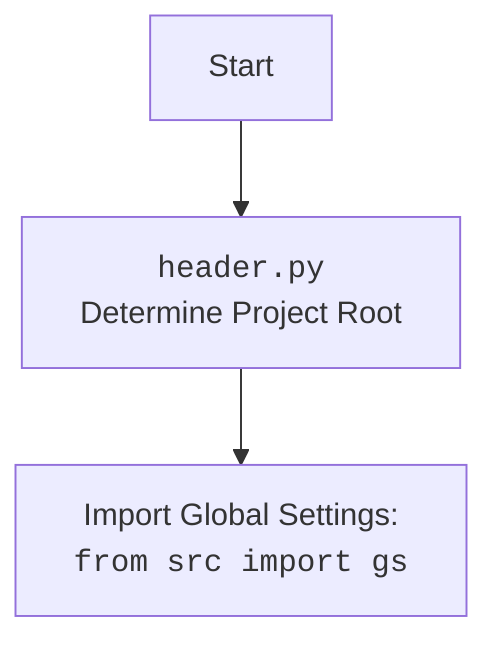

## ИНСТРУКЦИЯ:

Анализируй предоставленный код подробно и объясни его функциональность. Ответ должен включать три раздела:

1.  **<алгоритм>**: Опиши рабочий процесс в виде пошаговой блок-схемы, включая примеры для каждого логического блока, и проиллюстрируй поток данных между функциями, классами или методами.
2.  **<mermaid>**: Напиши код для диаграммы в формате `mermaid`, проанализируй и объясни все зависимости,
    которые импортируются при создании диаграммы.
    **ВАЖНО!** Убедитесь, что все имена переменных, используемые в диаграмме `mermaid`,
    имеют осмысленные и описательные имена. Имена переменных вроде `A`, `B`, `C`, и т.д., не допускаются!

    **Дополнительно**: Если в коде есть импорт `import header`, добавьте блок `mermaid` flowchart, объясняющий `header.py`:
    ```mermaid
    flowchart TD
        Start --> Header[<code>header.py</code><br> Determine Project Root]

        Header --> import[Import Global Settings: <br><code>from src import gs</code>]
    ```

3.  **<объяснение>**: Предоставьте подробные объяснения:
    *   **Импорты**: Их назначение и взаимосвязь с другими пакетами `src.`.
    *   **Классы**: Их роль, атрибуты, методы и взаимодействие с другими компонентами проекта.
    *   **Функции**: Их аргументы, возвращаемые значения, назначение и примеры.
    *   **Переменные**: Их типы и использование.
    *   Выделите потенциальные ошибки или области для улучшения.

Дополнительно, постройте цепочку взаимосвязей с другими частями проекта (если применимо).

Это обеспечивает всесторонний и структурированный анализ кода.
## Формат ответа: `.md` (markdown)
**КОНЕЦ ИНСТРУКЦИИ**

## <алгоритм>

**Блок-схема работы Telegram бота:**

1.  **Инициализация бота (`main`)**:
    *   Загрузка токена Telegram бота из глобальных настроек `gs.credentials.telegram.bot.kazarinov`.
    *   Создание экземпляра класса `TelegramBot` с использованием полученного токена.
    *   Регистрация обработчиков команд и сообщений.
    *   Запуск бота в режиме polling.

2.  **Регистрация обработчиков (`register_handlers`)**:
    *   Регистрация обработчиков для команд: `/start`, `/help`, `/sendpdf` (пример: `self.application.add_handler(CommandHandler('start', self.start))`).
    *   Регистрация обработчиков текстовых сообщений, голосовых сообщений и документов.

3.  **Обработчик команды `/start` (`start`)**:
    *   Принимает `update` и `context` от Telegram.
    *   Отправляет приветственное сообщение пользователю: "Hello! I am your simple bot. Type /help to see available commands.".

4.  **Обработчик команды `/help` (`help_command`)**:
    *   Принимает `update` и `context` от Telegram.
    *   Отправляет пользователю список доступных команд бота.

5.  **Обработчик команды `/sendpdf` (`send_pdf`)**:
    *   Принимает путь к PDF файлу (`pdf_file`).
    *   Открывает PDF файл в режиме чтения байтов (`rb`).
    *   Отправляет PDF документ пользователю с помощью `update.message.reply_document()`.
    *   Обработка исключений и отправка сообщения об ошибке, если не удалось отправить файл.

6.  **Обработчик голосовых сообщений (`handle_voice`)**:
    *   Принимает `update` и `context` от Telegram.
    *   Получает информацию о голосовом сообщении из `update.message.voice`.
    *   Скачивает голосовой файл на локальную машину во временный каталог.
    *   Вызывает функцию `transcribe_voice` (заглушка) для транскрибации.
    *   Отправляет расшифрованный текст обратно пользователю.
    *   Обработка исключений и отправка сообщения об ошибке, если не удалось обработать голосовое сообщение.

7.  **Функция транскрибации голоса (`transcribe_voice`)**:
    *   Принимает путь к голосовому файлу.
    *   Возвращает заглушку "Распознавание голоса ещё не реализовано.". (Нужно заменить на реальную логику распознавания)

8.  **Обработчик документов (`handle_document`)**:
    *   Принимает `update` и `context` от Telegram.
    *   Получает информацию о файле документа из `update.message.document`.
    *   Скачивает файл на локальную машину.
    *   Вызывает функцию `read_text_file` для чтения содержимого файла.
    *   Возвращает текст из файла.

9.  **Обработчик текстовых сообщений (`handle_message`)**:
    *   Принимает `update` и `context` от Telegram.
    *   Возвращает полученное текстовое сообщение.

10. **Обработчик логов (`handle_log`)**:
    *   Принимает `update` и `context` от Telegram.
    *   Логирует полученное сообщение.
    *   Отправляет сообщение подтверждение "Log received and processed."

**Примеры:**

*   Пользователь отправляет команду `/start`: бот отвечает "Hello! I am your simple bot. Type /help to see available commands.".
*   Пользователь отправляет команду `/help`: бот выводит список доступных команд.
*   Пользователь отправляет команду `/sendpdf`: бот отправляет PDF файл (путь к файлу должен быть определен заранее).
*   Пользователь отправляет голосовое сообщение: бот скачивает его, пытается распознать (возвращает заглушку) и выводит текст.
*   Пользователь отправляет текстовое сообщение: бот возвращает его обратно.
*   Пользователь отправляет документ: бот скачивает его, читает текст из него и возвращает его.

## <mermaid>

```mermaid
flowchart TD
    Start[Start Application] --> LoadToken[Load Telegram Bot Token from gs.credentials.telegram.bot.kazarinov]
    LoadToken --> CreateBot[Create TelegramBot Instance]
    CreateBot --> RegisterHandlers[Register Command and Message Handlers]
    RegisterHandlers --> StartPolling[Start Bot Polling]
    StartPolling --> WaitForUpdate[Wait for Telegram Update]

    WaitForUpdate -->|Command: /start| HandleStart[/start Command Handler/]
    WaitForUpdate -->|Command: /help| HandleHelp[/help Command Handler/]
    WaitForUpdate -->|Command: /sendpdf| HandleSendPdf[/sendpdf Command Handler/]
    WaitForUpdate -->|Message: Text| HandleMessage[Text Message Handler]
    WaitForUpdate -->|Message: Voice| HandleVoice[Voice Message Handler]
    WaitForUpdate -->|Message: Document| HandleDocument[Document Message Handler]
    WaitForUpdate -->|Message: Log| HandleLog[Log Message Handler]

    HandleStart --> ReplyStart[Reply with Greeting Message]
    HandleHelp --> ReplyHelp[Reply with Available Commands]
    HandleSendPdf --> OpenPdf[Open PDF File]
    OpenPdf --> SendPdf[Send PDF Document]
    HandleVoice --> GetVoiceFile[Get Voice File from Update]
    GetVoiceFile --> DownloadVoiceFile[Download Voice File]
    DownloadVoiceFile --> TranscribeVoice[Transcribe Voice (Stub)]
    TranscribeVoice --> ReplyVoice[Reply with Transcribed Text]
    HandleDocument --> GetDocumentFile[Get Document File from Update]
    GetDocumentFile --> DownloadDocumentFile[Download Document File]
    DownloadDocumentFile --> ReadDocumentFile[Read Text from Document]
    ReadDocumentFile --> ReturnDocumentText[Return Text Content]
    HandleMessage --> ReturnMessageText[Return Text Message]
    HandleLog --> LogMessage[Log the Message]
    LogMessage --> ReplyLog[Reply log processed]

    ReplyStart --> WaitForUpdate
    ReplyHelp --> WaitForUpdate
    SendPdf --> WaitForUpdate
    ReplyVoice --> WaitForUpdate
    ReturnDocumentText --> WaitForUpdate
    ReturnMessageText --> WaitForUpdate
    ReplyLog --> WaitForUpdate

    classDef cmdfill fill:#f9f,stroke:#333,stroke-width:2px
    class HandleStart, HandleHelp, HandleSendPdf cmdfill
    classDef msgfill fill:#ccf,stroke:#333,stroke-width:2px
    class HandleVoice, HandleDocument, HandleMessage, HandleLog msgfill

    linkStyle default stroke:#333,stroke-width:1.5px
```



**Объяснение `mermaid`:**

Диаграмма описывает поток управления в Telegram боте.

*   `Start Application`: Начало работы бота, запускается функция `main()`.
*   `Load Telegram Bot Token from gs.credentials.telegram.bot.kazarinov`: Загрузка токена бота из глобальных настроек.
*   `Create TelegramBot Instance`: Создание экземпляра класса `TelegramBot`.
*   `Register Command and Message Handlers`: Регистрация обработчиков команд и сообщений.
*   `Start Bot Polling`: Запуск бота в режиме опроса (polling).
*   `Wait for Telegram Update`: Ожидание новых обновлений (сообщений, команд) от Telegram.

Далее, в зависимости от типа обновления:

*   Если команда `/start` - вызывается `HandleStart`, который в свою очередь вызывает `ReplyStart`.
*   Если команда `/help` - вызывается `HandleHelp`, который в свою очередь вызывает `ReplyHelp`.
*   Если команда `/sendpdf` - вызывается `HandleSendPdf`, который открывает файл и вызывает `SendPdf`.
*   Если текстовое сообщение - вызывается `HandleMessage`, который возвращает текст `ReturnMessageText`.
*   Если голосовое сообщение - вызывается `HandleVoice`, который получает файл, скачивает, вызывает `TranscribeVoice`, затем вызывает `ReplyVoice` для отправки ответа.
*   Если документ - вызывается `HandleDocument`, который получает файл, скачивает, вызывает `ReadDocumentFile` для чтения текста и `ReturnDocumentText` для возврата.
*   Если сообщение для логов, то вызывается `HandleLog`, который логирует сообщение и возвращает `ReplyLog`.

Все обработчики сообщений и команд возвращаются к `Wait for Telegram Update`, ожидая новых обновлений.

**Зависимости:**

Импортируются следующие библиотеки для работы диаграммы:

*   `telegram`: Основная библиотека для работы с Telegram API.
*   `src.logger.logger`: Для логирования событий.
*   `src.utils.file`: Для работы с файлами (чтение текста).
*   `src.utils.convertors.tts`: Для распознавания голоса (в данном случае заглушка).
*   `src.gs`: Для доступа к глобальным настройкам.

## <объяснение>

**Импорты:**

*   `pathlib`:  Используется для работы с путями к файлам и директориям.
*   `tempfile`: Для создания временных файлов и директорий.
*   `asyncio`: Для асинхронного программирования.
*   `logging`: Для ведения логов.
*   `telegram`: Библиотека для работы с Telegram Bot API. Включает в себя классы `Update` для представления входящих обновлений, `Application` для управления ботом и `CallbackContext` для контекста обработки.
*   `telegram.ext`: Расширения для `telegram`, включает в себя классы `CommandHandler` и `MessageHandler` для обработки команд и сообщений, а также `filters` для фильтрации сообщений.
*   `header`:  Модуль, вероятно, используемый для определения корневой директории проекта.
*   `src.gs`: Модуль, вероятно, содержащий глобальные настройки проекта.
*   `src.utils.jjson`: Модуль для работы с JSON данными.
*   `src.logger.logger`: Модуль для логирования.
*   `requests`: Библиотека для скачивания файлов.
*   `src.utils.convertors.tts`:  Модуль для преобразования текста в речь и распознавания речи.
*   `src.utils.file`: Модуль для работы с файлами.

**Классы:**

*   `TelegramBot`:
    *   **Роль**: Класс для управления Telegram ботом. Содержит логику обработки команд и сообщений.
    *   **Атрибуты**:
        *   `application`: Экземпляр класса `telegram.ext.Application`, представляющий Telegram бота.
    *   **Методы**:
        *   `__init__(self, token: str)`: Конструктор, инициализирует бота с токеном и регистрирует обработчики.
        *   `register_handlers(self)`: Регистрирует обработчики команд и сообщений.
        *   `start(self, update: Update, context: CallbackContext)`: Обработчик команды `/start`.
        *   `help_command(self, update: Update, context: CallbackContext)`: Обработчик команды `/help`.
        *   `send_pdf(self, pdf_file: str | Path)`: Обработчик команды `/sendpdf`, отправляет PDF файл.
        *   `handle_voice(self, update: Update, context: CallbackContext)`: Обработчик голосовых сообщений, скачивает, пытается распознать (заглушка).
        *   `transcribe_voice(self, file_path: Path)`: Заглушка для распознавания голоса.
        *   `handle_document(self, update: Update, context: CallbackContext)`: Обработчик документов, скачивает и читает текст из них.
        *   `handle_message(self, update: Update, context: CallbackContext)`: Обработчик текстовых сообщений.
        *   `handle_log(self, update: Update, context: CallbackContext)`: Обработчик логов.

**Функции:**

*   `main()`:
    *   **Аргументы**: Нет.
    *   **Возвращаемое значение**: None.
    *   **Назначение**: Загружает токен, создает бота и запускает polling.

**Переменные:**

*   `token` (str): Токен Telegram бота для авторизации.
*   `bot` (TelegramBot): Экземпляр класса `TelegramBot`.
*   `update` (telegram.Update): Объект, представляющий входящее обновление от Telegram.
*   `context` (telegram.ext.CallbackContext): Контекст обработки, используется для доступа к боту и другим данным.
*   `pdf_file` (str | Path): Путь к PDF файлу.
*   `file_path` (Path): Путь к файлу для скачивания.
*    `tmp_file_path` (Path): Путь к временному файлу.

**Цепочка взаимосвязей:**

1.  `main()`: Загружает токен из `gs.credentials.telegram.bot.kazarinov`, создает экземпляр `TelegramBot`, регистрирует обработчики и запускает polling.
2.  `TelegramBot`: Инициализируется с токеном, регистрирует обработчики (`register_handlers`).
3.  Обработчики (`start`, `help_command`, `send_pdf`, `handle_voice`, `handle_document`, `handle_message`, `handle_log`): Реагируют на соответствующие типы сообщений, обрабатывают их и отправляют ответы пользователю.
4.  `transcribe_voice`: Заглушка для распознавания голоса (потенциальное место для интеграции с реальным сервисом распознавания).
5.  `read_text_file`: Используется для чтения текстового содержимого из файлов.
6.  Логгер (`src.logger.logger`): Используется для записи сообщений в логи.

**Потенциальные ошибки и улучшения:**

*   **Заглушка распознавания речи**: Функция `transcribe_voice` является заглушкой и не выполняет реального распознавания. Нужно реализовать распознавание речи, используя, например, Google Speech-to-Text API.
*   **Обработка ошибок**:  В некоторых местах есть try-except, но можно добавить больше обработки исключений, чтобы улучшить отказоустойчивость.
*   **Конфигурация**: Использование `gs.credentials.telegram.bot.kazarinov` для токена может быть не гибким, лучше использовать переменные окружения.
*   **Отправка PDF**:  `send_pdf` принимает путь к файлу, нужно предусмотреть динамическую генерацию pdf, либо интеграцию с базой данных.
*   **Обработка файлов**: Обработка голосовых сообщений и документов может быть улучшена путем добавления более сложных операций (например, распознавание текста на изображениях из документов).
*   **Логирование**: Можно улучшить логирование, добавив более подробную информацию о сообщениях, времени их обработки и ошибках.
*   **Асинхронность**:  Использовать `async/await` для асинхронных операций, особенно при работе с сетью и файлами, чтобы не блокировать выполнение программы.

Этот анализ предоставляет полное понимание функциональности кода, его архитектуры и взаимосвязей между различными частями проекта.