## ИНСТРУКЦИЯ:

Анализируй предоставленный код подробно и объясни его функциональность. Ответ должен включать три раздела:

1.  **<алгоритм>**: Опиши рабочий процесс в виде пошаговой блок-схемы, включая примеры для каждого логического блока, и проиллюстрируй поток данных между функциями, классами или методами.
2.  **<mermaid>**: Напиши код для диаграммы в формате `mermaid`, проанализируй и объясни все зависимости,
    которые импортируются при создании диаграммы.
    **ВАЖНО!** Убедитесь, что все имена переменных, используемые в диаграмме `mermaid`,
    имеют осмысленные и описательные имена. Имена переменных вроде `A`, `B`, `C`, и т.д., не допускаются!

    **Дополнительно**: Если в коде есть импорт `import header`, добавьте блок `mermaid` flowchart, объясняющий `header.py`:
    ```mermaid
    flowchart TD
        Start --> Header[<code>header.py</code><br> Determine Project Root]

        Header --> import[Import Global Settings: <br><code>from src import gs</code>]
    ```

3.  **<объяснение>**: Предоставьте подробные объяснения:
    -   **Импорты**: Их назначение и взаимосвязь с другими пакетами `src.`.
    -   **Классы**: Их роль, атрибуты, методы и взаимодействие с другими компонентами проекта.
    -   **Функции**: Их аргументы, возвращаемые значения, назначение и примеры.
    -   **Переменные**: Их типы и использование.
    -   Выделите потенциальные ошибки или области для улучшения.

Дополнительно, постройте цепочку взаимосвязей с другими частями проекта (если применимо).

Это обеспечивает всесторонний и структурированный анализ кода.
## Формат ответа: `.md` (markdown)
**КОНЕЦ ИНСТРУКЦИИ**

## <алгоритм>

**Блок-схема работы приложения:**

```mermaid
graph LR
    A[Начало] --> B(Создание TelegramBot);
    B --> C{Загрузка конфига};
    C --> D{Создание telegram.ext.Application};
    D --> E{Регистрация обработчиков};
    E --> F(Создание aiohttp приложения);
    F --> G{Сохранение bot в aiohttp app};
    G --> H{Регистрация роута /webhook};
    H --> I{Регистрация on_startup};
    I --> J{Регистрация on_shutdown};
    J --> K{Настройка application};
    K --> L(Запуск aiohttp app);

    L --> M{Telegram POST /webhook};
    M --> N(update_webhook_handler);
    N --> O{Извлечение JSON};
    O --> P{Получение bot из app};
    P --> Q{Обработка Update};
     Q --> R{Вызов обработчика telegram.ext.Application};
    R --> S(Возврат web.Response);
    S --> T(Бот отвечает);

    style A fill:#f9f,stroke:#333,stroke-width:2px
    style L fill:#ccf,stroke:#333,stroke-width:2px
    style M fill:#ccf,stroke:#333,stroke-width:2px

    classDef start fill:#f0f0f0,stroke:#333,stroke-width:2px
     class B,C,D,E,F,G,H,I,J,K start
    classDef http fill:#ccf,stroke:#333,stroke-width:2px
     class N,O,P,Q,R,S http
```



**Примеры:**

*   **Создание `TelegramBot`:**
    *   Пример: `bot = TelegramBot(token="YOUR_TELEGRAM_BOT_TOKEN", bot_handler=BotHandler())`
    *   Результат: Создается экземпляр `TelegramBot`, настраивается `telegram.ext.Application`, регистрируются обработчики, загружается конфигурация.
*   **Запуск AIOHTTP приложения:**
    *   Пример: `web.run_app(app, host=bot.host, port=bot.port)`
    *   Результат: Запускается AIOHTTP приложение, которое начинает слушать входящие HTTP-запросы.
*   **Webhook запрос:**
    *   Пример: Telegram отправляет POST запрос на `/webhook` с JSON-сообщением.
    *   Результат: Запрос перенаправляется в `update_webhook_handler`.
*   **Обработка Update:**
    *   Пример: `bot.application.process_update(update)`
    *   Результат: `telegram.ext.Application` обрабатывает `Update` и вызывает соответствующий обработчик.
*   **Вызов обработчика:**
    *   Пример: Если пользователь отправил текстовое сообщение, то вызывается `handle_message`.
    *   Результат: `handle_message` вызывает `bot_handler.handle_message` для обработки сообщения.

## <mermaid>

```mermaid
flowchart TD
    subgraph TelegramBot
        TelegramBot_init[TelegramBot.__init__]
        TelegramBot_load_config[TelegramBot._load_config]
        TelegramBot_register_handlers[TelegramBot.register_handlers]
        TelegramBot_start_handler[TelegramBot.start]
        TelegramBot_help_handler[TelegramBot.help_command]
        TelegramBot_send_pdf_handler[TelegramBot.send_pdf]
        TelegramBot_handle_message[TelegramBot.handle_message]
         TelegramBot_handle_voice[TelegramBot.handle_voice]
        TelegramBot_handle_document[TelegramBot.handle_document]
         TelegramBot_handle_log[TelegramBot.handle_log]

    end
    subgraph AIOHTTP
        create_app[create_app]
        setup_application[setup_application]
        update_webhook_handler[update_webhook_handler]
        on_startup[on_startup]
        on_shutdown[on_shutdown]
    end
   
    TelegramBot_init --> TelegramBot_load_config
    TelegramBot_init --> TelegramBot_register_handlers
    
    create_app -->| Сохраняет экземпляр TelegramBot | AIOHTTP
    create_app -->| Регистрирует обработчик /webhook | update_webhook_handler
     create_app -->| Добавляет обработчики on_startup, on_shutdown  | AIOHTTP
    create_app --> setup_application

    setup_application --> update_webhook_handler

    on_startup -->| set_webhook | TelegramBot_init
    on_shutdown -->| delete_webhook| TelegramBot_init


    update_webhook_handler -->| Извлекает JSON|
    update_webhook_handler --> | Получает bot из app | AIOHTTP
    update_webhook_handler --> | Передает update в telegram.ext.Application|  TelegramBot_init
    TelegramBot_init -->| process_update | TelegramBot_handle_message
    TelegramBot_init -->| process_update | TelegramBot_start_handler
     TelegramBot_init -->| process_update | TelegramBot_help_handler
      TelegramBot_init -->| process_update | TelegramBot_send_pdf_handler
      TelegramBot_init -->| process_update | TelegramBot_handle_voice
       TelegramBot_init -->| process_update | TelegramBot_handle_document
       TelegramBot_init -->| process_update | TelegramBot_handle_log

        TelegramBot_handle_message -->| Вызывает bot_handler.handle_message| BotHandler
        
    classDef classTelegramBot fill:#f0f0f0,stroke:#333,stroke-width:2px
    class TelegramBot_init,TelegramBot_load_config,TelegramBot_register_handlers,TelegramBot_start_handler,TelegramBot_help_handler,TelegramBot_send_pdf_handler,TelegramBot_handle_message, TelegramBot_handle_voice,TelegramBot_handle_document, TelegramBot_handle_log classTelegramBot
   
    classDef classAIOHTTP fill:#ccf,stroke:#333,stroke-width:2px
    class create_app,setup_application,update_webhook_handler,on_startup,on_shutdown classAIOHTTP
```

**Анализ зависимостей:**

*   **`TelegramBot`**:  Отвечает за взаимодействие с Telegram Bot API, инициализацию, загрузку конфигурации и регистрацию обработчиков сообщений.
*   **`AIOHTTP`**: Отвечает за создание и управление веб-сервером, обработку входящих запросов.
*   **`BotHandler`**: (не показан на диаграмме)  Отвечает за логику обработки сообщений телеграм бота.
*  **`telegram.ext.Application`**: (на диаграмме - `TelegramBot_init`) отвечает за обработку сообщений от телеграм бота,  и вызывает нужный обработчик.
*   **`create_app`**: Создает aiohttp приложение, сохраняет экземпляр `TelegramBot` и настраивает обработчики.
*   **`setup_application`**: Настраивает приложение для работы с webhook-ами телеграм.
*   **`update_webhook_handler`**: Обрабатывает входящие POST-запросы от Telegram, извлекает JSON,  передает его на обработку в `telegram.ext.Application`.
*   **`on_startup`**: Устанавливает webhook для телеграм-бота при запуске приложения.
*   **`on_shutdown`**: Удаляет webhook при остановке приложения.

## <объяснение>

### Импорты:

В данном коде не указаны импорты, но из контекста и кода можно предположить, что используются следующие импорты из пакета `src`:

*   `from aiohttp import web`: Библиотека `aiohttp` используется для создания асинхронного веб-сервера, обрабатывающего HTTP-запросы.
*   `from telegram.ext import Application, CommandHandler, MessageHandler, filters, CallbackContext`: Библиотека `python-telegram-bot`  используется для взаимодействия с Telegram Bot API, создания обработчиков и управления ботом.
*   `from telegram import Update`: Класс `Update` из `python-telegram-bot`  представляет входящие данные от Telegram (новое сообщение, команда).
*   `from pathlib import Path`: Библиотека `pathlib`  используется для работы с файловыми путями.
*  `from src import gs`: Импортируется глобальные настройки проекта.

### Класс `TelegramBot`:

*   **Роль**: Представляет Telegram-бота, инициализирует бота, загружает конфигурацию, регистрирует обработчики команд и сообщений.
*   **Атрибуты:**
    *   `token`: токен для доступа к Telegram Bot API.
    *   `bot_handler`: Экземпляр класса, который отвечает за логику обработки сообщений.
    *   `application`: экземпляр `telegram.ext.Application` для управления ботом.
    *   `host`: хост, на котором запускается сервер.
    *   `port`: порт, на котором запускается сервер.
*   **Методы:**
    *   `__init__(self, token: str, bot_handler)`: Инициализирует бота, загружает конфигурацию, создает экземпляр `telegram.ext.Application`, сохраняет `bot_handler`.
    *   `_load_config(self, config_path: str | Path)`: Загружает конфигурацию из JSON-файла, устанавливает значения `host` и `port`.
    *   `register_handlers(self)`: Регистрирует обработчики команд (например, `/start`, `/help`, `/sendpdf`) и сообщений (текстовые, голосовые, документы).
    *   Обработчики сообщений (например, `start`, `help_command`, `send_pdf`, `handle_message`, `handle_voice`, `handle_document`, `handle_log`): Обрабатывают входящие сообщения от пользователя, вызывая `bot_handler` или отправляя ответ пользователю.
*   **Взаимодействие**:
    *   Получает токен бота и `bot_handler`.
    *   Создает экземпляр `telegram.ext.Application` для взаимодействия с Telegram Bot API.
    *   Регистрирует обработчики, которые вызывают другие части приложения.
    *   Используется в `create_app` для создания aiohttp-приложения.

### Функции:

*   **`update_webhook_handler(request: web.Request) -> web.Response`**:
    *   **Аргументы**: `request` - запрос от aiohttp (содержит входящие данные от telegram).
    *   **Возвращаемое значение**: `web.Response` (пустой ответ в случае успеха или 500 в случае ошибки).
    *   **Назначение**: Обрабатывает webhook-запросы от Telegram, извлекает JSON, передает его в `bot.application.process_update` для обработки ботом.
    *  **Пример**: Обрабатывает входящий POST-запрос от Telegram, содержащий данные о новом сообщении от пользователя.
*   **`on_startup(app: web.Application)`**:
    *   **Аргументы**: `app` - aiohttp-приложение.
    *   **Возвращаемое значение**: `None`.
    *   **Назначение**: Устанавливает webhook для бота при запуске приложения с помощью `bot.application.bot.set_webhook`.
    *   **Пример**: Вызывается при запуске aiohttp-приложения, устанавливает webhook на адрес, указанный в настройках.
*  **`on_shutdown(app: web.Application)`**:
    *   **Аргументы**: `app` - aiohttp-приложение.
    *   **Возвращаемое значение**: `None`.
    *   **Назначение**: Удаляет webhook для бота при остановке приложения с помощью `bot.application.bot.delete_webhook`.
    *   **Пример**: Вызывается при остановке aiohttp-приложения, удаляет установленный webhook.
*   **`setup_application(app: web.Application, application: Application)`**:
     *    **Аргументы**: `app` - aiohttp-приложение, `application` -  экземпляр `telegram.ext.Application`.
     *    **Возвращаемое значение**: `None`.
     *    **Назначение**: Сохраняет функцию `update_webhook_handler` как обработчик для дальнейшего использования.
     *    **Пример**:  Настраивает aiohttp приложение, связывает его с `telegram.ext.Application`.
*   **`create_app(bot: TelegramBot) -> web.Application`**:
    *   **Аргументы**: `bot` - экземпляр `TelegramBot`.
    *   **Возвращаемое значение**: `web.Application` - сконфигурированное aiohttp-приложение.
    *   **Назначение**: Создает и настраивает aiohttp-приложение, сохраняет экземпляр бота, регистрирует обработчик `/webhook`, on_startup, on_shutdown, и настраивает приложение.
    *   **Пример**: Создает aiohttp-приложение, которое слушает на заданном хосте и порту и обрабатывает входящие webhook запросы.

### Переменные:

*   `token`: (str) токен для доступа к Telegram Bot API, передается при создании `TelegramBot`.
*   `bot_handler`: (объект) экземпляр класса, обрабатывающего сообщения телеграм-бота.
*   `app`: (web.Application) экземпляр aiohttp-приложения.
*   `bot`: (TelegramBot) экземпляр класса `TelegramBot`.
*   `update`: (Update) Объект, представляющий обновление из telegram API (новое сообщение, команда).
*   `host`: (str)  Хост сервера из конфигурации.
*    `port`: (int) Порт сервера из конфигурации.
*    `webhook_url`: (str) URL  для телеграм webhook из настроек.
*   `data`: (dict) JSON данные, извлеченные из тела запроса.

### Потенциальные ошибки и улучшения:

*   **Обработка ошибок:** Код не имеет подробной обработки ошибок.  Необходимо добавить try/except для обработки различных исключений, таких как ошибки разбора JSON, ошибки при работе с Telegram API.
*   **Конфигурация**: Загрузка конфигурации только из JSON. Возможность использовать переменные окружения.
*   **Логирование**: Добавить более детальное логирование всех действий, включая успешные и неудачные.
*   **Безопасность:** Хранение токена в коде небезопасно. Необходимо использовать переменные окружения или secrets manager.
*   **Зависимости:** Необходимо точно указать все используемые импорты в начале файла, чтобы не полагаться на контекст.
*   **`handle_message`**: Сейчас просто вызывает `bot_handler.handle_message`, но не проверяет результат и не обрабатывает возможные исключения.

**Взаимосвязь с другими частями проекта:**

*   Этот код является частью backend-а проекта, который принимает входящие запросы от телеграм, и в зависимости от типа запроса инициирует работу других частей проекта.
*   Логика обработки сообщений находится в другом классе `BotHandler`.
*   Использует настройки из `gs` для получения webhook url.
*   Возможно, взаимодействует с базой данных, файловой системой, другими сервисами.