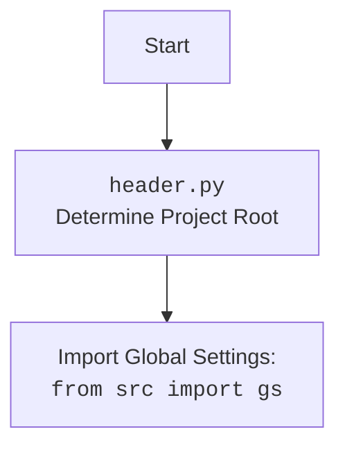

## ИНСТРУКЦИЯ:

Анализируй предоставленный код подробно и объясни его функциональность. Ответ должен включать три раздела:

1.  **<алгоритм>**: Опиши рабочий процесс в виде пошаговой блок-схемы, включая примеры для каждого логического блока, и проиллюстрируй поток данных между функциями, классами или методами.
2.  **<mermaid>**: Напиши код для диаграммы в формате `mermaid`, проанализируй и объясни все зависимости,
    которые импортируются при создании диаграммы.
    **ВАЖНО!** Убедитесь, что все имена переменных, используемые в диаграмме `mermaid`,
    имеют осмысленные и описательные имена. Имена переменных вроде `A`, `B`, `C`, и т.д., не допускаются!

    **Дополнительно**: Если в коде есть импорт `import header`, добавьте блок `mermaid` flowchart, объясняющий `header.py`:
    ```mermaid
    flowchart TD
        Start --> Header[<code>header.py</code><br> Determine Project Root]

        Header --> import[Import Global Settings: <br><code>from src import gs</code>]
    ```

3.  **<объяснение>**: Предоставьте подробные объяснения:
    -   **Импорты**: Их назначение и взаимосвязь с другими пакетами `src.`.
    -   **Классы**: Их роль, атрибуты, методы и взаимодействие с другими компонентами проекта.
    -   **Функции**: Их аргументы, возвращаемые значения, назначение и примеры.
    -   **Переменные**: Их типы и использование.
    -   Выделите потенциальные ошибки или области для улучшения.

Дополнительно, постройте цепочку взаимосвязей с другими частями проекта (если применимо).

Это обеспечивает всесторонний и структурированный анализ кода.
## Формат ответа: `.md` (markdown)
**КОНЕЦ ИНСТРУКЦИИ**

## <алгоритм>

```mermaid
graph LR
    A[Start: main()] --> B(Create TelegramBot Instance)
    B --> C(Create aiohttp Web Application)
    C --> D{Register Webhook Handler}
    D --> E{Register Startup Handler: on_startup()}
    E --> F{Register Shutdown Handler: on_shutdown()}
    F --> G(Setup Application with Bot)
    G --> H(Run Web Application)
    H --> I{Incoming Update From Telegram}
    I --> J{Route Update based on Type}
    J -- Command: /start --> K[Handle /start Command]
    J -- Command: /help --> L[Handle /help Command]
    J -- Command: /sendpdf --> M[Handle /sendpdf Command]
    J -- Voice Message --> N[Handle Voice Message]
    N --> O(Get Voice File)
    O --> P(Save Voice File to Disk)
    P --> Q(Transcribe Voice to Text)
    Q --> R(Reply with Transcription)
    J -- Text Message --> S[Handle Text Message]
    J -- Document --> T[Handle Document]
    T --> U(Get Document File)
    U --> V(Save Document to Disk)
    V --> W(Read Document Text)
    W --> X(Return Text Content)
    S --> Y(Return Received Text)
    K --> Z(Reply with Start Text)
    L --> AA(Reply with Help Text)
    M --> BB(Send PDF File to User)
     BB -- Error --> CC(Reply with Error Message)
    X --> D
    Y --> D
    R --> D
    Z --> D
    AA --> D
    CC --> D
    subgraph "Telegram Bot Class"
        K
        L
        M
        N
        O
        P
        Q
        R
        S
        T
        U
        V
        W
        X
        Y
        Z
        AA
        BB
        CC
    end
    subgraph "Webhook Handling"
        D
    end
    subgraph "Startup/Shutdown"
        E
        F
    end
```

**Примеры:**

*   **Старт:** `main()` инициирует создание экземпляра `TelegramBot`, создает `aiohttp` приложение, регистрирует обработчики и запускает приложение, ожидая входящие обновления от Telegram.

*   **Команда `/start`:** Пользователь отправляет `/start` в Telegram. `TelegramBot.start` обрабатывает команду, отправляя пользователю приветственное сообщение.

*   **Голосовое сообщение:** Пользователь отправляет голосовое сообщение. `TelegramBot.handle_voice` обрабатывает, скачивает файл, отправляет его на распознавание речи (пока заглушка) и отправляет транскрибированный текст.

*   **Текстовое сообщение:** Пользователь отправляет обычное текстовое сообщение. `TelegramBot.handle_message` обрабатывает, возвращая текст сообщения.

*   **Документ:** Пользователь отправляет документ (файл). `TelegramBot.handle_document` скачивает файл, сохраняет его на диск и возвращает текст из документа (если это текстовый документ).

*   **Команда `/sendpdf`**: Пользователь отправляет команду `/sendpdf`. `TelegramBot.send_pdf` отправляет пользователю PDF-файл.

## <mermaid>

```mermaid
flowchart TD
    Start[Start: main()] --> CreateTelegramBot[Create TelegramBot Instance]
    CreateTelegramBot --> CreateWebApp[Create aiohttp Web Application]
    CreateWebApp --> RegisterWebhookHandler[Register Webhook Handler]
    RegisterWebhookHandler --> RegisterStartupHandler[Register Startup Handler: on_startup()]
    RegisterStartupHandler --> RegisterShutdownHandler[Register Shutdown Handler: on_shutdown()]
    RegisterShutdownHandler --> SetupAppWithBot[Setup Application with Bot]
    SetupAppWithBot --> RunWebApp[Run Web Application]
    RunWebApp --> IncomingUpdate[Incoming Update From Telegram]
    IncomingUpdate --> RouteUpdate[Route Update Based on Type]

    RouteUpdate -- "/start" Command --> HandleStartCommand[Handle /start Command]
    RouteUpdate -- "/help" Command --> HandleHelpCommand[Handle /help Command]
    RouteUpdate -- "/sendpdf" Command --> HandleSendPdfCommand[Handle /sendpdf Command]
    RouteUpdate -- Voice Message --> HandleVoiceMessage[Handle Voice Message]
    RouteUpdate -- Text Message --> HandleTextMessage[Handle Text Message]
    RouteUpdate -- Document --> HandleDocument[Handle Document]

    HandleVoiceMessage --> GetVoiceFile[Get Voice File]
    GetVoiceFile --> SaveVoiceFile[Save Voice File to Disk]
    SaveVoiceFile --> TranscribeVoice[Transcribe Voice to Text]
    TranscribeVoice --> ReplyWithTranscription[Reply with Transcription]

    HandleDocument --> GetDocumentFile[Get Document File]
    GetDocumentFile --> SaveDocumentFile[Save Document File to Disk]
    SaveDocumentFile --> ReadDocumentText[Read Document Text]
    ReadDocumentText --> ReturnDocumentText[Return Text Content]

    HandleTextMessage --> ReturnTextMessage[Return Received Text]
     HandleStartCommand --> ReplyWithStartText[Reply with Start Text]
    HandleHelpCommand --> ReplyWithHelpText[Reply with Help Text]
    HandleSendPdfCommand --> SendPdfFile[Send PDF File to User]

    SendPdfFile -- Error --> ReplyWithError[Reply with Error Message]

    ReplyWithTranscription --> RouteUpdate
    ReturnTextMessage --> RouteUpdate
    ReturnDocumentText --> RouteUpdate
    ReplyWithStartText --> RouteUpdate
    ReplyWithHelpText --> RouteUpdate
    ReplyWithError --> RouteUpdate


    subgraph "TelegramBot Class"
        HandleStartCommand
        HandleHelpCommand
        HandleSendPdfCommand
        HandleVoiceMessage
        GetVoiceFile
        SaveVoiceFile
        TranscribeVoice
        ReplyWithTranscription
        HandleTextMessage
        HandleDocument
        GetDocumentFile
        SaveDocumentFile
        ReadDocumentText
        ReturnDocumentText
        ReturnTextMessage
        ReplyWithStartText
        ReplyWithHelpText
        SendPdfFile
        ReplyWithError

    end

   subgraph "Webhook Handling"
    RegisterWebhookHandler
    end

    subgraph "Startup/Shutdown"
    RegisterStartupHandler
    RegisterShutdownHandler
    end
```


**Описание зависимостей:**

*   `pathlib.Path`: Используется для работы с путями к файлам и директориям в файловой системе.

*   `tempfile`: Для создания временных файлов.

*   `asyncio`: Для асинхронного программирования.

*   `logging`: Для логирования событий.

*   `telegram`: Для работы с Telegram Bot API.

*   `telegram.ext`: Для упрощения разработки Telegram ботов.

*   `aiohttp`: Для создания веб-приложений.

*   `aiogram.webhook.aiohttp_server`: Для настройки вебхуков для `aiogram` (используется внутри `telegram.ext`).

*   `header`: Внутренний модуль, определяющий корневую директорию проекта, позволяет загружать глобальные настройки.

*   `src.gs`: Глобальные настройки приложения, загружаемые через `header.py`.

*   `src.utils.jjson`: Для работы с JSON файлами (загрузка и сохранение), в этом примере не используется напрямую, но импортирован.

*    `src.logger.logger`: Модуль для логирования событий проекта.

*   `requests`: Для выполнения HTTP запросов (например, скачивания файлов).

*   `src.utils.convertors.tts`: Модуль для распознавания речи и преобразования текста в речь.

*   `src.utils.file`: Модуль для чтения текстовых файлов.

**Объяснение `header.py`:**

`header.py` не представлен в коде, но по описанию используется для определения корневой директории проекта и загрузки глобальных настроек.

## <объяснение>

**Импорты:**

*   `pathlib`: Позволяет работать с путями к файлам и директориям в кроссплатформенном формате. Используется для создания путей к временным файлам.
*   `tempfile`: Предоставляет функции для создания временных файлов и каталогов. Используется для временного хранения скачанных медиа файлов.
*   `asyncio`: Предоставляет инфраструктуру для написания асинхронного кода. Весь код бота работает асинхронно.
*   `logging`: Предоставляет гибкую систему для записи логов. Используется для логирования событий бота, ошибок и отладочной информации.
*   `telegram`, `telegram.ext`: Официальная библиотека для работы с Telegram Bot API. Используется для получения обновлений от Telegram, отправки сообщений и обработки различных типов входящих данных.
*   `aiohttp`: Библиотека для создания асинхронных веб-приложений. Используется для реализации вебхуков.
*   `aiogram.webhook.aiohttp_server`: Используется для настройки вебхуков с использованием `aiohttp`, интегрируется с `telegram.ext`.
*   `header`: Внутренний модуль, вероятно, содержит логику определения корневой директории проекта.
*   `src.gs`: Глобальные настройки, используемые для хранения конфигурационных параметров бота (токена, URL вебхука и пр.) и путей к файлам.
*   `src.utils.jjson`: Утилиты для работы с JSON (загрузки, выгрузки)
*    `src.logger.logger`: Внутренний модуль, который предоставляет функциональность логирования для проекта
*   `requests`: Библиотека для выполнения HTTP-запросов, в данном случае, используется для скачивания файлов из Telegram.
*   `src.utils.convertors.tts`: Внутренний модуль для распознавания речи и преобразования текста в речь.
*   `src.utils.file`: Внутренний модуль для чтения файлов.

**Класс `TelegramBot`:**

*   **Роль:** Представляет собой интерфейс для работы с Telegram ботом. Содержит методы для обработки различных типов обновлений от Telegram.
*   **Атрибуты:**
    *   `application`: Экземпляр `telegram.ext.Application`, представляющий собой приложение Telegram бота.
*   **Методы:**
    *   `__init__(self, token: str)`: Конструктор класса, инициализирует экземпляр бота с заданным токеном, регистрирует обработчики.
    *   `register_handlers(self)`: Регистрирует обработчики команд и сообщений.
    *   `start(self, update: Update, context: CallbackContext) -> None`: Обработчик команды `/start`. Отправляет приветствие пользователю.
    *   `help_command(self, update: Update, context: CallbackContext) -> None`: Обработчик команды `/help`. Отправляет справку о командах бота.
    *   `send_pdf(self, pdf_file: str | Path) -> None`: Обработчик команды `/sendpdf`. Отправляет PDF файл пользователю.
    *  `handle_voice(self, update: Update, context: CallbackContext) -> None`: Обработчик голосовых сообщений, скачивает файл, отправляет на транскрибацию и возвращает текст.
    * `transcribe_voice(self, file_path: Path) -> str`: Функция-заглушка для транскрибации, в коде не реализована полноценно.
    * `handle_document(self, update: Update, context: CallbackContext) -> str`: Обработчик полученных документов, скачивает файл, возвращает текст документа
    *   `handle_message(self, update: Update, context: CallbackContext) -> str`: Обработчик любых текстовых сообщений. Просто возвращает текст сообщения.
     *   `handle_log(self, update: Update, context: CallbackContext) -> None`: Обработчик для логирования любых текстовых сообщений.

**Функции:**

*   `on_startup(app: web.Application)`: Функция, которая вызывается при запуске веб-приложения. Устанавливает вебхук для бота.
*   `on_shutdown(app: web.Application)`: Функция, вызываемая при остановке веб-приложения. Удаляет вебхук.
*   `create_app(bot: TelegramBot) -> web.Application`: Функция создает и настраивает веб-приложение aiohttp для работы с Telegram ботом.
*   `main() -> None`: Точка входа в приложение. Инициализирует бота, создает и запускает веб-приложение.

**Переменные:**

*   `token`: Строка, содержащая токен Telegram бота (получается из глобальных настроек).
*   `bot`: Экземпляр класса `TelegramBot`.
*   `app`: Экземпляр класса `web.Application` (веб-приложение aiohttp).
*   `update`: Объект `telegram.Update`, содержащий информацию о входящем событии от Telegram.
*   `context`: Объект `telegram.ext.CallbackContext`, содержащий контекст текущего разговора.
*   `file_path`: Объект `Path` путь к файлу.
*   `voice`: Объект `telegram.Voice` - информация о голосовом сообщении.
*   `log_message`: Сообщение для логирования

**Потенциальные ошибки и области для улучшения:**

*   **Обработка ошибок:** В коде используется `try-except`, но логирование ошибок может быть более информативным. Также, нет обработки специфических ошибок, связанных с работой `telegram` или `aiohttp`, что может привести к неожиданному поведению.
*   **Распознавание речи:** Функция `transcribe_voice` пока не реализована, и является заглушкой. Ее следует заменить на реальный сервис распознавания речи.
*   **Безопасность:** Токен Telegram бота и прочие важные параметры должны храниться безопасно, например, в переменных окружения.
*   **Обработка документов:** Обрабатываются только текстовые документы, нужно добавить возможность обрабатывать другие форматы.
*   **Менеджмент файлов:** Временные файлы не удаляются после использования. Это может привести к нехватке места на диске. Нужно реализовать их удаление, используя `tempfile`.
*   **Отсутствие обработки ошибок** `send_pdf` не обрабатывает случай, когда файл не найден или поврежден, что приведет к исключению.

**Цепочка взаимосвязей:**

1.  `main()` создает экземпляр `TelegramBot`, инициализируя его с токеном из `gs.credentials.telegram.bot.kazarinov`.
2.  `main()` создает веб-приложение `aiohttp` с помощью `create_app()` и передает ему экземпляр `TelegramBot`.
3.  `create_app()` настраивает маршруты, связывая URL `/gs.credentials.telegram.bot.kazarinov` с обработчиком вебхуков `bot.application.update_webhook`.
4.  `on_startup()` устанавливает вебхук, используя `gs.settings.get_webhook_url`, который считывается из глобальных настроек.
5.  При получении обновления от Telegram, `TelegramBot` перенаправляет его в соответствующие обработчики в зависимости от типа обновления (команды, текстовые сообщения, голосовые сообщения, документы).
6.  Внутри `TelegramBot`, методы используют `telegram` и `aiohttp` для взаимодействия с Telegram API и отправки ответов пользователям.
7.  Для скачивания файлов используется `requests` (для получения URL из Telegram) и `file.download_to_drive` (для сохранения файла на диск)
8.  Логирование производится с помощью `logger`, что позволяет отслеживать события в приложении.
9.  `transcribe_voice` вызывается при обработке голосовых сообщений, но сейчас это заглушка.
10. `read_text_file` вызывается при обработке документов для чтения их содержимого.
11. `on_shutdown()` удаляет вебхук при остановке веб-приложения.

Этот код является хорошей основой для создания Telegram бота с использованием вебхуков. Однако, ему требуется доработка в плане обработки ошибок, распознавания речи, менеджмента файлов и общей безопасности.