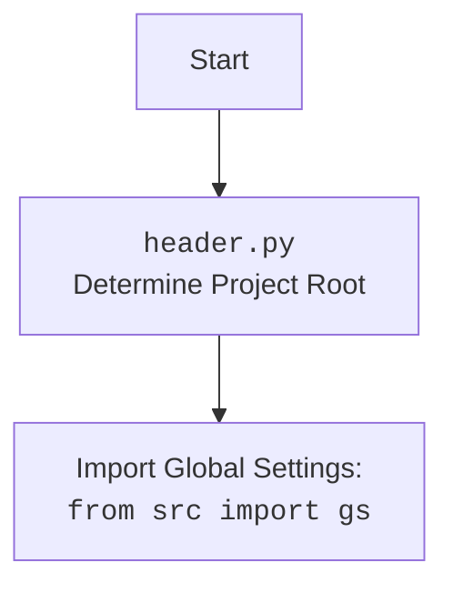

## ИНСТРУКЦИЯ:

Анализируй предоставленный код подробно и объясни его функциональность. Ответ должен включать три раздела:

1. **<алгоритм>**: Опиши рабочий процесс в виде пошаговой блок-схемы, включая примеры для каждого логического блока, и проиллюстрируй поток данных между функциями, классами или методами.
2. **<mermaid>**: Напиши код для диаграммы в формате `mermaid`, проанализируй и объясни все зависимости,
    которые импортируются при создании диаграммы.
    **ВАЖНО!** Убедитесь, что все имена переменных, используемые в диаграмме `mermaid`,
    имеют осмысленные и описательные имена. Имена переменных вроде `A`, `B`, `C`, и т.д., не допускаются!

    **Дополнительно**: Если в коде есть импорт `import header`, добавьте блок `mermaid` flowchart, объясняющий `header.py`:
    ```mermaid
    flowchart TD
        Start --> Header[<code>header.py</code><br> Determine Project Root]

        Header --> import[Import Global Settings: <br><code>from src import gs</code>]
    ```

3. **<объяснение>**: Предоставьте подробные объяснения:
   - **Импорты**: Их назначение и взаимосвязь с другими пакетами `src.`.
   - **Классы**: Их роль, атрибуты, методы и взаимодействие с другими компонентами проекта.
   - **Функции**: Их аргументы, возвращаемые значения, назначение и примеры.
   - **Переменные**: Их типы и использование.
   - Выделите потенциальные ошибки или области для улучшения.

Дополнительно, постройте цепочку взаимосвязей с другими частями проекта (если применимо).

Это обеспечивает всесторонний и структурированный анализ кода.
## Формат ответа: `.md` (markdown)
**КОНЕЦ ИНСТРУКЦИИ**

```markdown
## <алгоритм>

1.  **Инициализация `TelegramBot`**:
    *   Создается экземпляр `TelegramBot` с токеном и обработчиком сообщений.
    *   Загружается конфигурация из `config.json`.
        *   Если файл не найден, устанавливаются значения по умолчанию.
        *   Извлекаются `host` и `port`. Если `port` не указан, то выбирается свободный порт.
    *   Инициализируется `Application` из `telegram.ext` с использованием предоставленного токена.
    *   Регистрируются обработчики команд и сообщений.
2.  **Регистрация Обработчиков**:
    *   Регистрируются обработчики команд: `/start`, `/help`, `/sendpdf`.
    *   Регистрируются обработчики текстовых сообщений, голосовых сообщений и документов.
3.  **Обработка Команд**:
    *   `start`: Бот отправляет приветственное сообщение.
    *   `help`: Бот отправляет список доступных команд.
    *   `sendpdf`: Бот отправляет PDF-файл пользователю.
4.  **Обработка Голосовых Сообщений**:
    *   Скачивается голосовое сообщение.
    *   Вызывается функция `transcribe_voice` (заглушка) для преобразования речи в текст.
    *   Отправляется распознанный текст пользователю.
5.  **Обработка Документов**:
    *   Скачивается документ.
    *   Считывается текст из файла.
6.  **Обработка Текстовых Сообщений**:
    *   Текстовые сообщения перенаправляются в `bot_handler.handle_message`.
7.   **Обработка Лог Сообщений**:
    *  Полученное сообщение сохраняется в лог, а также отправляется сообщение об успешной обработке.
8.  **`update_webhook_handler`**:
    *   Получает JSON-данные от Telegram Webhook.
    *   Обрабатывает данные с помощью `Update.de_json` и передает их в `application.process_update`.
9.  **`on_startup`**:
    *   Устанавливает webhook для Telegram бота при запуске приложения.
10. **`on_shutdown`**:
    *   Удаляет webhook при остановке приложения.
11. **`setup_application`**:
    *   Настраивает обработчик webhook в приложении `aiohttp`.
12. **`create_app`**:
    *   Создает и настраивает `aiohttp` приложение.
    *   Регистрирует `update_webhook_handler` для входящих POST-запросов.
    *   Устанавливает обработчики запуска и остановки.
    *   Использует `setup_application` для интеграции с Telegram ботом.

## <mermaid>
```mermaid
flowchart TD
    subgraph TelegramBot
        StartTelegramBot[Start: Initialize TelegramBot]
        LoadConfig[Load Configuration: <code>_load_config()</code>]
        RegisterHandlers[Register Handlers: <code>register_handlers()</code>]
        StartTelegramBot --> LoadConfig
        LoadConfig --> RegisterHandlers
        RegisterHandlers --> HandleCommandsAndMessages
        HandleCommandsAndMessages[Handle Commands and Messages: <code>start()</code>, <code>help_command()</code>, <code>send_pdf()</code>, <code>handle_voice()</code>, <code>handle_document()</code>, <code>handle_message()</code>, <code>handle_log()</code>]
        HandleCommandsAndMessages --> EndTelegramBot
        EndTelegramBot[End: TelegramBot Running]
    end
    subgraph Webhook
       StartWebhook[Start: Webhook Update]
       HandleWebhookUpdate[Handle Webhook Update: <code>update_webhook_handler()</code>]
        StartWebhook --> HandleWebhookUpdate
       ProcessUpdate[Process Telegram Update: <code>application.process_update()</code>]
        HandleWebhookUpdate --> ProcessUpdate
        ProcessUpdate --> EndWebhook[End: Webhook Processed]
    end
     subgraph Aiohttp
        StartAiohttp[Start: Create aiohttp App]
        CreateApp[Create App: <code>create_app()</code>]
        StartAiohttp --> CreateApp
        RegisterWebhookHandler[Register Webhook Handler]
        CreateApp --> RegisterWebhookHandler
        SetWebhook[Set Webhook: <code>on_startup()</code>]
        RegisterWebhookHandler --> SetWebhook
        DeleteWebhook[Delete Webhook: <code>on_shutdown()</code>]
        SetWebhook --> DeleteWebhook
        AiohttpRun[Run aiohttp Application]
        DeleteWebhook --> AiohttpRun
        AiohttpRun --> EndAiohttp[End: aiohttp App Running]
    end
    TelegramBot --> Webhook
    Webhook --> Aiohttp
    classDef important fill:#f9f,stroke:#333,stroke-width:2px
    StartTelegramBot, LoadConfig, RegisterHandlers, HandleCommandsAndMessages, EndTelegramBot,
    StartWebhook, HandleWebhookUpdate, ProcessUpdate, EndWebhook,
    StartAiohttp, CreateApp, RegisterWebhookHandler, SetWebhook, DeleteWebhook, AiohttpRun, EndAiohttp  class important
```


## <объяснение>

### Импорты:

*   `pathlib.Path`: Используется для работы с путями к файлам и каталогам.
*   `tempfile`: Для создания временных файлов и директорий.
*   `asyncio`: Для асинхронного программирования.
*   `logging`: Для логирования событий.
*   `json`: Для работы с JSON-форматом.
*   `requests`: Для загрузки файлов по HTTP.
*   `typing.Dict`: Для аннотации типов словарей.
*   `telegram.Update`, `telegram.ext.Application`, `telegram.ext.CommandHandler`, `telegram.ext.MessageHandler`, `telegram.ext.filters`, `telegram.ext.CallbackContext`:
    Библиотека `python-telegram-bot` для создания Telegram-ботов.
*   `aiohttp.web`: Для создания веб-приложения.
*   `header`:  Скрипт для определения корня проекта и загрузки глобальных настроек.
*   `src.gs`: Глобальные настройки проекта.
*   `src.utils.jjson.j_loads`, `src.utils.jjson.j_loads_ns`, `src.utils.jjson.j_dumps`: Функции для работы с JSON.
*   `src.logger.logger`: Логгер проекта.
*   `src.utils.convertors.tts.speech_recognizer`, `src.utils.convertors.tts.text2speech`: Функции для распознавания и синтеза речи (используется только `text2speech`).
*   `src.utils.file.read_text_file`: Функция для чтения текстовых файлов.
*   `src.utils.get_free_port.get_free_port`: Функция для получения свободного порта.
*   `os`: Для работы с операционной системой.
*   `dotenv.load_dotenv`: Для загрузки переменных окружения из `.env` файла.

### Классы:

*   `TelegramBot`:
    *   **Роль**: Интерфейс для управления Telegram-ботом.
    *   **Атрибуты**:
        *   `application`: Экземпляр `telegram.ext.Application` для управления ботом.
        *   `host`: Хост для вебхука.
        *   `port`: Порт для вебхука.
        *   `webhook_url`: URL для вебхука.
        *   `bot_handler`: Объект-обработчик сообщений.
    *   **Методы**:
        *   `__init__(self, token: str, bot_handler)`: Инициализирует бота, загружает конфиг, регистрирует обработчики.
        *   `_load_config(self, config_path: str | Path)`: Загружает настройки из JSON-файла.
        *   `register_handlers(self)`: Регистрирует обработчики команд и сообщений.
        *   `start(self, update: Update, context: CallbackContext)`: Обрабатывает команду `/start`.
        *   `help_command(self, update: Update, context: CallbackContext)`: Обрабатывает команду `/help`.
        *    `send_pdf(self, update: Update, context: CallbackContext, pdf_file: str | Path)`: Отправляет PDF-файл.
        *   `handle_voice(self, update: Update, context: CallbackContext)`: Обрабатывает голосовые сообщения.
        *   `transcribe_voice(self, file_path: Path)`: Заглушка для преобразования речи в текст.
        *  `handle_document(self, update: Update, context: CallbackContext)`: Обрабатывает текстовые документы.
        *   `handle_message(self, update: Update, context: CallbackContext)`: Передает обработку текстовых сообщений в `bot_handler`.
        *  `handle_log(self, update: Update, context: CallbackContext)`: Обрабатывает и логирует текстовые сообщения.

### Функции:

*  `update_webhook_handler(request: web.Request) -> web.Response`:
   *   **Аргументы**:
        *  `request`: Объект веб-запроса от `aiohttp`.
   *   **Возвращаемое значение**: `web.Response`.
   *   **Назначение**: Обрабатывает POST-запросы от Telegram Webhook, обновляет бота.
   *   **Пример**: Получает JSON с данными обновления от Telegram,  передает данные в метод `process_update`
* `on_startup(app: web.Application)`:
    *   **Аргументы**:
        * `app`: Экземпляр `aiohttp.web.Application`.
    *   **Возвращаемое значение**: `None`.
    *   **Назначение**: Выполняет действия при запуске приложения, в частности устанавливает вебхук для телеграм бота
* `on_shutdown(app: web.Application)`:
    *   **Аргументы**:
        * `app`: Экземпляр `aiohttp.web.Application`.
    *   **Возвращаемое значение**: `None`.
    *   **Назначение**: Выполняет действия при остановке приложения, в частности удаляет вебхук.
*   `setup_application(app: web.Application, application: Application)`:
    *   **Аргументы**:
        *   `app`: Экземпляр `aiohttp.web.Application`.
        *   `application`: Экземпляр `telegram.ext.Application`.
    *   **Возвращаемое значение**: `None`.
    *   **Назначение**: Настраивает webhook-обработчик в приложении `aiohttp`.
*   `create_app(bot: TelegramBot) -> web.Application`:
    *   **Аргументы**:
        *   `bot`: Экземпляр `TelegramBot`.
    *   **Возвращаемое значение**: `web.Application`.
    *   **Назначение**: Создает и конфигурирует `aiohttp` приложение.
    *   **Пример**: Создает объект `app`, регистрирует маршруты, вебхук, добавляет обработчики старта/остановки.

### Переменные:
* `config_path`: тип `Path`, путь к файлу конфигурации `config.json`
* `bot_config`: тип `dict`, словарь с настройками телеграм бота, получаемыми из конфигурационного файла
* `host`: тип `str`, хост для вебхука
* `port`: тип `int`, порт для вебхука
* `update`: тип `telegram.Update`, объект, содержащий информацию об обновлении от Telegram
* `context`: тип `telegram.ext.CallbackContext`, контекст для текущего общения
* `voice`: тип `telegram.Voice`, объект, содержащий информацию о голосовом сообщении
* `file`: тип `telegram.File`, объект, представляющий файл Telegram
* `file_path`: тип `Path`, путь к скачанному файлу на локальной системе
* `transcribed_text`: тип `str`, распознанный текст из голосового сообщения
* `tmp_file_path`: тип `Path`, путь к временному файлу с документом
* `log_message`: тип `str`, сообщение лога

### Потенциальные ошибки и области для улучшения:

*   **Обработка ошибок:** В коде есть общая обработка исключений, однако для продакшена нужна более детальная обработка и логирование.
*   **`transcribe_voice`**: Функция является заглушкой, необходимо реализовать реальное распознавание речи.
*   **Безопасность**: `WEBHOOK_URL` передается через переменную окружения, нужно более безопасно хранить и передавать секреты.
*   **Конфигурация**: Жестко задан путь к файлу конфигурации.
*   **Логирование**: Не все этапы работы приложения достаточно логируются.
*   **Управление зависимостями**: Необходима более точная проработка зависимостей.
*  **Зависимость от переменных окружения**: Убедиться, что все необходимые переменные окружения устанавливаются правильно.

### Взаимосвязи с другими частями проекта:

*   **`header.py`**: Определяет корневой каталог проекта и загружает общие настройки.
*   **`src.gs`**: Содержит глобальные настройки проекта, такие как пути, API ключи, и т.д.
*   **`src.logger`**: Обеспечивает логирование событий, что позволяет отслеживать работу бота и отлаживать его.
*   **`src.utils.jjson`**: Используется для загрузки и обработки конфигурационного файла JSON.
*   **`src.utils.convertors.tts`**: Пока не используется, но планируется для реализации преобразования текста в речь.
*    **`src.utils.file`**: Используется для чтения текста из полученных файлов.
*   **`bot_handler`**: Объект, переданный при инициализации `TelegramBot`, который используется для обработки входящих текстовых сообщений.

В целом, этот код представляет собой основу для Telegram бота с использованием вебхуков, с возможностью обработки команд, текстовых, голосовых сообщений, документов и логов.
```