## ИНСТРУКЦИЯ:

Анализируй предоставленный код подробно и объясни его функциональность. Ответ должен включать три раздела:

1. **<алгоритм>**: Опиши рабочий процесс в виде пошаговой блок-схемы, включая примеры для каждого логического блока, и проиллюстрируй поток данных между функциями, классами или методами.
2. **<mermaid>**: Напиши код для диаграммы в формате `mermaid`, проанализируй и объясни все зависимости,
    которые импортируются при создании диаграммы.
    **ВАЖНО!** Убедитесь, что все имена переменных, используемые в диаграмме `mermaid`,
    имеют осмысленные и описательные имена. Имена переменных вроде `A`, `B`, `C`, и т.д., не допускаются!

    **Дополнительно**: Если в коде есть импорт `import header`, добавьте блок `mermaid` flowchart, объясняющий `header.py`:
    ```mermaid
    flowchart TD
        Start --> Header[<code>header.py</code><br> Determine Project Root]

        Header --> import[Import Global Settings: <br><code>from src import gs</code>]
    ```

3. **<объяснение>**: Предоставьте подробные объяснения:
   - **Импорты**: Их назначение и взаимосвязь с другими пакетами `src.`.
   - **Классы**: Их роль, атрибуты, методы и взаимодействие с другими компонентами проекта.
   - **Функции**: Их аргументы, возвращаемые значения, назначение и примеры.
   - **Переменные**: Их типы и использование.
   - Выделите потенциальные ошибки или области для улучшения.

Дополнительно, постройте цепочку взаимосвязей с другими частями проекта (если применимо).

Это обеспечивает всесторонний и структурированный анализ кода.
## Формат ответа: `.md` (markdown)
**КОНЕЦ ИНСТРУКЦИИ**

## <алгоритм>

```mermaid
graph LR
    A[Начало] --> B(Инициализация FastAPI приложения);
    B --> C{Получение токена Telegram из переменных окружения};
    C -- Токен найден --> D[Инициализация TelegramBot];
    C -- Токен не найден --> E[Ошибка: Отсутствует токен];
    D --> F{Определение webhook_url};
    F --> G[Регистрация обработчиков команд и сообщений];
    G --> H[Запуск FastAPI приложения];
     H --> I{Установка webhook для Telegram Bot};
        I -- Webhook установлен успешно --> J[Логирование: Бот запущен с webhook];
        I -- Ошибка при установке webhook --> K[Логирование: Ошибка при установке webhook];
    I --> L{Webhook не установлен?};
    L -- Да --> M[Запуск polling для Telegram Bot];
    L -- Нет --> N[Ожидание webhook запросов];
    M --> N;
    N --> O{Получен Webhook запрос};
    O -- Да --> P[Обработка Webhook запроса];
    O -- Нет --> N;
    P --> Q{Бот инициализирован?};
    Q -- Да --> R[Извлечение данных из запроса];
    Q -- Нет --> S[Ответ с ошибкой: Бот не инициализирован];
    R --> T[Обработка данных Telegram Bot application];
    T --> U[Ответ с кодом 200];
    T -- Ошибка --> V[Ответ с ошибкой обработки];
    U --> N;
    V --> N;
    J --> N;
    K --> N;
    E --> W[Конец];
    S --> W;
```



**Примеры:**

1. **Инициализация FastAPI приложения (B):** Создаётся экземпляр `FastApi` с заголовком "Telegram Bot API".

2. **Получение токена Telegram из переменных окружения (C):**
   - Пример: Если в окружении установлено `TELEGRAM_BOT_TOKEN=123456:ABC-DEF1234ghIkl-zyx57w2-4-567`, то эта строка используется для инициализации бота.
   - Пример: Если `TELEGRAM_BOT_TOKEN` не установлен, будет ошибка.

3. **Инициализация `TelegramBot` (D):**
   -  Пример: `TelegramBot(token="123456:ABC-DEF1234ghIkl-zyx57w2-4-567", port=8000)` создает экземпляр бота.
   -  Внутри `TelegramBot.__init__` читается конфигурация из `telegram.json`.

4.  **Определение `webhook_url` (F):**
    -  Пример: Если `webhook_url` не передан при создании `TelegramBot`, то он будет установлен в `/telegram_webhook`.
   
5. **Регистрация обработчиков (G):** Регистрируются обработчики команд `/start`, `/help`, `/sendpdf`, текстовых сообщений, голосовых сообщений, документов.

6. **Запуск FastAPI приложения (H):** Запускается FastAPI сервер на порту, указанном в конфигурации `telegram.json`

7. **Установка webhook (I):**
   - Пример: Бот регистрирует webhook с URL, например, `https://example.com/telegram_webhook`
    - Если не `webhook_url` не установлен, то будет запущен `polling`

8. **Получение webhook запроса (O):**
   - Пример: Telegram отправляет POST-запрос на `/telegram_webhook` с данными о сообщении.

9. **Обработка webhook запроса (P):**
   - Пример: `telegram_webhook` извлекает JSON данные, преобразует их в `Update` и передаёт в `bot_instance.application.process_update`.

10. **Ответ на webhook (U, V):**
   -  Успешный ответ с кодом 200 или ответ с ошибкой, если обработка не удалась.

## <mermaid>
```mermaid
flowchart TD
    Start --> ImportLibs[Импорт библиотек:<br><code>pathlib, asyncio, json, socket, os, types, typing, telegram, fastapi, uvicorn</code>]
    ImportLibs --> HeaderImport[Импорт header: <br><code>import header</code>]
    HeaderImport --> GSImport[Импорт глобальных настроек:<br><code>from src import gs</code>]
    GSImport --> FastApiImport[Импорт FastApi:<br><code>from src.fast_api.fast_api import FastApiServer as FastApi</code>]
    FastApiImport --> BotHandlerImport[Импорт BotHandler:<br><code>from src.endpoints.bots.telegram.bot_handlers import BotHandler</code>]
    BotHandlerImport --> LoggerImport[Импорт Logger:<br><code>from src.logger.logger import logger</code>]
    LoggerImport --> GetFreePortImport[Импорт get_free_port:<br><code>from src.utils.get_free_port import get_free_port</code>]
    GetFreePortImport --> JjsonImport[Импорт j_loads_ns:<br><code>from src.utils.jjson import j_loads_ns</code>]
    JjsonImport --> TelegramBotClass[Класс TelegramBot:<br><code>class TelegramBot</code>]
    TelegramBotClass --> TelegramBotInit[<code>__init__</code>: <br> Инициализация бота]
    TelegramBotInit --> LoadConfig[Загрузка конфигурации из <br> <code>telegram.json</code>]
    LoadConfig --> CreateApplication[Создание объекта Application <br> из <code>telegram.ext</code>]
    CreateApplication --> CreateBotHandler[Создание объекта BotHandler]
    CreateBotHandler --> SetWebhookUrl[Установка URL webhook]
    SetWebhookUrl --> RegisterHandlers[Регистрация обработчиков]
     RegisterHandlers --> CreateFastApi[Создание экземпляра FastApi]
    CreateFastApi --> RunFastApiAsync[Запуск FastApi в отдельном asyncio таске]
    TelegramBotClass --> RegisterHandlers[<code>_register_handlers</code>: <br>Регистрация команд и обработчиков сообщений]
    RegisterHandlers --> AddHandlers[Добавление обработчиков команд и сообщений]
    TelegramBotClass --> HandleMessage[<code>_handle_message</code>:<br>Обработка текстовых сообщений]
    HandleMessage --> CallBotHandler[Вызов <code>bot_handler.handle_message</code>]
    JjsonImport --> FastApiAppCreation[Создание FastAPI app:<br><code>app = FastApi(...)</code>]
    FastApiAppCreation --> GlobalBotInstance[Объявление bot_instance]
    GlobalBotInstance --> TelegramWebhookFunction[<code>telegram_webhook</code>: <br>Обработка входящих webhook-запросов]
    TelegramWebhookFunction --> CheckBotInstance[Проверка инициализации бота]
    CheckBotInstance -- Bot not initialized --> ReturnErrorResponse[Возврат ошибки 500]
     CheckBotInstance -- Bot initialized --> GetRequestData[Извлечение данных из запроса]
    GetRequestData --> ProcessUpdate[Обработка обновления Telegram Bot]
    ProcessUpdate --> ReturnSuccessResponse[Возврат ответа 200]
     ProcessUpdate -- Exception --> ReturnErrorResponseWebhook[Возврат ошибки обработки webhook]
    GlobalBotInstance --> InitializeBotFunction[<code>initialize_bot</code>: <br>Инициализация экземпляра бота]
     InitializeBotFunction --> CreateTelegramBotInstance[Создание экземпляра TelegramBot]
    CreateTelegramBotInstance --> SetWebhook[Установка Webhook]
    SetWebhook --> LogWebhookStart[Логирование: Webhook запущен]
      SetWebhook -- Exception --> LogWebhookError[Логирование: Ошибка установки webhook]
     SetWebhook --> CheckWebhookSet[Проверка установлен ли webhook]
    CheckWebhookSet -- No Webhook set --> StartPolling[Запуск polling]
    FastApiAppCreation --> StartupEvent[<code>startup_event</code>: <br>Запуск бота при старте FastAPI]
    StartupEvent --> GetTelegramToken[Получение токена из env]
    GetTelegramToken --> CallInitializeBot[Вызов <code>initialize_bot</code>]
   FastApiAppCreation --> ShutdownEvent[<code>shutdown_event</code>: <br>Остановка бота при завершении FastAPI]
    ShutdownEvent --> CheckBotInstanceShutdown[Проверка инициализации бота]
    CheckBotInstanceShutdown -- Bot initialized --> DeleteWebhook[Удаление Webhook]
    DeleteWebhook --> LogBotStop[Логирование: Webhook остановлен]
     DeleteWebhook -- Exception --> LogWebhookDeleteError[Логирование: Ошибка удаления webhook]
      CheckBotInstanceShutdown -- Bot not initialized --> EndShutdown[Завершение Shutdown]
   
    FastApiAppCreation --> AddWebhookRoute[Регистрация webhook пути:<br><code>app.add_route("/telegram_webhook",...)</code>]
    AddWebhookRoute --> RegisterRouter[Регистрация FastAPI роутера: <code>app.register_router()</code>]
   RegisterRouter --> RunFastApi[Запуск FastAPI:<br><code>if __name__ == "__main__": app.run()</code>]
   
    
    
  subgraph header.py
        StartHeader --> Header[<code>header.py</code><br> Determine Project Root]
    
        Header --> importGS[Import Global Settings: <br><code>from src import gs</code>]
    end
```

## <объяснение>

**Импорты:**

-   **`pathlib`**: Модуль для работы с путями файлов и директорий.
-   **`asyncio`**: Библиотека для работы с асинхронным кодом.
-   **`json`**: Модуль для работы с JSON данными.
-   **`socket`**: Модуль для работы с сетевыми сокетами.
-   **`os`**: Модуль для взаимодействия с операционной системой.
-   **`types.SimpleNamespace`**: Класс для создания объектов с атрибутами, доступными через точку.
-   **`typing.Optional`**: Тип для обозначения необязательных аргументов.
-   **`telegram`**: Библиотека для работы с Telegram Bot API.
-   **`telegram.ext`**: Расширения для библиотеки `telegram`, упрощающие создание ботов.
-   **`fastapi`**: Фреймворк для создания API.
-   **`fastapi.Request, Response`**: Классы для обработки запросов и ответов в FastAPI.
-   **`header`**: Пользовательский модуль для определения корневой директории проекта.
-   **`src.gs`**: Глобальные настройки проекта, используется для доступа к путям.
-   **`src.fast_api.fast_api.FastApiServer as FastApi`**: Пользовательский класс для управления FastAPI.
-   **`src.endpoints.bots.telegram.bot_handlers.BotHandler`**: Обработчик логики бота.
-   **`src.logger.logger.logger`**: Модуль для логирования.
-  **`src.utils.get_free_port.get_free_port`**: Функция для получения свободного порта.
-   **`uvicorn`**: ASGI сервер для FastAPI.
-   **`src.utils.jjson.j_loads_ns`**: Функция для загрузки JSON-данных в `SimpleNamespace`.

**Классы:**

-   **`TelegramBot`**:
    -   **Роль**: Управляет Telegram ботом, инициализирует обработчики, запускает приложение.
    -   **Атрибуты**:
        -   `application`: Экземпляр `telegram.ext.Application` для управления ботом.
        -   `webhook_url`: URL для webhook.
        -   `bot_handler`: Экземпляр `BotHandler` для обработки сообщений.
        -   `config`: Конфигурация бота, загруженная из `telegram.json`.
        -   `fast_api`: Экземпляр `FastApi` для управления FastAPI.
    -   **Методы**:
        -   `__init__(token, port, webhook_url, bot_handler)`: Инициализирует бота, читает конфиг, устанавливает webhook url и регистрирует обработчики.
        -   `_register_handlers()`: Регистрирует обработчики команд и сообщений.
        -  `_handle_message(update, context)`: обрабатывает текстовые сообщения.

**Функции:**

-   **`telegram_webhook(request)`**:
    -   **Аргументы**: `request` типа `fastapi.Request`, содержит данные webhook-запроса.
    -   **Возвращаемое значение**: `fastapi.Response` с кодом 200 или 500.
    -   **Назначение**: Принимает webhook запросы от Telegram, обрабатывает их и отправляет в бота.
-  **`initialize_bot(token)`**:
    - **Аргументы**: `token` строка, токен telegram бота
    - **Возвращаемое значение**: `None`
    - **Назначение**: Инициализирует бота `TelegramBot`, устанавливает webhook и запускает polling если webhook не установлен.
-   **`startup_event()`**:
    -   **Аргументы**: Нет.
    -   **Возвращаемое значение**: Нет.
    -   **Назначение**: Запускается при старте FastAPI, получает токен из переменных окружения и инициализирует бота.
-   **`shutdown_event()`**:
    -   **Аргументы**: Нет.
    -   **Возвращаемое значение**: Нет.
    -   **Назначение**: Запускается при завершении FastAPI, удаляет webhook у бота.

**Переменные:**

-   `app`: Экземпляр `FastApi` для управления FastAPI.
-   `bot_instance`: Экземпляр `TelegramBot`, инициализируется при старте.

**Подробные объяснения:**

1.  **Инициализация:**
    -   Импортируются необходимые модули.
    -   Создается экземпляр FastAPI приложения (`app`).
    -   Определяется глобальная переменная `bot_instance`, которая будет хранить экземпляр бота.

2.  **`TelegramBot`:**
    -   При инициализации загружается конфигурация из `telegram.json`.
    -   Создается экземпляр `Application` из библиотеки `telegram.ext`.
    -   Если `bot_handler` не передан, создается экземпляр `BotHandler`.
    -   Определяется URL для webhook.
    -   Регистрируются обработчики команд и сообщений.
    -   Создается экземпляр `FastApi`, и запускается в асинхронном режиме.
    -  Обработчики обрабатывают команды /start, /help, /sendpdf, текстовые сообщения, голосовые сообщения, документы

3.  **`telegram_webhook`:**
    -   Принимает POST-запросы по URL `/telegram_webhook`.
    -   Проверяет, инициализирован ли бот.
    -   Извлекает JSON данные из запроса.
    -   Преобразует JSON в объект `Update` и отправляет его на обработку в `application`.
    -   Возвращает ответ 200 при успешной обработке или 500 при ошибке.

4.  **`initialize_bot`:**
    -   Инициализирует `TelegramBot` с переданным токеном.
    -   Устанавливает webhook.
    -   Если webhook не установлен, запускает polling для получения обновлений.

5. **Startup и shutdown events:**
   -  При старте FastAPI срабатывает `startup_event`, получает токен из переменных окружения и инициализирует бота.
   -  При завершении FastAPI срабатывает `shutdown_event` и удаляет webhook у бота.

6.  **FastAPI endpoints:**
    -   Регистрируется эндпоинт `/telegram_webhook` для обработки webhook запросов.
    -   Запускается FastAPI приложение через `app.run()`.

**Потенциальные ошибки и области для улучшения:**

-   **Обработка ошибок:** Не все ошибки обрабатываются. Например, при загрузке конфигурации.
-   **Конфигурация:** Конфигурация бота загружается из файла, можно использовать переменные окружения.
-  **Порты**: При старте приложения порт берется из конфигурации, необходимо добавить проверку свободен ли порт.
-  **Безопасность:** Для production-окружения следует использовать HTTPS.
-   **Логирование:** Необходимо добавить больше логирования для отладки.
-   **Асинхронность:** В некоторых местах можно использовать async/await для улучшения производительности.
-  **Обработка ошибок при обработке сообщений**: Желательно добавить обработку ошибок для `bot_handler`.

**Взаимосвязи с другими частями проекта:**

-   **`header.py`**: Определяет корневой путь проекта, который используется для загрузки конфигурации.
-   **`src.gs`**: Содержит общие настройки проекта, такие как пути к файлам.
-  **`src.fast_api.fast_api`**: Управляет FastAPI сервером.
-   **`src.endpoints.bots.telegram.bot_handlers`**: Содержит логику обработки сообщений бота.
-   **`src.logger.logger`**: Используется для логирования событий.
-   **`src.utils.jjson`**: Используется для загрузки json-файлов в `SimpleNamespace`

Этот код представляет собой основной компонент для создания и запуска Telegram-бота, интегрированного с FastAPI. Он обрабатывает входящие webhook-запросы и делегирует обработку сообщений в `BotHandler`.