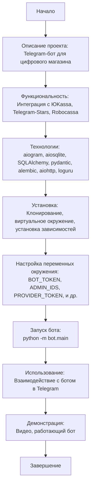

## Анализ кода `README.md`

### 1. <алгоритм>

Этот файл `README.md` является документацией к проекту Telegram-бота для цифрового магазина. Его основная цель — предоставить пользователям информацию о проекте, включая его функциональность, используемые технологии, инструкции по установке и запуску, а также демонстрации работы бота.

**Блок-схема:**

1.  **Начало:** Пользователь открывает файл `README.md`.
    *   _Пример_: Читает описание проекта в начале документа.
2.  **Описание проекта:** Пользователь получает общее представление о проекте.
    *   _Пример_: Узнает, что это Telegram-бот для цифрового магазина, использующий вебхуки.
3.  **Функциональность:** Пользователь узнает о ключевых возможностях бота.
    *   _Пример_: Понимает, что бот поддерживает три платежные системы: ЮKassa, Telegram-Stars и Robocassa.
4.  **Технологии:** Пользователь ознакомливается с используемыми технологиями.
    *   _Пример_: Узнает о применении `aiogram`, `aiosqlite`, `SQLAlchemy` и других библиотек.
5.  **Установка:** Пользователь получает пошаговую инструкцию по установке и настройке проекта.
    *   _Пример_: Клонирует репозиторий, создает виртуальное окружение, устанавливает зависимости.
6.  **Настройка переменных окружения:** Пользователь узнает о необходимых переменных окружения.
    *   _Пример_: Устанавливает значения токена бота, ID администраторов, токенов платежных систем.
7.  **Запуск:** Пользователь получает инструкцию по запуску бота.
    *   _Пример_: Запускает скрипт `python -m bot.main`.
8.  **Использование:** Пользователь узнает о взаимодействии с ботом.
    *   _Пример_: Понимает, что может использовать бот в Telegram для просмотра товаров и совершения покупок.
9.  **Демонстрация:** Пользователю предоставляются ссылки на демонстрационные материалы.
    *   _Пример_: Смотрит видео на Rutube, тестирует работающего бота в Telegram.
10. **Завершение:** Пользователь получает всю необходимую информацию о проекте.
    *   _Пример_: Может использовать бот, изучить исходный код, дать обратную связь.

### 2. <mermaid>

**Объяснение:**

*   **`Start`**: Начальная точка процесса.
*   **`ProjectDescription`**: Описывает проект как Telegram-бота для цифрового магазина, давая общее представление.
*   **`Functionality`**: Описывает ключевую функциональность, а именно интеграцию с различными платежными системами.
*   **`Technologies`**: Перечисляет используемые технологии, включая фреймворки и библиотеки. Это позволяет понять, какие инструменты использовались для создания бота.
*   **`Installation`**: Описывает шаги, необходимые для установки и подготовки проекта к работе.
*   **`EnvSetup`**: Подчеркивает важность настройки переменных окружения, которые необходимы для корректной работы бота.
*   **`RunBot`**: Описывает запуск основного файла бота.
*   **`Usage`**: Объясняет как пользователь должен взаимодействовать с ботом в Telegram.
*   **`Demonstration`**: Указывает на наличие демонстрационных материалов, позволяющих увидеть работу бота.
*    **`End`**: Конечная точка процесса.

Диаграмма `mermaid` демонстрирует последовательность шагов, которые проходит пользователь, изучая документацию `README.md` и начиная работать с проектом.

### 3. <объяснение>

**Общее:**

Файл `README.md` предоставляет всестороннюю документацию к проекту Telegram-бота для цифрового магазина. Он содержит описание проекта, инструкции по установке и использованию, список использованных технологий и демонстрационные материалы. Основная цель — помочь пользователям понять, как работает бот, как его установить и запустить, и как с ним взаимодействовать.

**Детали:**

*   **Описание проекта:**
    *   Представляет собой общее описание Telegram-бота, его предназначение и особенности.
    *   Указывает на использование веб-хуков для обеспечения производительности.
    *   Описывает интеграцию с тремя платежными системами: ЮKassa, Telegram-Stars и Robocassa.
*   **Технологии:**
    *   `aiogram`: Асинхронный фреймворк для разработки Telegram-ботов, который обеспечивает взаимодействие с Telegram API.
    *   `aiosqlite`: Асинхронный драйвер для работы с SQLite, используемый для хранения данных.
    *   `loguru`: Библиотека для продвинутого логирования, позволяющая отслеживать работу бота и выявлять ошибки.
    *   `pydantic-settings`: Управление настройками с использованием Pydantic, обеспечивает валидацию и управление переменными окружения.
    *   `SQLAlchemy`: SQL-библиотека и ORM для Python, используемые для работы с базами данных.
    *   `pydantic`: Библиотека для валидации данных и управления настройками, используется для валидации моделей данных.
    *   `alembic`: Инструмент для управления миграциями базы данных, позволяющий управлять изменениями схемы БД.
    *   `aiohttp`: Веб-сервер для обслуживания веб-хуков в боте, обеспечивает асинхронную работу с HTTP-запросами.
*   **Установка:**
    *   Предоставляет пошаговую инструкцию по установке и настройке проекта.
    *   Включает клонирование репозитория, создание виртуального окружения и установку зависимостей.
    *   Указывает на необходимость получения токена бота и токенов платежных систем.
    *   Описывает создание файла `.env` для хранения переменных окружения.
*   **Запуск:**
    *   Указывает команду для запуска бота: `python -m bot.main`.
    *   Объясняет необходимость использования туннеля (например, Ngrok) для работы с вебхуками.
*   **Использование:**
    *   Описывает взаимодействие с ботом в Telegram.
    *   Упоминает возможность тестирования оплаты через ЮKassa, Robocassa и Telegram Stars.
*   **Демонстрация:**
    *   Предоставляет ссылки на видео-демонстрации работы проекта.
    *   Предлагает протестировать работающего бота в Telegram.

**Цепочка взаимосвязей:**

*   `aiogram` использует Telegram API.
*   `aiosqlite` и `SQLAlchemy` работают с базами данных.
*   `pydantic-settings` и `pydantic` используются для валидации и управления настройками.
*   `aiohttp` взаимодействует с веб-хуками.
*   `loguru` используется для логирования работы всех компонентов.

**Потенциальные ошибки или области для улучшения:**

*   В инструкции по установке для Windows следует уточнить, что виртуальное окружение активируется командой `venv\Scripts\activate`.
*   Может потребоваться более подробное описание настройки `Ngrok`, поскольку для новичков это может быть сложно.
*   Следует более подробно описать формат `ADMIN_IDS` (строка, разделенная запятыми, или JSON-список).
*   Можно добавить раздел FAQ с ответами на наиболее частые вопросы.
*   Можно добавить ссылку на пример `env.example`, который поможет пользователям с настройкой переменных окружения.
*   Нужно добавить более детальное описание, как настроить `Robokassa`
*   Нужно добавить более детальное описание, как настроить `Telegram Stars`

Этот файл `README.md` играет важную роль в проекте, предоставляя необходимую информацию для пользователей. Правильное и полное описание проекта делает его более доступным и понятным для других разработчиков и пользователей.