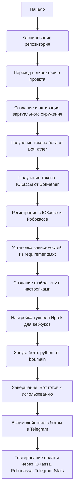
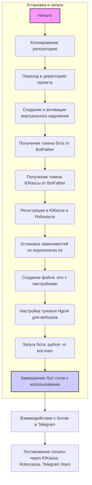

## Анализ кода `README.md`

### 1. **<алгоритм>**

Этот документ `README.md` представляет собой не код, а скорее подробное руководство по проекту Telegram-бота для цифрового магазина. Здесь нет явного алгоритмического процесса в том смысле, как в коде Python, но есть последовательность шагов по установке и использованию бота.

**Блок-схема процесса установки и запуска:**



Пример блока:

- **Клонирование репозитория:**
  ```bash
  git clone https://github.com/Yakvenalex/DigitalMarketHookBot.git
  ```
- **Установка зависимостей:**
  ```bash
  pip install -r requirements.txt
  ```
- **Настройка туннеля Ngrok:**
   ```bash
    ngrok http 8000
   ```
- **Запуск бота:**
  ```bash
  python -m bot.main
  ```
- **Взаимодействие с ботом:**
  - Пользователь отправляет команды боту в Telegram.
  - Бот отвечает на запросы, предоставляя функциональность магазина.
  - Пользователь может просматривать каталог товаров, добавлять товары в корзину и оформлять покупки.
  - Бот обрабатывает платежи через интегрированные системы (ЮKassa, Robocassa, Telegram Stars).

**Поток данных:**

1.  Пользователь взаимодействует с ботом через Telegram.
2.  Бот обрабатывает команды пользователя.
3.  Если требуется оплата, бот взаимодействует с платежными системами.
4.  Результат оплаты возвращается пользователю в Telegram.
5.  При работе с Robocassa, вебхуки обрабатываются через aiohttp.
6.  Данные о настройках берутся из `.env`.

### 2. **<mermaid>**



**Объяснение:**

- `flowchart TD`: Определяет тип диаграммы как блок-схему (flowchart) с направлением сверху вниз (TD).
- `A[Начало]`: Обозначает начало процесса установки и запуска бота.
- Последовательные шаги `B`, `C`, `D`, `E`, `F`, `G`, `H`, `I`, `J`, `K`, представляют собой конкретные действия.
- `L[Завершение: Бот готов к использованию]` отмечает завершение процесса.
- `M` и `N` представляют взаимодействие с ботом в Telegram и тестирование оплат.
- `style A ...` и `style L ...` задают стиль для начального и завершающего блоков (фиолетовый и синий цвет).
-  `subgraph` используется для группировки шагов установки и запуска в один блок.

### 3. **<объяснение>**

**Импорты:**

- `aiogram` 3.15.0: Асинхронный фреймворк для создания Telegram-ботов. Он используется для управления ботом, обработки входящих сообщений и отправки ответов, а также для управления состояниями и т.д.
- `aiosqlite` 0.20.0: Асинхронный драйвер для работы с SQLite. Используется для работы с базой данных, где хранится информация о товарах, пользователях, заказах и т.д.
- `loguru` 0.7.2: Библиотека для логирования. Помогает отслеживать ошибки, действия пользователей и другие важные события в приложении.
- `pydantic-settings` 2.7.0: Управление настройками приложения с использованием Pydantic. Используется для загрузки и валидации настроек из `.env` файла.
- `SQLAlchemy` 2.0.35: SQL-библиотека и ORM (Object-Relational Mapper). Позволяет взаимодействовать с базой данных, используя объектно-ориентированный подход, а не прямой SQL.
- `pydantic` >=2.4.1,<2.10: Библиотека для валидации данных и управления настройками. Используется совместно с `pydantic-settings` для проверки и управления переменными.
- `alembic` 1.14.0: Инструмент для управления миграциями базы данных. Помогает отслеживать изменения в схеме базы данных и применять их последовательно.
- `aiohttp` 3.10.11: Асинхронный HTTP клиент/сервер. Используется для реализации веб-хуков и обработки платежей от Robocassa.

Все эти пакеты, кроме `alembic` и `SQLAlchemy`, являются асинхронными, что хорошо подходит для работы с ботами и веб-серверами, где важна эффективность.

**Классы:**

В данном файле `README.md` классы не описываются, но предполагается, что они существуют в коде проекта. Примеры классов, которые могут присутствовать в проекте:

- **`Bot`**: Класс, который содержит основную логику работы бота, взаимодействует с `aiogram` и обрабатывает входящие запросы.
- **`Database`**: Класс для работы с базой данных, используя `SQLAlchemy` и `aiosqlite`. Содержит методы для получения, добавления, изменения данных о пользователях, товарах, заказах и т.д.
- **`PaymentSystem`**: Абстрактный класс для работы с разными платежными системами.
    - **`YookassaPayment`**, **`TelegramStarsPayment`**, **`RobocassaPayment`**: Классы, реализующие конкретные методы для каждого платежного метода.
- **`Product`**, **`User`**, **`Order`**, **`Category`**: Классы, представляющие модели данных из базы данных. Используются совместно с ORM `SQLAlchemy`.
- **`Config`**: Класс, созданный на основе `pydantic-settings`, содержащий все необходимые настройки, загруженные из `.env`.

**Функции:**

Описания функций также нет, но вот примеры функций, которые могут присутствовать в проекте:

- **`setup_bot()`**: Функция для инициализации и запуска бота.
- **`handle_start_command()`**: Функция, обрабатывающая команду `/start`.
- **`handle_product_selection()`**: Обработка выбора товара.
- **`handle_payment()`**:  Обработка платежей через разные системы.
- **`process_robocassa_payment()`**: Обработка вебхуков от Robocassa.
- **`get_user()`**, **`get_products()`**, **`save_order()`**: Функции для работы с базой данных.

**Переменные:**

- **`BOT_TOKEN`**: Токен Telegram бота.
- **`ADMIN_IDS`**: Список идентификаторов администраторов.
- **`PROVIDER_TOKEN`**: Токен ЮКассы.
- **`SITE_URL`**: URL для вебхуков.
- **`SITE_HOST`**: Хост для вебхука.
- **`SITE_PORT`**: Порт для вебхука.
- **`MRH_LOGIN`**, **`MRH_PASS_1`**, **`MRH_PASS_2`**: Данные для Робокассы.
- **`IN_TEST`**: Флаг для режима тестирования Robocassa.

**Потенциальные ошибки и области для улучшения:**

1.  **Безопасность:** Хранение паролей и токенов непосредственно в `.env` файле не безопасно. Лучше использовать системы управления секретами.
2.  **Обработка ошибок:** Необходимо добавить обработку ошибок для каждого взаимодействия с внешними системами, чтобы бот мог правильно отреагировать в случае неполадок (например, сбои в платежной системе, ошибки сети).
3.  **Масштабируемость:** Необходимо продумать архитектуру проекта, чтобы он мог выдерживать большую нагрузку.
4.  **Тестирование:** Наличие тестов для ключевых функций поможет предотвратить ошибки при изменении кода.
5.  **Логирование**: Необходимо логировать не только ошибки, но и важные события, действия пользователей и т.д.
6.  **Оптимизация кода:**  Следует регулярно пересматривать код для оптимизации производительности.
7.  **Документация**: Добавить подробную документацию кода с описанием классов, функций и т.д.

**Взаимосвязи с другими частями проекта:**

Этот проект имеет тесную связь с другими частями системы, особенно с модулем `bot.main` (точка входа), моделями базы данных, классами платежных систем и настройками, определенными в файле `.env`. Поток данных происходит между ботом, базой данных, пользователями и платежными системами через вебхуки (для Robocassa).

Этот анализ дает полное представление о проекте и его основных компонентах.