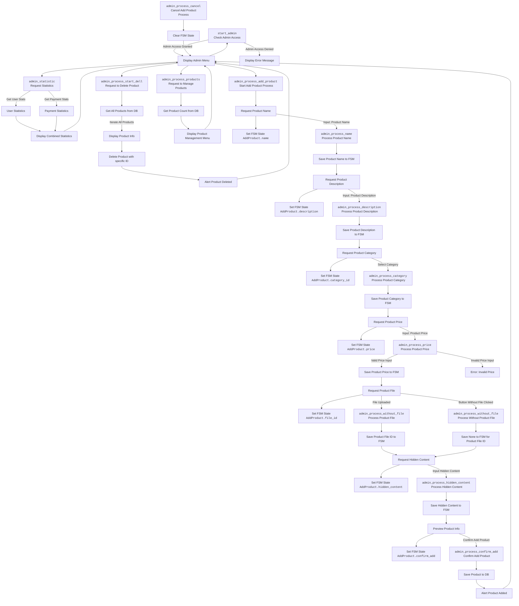

## ИНСТРУКЦИЯ:

Анализируй предоставленный код подробно и объясни его функциональность. Ответ должен включать три раздела:  

1. **<алгоритм>**: Опиши рабочий процесс в виде пошаговой блок-схемы, включая примеры для каждого логического блока, и проиллюстрируй поток данных между функциями, классами или методами.  
2. **<mermaid>**: Напиши код для диаграммы в формате `mermaid`, проанализируй и объясни все зависимости, 
    которые импортируются при создании диаграммы. 
    **ВАЖНО!** Убедитесь, что все имена переменных, используемые в диаграмме `mermaid`, 
    имеют осмысленные и описательные имена. Имена переменных вроде `A`, `B`, `C`, и т.д., не допускаются!  
    
    **Дополнительно**: Если в коде есть импорт `import header`, добавьте блок `mermaid` flowchart, объясняющий `header.py`:\
    ```mermaid
    flowchart TD
        Start --> Header[<code>header.py</code><br> Determine Project Root]
    
        Header --> import[Import Global Settings: <br><code>from src import gs</code>] 
    ```

3. **<объяснение>**: Предоставьте подробные объяснения:  
   - **Импорты**: Их назначение и взаимосвязь с другими пакетами `src.`.  
   - **Классы**: Их роль, атрибуты, методы и взаимодействие с другими компонентами проекта.  
   - **Функции**: Их аргументы, возвращаемые значения, назначение и примеры.  
   - **Переменные**: Их типы и использование.  
   - Выделите потенциальные ошибки или области для улучшения.  

Дополнительно, постройте цепочку взаимосвязей с другими частями проекта (если применимо).  

Это обеспечивает всесторонний и структурированный анализ кода.
## Формат ответа: `.md` (markdown)
**КОНЕЦ ИНСТРУКЦИИ**
```markdown
## <алгоритм>

**1. Инициализация:**

*   Импортируются необходимые библиотеки и модули для работы с Telegram ботом (aiogram), асинхронными операциями (asyncio), базами данных (sqlalchemy), FSM (машина состояний), и конфигурационными файлами.
*   Создается `Router` для обработки сообщений и коллбеков.
*   Определяется класс `AddProduct` для хранения состояний при добавлении нового продукта.

**2. Обработка входа в админ-панель:**

*   Функция `start_admin` вызывается при нажатии на кнопку "admin_panel" и проверяет, есть ли ID пользователя в списке администраторов.
    *   Если пользователь является администратором, бот отправляет приветственное сообщение с меню администратора.
    *   В случае ошибки при редактировании сообщения, бот пытается отправить новое сообщение с тем же меню, либо выводит сообщение об ошибке.

**3. Обработка запроса статистики:**

*   Функция `admin_statistic` вызывается при нажатии на кнопку "statistic" и проверяет, есть ли ID пользователя в списке администраторов.
    *   Бот выводит уведомление о сборе статистики.
    *   Используется `UserDAO` и `PurchaseDao` для получения статистики пользователей и платежей.
    *   Бот отправляет сообщение со статистикой и меню администратора.

**4. Отмена операции добавления товара:**

*   Функция `admin_process_cancel` вызывается при нажатии на кнопку "cancel" во время добавления товара.
    *   Сбрасывает состояние FSM.
    *   Отправляет сообщение об отмене и возвращает в главное меню админки.

**5. Обработка запроса на удаление товара:**

*   Функция `admin_process_start_dell` вызывается при нажатии на кнопку "delete_product" и проверяет, есть ли ID пользователя в списке администраторов.
    *   Получает все продукты из базы данных с помощью `ProductDao`.
    *   Для каждого продукта бот отправляет сообщение с описанием и кнопкой удаления.
    *   Если у продукта есть файл, он отправляется как документ с описанием.

**6. Обработка удаления товара:**

*   Функция `admin_process_start_dell` вызывается при нажатии на кнопку удаления товара `dell_{product_id}`.
    *   Извлекает `product_id` из данных callback.
    *   Удаляет продукт из базы данных с помощью `ProductDao`.
    *   Выводит сообщение об успешном удалении.

**7. Обработка запроса на управление товарами:**

*   Функция `admin_process_products` вызывается при нажатии на кнопку "process_products" и проверяет, есть ли ID пользователя в списке администраторов.
    *   Получает количество всех продуктов из базы данных с помощью `ProductDao`.
    *   Отправляет сообщение с количеством продуктов и меню управления товарами.

**8. Начало сценария добавления товара:**

*   Функция `admin_process_add_product` вызывается при нажатии на кнопку "add_product" и проверяет, есть ли ID пользователя в списке администраторов.
    *   Бот запрашивает имя товара и устанавливает состояние `AddProduct.name`.

**9. Обработка имени товара:**

*   Функция `admin_process_name` вызывается при получении текстового сообщения в состоянии `AddProduct.name` и проверяет, есть ли ID пользователя в списке администраторов.
    *   Сохраняет имя товара в состояние FSM.
    *   Удаляет предыдущее сообщение.
    *   Бот запрашивает описание товара и устанавливает состояние `AddProduct.description`.

**10. Обработка описания товара:**

*   Функция `admin_process_description` вызывается при получении текстового сообщения в состоянии `AddProduct.description` и проверяет, есть ли ID пользователя в списке администраторов.
    *   Сохраняет описание товара в состояние FSM.
    *   Удаляет предыдущее сообщение.
    *   Бот запрашивает категорию товара и устанавливает состояние `AddProduct.category_id`, предоставляет список категорий из базы данных.

**11. Обработка выбора категории товара:**

*   Функция `admin_process_category` вызывается при нажатии на кнопку с `add_category_{category_id}` в состоянии `AddProduct.category_id` и проверяет, есть ли ID пользователя в списке администраторов.
    *   Сохраняет ID категории в состояние FSM.
    *   Бот запрашивает цену товара и устанавливает состояние `AddProduct.price`.

**12. Обработка цены товара:**

*   Функция `admin_process_price` вызывается при получении текстового сообщения в состоянии `AddProduct.price` и проверяет, есть ли ID пользователя в списке администраторов.
    *   Пытается преобразовать полученный текст в целое число (цену).
    *   Сохраняет цену в состояние FSM.
    *   Удаляет предыдущее сообщение.
    *   Бот предлагает отправить файл или нажать на кнопку "БЕЗ ФАЙЛА" и устанавливает состояние `AddProduct.file_id`.
    *   Если введено не число, выводит сообщение об ошибке.

**13. Обработка отсутствия файла:**

*   Функция `admin_process_without_file` вызывается при нажатии на кнопку "without_file" в состоянии `AddProduct.file_id` и проверяет, есть ли ID пользователя в списке администраторов.
    *   Устанавливает `file_id` в `None`.
    *   Бот запрашивает скрытый контент и устанавливает состояние `AddProduct.hidden_content`.

**14. Обработка отправки файла:**

*   Функция `admin_process_without_file` вызывается при получении документа в состоянии `AddProduct.file_id` и проверяет, есть ли ID пользователя в списке администраторов.
    *   Сохраняет file_id в состояние FSM.
    *   Удаляет предыдущее сообщение.
    *   Бот запрашивает скрытый контент и устанавливает состояние `AddProduct.hidden_content`.

**15. Обработка скрытого контента:**

*   Функция `admin_process_hidden_content` вызывается при получении текстового сообщения в состоянии `AddProduct.hidden_content` и проверяет, есть ли ID пользователя в списке администраторов.
    *   Сохраняет скрытый контент в состояние FSM.
    *   Получает все данные из FSM.
    *   Формирует сообщение с информацией о товаре и кнопкой подтверждения.
    *   Отправляет превью товара с файлом (если есть) и устанавливает состояние `AddProduct.confirm_add`.

**16. Подтверждение добавления товара:**

*   Функция `admin_process_confirm_add` вызывается при нажатии на кнопку "confirm_add" в состоянии `AddProduct.confirm_add` и проверяет, есть ли ID пользователя в списке администраторов.
    *   Удаляет предыдущее сообщение с превью товара.
    *   Сохраняет данные о товаре в базу данных с помощью `ProductDao`.
    *   Отправляет сообщение об успешном добавлении и возвращается в главное меню админки.

## <mermaid>


**Объяснение зависимостей `mermaid`:**

1.  **Импорты**:
    *   `asyncio`:  Используется для асинхронного выполнения операций, что позволяет боту обрабатывать несколько запросов одновременно.
    *   `aiogram`: Фреймворк для создания Telegram ботов.
        *   `Router`:  Используется для маршрутизации входящих обновлений (сообщений, колбеков) к соответствующим обработчикам.
        *   `F`:  Используется для создания фильтров для входящих обновлений.
        *   `FSMContext`: Предоставляет доступ к FSM.
        *   `StatesGroup, State`:  Используются для определения состояний машины состояний.
        *   `CallbackQuery, Message`: Типы объектов, представляющих входящие коллбеки и сообщения.
    *   `sqlalchemy.ext.asyncio`: Библиотека для работы с базами данных SQLAlchemy асинхронно.
    *   `bot.config`: Модуль конфигурации бота, где хранятся настройки (токен, ID админов, и т.д.).
    *   `bot.dao.dao`: Модуль, содержащий DAO (Data Access Objects) для доступа к данным в БД (пользователи, продукты, категории, покупки).
    *   `bot.admin.kbs`: Модуль, содержащий клавиатуры для админ-панели.
    *    `bot.admin.schemas`: Модуль, содержащий схемы для валидации данных.
    *   `bot.admin.utils`: Модуль, содержащий утилиты для админ-панели.

2.  **Классы**:
    *   `AddProduct(StatesGroup)`:  Класс, определяющий состояния для процесса добавления продукта.
        *   `name = State()`: Состояние для ввода имени продукта.
        *   `description = State()`: Состояние для ввода описания продукта.
        *   `price = State()`: Состояние для ввода цены продукта.
        *   `file_id = State()`: Состояние для загрузки файла продукта.
        *   `category_id = State()`: Состояние для выбора категории продукта.
        *   `hidden_content = State()`: Состояние для ввода скрытого контента продукта.
        *   `confirm_add = State()`: Состояние для подтверждения добавления продукта.

3.  **Функции**:
    *   `start_admin(call: CallbackQuery)`: Обрабатывает команду `admin_panel`, отображает админ-панель.
    *   `admin_statistic(call: CallbackQuery, session_without_commit: AsyncSession)`:  Обрабатывает команду `statistic`, выводит статистику.
    *   `admin_process_cancel(call: CallbackQuery, state: FSMContext)`: Обрабатывает команду `cancel` при добавлении товара, отменяет процесс.
    *   `admin_process_start_dell(call: CallbackQuery, session_without_commit: AsyncSession)`: Обрабатывает команду `delete_product`, начинает процесс удаления.
    *    `admin_process_start_dell(call: CallbackQuery, session_with_commit: AsyncSession)`: Обрабатывает удаление конкретного товара.
    *   `admin_process_products(call: CallbackQuery, session_without_commit: AsyncSession)`: Обрабатывает команду `process_products`, предлагает действия с товарами.
    *   `admin_process_add_product(call: CallbackQuery, state: FSMContext)`: Обрабатывает команду `add_product`, начинает процесс добавления товара.
    *   `admin_process_name(message: Message, state: FSMContext)`: Обрабатывает ввод имени товара.
    *   `admin_process_description(message: Message, state: FSMContext, session_without_commit: AsyncSession)`: Обрабатывает ввод описания товара.
    *   `admin_process_category(call: CallbackQuery, state: FSMContext)`: Обрабатывает выбор категории товара.
    *   `admin_process_price(message: Message, state: FSMContext)`: Обрабатывает ввод цены товара.
    *   `admin_process_without_file(call: CallbackQuery, state: FSMContext)`: Обрабатывает ситуацию, когда пользователь не загружает файл товара.
    *    `admin_process_without_file(message: Message, state: FSMContext)`: Обрабатывает загрузку файла товара.
    *   `admin_process_hidden_content(message: Message, state: FSMContext, session_without_commit: AsyncSession)`: Обрабатывает ввод скрытого контента товара.
    *   `admin_process_confirm_add(call: CallbackQuery, state: FSMContext, session_with_commit: AsyncSession)`:  Обрабатывает подтверждение добавления товара.

4.  **Переменные**:
    *   `admin_router`: Экземпляр `Router` для обработки входящих обновлений в админ-панели.
    *   `settings`: Объект с настройками бота, полученный из модуля конфигурации.
    *   `bot`: Экземпляр бота `aiogram`.
    *   `session_without_commit`: Экземпляр асинхронной сессии SQLAlchemy (без автоматического коммита).
    *   `session_with_commit`: Экземпляр асинхронной сессии SQLAlchemy (с автоматическим коммитом).
    *   `state`: Экземпляр `FSMContext` для управления состояниями.
    *   `call`: Экземпляр `CallbackQuery` для обработки входящих колбеков.
    *   `message`: Экземпляр `Message` для обработки входящих сообщений.
    *   `product_data`: Данные о продукте, полученные из FSM.
    *    `all_products`: Список всех продуктов полученных из БД.
    *    `all_products_count`: Количество всех продуктов полученных из БД.
    *    `file_id`: ID загруженного файла.
    *    `product_id`: ID выбранного товара.
    *   `catalog_data`: Данные о категориях, полученные из БД.
    *   `price`: Цена товара, преобразованная в число.
    *   `stats`, `payment_stats`:  Словари со статистическими данными.
    *   `stats_message`:  Строка сообщения со статистикой.
    *   `msg`: Объект `Message`, который возвращает метод `.answer()`.

## <объяснение>

**Импорты:**

*   `asyncio`:
    *   **Назначение:** Обеспечивает асинхронное выполнение операций, что позволяет боту не блокироваться при ожидании ввода пользователя или ответа от базы данных.
    *   **Взаимосвязь с `src`:** Используется в функциях, которые взаимодействуют с базой данных или отправляют запросы к Telegram API.

*   `aiogram`:
    *   **Назначение:** Фреймворк для создания Telegram ботов.
    *   **Взаимосвязь с `src`:** Основной инструмент для создания и обработки сообщений от Telegram, обработки колбеков и управления FSM.
        *   `Router`:  Маршрутизирует входящие обновления к нужным функциям-обработчикам.
        *   `F`:  Создает фильтры для проверки данных (текст, коллбек, ID пользователя).
        *   `FSMContext`: Предоставляет доступ к контексту машины состояний.
        *   `StatesGroup`, `State`:  Используются для создания состояний в FSM.
        *   `CallbackQuery`, `Message`: Типы данных, которые представляют входящие коллбеки (нажатия кнопок) и сообщения от пользователя.

*   `sqlalchemy.ext.asyncio`:
    *   **Назначение:** Библиотека для работы с базами данных SQLAlchemy в асинхронном режиме.
    *   **Взаимосвязь с `src`:** Позволяет взаимодействовать с базой данных для получения, добавления и удаления данных (пользователей, продуктов, и т.д.).

*   `bot.config`:
    *   **Назначение:** Содержит настройки бота (токен, ID администраторов).
    *   **Взаимосвязь с `src`:** Используется для получения доступа к настройкам, необходимым для работы бота.

*   `bot.dao.dao`:
    *   **Назначение:** Содержит классы DAO для доступа к данным в БД.
    *   **Взаимосвязь с `src`:** Предоставляет методы для взаимодействия с базой данных (получение статистики, добавление/удаление товаров, и т.д.).

*   `bot.admin.kbs`:
    *   **Назначение:** Содержит клавиатуры для админ-панели.
    *   **Взаимосвязь с `src`:**  Используется для создания интерактивных меню в админ-панели.

*   `bot.admin.schemas`:
    *   **Назначение:** Содержит Pydantic-схемы для валидации данных.
    *   **Взаимосвязь с `src`:** Используется для валидации и сериализации данных.

*   `bot.admin.utils`:
    *   **Назначение:** Содержит утилиты, упрощающие работу с админкой.
    *    **Взаимосвязь с `src`:** Используется для переиспользования логики, связанной с удалением сообщений.

**Классы:**

*   `AddProduct(StatesGroup)`:
    *   **Роль:** Управляет состояниями FSM для добавления товара.
    *   **Атрибуты:** `name`, `description`, `price`, `file_id`, `category_id`, `hidden_content`, `confirm_add` (все являются экземплярами `State`).
    *   **Методы:** Не имеет собственных методов. Использует методы родительского класса `StatesGroup`.
    *   **Взаимодействие с другими компонентами:** Используется в функциях, которые обрабатывают процесс добавления товара, чтобы хранить данные о товаре между шагами процесса.

**Функции:**

*   **`start_admin`**:
    *   **Аргументы:** `call` (экземпляр `CallbackQuery`).
    *   **Возвращаемое значение:** None.
    *   **Назначение:** Проверяет, является ли пользователь администратором, и отображает админ-панель.
    *   **Пример:** Пользователь нажимает кнопку "admin_panel", эта функция проверяет его ID и выводит меню администратора.
*  **`admin_statistic`**:
    *   **Аргументы:** `call` (экземпляр `CallbackQuery`), `session_without_commit` (экземпляр `AsyncSession`).
    *   **Возвращаемое значение:** None.
    *   **Назначение:** Собирает статистику по пользователям и заказам.
    *   **Пример:** Пользователь нажимает кнопку "statistic", эта функция получает данные из базы данных и выводит статистику.
*   **`admin_process_cancel`**:
    *   **Аргументы:** `call` (экземпляр `CallbackQuery`), `state` (экземпляр `FSMContext`).
    *   **Возвращаемое значение:** None.
    *   **Назначение:** Отменяет процесс добавления товара, сбрасывает состояние FSM.
    *   **Пример:** Пользователь нажимает кнопку "cancel" во время добавления товара, эта функция сбрасывает все введенные данные.
*   **`admin_process_start_dell` (удаление товара)**:
    *   **Аргументы:** `call` (экземпляр `CallbackQuery`), `session_without_commit` (экземпляр `AsyncSession`).
    *   **Возвращаемое значение:** None.
    *   **Назначение:** Получает все товары из БД и выводит их для удаления.
    *   **Пример:** Пользователь нажимает кнопку "delete_product", эта функция выводит список товаров.
*   **`admin_process_start_dell` (обработка удаления товара)**:
    *   **Аргументы:** `call` (экземпляр `CallbackQuery`), `session_with_commit` (экземпляр `AsyncSession`).
    *   **Возвращаемое значение:** None.
    *   **Назначение:** Удаляет товар с конкретным ID из базы данных.
    *   **Пример:** Пользователь нажимает кнопку "dell_123", эта функция удаляет товар с ID 123.
*   **`admin_process_products`**:
    *   **Аргументы:** `call` (экземпляр `CallbackQuery`), `session_without_commit` (экземпляр `AsyncSession`).
    *   **Возвращаемое значение:** None.
    *   **Назначение:** Отображает меню управления товарами.
    *   **Пример:** Пользователь нажимает кнопку "process_products", эта функция выводит меню с действиями для товаров.
*   **`admin_process_add_product`**:
    *   **Аргументы:** `call` (экземпляр `CallbackQuery`), `state` (экземпляр `FSMContext`).
    *   **Возвращаемое значение:** None.
    *   **Назначение:** Начинает процесс добавления нового товара, запрашивая имя товара.
    *   **Пример:** Пользователь нажимает кнопку "add_product", эта функция запрашивает имя товара.
*   **`admin_process_name`**:
    *   **Аргументы:** `message` (экземпляр `Message`), `state` (экземпляр `FSMContext`).
    *   **Возвращаемое значение:** None.
    *   **Назначение:** Сохраняет имя товара в FSM и запрашивает описание.
    *   **Пример:** Пользователь вводит имя товара, эта функция сохраняет его и запрашивает описание.
*   **`admin_process_description`**:
    *   **Аргументы:** `message` (экземпляр `Message`), `state` (экземпляр `FSMContext`), `session_without_commit` (экземпляр `AsyncSession`).
    *   **Возвращаемое значение:** None.
    *   **Назначение:** Сохраняет описание товара в FSM и запрашивает категорию.
    *   **Пример:** Пользователь вводит описание товара, эта функция сохраняет его и запрашивает категорию.
*   **`admin_process_category`**:
    *   **Аргументы:** `call` (экземпляр `CallbackQuery`), `state` (экземпляр `FSMContext`).
    *   **Возвращаемое значение:** None.
    *   **Назначение:** Сохраняет категорию товара в FSM и запрашивает цену.
    *   **Пример:** Пользователь выбирает категорию товара, эта функция сохраняет ID категории и запрашивает цену.
*   **`admin_process_price`**:
    *   **Аргументы:** `message` (экземпляр `Message`), `state` (экземпляр `FSMContext`).
    *   **Возвращаемое значение:** None.
    *   **Назначение:** Сохраняет цену товара в FSM и запрашивает файл (если нужен).
    *   **Пример:** Пользователь вводит цену товара, эта функция сохраняет ее и предлагает загрузить файл.
*   **`admin_process_without_file` (без файла)**:
    *   **Аргументы:** `call` (экземпляр `CallbackQuery`), `state` (экземпляр `FSMContext`).
    *   **Возвращаемое значение:** None.
    *   **Назначение:** Сохраняет отсутствие файла в FSM и запрашивает скрытый контент.
    *   **Пример:** Пользователь нажимает кнопку "без файла", эта функция переходит к запросу скрытого контента.
*   **`admin_process_without_file` (загрузка файла)**:
    *   **Аргументы:** `message` (экземпляр `Message`), `state` (экземпляр `FSMContext`).
    *   **Возвращаемое значение:** None.
    *   **Назначение:** Сохраняет ID файла в FSM и запрашивает скрытый контент.
    *   **Пример:** Пользователь загружает файл, эта функция сохраняет ID файла и переходит к запросу скрытого контента.
*   **`admin_process_hidden_content`**:
    *   **Аргументы:** `message` (экземпляр `Message`), `state` (экземпляр `FSMContext`), `session_without_commit` (экземпляр `AsyncSession`).
    *   **Возвращаемое значение:** None.
    *   **Назначение:** Сохраняет скрытый контент в FSM и показывает превью товара для подтверждения.
    *   **Пример:** Пользователь вводит скрытый контент, эта функция сохраняет его и показывает превью товара.
*  **`admin_process_confirm_add`**:
    *  **Аргументы:** `call` (экземпляр `CallbackQuery`), `state` (экземпляр `FSMContext`), `session_with_commit` (экземпляр `AsyncSession`).
    *  **Возвращаемое значение:** None.
    *  **Назначение:** Сохраняет данные о товаре в БД после подтверждения.
    *  **Пример:** Пользователь нажимает кнопку "confirm_add", эта функция сохраняет данные и выводит сообщение об успехе.

**Переменные:**

*   `admin_router`: Экземпляр класса `Router` для обработки сообщений и коллбеков.
*   `settings`:  Объект конфигурации, содержащий настройки бота (например, ID администраторов).
*   `bot`: Экземпляр бота `aiogram`.
*   `session_without_commit`: Экземпляр сессии SQLAlchemy без автоматического коммита транзакций.
*  `session_with_commit`:  Экземпляр сессии SQLAlchemy с автоматическим коммитом транзакций.
*   `state`: Объект, представляющий контекст FSM.
*   `call`: Объект, представляющий входящий коллбек от Telegram.
*   `message`: Объект, представляющий входящее текстовое или файловое сообщение от Telegram.
*    `all_products`:  Список всех продуктов из БД, полученный из `ProductDao`.
*   `product_data`:  Словарь, содержащий данные о товаре, сохраненные в FSM.
*   `price`: Переменная, хранящая цену товара после преобразования к типу `int`.
*   `file_id`: ID загруженного файла.
*   `product_id`: ID выбранного товара.
*   `catalog_data`: Список категорий, полученный из БД.
*   `stats`, `payment_stats`:  Словари со статистическими данными.
*   `stats_message`:  Строка сообщения со статистикой.
*   `msg`: Объект `Message`, который возвращает метод `.answer()`.

**Потенциальные ошибки и области для улучшения:**

*   **Обработка ошибок:** Код содержит некоторые блоки `try-except`, но есть места, где можно добавить больше обработчиков, чтобы бот более стабильно работал.
*   **Валидация данных:** Валидация введенных пользователем данных (цена, описание) не является полной. Можно добавить дополнительные проверки и ограничения.
*    **Улучшение читаемости:** Можно использовать более описательные имена переменных.
*   **Рефакторинг:** Некоторые функции (например, обработка файла) можно разделить на более мелкие для лучшей читаемости.
*   **Безопасность:** Использование `message.html_text` может быть небезопасным, так как позволяет отправлять HTML, стоит использовать `message.text` и форматировать его самостоятельно.

**Взаимосвязи с другими частями проекта:**

*   **`bot.config`**: Зависимость от настроек бота, включая токен и ID администраторов.
*   **`bot.dao.dao`**: Зависимость от моделей доступа к данным для взаимодействия с базой данных.
*   **`bot.admin.kbs`**: Зависимость от клавиатур для админ-панели.
*   **`bot.admin.schemas`**: Зависимость от Pydantic схем для валидации и сериализации.
*   **`bot.admin.utils`**: Зависимость от утилитных функций.
*   **Другие модули** (например, `bot.handlers`):  Этот модуль, вероятно, является частью более крупной системы, и другие модули проекта могут использовать его для отправки уведомлений или для других целей.

Этот подробный анализ обеспечивает полное понимание функциональности кода, его зависимостей и потенциальных областей для улучшения.
```