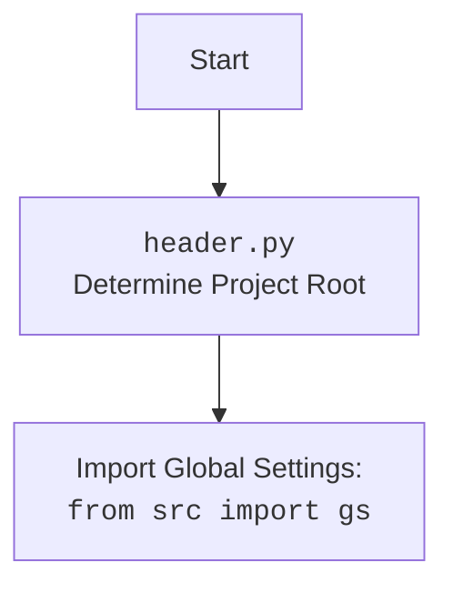

## ИНСТРУКЦИЯ:

Анализируй предоставленный код подробно и объясни его функциональность. Ответ должен включать три раздела:

1. **<алгоритм>**: Опиши рабочий процесс в виде пошаговой блок-схемы, включая примеры для каждого логического блока, и проиллюстрируй поток данных между функциями, классами или методами.
2. **<mermaid>**: Напиши код для диаграммы в формате `mermaid`, проанализируй и объясни все зависимости,
    которые импортируются при создании диаграммы.
    **ВАЖНО!** Убедитесь, что все имена переменных, используемые в диаграмме `mermaid`,
    имеют осмысленные и описательные имена. Имена переменных вроде `A`, `B`, `C`, и т.д., не допускаются!

    **Дополнительно**: Если в коде есть импорт `import header`, добавьте блок `mermaid` flowchart, объясняющий `header.py`:
    ```mermaid
    flowchart TD
        Start --> Header[<code>header.py</code><br> Determine Project Root]

        Header --> import[Import Global Settings: <br><code>from src import gs</code>]
    ```

3. **<объяснение>**: Предоставьте подробные объяснения:
   - **Импорты**: Их назначение и взаимосвязь с другими пакетами `src.`.
   - **Классы**: Их роль, атрибуты, методы и взаимодействие с другими компонентами проекта.
   - **Функции**: Их аргументы, возвращаемые значения, назначение и примеры.
   - **Переменные**: Их типы и использование.
   - Выделите потенциальные ошибки или области для улучшения.

Дополнительно, постройте цепочку взаимосвязей с другими частями проекта (если применимо).

Это обеспечивает всесторонний и структурированный анализ кода.
## Формат ответа: `.md` (markdown)
**КОНЕЦ ИНСТРУКЦИИ**

```markdown
## <алгоритм>

1. **Инициализация:**
   - Создается `Router` для обработки админских команд.
   - Определяется класс `AddProduct` (наследник `StatesGroup`) для управления состояниями при добавлении товара.
   - Определяется набор состояний `name`, `description`, `price`, `file_id`, `category_id`, `hidden_content`, `confirm_add`

2. **Обработка команды `/admin`:**
    - **Пример:** Пользователь нажимает кнопку `admin_panel`.
   - Проверяется, является ли пользователь администратором.
   - Отправляется приветственное сообщение с админской клавиатурой.
   - Если произошла ошибка при редактировании сообщения, пытается удалить старое и отправить новое. Если и это не получается, то отправляется сообщение об ошибке.

3. **Обработка команды `statistic`:**
   - **Пример:** Пользователь нажимает кнопку `statistic`.
   - Проверяется, является ли пользователь администратором.
   - Получает статистику по пользователям и платежам через `UserDAO` и `PurchaseDao`.
   - Формирует текстовое сообщение со статистикой и отправляет его пользователю.

4. **Обработка команды `cancel`:**
    - **Пример:** Пользователь нажимает кнопку `cancel` во время добавления товара.
   - Очищает состояние FSM (Finite State Machine).
   - Отправляет сообщение об отмене операции и возвращается к главному меню админ-панели.

5. **Обработка команды `delete_product`:**
   - **Пример:** Пользователь нажимает кнопку `delete_product`.
   - Проверяется, является ли пользователь администратором.
   - Получает список всех товаров из базы данных через `ProductDao`.
   - Отображает каждый товар с кнопкой для удаления.
   - Кнопка содержит `product.id`, который используется для удаления.
   - Отправляется сообщение со списком всех продуктов для удаления.
   - Если у продукта есть файл, отправляет его, в противном случае отправляет только текстовое описание.

6. **Обработка нажатия кнопки удаления товара:**
    - **Пример:** Пользователь нажимает кнопку `dell_123`, где `123` - ID товара.
    - Извлекается ID товара из `callback_data`.
    - Удаляет товар из базы данных через `ProductDao`.
    - Отправляет подтверждение об удалении.

7. **Обработка команды `process_products`:**
   - **Пример:** Пользователь нажимает кнопку `process_products`.
   - Проверяется, является ли пользователь администратором.
   - Получает общее количество товаров из базы данных через `ProductDao`.
   - Отправляет сообщение с количеством товаров и клавиатурой для управления товарами (добавить, удалить и тд)

8.  **Обработка команды `add_product`:**
    - **Пример:** Пользователь нажимает кнопку `add_product`.
   -  Переходит в состояние `AddProduct.name`.
   - Отправляет сообщение с запросом имени товара.

9.  **Обработка ввода имени товара:**
    - **Пример:** Пользователь вводит "Новый товар 123".
   - Сохраняет имя товара в состоянии `FSM`.
   - Переходит в состояние `AddProduct.description`.
   - Отправляет сообщение с запросом описания товара.

10. **Обработка ввода описания товара:**
     - **Пример:** Пользователь вводит "Описание нового товара 123".
    - Сохраняет описание товара в состоянии `FSM`.
    - Получает список категорий товаров через `CategoryDao`.
    - Переходит в состояние `AddProduct.category_id`.
    - Отправляет сообщение с клавиатурой для выбора категории.

11. **Обработка выбора категории товара:**
     - **Пример:** Пользователь выбирает категорию с `callback_data="add_category_456"`.
    - Извлекает ID категории из `callback_data`.
    - Сохраняет ID категории в состоянии `FSM`.
    - Переходит в состояние `AddProduct.price`.
    - Отправляет сообщение с запросом цены товара.

12. **Обработка ввода цены товара:**
     - **Пример:** Пользователь вводит "100".
    - Сохраняет цену товара в состоянии `FSM`.
    - Переходит в состояние `AddProduct.file_id`.
    - Отправляет сообщение с запросом файла товара или кнопкой "БЕЗ ФАЙЛА".
    - Если введено не число, то отправляет сообщение об ошибке.

13. **Обработка выбора "без файла":**
     - **Пример:** Пользователь нажимает кнопку `without_file`.
    - Сохраняет `file_id = None` в состояние `FSM`.
    - Переходит в состояние `AddProduct.hidden_content`.
    - Отправляет сообщение с запросом скрытого контента товара.

14. **Обработка отправки файла:**
    - **Пример:** Пользователь отправляет файл.
    - Сохраняет `file_id` в состояние `FSM`.
    - Переходит в состояние `AddProduct.hidden_content`.
    - Отправляет сообщение с запросом скрытого контента товара.

15. **Обработка ввода скрытого контента товара:**
    - **Пример:** Пользователь вводит "Скрытый контент товара 123".
    - Сохраняет скрытый контент товара в состояние `FSM`.
    - Формирует текстовое сообщение со всеми данными товара.
    - Отправляет сообщение с данными товара и кнопкой подтверждения.
    - Переходит в состояние `AddProduct.confirm_add`.

16. **Обработка подтверждения добавления товара:**
     - **Пример:** Пользователь нажимает кнопку `confirm_add`.
    - Удаляет последнее сообщение с превью товара.
    - Сохраняет все данные о товаре в базу данных через `ProductDao`.
    - Отправляет сообщение об успешном добавлении товара.

## <mermaid>

```mermaid
flowchart TD
    StartAdmin[Начало: /admin] --> CheckAdmin[Проверка: Является ли пользователь администратором?]
    CheckAdmin -- Да --> AdminPanel[Отправка админ-панели]
    CheckAdmin -- Нет --> AccessDenied[Отказать в доступе]

    AdminPanel --> StatisticBtn[Кнопка: statistic]
    AdminPanel --> CancelBtn[Кнопка: cancel]
    AdminPanel --> DeleteProductBtn[Кнопка: delete_product]
    AdminPanel --> ProcessProductsBtn[Кнопка: process_products]
    
    StatisticBtn --> GetStatistics[Получение статистики: UserDAO, PurchaseDao]
    GetStatistics --> ShowStatistics[Отображение статистики]
    ShowStatistics --> AdminPanel

    CancelBtn --> ClearState[Очистка FSM State]
    ClearState --> CancelMessage[Отправка сообщения об отмене]
    CancelMessage --> AdminPanel

    DeleteProductBtn --> GetProducts[Получение списка товаров: ProductDao]
    GetProducts --> ShowProducts[Отображение списка товаров с кнопками удаления]
    ShowProducts --> DeleteProductAction[Кнопка: Удаление товара]

    DeleteProductAction --> DeleteProduct[Удаление товара: ProductDao]
    DeleteProduct --> DeleteConfirm[Подтверждение удаления]
    DeleteConfirm --> AdminPanel
    
    ProcessProductsBtn --> GetProductCount[Получение кол-ва товаров]
    GetProductCount --> ShowProductManagement[Отображение панели управления товарами]
    ShowProductManagement --> AddProductBtn[Кнопка: add_product]
    
    AddProductBtn --> SetStateName[Установка State: AddProduct.name]
    SetStateName --> GetProductName[Запрос имени товара]
    GetProductName --> SaveProductName[Сохранение имени товара]
    SaveProductName --> SetStateDescription[Установка State: AddProduct.description]
    SetStateDescription --> GetProductDescription[Запрос описания товара]
    GetProductDescription --> SaveProductDescription[Сохранение описания товара]
    SaveProductDescription --> SetStateCategory[Установка State: AddProduct.category_id]
    SetStateCategory --> GetCategoryList[Получение списка категорий]
    GetCategoryList --> ShowCategoryList[Отображение списка категорий]
    ShowCategoryList --> SelectCategory[Выбор категории]
    SelectCategory --> SaveCategoryId[Сохранение ID категории]
    SaveCategoryId --> SetStatePrice[Установка State: AddProduct.price]
    SetStatePrice --> GetProductPrice[Запрос цены товара]
    GetProductPrice --> ValidatePrice[Валидация цены]
    ValidatePrice -- Ошибка --> GetProductPrice
    ValidatePrice -- Успех --> SaveProductPrice[Сохранение цены товара]
    SaveProductPrice --> SetStateFile[Установка State: AddProduct.file_id]
    SetStateFile --> GetFileOrNot[Запрос файла товара или "Без файла"]
    GetFileOrNot --> WithoutFile[Кнопка: without_file]
    GetFileOrNot --> GetFile[Запрос файла]
    WithoutFile --> SaveFileNone[Сохранение file_id = None]
    SaveFileNone --> SetStateHidden[Установка State: AddProduct.hidden_content]
    GetFile --> SaveFileId[Сохранение file_id]
    SaveFileId --> SetStateHidden
    SetStateHidden --> GetHiddenContent[Запрос скрытого контента товара]
    GetHiddenContent --> SaveHiddenContent[Сохранение скрытого контента]
    SaveHiddenContent --> PreviewProduct[Предпросмотр товара]
    PreviewProduct --> ConfirmAddBtn[Кнопка: confirm_add]
    ConfirmAddBtn --> SaveProductDB[Сохранение товара в БД: ProductDao]
    SaveProductDB --> ProductAddSuccess[Сообщение об успешном добавлении]
    ProductAddSuccess --> AdminPanel
    AccessDenied --> EndAdmin[Конец]
    EndAdmin
```
### Анализ зависимостей в `mermaid` диаграмме:
- **`StartAdmin`**: Начало процесса обработки административных команд.
- **`CheckAdmin`**: Проверка, является ли пользователь администратором. Зависит от `settings.ADMIN_IDS`.
- **`AdminPanel`**: Отправка админской клавиатуры. Зависит от `admin_kb()`.
- **`StatisticBtn`**: Кнопка для получения статистики.
- **`CancelBtn`**: Кнопка отмены текущей операции.
- **`DeleteProductBtn`**: Кнопка для удаления товара.
- **`ProcessProductsBtn`**: Кнопка для управления товарами.
- **`GetStatistics`**: Получение статистики пользователей и платежей. Зависит от `UserDAO.get_statistics` и `PurchaseDao.get_payment_stats`.
- **`ShowStatistics`**: Отображение полученной статистики.
- **`ClearState`**: Очистка FSM State. Зависит от `state.clear()`.
- **`CancelMessage`**: Отправка сообщения об отмене. Зависит от `admin_kb_back()`.
- **`GetProducts`**: Получение списка товаров. Зависит от `ProductDao.find_all`.
- **`ShowProducts`**: Отображение списка товаров с кнопками для удаления. Зависит от `dell_product_kb(product_data.id)`.
- **`DeleteProductAction`**: Кнопка для удаления конкретного товара.
- **`DeleteProduct`**: Удаление товара. Зависит от `ProductDao.delete`.
- **`DeleteConfirm`**: Отправка подтверждения об удалении товара.
- **`GetProductCount`**: Получение общего количества товаров. Зависит от `ProductDao.count`.
- **`ShowProductManagement`**: Отображение панели управления товарами. Зависит от `product_management_kb()`.
- **`AddProductBtn`**: Кнопка добавления товара.
- **`SetStateName`**: Установка состояния для ввода имени товара. Зависит от `AddProduct.name`.
- **`GetProductName`**: Запрос имени товара.
- **`SaveProductName`**: Сохранение введенного имени. Зависит от `state.update_data(name=message.text)`.
- **`SetStateDescription`**: Установка состояния для ввода описания товара. Зависит от `AddProduct.description`.
- **`GetProductDescription`**: Запрос описания товара.
- **`SaveProductDescription`**: Сохранение введенного описания. Зависит от `state.update_data(description=message.html_text)`.
- **`SetStateCategory`**: Установка состояния для выбора категории товара. Зависит от `AddProduct.category_id`.
- **`GetCategoryList`**: Получение списка категорий товаров. Зависит от `CategoryDao.find_all`.
- **`ShowCategoryList`**: Отображение списка категорий для выбора. Зависит от `catalog_admin_kb(catalog_data)`.
- **`SelectCategory`**: Выбор категории товара.
- **`SaveCategoryId`**: Сохранение ID выбранной категории. Зависит от `state.update_data(category_id=category_id)`.
- **`SetStatePrice`**: Установка состояния для ввода цены товара. Зависит от `AddProduct.price`.
- **`GetProductPrice`**: Запрос цены товара.
- **`ValidatePrice`**: Валидация введенной цены.
- **`SaveProductPrice`**: Сохранение введенной цены. Зависит от `state.update_data(price=price)`.
- **`SetStateFile`**: Установка состояния для выбора файла товара. Зависит от `AddProduct.file_id`.
- **`GetFileOrNot`**: Запрос файла товара или варианта "без файла".
- **`WithoutFile`**: Выбор варианта "без файла".
- **`SaveFileNone`**: Сохранение значения `None` для file_id. Зависит от `state.update_data(file_id=None)`.
- **`GetFile`**: Отправка файла товара.
- **`SaveFileId`**: Сохранение file_id. Зависит от `state.update_data(file_id=message.document.file_id)`.
-  **`SetStateHidden`**: Установка состояния для ввода скрытого контента. Зависит от `AddProduct.hidden_content`.
- **`GetHiddenContent`**: Запрос скрытого контента.
- **`SaveHiddenContent`**: Сохранение скрытого контента. Зависит от `state.update_data(hidden_content=message.html_text)`.
- **`PreviewProduct`**: Предпросмотр товара перед сохранением. Зависит от `admin_confirm_kb()`.
- **`ConfirmAddBtn`**: Кнопка подтверждения добавления товара.
- **`SaveProductDB`**: Сохранение товара в базу данных. Зависит от `ProductDao.add`.
- **`ProductAddSuccess`**: Сообщение об успешном добавлении товара.
- **`AccessDenied`**: Сообщение об отказе в доступе.
- **`EndAdmin`**: Конец процесса.
### Дополнительно:



## <объяснение>

### Импорты:

- `asyncio`: Библиотека для асинхронного программирования. Используется для работы с асинхронными операциями, такими как взаимодействие с Telegram API и базой данных.
- `aiogram`: Фреймворк для создания Telegram-ботов.
  - `Router`: Используется для маршрутизации входящих обновлений от Telegram (сообщений, callback-запросов) к соответствующим обработчикам.
  - `F`: Фабрика фильтров для обработки обновлений. Например, `F.data == 'admin_panel'` фильтрует callback-запросы с `data` равным `admin_panel`. `F.from_user.id.in_(settings.ADMIN_IDS)` - фильтрует id пользователей.
  - `FSMContext`: Контекст для управления состояниями конечного автомата (FSM). Позволяет хранить данные между обработчиками.
  - `StatesGroup`, `State`: Используются для создания конечного автомата.
  - `CallbackQuery`, `Message`: Типы объектов, представляющие callback-запросы и сообщения.
- `sqlalchemy.ext.asyncio`: Асинхронная версия SQLAlchemy для работы с базами данных.
  - `AsyncSession`: Асинхронная сессия для работы с базой данных.
- `bot.config`: Модуль, содержащий настройки бота.
  - `settings`: Объект, содержащий настройки бота, включая ID администраторов.
  - `bot`: Экземпляр бота, созданный с помощью `aiogram`.
- `bot.dao.dao`: Модуль, содержащий классы для доступа к данным (DAO - Data Access Object).
  - `UserDAO`: DAO для работы с пользователями.
  - `ProductDao`: DAO для работы с товарами.
  - `CategoryDao`: DAO для работы с категориями.
  - `PurchaseDao`: DAO для работы с покупками.
- `bot.admin.kbs`: Модуль, содержащий клавиатуры для административной панели.
- `bot.admin.schemas`: Модуль, содержащий схемы для работы с данными.
- `bot.admin.utils`: Модуль, содержащий утилиты для админской панели.
  - `process_dell_text_msg`: Функция для удаления предыдущего сообщения с текстом.

### Классы:

- `AddProduct(StatesGroup)`:
    -  Класс-наследник `StatesGroup`, используется для описания состояний при добавлении нового товара.
    -   Атрибуты:
         -   `name`: Состояние для ввода имени товара.
         -   `description`: Состояние для ввода описания товара.
         -   `price`: Состояние для ввода цены товара.
         -   `file_id`: Состояние для отправки файла товара.
         -   `category_id`: Состояние для выбора категории товара.
         -   `hidden_content`: Состояние для ввода скрытого контента.
         -   `confirm_add`: Состояние для подтверждения добавления товара.

### Функции:

- `@admin_router.callback_query(F.data == "admin_panel", F.from_user.id.in_(settings.ADMIN_IDS))`
  - `start_admin(call: CallbackQuery)`:
    -   Обрабатывает нажатие кнопки `admin_panel`.
    -   `call`: Объект `CallbackQuery`, содержащий данные о callback-запросе.
    -   Проверяет, является ли пользователь администратором.
    -   Отправляет сообщение с админ-панелью и клавиатурой.
- `@admin_router.callback_query(F.data == 'statistic', F.from_user.id.in_(settings.ADMIN_IDS))`
    - `admin_statistic(call: CallbackQuery, session_without_commit: AsyncSession)`:
        - Обрабатывает нажатие кнопки `statistic`.
        - `call`: Объект `CallbackQuery`, содержащий данные о callback-запросе.
        - `session_without_commit`: Сессия SQLAlchemy для работы с базой данных (без автоматического коммита).
        -  Получает статистику по пользователям и платежам из БД.
        -  Формирует и отправляет текстовое сообщение со статистикой.
- `@admin_router.callback_query(F.data == "cancel", F.from_user.id.in_(settings.ADMIN_IDS))`
    - `admin_process_cancel(call: CallbackQuery, state: FSMContext)`:
       - Обрабатывает нажатие кнопки `cancel`.
       - `call`: Объект `CallbackQuery`, содержащий данные о callback-запросе.
       - `state`: Контекст FSM, содержащий текущее состояние пользователя.
       - Очищает состояние FSM и отправляет сообщение об отмене.
- `@admin_router.callback_query(F.data == 'delete_product', F.from_user.id.in_(settings.ADMIN_IDS))`
    - `admin_process_start_dell(call: CallbackQuery, session_without_commit: AsyncSession)`:
      -  Обрабатывает нажатие кнопки `delete_product`.
      -   `call`: Объект `CallbackQuery`, содержащий данные о callback-запросе.
      -   `session_without_commit`: Сессия SQLAlchemy для работы с базой данных (без автоматического коммита).
      -  Получает список всех товаров из базы данных.
      -   Отправляет сообщение со списком всех товаров для удаления.
-  `@admin_router.callback_query(F.data.startswith('dell_'), F.from_user.id.in_(settings.ADMIN_IDS))`
   - `admin_process_start_dell(call: CallbackQuery, session_with_commit: AsyncSession)`:
        - Обрабатывает нажатие кнопки удаления товара (например, `dell_123`).
        -  `call`: Объект `CallbackQuery`, содержащий данные о callback-запросе.
        -  `session_with_commit`: Сессия SQLAlchemy для работы с базой данных (с автоматическим коммитом).
        - Извлекает ID товара из `callback_data`.
        - Удаляет товар из базы данных.
- `@admin_router.callback_query(F.data == 'process_products', F.from_user.id.in_(settings.ADMIN_IDS))`
   - `admin_process_products(call: CallbackQuery, session_without_commit: AsyncSession)`:
      -  Обрабатывает нажатие кнопки `process_products`.
      -   `call`: Объект `CallbackQuery`, содержащий данные о callback-запросе.
      -   `session_without_commit`: Сессия SQLAlchemy для работы с базой данных (без автоматического коммита).
      - Получает общее количество товаров из базы данных.
      - Отправляет сообщение с количеством товаров и клавиатурой для управления товарами.
- `@admin_router.callback_query(F.data == 'add_product', F.from_user.id.in_(settings.ADMIN_IDS))`
    - `admin_process_add_product(call: CallbackQuery, state: FSMContext)`:
        - Обрабатывает нажатие кнопки `add_product`.
        - `call`: Объект `CallbackQuery`, содержащий данные о callback-запросе.
        - `state`: Контекст FSM, содержащий текущее состояние пользователя.
        -  Переходит в состояние добавления товара, запрашивая имя товара.
- `@admin_router.message(F.text, F.from_user.id.in_(settings.ADMIN_IDS), AddProduct.name)`
    -  `admin_process_name(message: Message, state: FSMContext)`:
       - Обрабатывает сообщение с именем товара.
       - `message`: Объект `Message`, содержащий данные о сообщении.
       - `state`: Контекст FSM, содержащий текущее состояние пользователя.
       - Сохраняет имя товара в FSM и переходит к запросу описания.
- `@admin_router.message(F.text, F.from_user.id.in_(settings.ADMIN_IDS), AddProduct.description)`
   - `admin_process_description(message: Message, state: FSMContext, session_without_commit: AsyncSession)`:
      -  Обрабатывает сообщение с описанием товара.
      -  `message`: Объект `Message`, содержащий данные о сообщении.
      - `state`: Контекст FSM, содержащий текущее состояние пользователя.
      -   `session_without_commit`: Сессия SQLAlchemy для работы с базой данных (без автоматического коммита).
      - Сохраняет описание товара в FSM и запрашивает категорию.
-  `@admin_router.callback_query(F.data.startswith("add_category_"), F.from_user.id.in_(settings.ADMIN_IDS), AddProduct.category_id)`
  - `admin_process_category(call: CallbackQuery, state: FSMContext)`:
       -  Обрабатывает выбор категории товара.
       -  `call`: Объект `CallbackQuery`, содержащий данные о callback-запросе.
       -  `state`: Контекст FSM, содержащий текущее состояние пользователя.
       - Сохраняет ID категории в FSM и запрашивает цену товара.
- `@admin_router.message(F.text, F.from_user.id.in_(settings.ADMIN_IDS), AddProduct.price)`
    -  `admin_process_price(message: Message, state: FSMContext)`:
        - Обрабатывает сообщение с ценой товара.
        -  `message`: Объект `Message`, содержащий данные о сообщении.
        -  `state`: Контекст FSM, содержащий текущее состояние пользователя.
        - Сохраняет цену товара в FSM и запрашивает файл (или кнопку "БЕЗ ФАЙЛА").
- `@admin_router.callback_query(F.data == "without_file", F.from_user.id.in_(settings.ADMIN_IDS), AddProduct.file_id)`
  - `admin_process_without_file(call: CallbackQuery, state: FSMContext)`:
        -  Обрабатывает нажатие кнопки "БЕЗ ФАЙЛА".
        - `call`: Объект `CallbackQuery`, содержащий данные о callback-запросе.
        - `state`: Контекст FSM, содержащий текущее состояние пользователя.
        - Сохраняет `file_id = None` в FSM и переходит к запросу скрытого контента.
- `@admin_router.message(F.document, F.from_user.id.in_(settings.ADMIN_IDS), AddProduct.file_id)`
   -  `admin_process_without_file(message: Message, state: FSMContext)`:
      - Обрабатывает отправку документа (файла).
      - `message`: Объект `Message`, содержащий данные о сообщении.
      - `state`: Контекст FSM, содержащий текущее состояние пользователя.
      - Сохраняет `file_id` в FSM и переходит к запросу скрытого контента.
- `@admin_router.message(F.text, F.from_user.id.in_(settings.ADMIN_IDS), AddProduct.hidden_content)`
   -  `admin_process_hidden_content(message: Message, state: FSMContext, session_without_commit: AsyncSession)`:
        - Обрабатывает сообщение со скрытым контентом.
        -  `message`: Объект `Message`, содержащий данные о сообщении.
        - `state`: Контекст FSM, содержащий текущее состояние пользователя.
        - `session_without_commit`: Сессия SQLAlchemy для работы с базой данных (без автоматического коммита).
        -  Сохраняет скрытый контент товара в FSM, формирует текст с данными о товаре и отправляет его на подтверждение.
- `@admin_router.callback_query(F.data == "confirm_add", F.from_user.id.in_(settings.ADMIN_IDS))`
  -  `admin_process_confirm_add(call: CallbackQuery, state: FSMContext, session_with_commit: AsyncSession)`:
        - Обрабатывает подтверждение добавления товара.
        - `call`: Объект `CallbackQuery`, содержащий данные о callback-запросе.
        - `state`: Контекст FSM, содержащий текущее состояние пользователя.
        -  `session_with_commit`: Сессия SQLAlchemy для работы с базой данных (с автоматическим коммитом).
        - Сохраняет данные о товаре в базу данных.
        - Отправляет сообщение об успешном добавлении товара.

### Переменные:

-   `admin_router`: Экземпляр `Router` для обработки административных команд.
-   `settings`: Объект настроек (из `bot.config`)
-   `product_data`: Словарь, содержащий данные о товаре, получаемые из `FSMContext`.
-   `category_info`: Данные о категории товара, получаемые из БД.
-   `file_id`: ID файла, прикрепленного к товару.
-   `file_text`: Текст, указывающий наличие файла у товара (либо "📦 Товар с файлом", либо "📄 Товар без файла").
-  `product_text`: Текст, содержащий описание товара.
-   `stats`: Данные статистики по пользователям, полученные из `UserDAO`.
-   `payment_stats`: Данные статистики по платежам, полученные из `PurchaseDao`.
-   `stats_message`: Форматированная строка со статистикой.
-   `all_products`: Список всех товаров, полученных из `ProductDao`.
-   `all_products_count`: Общее количество товаров, полученное из `ProductDao`.
-   `msg`: Сообщение, которое отправляет бот пользователю.
-   `price`: Цена товара, введенная пользователем.
-   `category_id`: ID категории товара.

### Потенциальные ошибки и области для улучшения:

- Обработка ошибок: В коде есть общая обработка исключений при старте админ-панели, но стоит добавить более детальную обработку ошибок в других частях кода, например при работе с базой данных или при парсинге данных от пользователя.
- Валидация данных: В коде выполняется только простая проверка на число при вводе цены. Стоит добавить более строгую валидацию данных (например, проверка на минимальную и максимальную цену, на допустимые символы в имени и описании товара).
- Коммит транзакций: В коде используется `session_with_commit` и `session_without_commit`. Важно убедиться, что коммиты происходят в нужных местах (например, после успешного добавления/удаления данных).
- Повторное использование кода: Некоторые части кода (например, отправка сообщения с кнопкой отмены) повторяются. Стоит выделить их в отдельные функции.

### Взаимосвязь с другими частями проекта:

- `bot.config`: Используется для получения настроек бота, таких как ID администраторов.
- `bot.dao.dao`: Используется для доступа к данным о пользователях, товарах, категориях и покупках.
- `bot.admin.kbs`: Используется для создания клавиатур для админ-панели.
- `bot.admin.schemas`: Используется для определения схем данных, с которыми работают DAO.
- `bot.admin.utils`: Используется для выполнения общих задач, например, удаление предыдущих сообщений.

Этот код представляет собой модуль для управления админ-панелью Telegram-бота, позволяющий администраторам просматривать статистику, добавлять, удалять и изменять товары в базе данных. Он использует асинхронное программирование и FSM для обеспечения корректной работы.
```