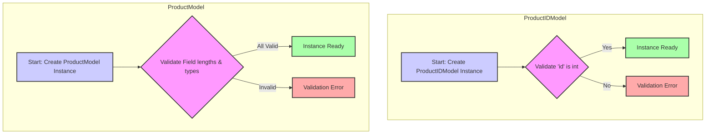

## АНАЛИЗ КОДА: `hypotez/src/endpoints/bots/telegram/digital_market/bot/admin/schemas.py`

### 1. <алгоритм>

**`ProductIDModel`**

1.  **Ввод данных:**  Экземпляр `ProductIDModel` создается с целочисленным значением `id`.
2.  **Валидация:** Pydantic проверяет, что `id` имеет тип `int`.
3.  **Вывод данных:** Экземпляр `ProductIDModel` готов для использования, например, для передачи идентификатора продукта в функции.

   *Пример*:
   ```python
    product_id_data = ProductIDModel(id=123)
    print(product_id_data.id) # Output: 123
   ```

**`ProductModel`**

1.  **Ввод данных:** Экземпляр `ProductModel` создается со значениями для `name`, `description`, `price`, `category_id`, `file_id` (опционально) и `hidden_content`.
2.  **Валидация:** Pydantic проверяет:
    *   `name` и `description` - строка, длина >= 5 символов
    *   `price` и `category_id` - целое число > 0
    *   `hidden_content` - строка, длина >= 5 символов
    *   `file_id` - может быть строкой или `None`
3.  **Вывод данных:** Экземпляр `ProductModel` с валидированными данными готов для использования, например, для создания или обновления записи о продукте в базе данных.

   *Пример*:
   ```python
   product_data = ProductModel(
        name="Супер Товар",
        description="Отличное описание товара",
        price=100,
        category_id=1,
        hidden_content="Секретная информация"
    )
    print(product_data.name)  # Output: Супер Товар
    print(product_data.price) # Output: 100
    ```

   *Пример невалидных данных*:

   ```python
   try:
      invalid_product_data = ProductModel(
        name="Тов", # < 5 символов
        description="Оп", # < 5 символов
        price=0, # не > 0
        category_id=-1, # не > 0
        hidden_content="Сек" # < 5 символов
    )
   except ValidationError as e:
      print(e) # Выведет ошибки валидации
   ```

### 2. <mermaid>



**Разбор `mermaid`:**

*   **`ProductIDModel` subgraph:**
    *   `A`: Начало процесса создания экземпляра `ProductIDModel`.
    *   `B`: Валидация типа `id` (проверка, что это целое число). Если тип верный, то поток переходит в `C`, иначе - в `D`.
    *   `C`:  Экземпляр `ProductIDModel` успешно создан.
    *   `D`: Произошла ошибка валидации.
*   **`ProductModel` subgraph:**
    *   `E`: Начало процесса создания экземпляра `ProductModel`.
    *   `F`:  Валидация длин строк и типов данных для полей `name`, `description`, `price`, `category_id`, `file_id`, `hidden_content`.
        Если все проверки пройдены, поток переходит в `G`, иначе - в `H`.
    *   `G`:  Экземпляр `ProductModel` успешно создан.
    *   `H`: Произошла ошибка валидации.
*   **`classDef validationFill`**: стили для узлов валидации.
*   **`style`**: стили для различных состояний.

**Зависимости:**

В данном коде используется библиотека `pydantic`. Это означает, что  импортируются классы `BaseModel`, `Field` и `ConfigDict` из `pydantic`. Эти классы используются для определения моделей данных с валидацией, которая осуществляется автоматически.

### 3. <объяснение>

**Импорты:**

*   `from pydantic import BaseModel, ConfigDict, Field`:
    *   `BaseModel`: Базовый класс для создания моделей Pydantic. Модели Pydantic используются для описания структуры данных и их типов, а также для валидации данных.
    *   `ConfigDict`: Используется для настройки конфигурации модели Pydantic.  В данном коде не используется, но импортирован, вероятно, для будущего использования.
    *   `Field`: Используется для настройки дополнительных параметров полей модели, таких как ограничения на длину строк, числовые ограничения и т.д.

**Классы:**

*   **`ProductIDModel(BaseModel)`:**
    *   **Роль:** Представляет модель данных для идентификатора продукта. Используется, когда нужно передать только id продукта.
    *   **Атрибуты:**
        *   `id: int`: Целочисленный идентификатор продукта.
    *   **Методы:** Нет явных методов, используется функционал `pydantic` для валидации и создания экземпляров класса.

*   **`ProductModel(BaseModel)`:**
    *   **Роль:** Представляет модель данных для товара. Используется для создания, валидации и передачи данных о товаре.
    *   **Атрибуты:**
        *   `name: str = Field(..., min_length=5)`: Название товара, строка, минимум 5 символов. `...` указывает на то, что поле обязательное.
        *   `description: str = Field(..., min_length=5)`: Описание товара, строка, минимум 5 символов. `...` указывает на то, что поле обязательное.
        *   `price: int = Field(..., gt=0)`: Цена товара, целое число, строго больше 0. `...` указывает на то, что поле обязательное.
        *   `category_id: int = Field(..., gt=0)`: Идентификатор категории товара, целое число, строго больше 0. `...` указывает на то, что поле обязательное.
        *   `file_id: str | None = None`: Идентификатор файла (например, изображения), может быть строкой или `None`, по умолчанию - `None` (необязательное поле).
        *  `hidden_content: str = Field(..., min_length=5)`: Скрытый контент, строка, минимум 5 символов. `...` указывает на то, что поле обязательное.
    *   **Методы:** Нет явных методов, используется функционал `pydantic` для валидации и создания экземпляров класса.

**Переменные:**

*   Внутри классов определены атрибуты (`id`, `name`, `description` и т.д.), которые также можно рассматривать как переменные экземпляра, каждая из которых имеет свой тип данных.

**Объяснение кода:**

Код определяет две модели данных (`ProductIDModel` и `ProductModel`) с использованием `pydantic`. Эти модели нужны для структурирования и валидации данных, используемых при работе с информацией о продуктах в рамках Telegram бота.
`ProductIDModel` используется для идентификации продукта, `ProductModel` - для представления полной информации о товаре. Это делает код более читаемым, понятным и надежным, поскольку  данные валидируются, не позволяя создавать объекты с некорректными данными.

**Потенциальные ошибки и области для улучшения:**

*   В текущей реализации `file_id` может быть только `str` или `None`. Возможно, в будущем потребуется добавить валидацию формата `file_id`.
*   Можно добавить более сложные валидации с использованием `pydantic.validator` для дополнительных проверок.
*   Конфигурацию моделей, в виде `ConfigDict`, пока не используется, но в будущем можно добавить для изменения поведения валидации (например, запрет на лишние поля).

**Взаимосвязи с другими частями проекта:**

Эти модели, скорее всего, будут использоваться в следующих частях проекта:

*   **Эндпоинты API:** Для валидации данных, получаемых от пользователей через запросы API.
*   **База данных:** Для преобразования данных в структуры, которые можно сохранить в базу данных.
*   **Telegram-бот:** Для обработки пользовательского ввода и формирования ответов.

В целом, этот код представляет собой важную часть системы, обеспечивающую контроль и корректность данных, связанных с продуктами, в рамках Telegram бота.