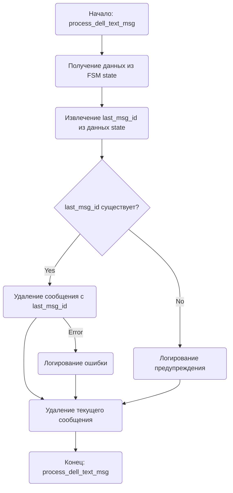

## АНАЛИЗ КОДА: `hypotez/src/endpoints/bots/telegram/digital_market/bot/admin/utils.py`

### 1. <алгоритм>

**process_dell_text_msg(message: Message, state: FSMContext)**

1. **Начало:** Функция `process_dell_text_msg` принимает на вход два параметра: объект сообщения Telegram `message` и состояние конечного автомата `state`.
   * _Пример:_  `message` содержит информацию о сообщении пользователя, включая его ID и текст. `state` содержит данные о текущем состоянии разговора.
2. **Получение данных из состояния:**  Извлекаем данные из состояния `state`, используя `await state.get_data()`, и сохраняем их в словаре `data`.
    * _Пример:_ `data` может содержать различные данные, сохраненные ранее в FSM, включая `last_msg_id`.
3. **Получение `last_msg_id`:**  Извлекаем значение `last_msg_id` из словаря `data`. Если ключа нет, будет возвращено `None`.
    * _Пример:_ `last_msg_id` может быть целым числом, представляющим ID предыдущего сообщения, или `None`.
4. **Условная проверка:** Проверяем, является ли `last_msg_id` истинным значением (не `None`, не `0`, и т.д.).
    * _Пример:_ Если `last_msg_id` равен 12345, условие истинно; если `last_msg_id` равно `None`, условие ложно.
5. **Удаление предыдущего сообщения (если `last_msg_id` существует):**
    * Вызываем метод `bot.delete_message()` с параметрами `chat_id` (ID пользователя, отправившего сообщение) и `message_id` (значение `last_msg_id`).
    * _Пример:_ Выполняется `await bot.delete_message(chat_id=123456789, message_id=12345)`.
6. **Логирование предупреждения (если `last_msg_id` не существует):** Если `last_msg_id` не был найден в данных FSM, функция записывает предупреждающее сообщение в лог.
   * _Пример:_ В лог попадает сообщение "Ошибка: Не удалось найти идентификатор последнего сообщения для удаления."
7. **Удаление текущего сообщения:** Вызываем `await message.delete()` для удаления сообщения, вызвавшего функцию.
   * _Пример:_ Сообщение, приславшее команду, будет удалено.
8. **Обработка ошибок:** Оборачиваем основной код в блок `try...except`, чтобы перехватить любые исключения, которые могут возникнуть при удалении сообщения. Если ошибка происходит, она логируется.
    * _Пример:_ Если `bot.delete_message()` вызовет исключение (например, при отсутствии прав), ошибка будет записана в лог.
9. **Конец:** Функция завершает свою работу.

### 2. <mermaid>

**Объяснение диаграммы mermaid:**

*   `Start`: Начало выполнения функции `process_dell_text_msg`.
*   `GetStateData`: Получение данных из FSM (Finite State Machine) контекста `state` с помощью `await state.get_data()`.
*   `ExtractLastMsgId`: Извлечение значения `last_msg_id` из полученных данных.
*   `CheckLastMsgId`: Проверка, существует ли `last_msg_id`.
*   `DeletePreviousMessage`: Удаление сообщения с идентификатором `last_msg_id` с помощью `bot.delete_message()`.
*   `LogWarning`: Логирование предупреждения, если `last_msg_id` не найден.
*  `DeleteCurrentMessage`: Удаление текущего сообщения с помощью `message.delete()`.
*  `End`: Завершение выполнения функции.
*  `LogError`: Логирование ошибки в случае исключения при удалении сообщения.

**Импорты и зависимости:**
*   `aiogram.fsm.context.FSMContext`: используется для хранения и управления состояниями конечного автомата,  здесь для доступа к сохраненным данным.
*   `aiogram.types.Message`: представляет объект сообщения Telegram, содержит информацию о сообщении и отправителе.
*   `loguru.logger`: используется для логирования событий.
*   `bot.config.bot`: импортирует объект бота Telegram из конфигурации проекта, через него осуществляется взаимодействие с Telegram API, включая отправку и удаление сообщений.

### 3. <объяснение>

**Импорты:**

*   `from aiogram.fsm.context import FSMContext`: `FSMContext` используется для работы с состояниями конечного автомата (FSM), что позволяет боту поддерживать контекст в многошаговых диалогах с пользователем. В данном случае, `FSMContext` позволяет получить ранее сохраненные данные, включая `last_msg_id`.
*   `from aiogram.types import Message`: `Message` представляет объект сообщения Telegram. Он используется для получения информации о сообщении, включая текст, ID пользователя, ID чата и т. д.
*   `from loguru import logger`: `logger` используется для логирования событий. Это позволяет отслеживать поведение бота и диагностировать проблемы.
*   `from bot.config import bot`: `bot` представляет экземпляр бота Telegram, настроенный с использованием токена и других параметров. Он необходим для взаимодействия с API Telegram, в том числе для удаления сообщений.

**Функция `process_dell_text_msg`:**

*   **Аргументы:**
    *   `message: Message`: Объект сообщения Telegram, который вызвал эту функцию.
    *   `state: FSMContext`: Объект, представляющий текущее состояние FSM.
*   **Возвращаемое значение:** Функция ничего не возвращает (`None`).
*   **Назначение:** Функция `process_dell_text_msg` предназначена для удаления предыдущего сообщения пользователя (если его ID сохранен в состоянии FSM) и текущего сообщения, которое вызвало функцию. Это используется в боте для очистки сообщений после обработки команды.
*   **Пример:** Представьте, что пользователь отправил команду, которая должна отобразить несколько сообщений, а затем удалить их, включая и саму команду. В FSM будет сохранен `last_msg_id`, который указывает на предыдущее сообщение. После обработки команда вызывается эта функция, которая сначала удалит предыдущее сообщение, а затем и текущее.

**Переменные:**

*   `data`: Словарь, содержащий данные, полученные из состояния FSM.
*   `last_msg_id`: Идентификатор предыдущего сообщения, который необходимо удалить. Может быть `None`, если идентификатор не был сохранен.
*   `e`: Объект исключения, содержащий информацию об ошибке, произошедшей при удалении сообщения.

**Потенциальные ошибки и области для улучшения:**

*   **Отсутствие `last_msg_id`:** Если `last_msg_id` не был сохранен в состоянии FSM, то функция не удалит предыдущее сообщение. Это может быть исправлено добавлением логики для установки `last_msg_id` в FSM перед использованием этой функции.
*   **Обработка ошибок:** Текущая обработка ошибок просто логирует ошибку. Можно добавить более специфичную обработку ошибок, например, отправку сообщения пользователю об ошибке.
*   **Права бота:** Если у бота нет прав на удаление сообщений, функция вызовет исключение. Можно проверить наличие прав перед попыткой удаления сообщения.
*   **Оптимизация:** Функция выполняет две операции удаления, что может вызвать небольшую задержку. Возможно, стоит рассмотреть возможность объединения удаления предыдущего и текущего сообщения в одну операцию, если API Telegram позволяет это сделать, тем самым повысив эффективность кода.
*   **Зависимость от FSM:** Функция сильно зависит от FSM. Необходимо всегда помнить, что в FSM должен быть сохранен корректный `last_msg_id`.

**Взаимосвязь с другими частями проекта:**

*   Эта функция используется в административной части Telegram-бота, что указывает на то, что она работает с командами и сообщениями от администраторов бота.
*   Она полагается на `bot.config.bot`, которая определена в конфигурации проекта, и на `loguru` для логирования.
*   `FSMContext` подразумевает, что другие части проекта также работают с FSM, сохраняя `last_msg_id`.

**Цепочка взаимосвязей:**

1.  Пользователь (администратор) отправляет команду боту.
2.  Бот обрабатывает команду и сохраняет `last_msg_id` в FSM (этот шаг не показан в данном коде, но подразумевается).
3.  После обработки команды вызывается функция `process_dell_text_msg`.
4.  Функция `process_dell_text_msg` получает `last_msg_id` из FSM.
5.  Функция `process_dell_text_msg` удаляет предыдущее сообщение, используя `bot.delete_message`.
6.  Функция `process_dell_text_msg` удаляет текущее сообщение, вызвавшее функцию.
7.  Логгер записывает любые ошибки в процессе удаления.