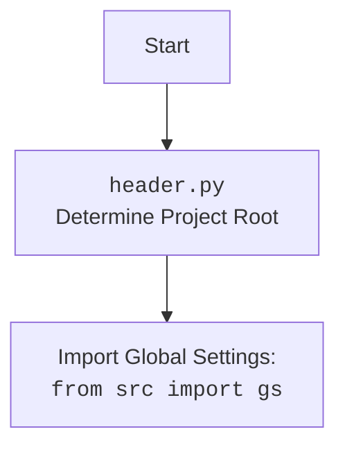

## ИНСТРУКЦИЯ:

Анализируй предоставленный код подробно и объясни его функциональность. Ответ должен включать три раздела:  

1. **<алгоритм>**: Опиши рабочий процесс в виде пошаговой блок-схемы, включая примеры для каждого логического блока, и проиллюстрируй поток данных между функциями, классами или методами.  
2. **<mermaid>**: Напиши код для диаграммы в формате `mermaid`, проанализируй и объясни все зависимости, 
    которые импортируются при создании диаграммы. 
    **ВАЖНО!** Убедитесь, что все имена переменных, используемые в диаграмме `mermaid`, 
    имеют осмысленные и описательные имена. Имена переменных вроде `A`, `B`, `C`, и т.д., не допускаются!  
    
    **Дополнительно**: Если в коде есть импорт `import header`, добавьте блок `mermaid` flowchart, объясняющий `header.py`:\
    ```mermaid
    flowchart TD
        Start --> Header[<code>header.py</code><br> Determine Project Root]
    
        Header --> import[Import Global Settings: <br><code>from src import gs</code>] 
    ```

3. **<объяснение>**: Предоставьте подробные объяснения:  
   - **Импорты**: Их назначение и взаимосвязь с другими пакетами `src.`.  
   - **Классы**: Их роль, атрибуты, методы и взаимодействие с другими компонентами проекта.  
   - **Функции**: Их аргументы, возвращаемые значения, назначение и примеры.  
   - **Переменные**: Их типы и использование.  
   - Выделите потенциальные ошибки или области для улучшения.  

Дополнительно, постройте цепочку взаимосвязей с другими частями проекта (если применимо).  

Это обеспечивает всесторонний и структурированный анализ кода.
## Формат ответа: `.md` (markdown)
**КОНЕЦ ИНСТРУКЦИИ**
## <алгоритм>
1. **Импорт библиотек**:
    *   Импортируются необходимые библиотеки для работы с операционной системой (`os`), типами данных (`typing`), логгированием (`loguru`), Telegram ботами (`aiogram`) и настройками (`pydantic_settings`).
    *   Пример: `import os`, `from typing import List`, `from loguru import logger`
2.  **Определение класса `Settings`**:
    *   Создается класс `Settings` для хранения настроек бота, наследующийся от `BaseSettings` из `pydantic_settings`.
    *   Внутри класса определяются атрибуты для хранения токена бота, идентификаторов администраторов, токена провайдера, форматов логов, URL сайта, логина и пароля для сервиса MRH, признака тестового режима, и строка подключения к БД.
    *   `model_config` указывает на местоположение файла `.env` с переменными окружения.
    *   Пример:
        ```python
        class Settings(BaseSettings):
            BOT_TOKEN: str
            ADMIN_IDS: List[int]
            # ...
            model_config = SettingsConfigDict(env_file=...)
        ```
3.  **Динамическое формирование URL**:
    *   Реализуются методы `get_webhook_url` и `get_provider_hook_url`, которые динамически формируют URL для вебхуков на основе URL сайта и токена бота.
    *   Пример:
        ```python
        @property
        def get_webhook_url(self) -> str:
            return f"{self.SITE_URL}/{self.BOT_TOKEN}"
        ```
4.  **Инициализация настроек**:
    *   Создается экземпляр класса `Settings`, который загружает настройки из переменных окружения (`.env` файл).
    *   Пример: `settings = Settings()`
5.  **Инициализация бота и диспетчера**:
    *   Создается экземпляр `Bot` с использованием токена из настроек и режима парсинга HTML.
    *   Создается экземпляр `Dispatcher` с использованием `MemoryStorage` для хранения состояний.
    *   Пример: `bot = Bot(token=settings.BOT_TOKEN, default=...)`, `dp = Dispatcher(storage=MemoryStorage())`
6.  **Получение списка администраторов**:
    *   Получается список идентификаторов администраторов из настроек.
    *   Пример: `admins = settings.ADMIN_IDS`
7.  **Настройка логгирования**:
    *   Формируется путь к файлу лога.
    *   Настраивается логгер с использованием формата, уровня и ротации логов из настроек.
    *   Пример: `logger.add(log_file_path, format=settings.FORMAT_LOG, level="INFO", rotation=settings.LOG_ROTATION)`
8.  **Получение URL базы данных**:
    *   Получается строка подключения к базе данных из настроек.
    *   Пример: `database_url = settings.DB_URL`

## <mermaid>
```mermaid
flowchart TD
    Start --> LoadSettings[Load Settings from .env]
    LoadSettings --> SettingsClass[Settings Class: Validate and Store Settings]
    SettingsClass --> CreateBot[Create Bot Instance]
    CreateBot --> CreateDispatcher[Create Dispatcher Instance]
    CreateDispatcher --> GetAdminIDs[Get Admin IDs from Settings]
    GetAdminIDs --> ConfigureLogger[Configure Logger]
    ConfigureLogger --> GetDatabaseURL[Get Database URL from Settings]
    GetDatabaseURL --> End
    
    classDef setting fill:#f9f,stroke:#333,stroke-width:2px;
    class SettingsClass, LoadSettings setting
    
    classDef bot fill:#ccf,stroke:#333,stroke-width:2px;
    class CreateBot, CreateDispatcher bot
```



**Объяснение зависимостей:**

*   `os`: Используется для работы с операционной системой, например, для формирования путей к файлам и директориям (`os.path.join`, `os.path.dirname`, `os.path.abspath`).
*   `typing`: Используется для аннотации типов, например, `List` для списка идентификаторов администраторов (`ADMIN_IDS: List[int]`).
*   `loguru`: Используется для логирования событий в приложении, предоставляя гибкую настройку форматов и уровней логов.
*   `aiogram`: Используется для создания и управления Telegram ботом, включая обработку сообщений и команд, а также для работы с диспетчером.
    *   `Bot`: Класс для представления бота Telegram.
    *   `Dispatcher`: Класс для управления обработчиками событий бота.
    *   `ParseMode`: Перечисление для задания формата парсинга текста.
    *   `MemoryStorage`: Класс для хранения состояния бота в памяти.
    *   `DefaultBotProperties`: Класс для хранения настроек по умолчанию для бота.
*   `pydantic_settings`: Используется для загрузки и валидации настроек приложения из переменных окружения, обеспечивая строгую проверку типов и более удобную работу с настройками.
    *   `BaseSettings`: Базовый класс для создания моделей настроек.
    *   `SettingsConfigDict`: Класс для конфигурации настроек `pydantic`.

## <объяснение>

**Импорты:**

*   `import os`: Модуль `os` используется для взаимодействия с операционной системой. В данном коде он применяется для работы с путями к файлам, например, для определения абсолютного пути к файлу `.env` и файлу лога.
*   `from typing import List`: Модуль `typing` используется для статической типизации данных. `List` указывает, что `ADMIN_IDS` должен быть списком целых чисел.
*   `from loguru import logger`: Библиотека `loguru` используется для логирования. Она предоставляет удобный и гибкий способ записи сообщений о работе приложения в файл.
*   `from aiogram import Bot, Dispatcher`: Модули `Bot` и `Dispatcher` из библиотеки `aiogram` используются для создания и управления Telegram-ботом. `Bot` управляет взаимодействием с API Telegram, а `Dispatcher` обрабатывает входящие сообщения и команды.
*   `from aiogram.enums import ParseMode`: `ParseMode` используется для установки режима парсинга текста. `ParseMode.HTML` позволяет использовать HTML-теги в сообщениях бота.
*   `from aiogram.fsm.storage.memory import MemoryStorage`: `MemoryStorage` используется для хранения состояний бота в оперативной памяти. Это простой способ хранения данных, но при перезапуске бота данные теряются.
*   `from aiogram.client.default import DefaultBotProperties`:  `DefaultBotProperties` используется для установки общих настроек бота, таких как режим парсинга.
*   `from pydantic_settings import BaseSettings, SettingsConfigDict`: `BaseSettings` и `SettingsConfigDict` из библиотеки `pydantic_settings` используются для создания класса `Settings`, который автоматически загружает настройки из переменных окружения и проверяет их типы.

**Классы:**

*   `Settings(BaseSettings)`: Класс, определяющий структуру настроек приложения.
    *   **Атрибуты:**
        *   `BOT_TOKEN: str`: Токен Telegram-бота.
        *   `ADMIN_IDS: List[int]`: Список ID администраторов бота.
        *   `PROVIDER_TOKEN: str`: Токен провайдера платежей (например, Robokassa).
        *   `FORMAT_LOG: str`: Формат вывода логов.
        *   `LOG_ROTATION: str`: Правило ротации лог-файлов.
        *   `DB_URL: str`: URL для подключения к базе данных.
        *   `SITE_URL: str`: URL сайта.
        *   `SITE_HOST: str`: Хост сайта.
        *   `SITE_PORT: int`: Порт сайта.
        *   `MRH_LOGIN: str`: Логин для сервиса MRH.
        *   `MRH_PASS_1: str`, `MRH_PASS_2: str`: Пароли для сервиса MRH.
        *    `IN_TEST: int`: Признак тестового режима.
        *   `model_config`: Конфигурация для `pydantic`, указывающая путь к файлу `.env`.
    *   **Методы:**
        *   `get_webhook_url(self) -> str`: Динамически формирует URL для вебхука бота.
        *   `get_provider_hook_url(self) -> str`: Динамически формирует URL для вебхука провайдера платежей.

**Функции:**

*   **В данном коде нет явно определенных функций, кроме методов класса `Settings`:**
    *   `get_webhook_url`: Эта функция (метод класса) принимает `self` (экземпляр класса `Settings`) и возвращает строку, представляющую URL для вебхука бота. Она используется для динамического построения URL, что позволяет избежать жесткого задания URL в коде. Пример: если `SITE_URL` это `"https://example.com"`, а `BOT_TOKEN` это `"123456:ABCDEFG"`, то вернётся `"https://example.com/123456:ABCDEFG"`.
    *  `get_provider_hook_url`: Аналогично `get_webhook_url`, но формирует URL для вебхука провайдера платежей, добавляя `"robokassa"` к `SITE_URL`. Пример: если `SITE_URL` это `"https://example.com"`, то вернётся `"https://example.com/robokassa"`.

**Переменные:**

*   `settings: Settings`: Экземпляр класса `Settings`, содержащий загруженные настройки.
*   `bot: Bot`: Экземпляр класса `Bot` для взаимодействия с Telegram API.
*  `dp: Dispatcher`: Экземпляр класса `Dispatcher` для обработки сообщений.
*   `admins: List[int]`: Список ID администраторов бота, загруженный из настроек.
*   `log_file_path: str`: Абсолютный путь к файлу лога.
*   `database_url: str`: URL для подключения к базе данных.

**Потенциальные ошибки и области для улучшения:**

*   **Обработка ошибок:** В коде отсутствует явная обработка ошибок. Например, при загрузке настроек из файла `.env` или при создании экземпляров `Bot` и `Dispatcher` могут возникать исключения. Необходимо добавить блоки `try-except` для перехвата и обработки таких ошибок.
*   **Безопасность:** Хранение паролей в переменных окружения в открытом виде может быть небезопасным. Рассмотреть возможность использования более безопасных методов, таких как secrets manager.
*   **Управление состоянием:** `MemoryStorage` подходит только для простых ботов. Для более сложных приложений следует использовать более надежные хранилища, такие как Redis или базы данных.
*  **Проверка конфигурации**: Перед запуском бота необходимо проверять, все ли обязательные параметры были загружены корректно.

**Цепочка взаимосвязей с другими частями проекта:**

*   **`settings`**: Переменная `settings` используется для передачи конфигурации во все части бота, от `bot` и `dp` до логгера и БД. Это обеспечивает централизованное управление настройками.
*   **`bot` и `dp`**: `bot` и `dp`  это основные компоненты для работы с Telegram API и обработки сообщений. Они взаимодействуют со всеми модулями, которые регистрируют хендлеры или используют API.
*  **`logger`**: `logger` используется во всех частях приложения для записи событий и ошибок в файл. Это важный компонент для отладки и мониторинга работы бота.
* **`database_url`**: Эта переменная служит для подключения к базе данных, она будет использоваться в модулях, которые взаимодействуют с БД для хранения и чтения данных.

Данный код представляет собой базовую конфигурацию Telegram-бота, где все основные параметры, включая токен бота, список администраторов, URL сайта и параметры БД, загружаются из переменных окружения и инициализируют основные компоненты бота.