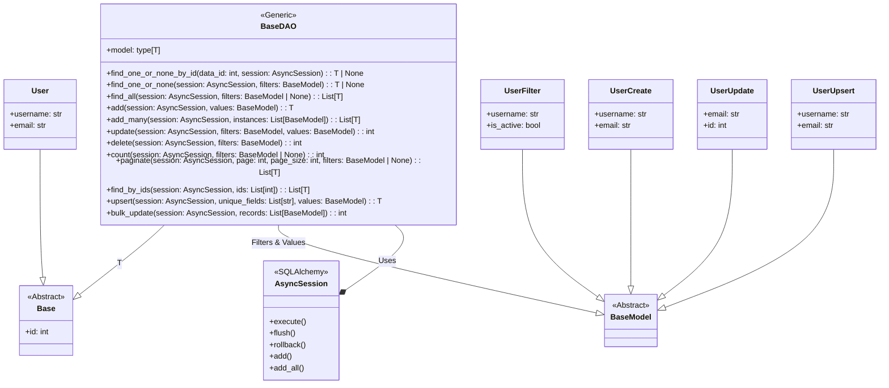

## ИНСТРУКЦИЯ:

Анализируй предоставленный код подробно и объясни его функциональность. Ответ должен включать три раздела:

1.  **<алгоритм>**: Опиши рабочий процесс в виде пошаговой блок-схемы, включая примеры для каждого логического блока, и проиллюстрируй поток данных между функциями, классами или методами.
2.  **<mermaid>**: Напиши код для диаграммы в формате `mermaid`, проанализируй и объясни все зависимости,
    которые импортируются при создании диаграммы.
    **ВАЖНО!** Убедитесь, что все имена переменных, используемые в диаграмме `mermaid`,
    имеют осмысленные и описательные имена. Имена переменных вроде `A`, `B`, `C`, и т.д., не допускаются!

    **Дополнительно**: Если в коде есть импорт `import header`, добавьте блок `mermaid` flowchart, объясняющий `header.py`:
    ```mermaid
    flowchart TD
        Start --> Header[<code>header.py</code><br> Determine Project Root]

        Header --> import[Import Global Settings: <br><code>from src import gs</code>]
    ```

3.  **<объяснение>**: Предоставьте подробные объяснения:
    *   **Импорты**: Их назначение и взаимосвязь с другими пакетами `src.`.
    *   **Классы**: Их роль, атрибуты, методы и взаимодействие с другими компонентами проекта.
    *   **Функции**: Их аргументы, возвращаемые значения, назначение и примеры.
    *   **Переменные**: Их типы и использование.
    *   Выделите потенциальные ошибки или области для улучшения.

Дополнительно, постройте цепочку взаимосвязей с другими частями проекта (если применимо).

Это обеспечивает всесторонний и структурированный анализ кода.
## Формат ответа: `.md` (markdown)
**КОНЕЦ ИНСТРУКЦИИ**
## Ответ:

### <алгоритм>

**Общий алгоритм работы `BaseDAO`:**

`BaseDAO` - это базовый класс для доступа к данным в базе данных. Он предоставляет набор общих методов для выполнения операций CRUD (Create, Read, Update, Delete) и других операций.

1.  **Инициализация**:
    *   Класс `BaseDAO` является дженериком, принимающим в качестве параметра класс модели (`T`), который должен быть наследником `Base` (модели SQLAlchemy).
    *   Атрибут `model` хранит ссылку на класс модели, с которым работает данный экземпляр `BaseDAO`.

2.  **Чтение данных**:
    *   `find_one_or_none_by_id(data_id, session)`:
        *   Принимает `data_id` (целое число) и асинхронную сессию БД `session`.
        *   Формирует запрос `SELECT * FROM model WHERE id = data_id`.
        *   Выполняет запрос и возвращает одну запись или `None`.
        *   Пример: `await BaseDAO[User].find_one_or_none_by_id(123, session)`.
    *   `find_one_or_none(session, filters)`:
        *   Принимает асинхронную сессию БД `session` и объект `filters` (наследник `BaseModel`), содержащий параметры фильтрации.
        *   Формирует запрос `SELECT * FROM model WHERE <filters>`.
        *   Выполняет запрос и возвращает одну запись или `None`.
        *   Пример: `await BaseDAO[User].find_one_or_none(session, UserFilter(username='test_user'))`.
    *   `find_all(session, filters=None)`:
        *   Принимает асинхронную сессию БД `session` и объект `filters` (наследник `BaseModel`, опционально).
        *   Формирует запрос `SELECT * FROM model WHERE <filters>` (если `filters` задан) или `SELECT * FROM model` (если `filters` не задан).
        *   Выполняет запрос и возвращает список всех записей, соответствующих критериям.
        *   Пример: `await BaseDAO[User].find_all(session, UserFilter(is_active=True))`.
    *   `find_by_ids(session, ids)`:
         * Принимает асинхронную сессию БД `session` и список `ids`.
         * Формирует запрос `SELECT * FROM model WHERE id IN (ids)`.
         * Выполняет запрос и возвращает список записей, соответствующих переданным id.
         * Пример: `await BaseDAO[User].find_by_ids(session, [1, 2, 3])`.
     *  `paginate(session, page, page_size, filters=None)`:
         *   Принимает асинхронную сессию БД `session`, номер страницы `page`, размер страницы `page_size` и объект `filters` (наследник `BaseModel`, опционально).
         *   Формирует запрос `SELECT * FROM model WHERE <filters> LIMIT page_size OFFSET (page-1)*page_size`.
         *   Выполняет запрос и возвращает список записей для текущей страницы.
         *   Пример: `await BaseDAO[User].paginate(session, page=2, page_size=20, filters=UserFilter(is_active=True))`.
    * `count(session, filters=None)`:
        *   Принимает асинхронную сессию БД `session` и объект `filters` (наследник `BaseModel`, опционально).
        *   Формирует запрос `SELECT COUNT(id) FROM model WHERE <filters>` (если `filters` задан) или `SELECT COUNT(id) FROM model` (если `filters` не задан).
        *   Выполняет запрос и возвращает количество записей.
        *   Пример: `await BaseDAO[User].count(session, UserFilter(is_active=True))`.

3.  **Создание данных**:
    *   `add(session, values)`:
        *   Принимает асинхронную сессию БД `session` и объект `values` (наследник `BaseModel`) с данными для новой записи.
        *   Создает новый экземпляр модели из `values`.
        *   Добавляет экземпляр в сессию и делает flush.
        *   Возвращает созданный экземпляр.
        *   Пример: `await BaseDAO[User].add(session, UserCreate(username='new_user', email='test@test.com'))`.
    *   `add_many(session, instances)`:
        *   Принимает асинхронную сессию БД `session` и список объектов `instances` (наследники `BaseModel`) с данными для новых записей.
        *   Создает новые экземпляры модели из `instances`.
        *   Добавляет все экземпляры в сессию и делает flush.
        *   Возвращает список созданных экземпляров.
        *   Пример: `await BaseDAO[User].add_many(session, [UserCreate(...), UserCreate(...)])`.
    * `upsert(session, unique_fields, values)`:
        * Принимает асинхронную сессию БД `session`, список `unique_fields` (ключевые поля для поиска) и объект `values` (наследник `BaseModel`).
        * Пытается найти запись по `unique_fields`.
        * Если запись найдена, то она обновляется данными из `values`.
        * Если запись не найдена, то создается новая запись.
        * Возвращает обновленный или созданный экземпляр.
        * Пример: `await BaseDAO[User].upsert(session, ['username'], UserUpsert(username='existing_user', email='new@email.com'))`.

4.  **Обновление данных**:
    *   `update(session, filters, values)`:
        *   Принимает асинхронную сессию БД `session`, объект `filters` (наследник `BaseModel`) для фильтрации и объект `values` (наследник `BaseModel`) с новыми данными.
        *   Формирует запрос `UPDATE model SET <values> WHERE <filters>`.
        *   Выполняет запрос и возвращает количество обновленных записей.
        *   Пример: `await BaseDAO[User].update(session, UserFilter(username='test_user'), UserUpdate(email='new_email@test.com'))`.
    * `bulk_update(session, records)`:
        *   Принимает асинхронную сессию БД `session` и список `records` (наследники `BaseModel`) с данными для обновления.
        *   Для каждого `record` формирует запрос `UPDATE model SET <values> WHERE id=<record.id>`.
        *   Выполняет запросы и возвращает общее количество обновленных записей.
        *   Пример: `await BaseDAO[User].bulk_update(session, [UserUpdate(id=1, email='email1@test.com'), UserUpdate(id=2, email='email2@test.com')])`.

5.  **Удаление данных**:
    *   `delete(session, filters)`:
        *   Принимает асинхронную сессию БД `session` и объект `filters` (наследник `BaseModel`) для фильтрации.
        *   Формирует запрос `DELETE FROM model WHERE <filters>`.
        *   Выполняет запрос и возвращает количество удаленных записей.
        *   Пример: `await BaseDAO[User].delete(session, UserFilter(is_active=False))`.

### <mermaid>



**Разбор зависимостей:**

*   `Base`:  Базовый класс для всех моделей в базе данных (SQLAlchemy). Определяет структуру таблицы, как минимум  `id`.
*   `BaseModel`: Базовый класс для валидации и сериализации данных (Pydantic). Используется для фильтров и значений при работе с DAO.
*   `AsyncSession`: Класс из SQLAlchemy для работы с асинхронными сессиями базы данных. Используется для выполнения запросов.
*   `BaseDAO`: Класс, предоставляющий методы для доступа к данным. Использует `Base` в качестве generic параметра и принимает экземпляры `BaseModel` и `AsyncSession`.
    `T` - это placeholder для любого класса, наследуемого от `Base`
*   `User`: пример сущности в базе данных (наследник `Base`).
*   `UserFilter`:  пример класса для фильтрации пользователей (наследник `BaseModel`).
*   `UserCreate`: пример класса для создания пользователя (наследник `BaseModel`).
*   `UserUpdate`: пример класса для обновления пользователя (наследник `BaseModel`).
*    `UserUpsert`: пример класса для создания или обновления пользователя (наследник `BaseModel`).

### <объяснение>

**Импорты:**

*   `from typing import List, Any, TypeVar, Generic`: Импортирует типы для аннотаций (список, любой тип, переменная типа, дженерики). Это позволяет делать код более читаемым и предотвращает ошибки типов.
*   `from pydantic import BaseModel`: Импортирует класс `BaseModel` из Pydantic для создания схем данных, которые используются для валидации и сериализации.
*   `from sqlalchemy.exc import SQLAlchemyError`: Импортирует класс `SQLAlchemyError` для обработки исключений, связанных с SQLAlchemy.
*   `from sqlalchemy.future import select`: Импортирует функцию `select` для создания SQL-запросов в SQLAlchemy.
*   `from sqlalchemy import update as sqlalchemy_update, delete as sqlalchemy_delete, func`: Импортирует функции `update` и `delete`, а так же `func` для работы с SQL запросами.
*   `from loguru import logger`: Импортирует объект `logger` для логирования событий.
*   `from sqlalchemy.ext.asyncio import AsyncSession`: Импортирует класс `AsyncSession` для работы с асинхронными сессиями базы данных в SQLAlchemy.
*   `from bot.dao.database import Base`: Импортирует базовый класс `Base` для моделей SQLAlchemy, который определен в `src/bot/dao/database.py`.

**Классы:**

*   `BaseDAO[T: Base](Generic[T])`:
    *   **Роль**: Базовый класс для доступа к данным. Реализует общую логику CRUD.
    *   **Атрибуты**:
        *   `model: type[T]`:  Хранит класс модели, с которой работает DAO.
    *   **Методы**:
        *   `find_one_or_none_by_id(data_id: int, session: AsyncSession)`: Находит одну запись по ID.
        *   `find_one_or_none(session: AsyncSession, filters: BaseModel)`: Находит одну запись по фильтру.
        *   `find_all(session: AsyncSession, filters: BaseModel | None)`: Находит все записи по фильтру.
        *   `add(session: AsyncSession, values: BaseModel)`: Добавляет новую запись.
        *   `add_many(session: AsyncSession, instances: List[BaseModel])`: Добавляет несколько записей.
        *   `update(session: AsyncSession, filters: BaseModel, values: BaseModel)`: Обновляет записи по фильтру.
        *   `delete(session: AsyncSession, filters: BaseModel)`: Удаляет записи по фильтру.
        *  `count(session: AsyncSession, filters: BaseModel | None)`: Подсчитывает количество записей.
        *   `paginate(session: AsyncSession, page: int, page_size: int, filters: BaseModel = None)`:  Получает данные для пагинации.
        *   `find_by_ids(session: AsyncSession, ids: List[int])`: Находит несколько записей по списку ID.
        *   `upsert(session: AsyncSession, unique_fields: List[str], values: BaseModel)`: Создает или обновляет запись.
        *    `bulk_update(session: AsyncSession, records: List[BaseModel])`: Массовое обновление записей.
    *   **Взаимодействие**: Работает с моделями SQLAlchemy (`T`) и асинхронной сессией SQLAlchemy (`AsyncSession`). Использует `BaseModel` для передачи данных.

**Функции:**

Все методы класса `BaseDAO` являются асинхронными методами класса, предназначенными для работы с базой данных. Они принимают на вход `AsyncSession` для выполнения запросов и используют `BaseModel` для получения данных.

Примеры функций:
*  `find_one_or_none_by_id` - ищет запись в БД по id. Примеры использования:
```python
# Пример использования find_one_or_none_by_id
async def example_find_by_id(session: AsyncSession):
    user_id = 1
    user = await BaseDAO[User].find_one_or_none_by_id(user_id, session)
    if user:
        print(f"Пользователь с id {user_id}: {user.username}")
    else:
        print(f"Пользователь с id {user_id} не найден")
```

*   `add` - добавляет новую запись в БД. Примеры использования:
```python
# Пример использования add
async def example_add_user(session: AsyncSession):
    new_user_data = UserCreate(username="new_user", email="new_user@example.com")
    new_user = await BaseDAO[User].add(session, new_user_data)
    print(f"Создан пользователь с id {new_user.id} и именем {new_user.username}")
```

*  `update` - обновляет запись в БД. Примеры использования:
```python
# Пример использования update
async def example_update_user(session: AsyncSession):
    update_filter = UserFilter(username="old_user")
    update_data = UserUpdate(email="updated_email@example.com")
    updated_count = await BaseDAO[User].update(session, update_filter, update_data)
    if updated_count > 0:
        print(f"Обновлено {updated_count} пользователей.")
    else:
        print("Пользователи не найдены или обновление не удалось.")

```

* `delete` - удаляет запись из БД. Примеры использования:
```python
# Пример использования delete
async def example_delete_user(session: AsyncSession):
    delete_filter = UserFilter(username="user_to_delete")
    deleted_count = await BaseDAO[User].delete(session, delete_filter)
    if deleted_count > 0:
        print(f"Удалено {deleted_count} пользователей.")
    else:
        print("Пользователи не найдены или удаление не удалось.")
```

**Переменные:**

*   `T = TypeVar("T", bound=Base)`:  Определяет типовую переменную `T`, которая должна быть наследником `Base` (модель SQLAlchemy). Используется для создания дженерик-класса `BaseDAO`.

**Потенциальные ошибки и области для улучшения:**

*   **Отсутствие валидации на уровне базы данных:** Хотя `BaseModel` валидирует данные на уровне приложения, стоит также настроить валидацию на уровне базы данных (например, через ограничения SQL).
*   **Одинаковое название фильтров и полей:** При использовании `filters` для фильтрации записей в БД, названия полей в  `filter_dict` должны совпадать с названиями полей в БД.
*   **Обработка исключений:** В коде есть обработка исключений `SQLAlchemyError`, но при необходимости стоит добавить более специфичную обработку исключений в зависимости от нужд приложения.
*   **Массовое обновление/удаление:**  В случае с массовым обновлением и удалением, стоит рассмотреть возможность использования `sqlalchemy.update().values()` и `sqlalchemy.delete()`, что позволит повысить производительность и уменьшит количество запросов к БД.
* **Улучшения `bulk_update`**:  При массовом обновлении следует проверять наличие `id` перед обновлением.
* **Логирование:** В код добавлено логирование, однако стоит продумать уровни и форматы логирования, чтобы они соответствовали требованиям проекта.
* **Использование `upsert`:** При использовании `upsert` следует внимательно продумать выбор `unique_fields`, чтобы логика обновления/создания была корректной.

**Взаимосвязи с другими частями проекта:**

*   `bot.dao.database`: `BaseDAO` зависит от базового класса `Base`, который определен в `bot.dao.database`.
*   Модели: `BaseDAO` используется для работы с моделями SQLAlchemy, которые представляют таблицы в базе данных.
*   Логирование: `BaseDAO` использует библиотеку `loguru` для логирования своих действий.

Этот код обеспечивает базовый слой для работы с данными в приложении и может быть использован для создания конкретных DAO для каждой модели.