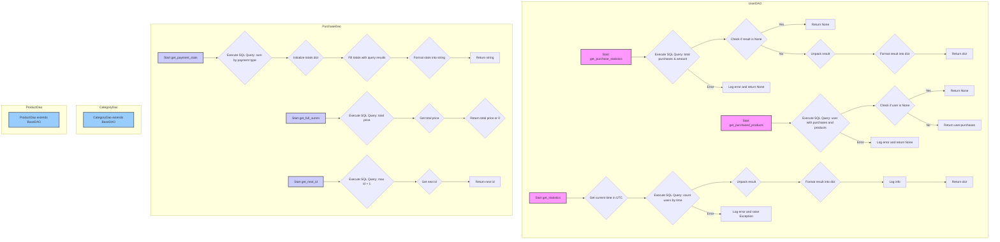

## ИНСТРУКЦИЯ:

Анализируй предоставленный код подробно и объясни его функциональность. Ответ должен включать три раздела:  

1. **<алгоритм>**: Опиши рабочий процесс в виде пошаговой блок-схемы, включая примеры для каждого логического блока, и проиллюстрируй поток данных между функциями, классами или методами.  
2. **<mermaid>**: Напиши код для диаграммы в формате `mermaid`, проанализируй и объясни все зависимости, 
    которые импортируются при создании диаграммы. 
    **ВАЖНО!** Убедитесь, что все имена переменных, используемые в диаграмме `mermaid`, 
    имеют осмысленные и описательные имена. Имена переменных вроде `A`, `B`, `C`, и т.д., не допускаются!  
    
    **Дополнительно**: Если в коде есть импорт `import header`, добавьте блок `mermaid` flowchart, объясняющий `header.py`:\
    ```mermaid
    flowchart TD
        Start --> Header[<code>header.py</code><br> Determine Project Root]
    
        Header --> import[Import Global Settings: <br><code>from src import gs</code>] 
    ```

3. **<объяснение>**: Предоставьте подробные объяснения:  
   - **Импорты**: Их назначение и взаимосвязь с другими пакетами `src.`.  
   - **Классы**: Их роль, атрибуты, методы и взаимодействие с другими компонентами проекта.  
   - **Функции**: Их аргументы, возвращаемые значения, назначение и примеры.  
   - **Переменные**: Их типы и использование.  
   - Выделите потенциальные ошибки или области для улучшения.  

Дополнительно, постройте цепочку взаимосвязей с другими частями проекта (если применимо).  

Это обеспечивает всесторонний и структурированный анализ кода.
## Формат ответа: `.md` (markdown)
**КОНЕЦ ИНСТРУКЦИИ**

## <алгоритм>
### UserDAO
1. **`get_purchase_statistics(session: AsyncSession, telegram_id: int)`**
   - **Начало:** Получает `AsyncSession` для работы с БД и `telegram_id` пользователя.
   - **Запрос:** Выполняет SQL-запрос, подсчитывающий общее количество покупок (`total_purchases`) и общую сумму (`total_amount`) для пользователя с заданным `telegram_id`.
   - **Обработка:**
     - Если результат запроса пуст (пользователь не найден или не совершал покупок), возвращает `None`.
     - Иначе, распаковывает результат запроса в `total_purchases` и `total_amount`.
     - Формирует словарь `{'total_purchases': total_purchases, 'total_amount': total_amount}` и возвращает его. Обрабатывает случай, когда `total_amount` может быть `None`, заменяя его на 0.
   - **Ошибки:** В случае ошибки `SQLAlchemyError`, выводит сообщение в консоль и возвращает `None`.

   **Пример:**
   ```python
   session = ... # Асинхронная сессия SQLAlchemy
   telegram_id = 12345
   stats = await UserDAO.get_purchase_statistics(session, telegram_id)
   if stats:
       print(f"Покупок: {stats['total_purchases']}, Сумма: {stats['total_amount']}")
   ```
2.  **`get_purchased_products(session: AsyncSession, telegram_id: int)`**
    - **Начало:** Принимает `AsyncSession` и `telegram_id`.
    - **Запрос:** Выполняет SQL-запрос для получения пользователя с заданным `telegram_id` и всех его покупок, включая информацию о продуктах в каждой покупке. Использует `selectinload` для эффективной загрузки связанных данных.
    - **Обработка:**
      - Если пользователь с данным `telegram_id` не найден, возвращает `None`.
      - Иначе возвращает список покупок пользователя (`user.purchases`).
    - **Ошибки:** Если происходит `SQLAlchemyError`, выводит сообщение об ошибке и возвращает `None`.

    **Пример:**
    ```python
    session = ... # Асинхронная сессия SQLAlchemy
    telegram_id = 12345
    purchases = await UserDAO.get_purchased_products(session, telegram_id)
    if purchases:
        for purchase in purchases:
            print(f"Покупка ID: {purchase.id}, Товар: {purchase.product.name}")
    ```

3. **`get_statistics(session: AsyncSession)`**
   - **Начало:** Принимает `AsyncSession` для работы с БД.
   - **Получение текущей даты:** Получает текущее время в UTC.
   - **Запрос:** Выполняет SQL-запрос для подсчета:
     - Общего количества пользователей (`total_users`).
     - Количества новых пользователей за последние 24 часа (`new_today`).
     - Количества новых пользователей за последние 7 дней (`new_week`).
     - Количества новых пользователей за последние 30 дней (`new_month`).
   - **Обработка:**
     - Извлекает данные из результата запроса.
     - Формирует словарь `statistics` с ключами `total_users`, `new_today`, `new_week`, `new_month`.
   - **Логирование:** Логирует полученную статистику с помощью `logger.info`.
   - **Возврат:** Возвращает словарь со статистикой.
   - **Ошибки:** Логирует ошибку `SQLAlchemyError` с помощью `logger.error` и пробрасывает исключение.

   **Пример:**
    ```python
    session = ... # Асинхронная сессия SQLAlchemy
    statistics = await UserDAO.get_statistics(session)
    print(f"Общее число пользователей: {statistics['total_users']}")
    ```
### PurchaseDao
1. **`get_payment_stats(session: AsyncSession)`**
   - **Начало:** Получает `AsyncSession`.
   - **Запрос:** Выполняет запрос, группируя покупки по типу оплаты (`payment_type`) и вычисляя общую сумму для каждого типа.
   - **Обработка:**
     - Инициализирует словарь `totals` для хранения сумм по типам оплат (`yukassa`, `robocassa`, `stars`).
     - Заполняет словарь `totals` на основе результатов запроса. Если для какого-то типа нет данных, то ставится значение 0.
     - Форматирует данные в строку с информацией о суммах по каждому типу оплаты и актуальностью статистики.
   - **Возврат:** Возвращает отформатированную строку.

   **Пример:**
    ```python
    session = ... # Асинхронная сессия SQLAlchemy
    stats_string = await PurchaseDao.get_payment_stats(session)
    print(stats_string)
    ```
2. **`get_full_summ(session: AsyncSession)`**
   - **Начало:** Получает `AsyncSession`.
   - **Запрос:** Выполняет запрос для получения общей суммы всех покупок.
   - **Обработка:** Извлекает сумму из результата запроса. Если результат `None`, то возвращает 0.
   - **Возврат:** Возвращает общую сумму покупок (целое число).

   **Пример:**
    ```python
    session = ... # Асинхронная сессия SQLAlchemy
    total_sum = await PurchaseDao.get_full_summ(session)
    print(f"Общая сумма покупок: {total_sum}")
    ```

3. **`get_next_id(session: AsyncSession)`**
    - **Начало:** Принимает `AsyncSession`.
    - **Запрос:** Выполняет SQL-запрос для получения максимального ID из таблицы покупок и добавляет к нему 1. Если таблица пуста, возвращает 1.
    - **Возврат:** Возвращает следующий свободный ID (целое число).

    **Пример:**
    ```python
    session = ... # Асинхронная сессия SQLAlchemy
    next_id = await PurchaseDao.get_next_id(session)
    print(f"Следующий ID для новой покупки: {next_id}")
    ```

### CategoryDao
- Просто наследуется от `BaseDAO` и определяет модель `Category`.
### ProductDao
- Просто наследуется от `BaseDAO` и определяет модель `Product`.

## <mermaid>

### Зависимости в `mermaid` диаграмме:
1.  **`UserDAO`**:
    -   `Start get_purchase_statistics`, `Start get_purchased_products`, `Start get_statistics` - начальные точки методов для получения статистики пользователя.
    -   `Execute SQL Query: total purchases & amount`, `Execute SQL Query: user with purchases and products`, `Execute SQL Query: count users by time` - запросы к базе данных, для получения необходимой информации.
    -   `Check if result is None`, `Check if user is None` - проверки результатов запросов на `None`, для обработки случаев, когда данные отсутствуют.
    -   `Unpack result` - распаковка результата из запроса к базе данных.
    -   `Format result into dict` - форматирование данных в словарь для удобного возврата.
    -   `Log error and return None`, `Log error and raise Exception` - обработка ошибок при работе с базой данных.
2.  **`PurchaseDao`**:
    -   `Start get_payment_stats`, `Start get_full_summ`, `Start get_next_id` - начальные точки методов для получения статистики покупок.
    -   `Execute SQL Query: sum by payment type`, `Execute SQL Query: total price`, `Execute SQL Query: max id + 1` - запросы к базе данных.
    -   `Initialize totals dict`, `Fill totals with query results` - работа со словарем для хранения результатов.
    -    `Get total price` - извлекает общую сумму покупок из результатов запроса.
     -   `Get next id` - извлекает следующий свободный id.
    -   `Format stats into string` - форматирует статистику в строку для возврата.
    -   `Return string`, `Return total price or 0`, `Return next id` - возврат полученных значений.
3.  **`CategoryDao` и `ProductDao`**:
    -   `CategoryDao extends BaseDAO` и `ProductDao extends BaseDAO` - эти классы наследуются от `BaseDAO`, что говорит о том, что они используют общую логику работы с базой данных, но для разных моделей.
    
## <объяснение>
### Импорты:
-   `datetime, UTC, timedelta`: Модуль `datetime` используется для работы с датой и временем, `UTC` для установки часового пояса, `timedelta` для работы с интервалами времени (например, "сегодня", "за неделю").
-   `Optional, List, Dict`: Используется для аннотации типов, что улучшает читаемость кода и позволяет статическим анализаторам кода находить ошибки.
-   `logger`: Модуль `loguru` используется для логирования событий и ошибок.
-   `select, func, case`: Используются из `sqlalchemy` для построения SQL-запросов, `select` для выборки данных, `func` для SQL-функций (например, `count`, `sum`), `case` для условных выражений в запросах.
-   `SQLAlchemyError`: Используется для обработки исключений при работе с базой данных.
-   `AsyncSession`: Класс для асинхронной работы с базой данных.
-   `selectinload`: Используется из `sqlalchemy` для оптимизации загрузки связанных данных из базы данных.
-   `BaseDAO`: Базовый класс DAO (Data Access Object), от которого наследуются `UserDAO`, `PurchaseDao`, `CategoryDao` и `ProductDao`.
-   `User, Purchase, Category, Product`: Модели SQLAlchemy для представления таблиц в базе данных.

### Классы:
1.  **`UserDAO(BaseDAO[User])`**:
    -   `model = User`: Определяет модель SQLAlchemy, с которой работает этот DAO - модель `User`.
    -   `get_purchase_statistics(session: AsyncSession, telegram_id: int) -> Optional[Dict[str, int]]`: Метод для получения статистики покупок пользователя.
        -   Принимает: `session` - асинхронная сессия SQLAlchemy, `telegram_id` - ID пользователя в Telegram.
        -   Возвращает: Словарь с общим количеством покупок и общей суммой или `None`, если пользователь не найден или произошла ошибка.
    -   `get_purchased_products(session: AsyncSession, telegram_id: int) -> Optional[List[Purchase]]`: Метод для получения списка покупок пользователя.
        -   Принимает: `session` - асинхронная сессия SQLAlchemy, `telegram_id` - ID пользователя в Telegram.
        -   Возвращает: Список покупок пользователя или `None`, если пользователь не найден или произошла ошибка.
    -   `get_statistics(session: AsyncSession) -> Dict[str, int]`: Метод для получения общей статистики по пользователям.
        -   Принимает: `session` - асинхронная сессия SQLAlchemy.
        -   Возвращает: Словарь с общим количеством пользователей, количеством новых за сегодня, за неделю и за месяц.
2. **`PurchaseDao(BaseDAO[Purchase])`**:
    -   `model = Purchase`: Определяет модель SQLAlchemy, с которой работает этот DAO - модель `Purchase`.
    -   `get_payment_stats(session: AsyncSession) -> str`: Метод для получения статистики платежей по типу.
        -   Принимает: `session` - асинхронная сессия SQLAlchemy.
        -   Возвращает: Отформатированную строку со статистикой платежей по типам (yukassa, robocassa, stars).
    -   `get_full_summ(session: AsyncSession) -> int`: Метод для получения общей суммы всех покупок.
        -   Принимает: `session` - асинхронная сессия SQLAlchemy.
        -   Возвращает: Общая сумма всех покупок.
    -   `get_next_id(session: AsyncSession) -> int`: Метод для получения следующего свободного ID.
        -   Принимает: `session` - асинхронная сессия SQLAlchemy.
        -   Возвращает: Следующий свободный ID.
3.  **`CategoryDao(BaseDAO[Category])`**:
    -   `model = Category`: Определяет модель SQLAlchemy, с которой работает этот DAO - модель `Category`.
4.  **`ProductDao(BaseDAO[Product])`**:
    -   `model = Product`: Определяет модель SQLAlchemy, с которой работает этот DAO - модель `Product`.

### Функции:
- Методы классов `UserDAO` и `PurchaseDao`, описаны выше.

### Переменные:
-   `session`: Объект асинхронной сессии SQLAlchemy для взаимодействия с базой данных.
-   `telegram_id`: ID пользователя в Telegram (целое число).
-   `stats`: Словарь (или кортеж) с данными, полученными из запроса к базе данных.
-   `now`: Текущее время (объект datetime).
-   `total_purchases`, `total_amount`: Общее количество покупок и общая сумма для пользователя (целые числа).
-   `statistics`: Словарь со статистикой пользователей.
-   `totals`: Словарь для хранения статистики по типам оплат.
-   `formatted_stats`: Строка со статистикой по типам оплат в отформатированном виде.
-   `total_price`: Общая сумма всех покупок.

### Потенциальные ошибки и области для улучшения:
-   Обработка ошибок: В методах `UserDAO` и `PurchaseDao` ошибки `SQLAlchemyError` обрабатываются путем вывода сообщения в консоль. Логирование ошибок было бы более предпочтительным вариантом (особенно для production-окружения). В методе `get_statistics` ошибка логгируется, и далее пробрасывается исключение - это правильный подход.
-   Типизация: В методе `get_payment_stats` в словаре `totals` явно указаны типы float, однако значения `total` из базы данных могут быть типа int, и не всегда ясно, придет ли float. Необходимо явно приводить к нужному типу.
-   `get_next_id`: Данный метод использует `func.coalesce`, который сработает корректно, если id целочисленный. Желательно предусмотреть и другие случаи.
-   Масштабируемость: Если данных в таблицах будет много, некоторые запросы могут стать медленными. Необходимо использовать правильные индексы в БД.
-   Общий базовый класс: Все DAO унаследованы от `BaseDAO`. Необходимо убедиться, что этот базовый класс имеет достаточную абстракцию для всех возможных вариантов использования.

### Взаимосвязи с другими частями проекта:
-   **Модели (User, Purchase, Category, Product):** Этот код напрямую зависит от моделей SQLAlchemy, которые определяют структуру таблиц в базе данных.
-   **`BaseDAO`:** Код использует базовый класс DAO для реализации общих операций работы с базой данных.
-   **`loguru`:** Код использует `loguru` для логирования событий.
-   **Telegram Bot:** Данные, полученные этими DAO, могут использоваться для отображения статистики пользователям бота.
-   **База данных:** Код работает с базой данных через SQLAlchemy.

Этот код представляет собой набор DAO для работы с различными сущностями в базе данных. Он включает в себя методы для получения статистики по пользователям, покупкам и платежам. Код использует асинхронную работу с базой данных для повышения производительности.