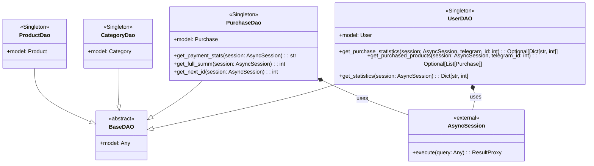

## ИНСТРУКЦИЯ:

Анализируй предоставленный код подробно и объясни его функциональность. Ответ должен включать три раздела:

1.  **<алгоритм>**: Опиши рабочий процесс в виде пошаговой блок-схемы, включая примеры для каждого логического блока, и проиллюстрируй поток данных между функциями, классами или методами.
2.  **<mermaid>**: Напиши код для диаграммы в формате `mermaid`, проанализируй и объясни все зависимости,
    которые импортируются при создании диаграммы.
    **ВАЖНО!** Убедитесь, что все имена переменных, используемые в диаграмме `mermaid`,
    имеют осмысленные и описательные имена. Имена переменных вроде `A`, `B`, `C`, и т.д., не допускаются!

    **Дополнительно**: Если в коде есть импорт `import header`, добавьте блок `mermaid` flowchart, объясняющий `header.py`:
    ```mermaid
    flowchart TD
        Start --> Header[<code>header.py</code><br> Determine Project Root]

        Header --> import[Import Global Settings: <br><code>from src import gs</code>]
    ```

3.  **<объяснение>**: Предоставьте подробные объяснения:
    -   **Импорты**: Их назначение и взаимосвязь с другими пакетами `src.`.
    -   **Классы**: Их роль, атрибуты, методы и взаимодействие с другими компонентами проекта.
    -   **Функции**: Их аргументы, возвращаемые значения, назначение и примеры.
    -   **Переменные**: Их типы и использование.
    -   Выделите потенциальные ошибки или области для улучшения.

Дополнительно, постройте цепочку взаимосвязей с другими частями проекта (если применимо).

Это обеспечивает всесторонний и структурированный анализ кода.
## Формат ответа: `.md` (markdown)
**КОНЕЦ ИНСТРУКЦИИ**

## <алгоритм>

**UserDAO**

1.  **`get_purchase_statistics(session, telegram_id)`**:
    *   Принимает асинхронную сессию `AsyncSession` и `telegram_id` пользователя.
    *   Формирует SQL запрос с помощью `sqlalchemy`, чтобы получить общее количество покупок и общую сумму, связанных с указанным `telegram_id`.
    *   Выполняет запрос.
    *   Если результат не пустой, возвращает словарь с ключами `total_purchases` и `total_amount`.
    *   Если результат пустой, возвращает `None`.
    *   При возникновении ошибки, логирует ее и возвращает `None`.

    *Пример:*
    ```python
    # Допустим, у пользователя с telegram_id=123 есть 3 покупки на общую сумму 500
    {
        'total_purchases': 3,
        'total_amount': 500
    }

    # Если у пользователя нет покупок
    None
    ```
2.  **`get_purchased_products(session, telegram_id)`**:
    *   Принимает асинхронную сессию `AsyncSession` и `telegram_id` пользователя.
    *   Формирует SQL запрос с помощью `sqlalchemy`, для получения пользователя по `telegram_id` и его покупок, загружая связанные данные о продуктах.
    *   Выполняет запрос.
    *   Если пользователь найден, возвращает список покупок этого пользователя, если нет, возвращает `None`.
    *   При возникновении ошибки, логирует ее и возвращает `None`.

    *Пример:*
    ```python
    # Допустим, у пользователя с telegram_id=123 есть 2 покупки:
    [
        <Purchase obj1>,
        <Purchase obj2>
    ]

    # Если у пользователя нет покупок
    None
    ```
3.  **`get_statistics(session)`**:
    *   Принимает асинхронную сессию `AsyncSession`.
    *   Формирует SQL запрос с помощью `sqlalchemy`, чтобы получить общее количество пользователей, новых пользователей за сегодня, за неделю и за месяц.
    *   Выполняет запрос.
    *   Возвращает словарь со статистикой: `total_users`, `new_today`, `new_week`, `new_month`.
    *   Логирует полученную статистику.
    *   При возникновении ошибки, логирует ее и поднимает исключение.

    *Пример:*
    ```python
    {
        'total_users': 1000,
        'new_today': 50,
        'new_week': 300,
        'new_month': 700
    }
    ```

**PurchaseDao**

1.  **`get_payment_stats(session)`**:
    *   Принимает асинхронную сессию `AsyncSession`.
    *   Формирует SQL запрос с помощью `sqlalchemy`, чтобы получить сумму покупок по каждому типу платежа (`yukassa`, `robocassa`, `stars`).
    *   Выполняет запрос.
    *   Форматирует полученные данные в строку и возвращает ее.
    *   Если для какого-то из типов платежей нет записей, в строку будет подставлен 0.

    *Пример:*
    ```
    "💳 Юкасса: 1500.50 ₽\n🤖 Робокасса: 2500.75 ₽\n⭐ STARS: 1000\n\nСтатистика актуальна на данный момент."
    ```
2.  **`get_full_summ(session)`**:
    *   Принимает асинхронную сессию `AsyncSession`.
    *   Формирует SQL запрос с помощью `sqlalchemy`, чтобы получить общую сумму всех покупок.
    *   Выполняет запрос.
    *   Возвращает общую сумму покупок, или 0 если нет ни одной покупки.

    *Пример:*
    ```python
    12345
    ```
3.  **`get_next_id(session)`**:
    *   Принимает асинхронную сессию `AsyncSession`.
    *   Формирует SQL запрос с помощью `sqlalchemy`, чтобы получить следующий свободный ID для новой записи.
    *   Выполняет запрос.
    *   Возвращает следующий свободный ID.

    *Пример:*
    ```python
    15
    ```

**CategoryDao**

1.  **`BaseDAO`**:
    *   Просто наследуется от базового DAO, без реализации собственных методов.

**ProductDao**

1.  **`BaseDAO`**:
    *   Просто наследуется от базового DAO, без реализации собственных методов.

## <mermaid>



**Объяснение зависимостей:**

*   `UserDAO`, `PurchaseDao`, `CategoryDao`, и `ProductDao` являются классами-наследниками `BaseDAO`. `BaseDAO` предоставляет базовую функциональность для работы с данными.
*   `UserDAO`  отвечает за операции, связанные с пользователями, такие как получение статистики покупок и списка купленных продуктов.
*   `PurchaseDao` отвечает за операции, связанные с покупками, такие как получение статистики по платежам и общей суммы покупок.
*   `CategoryDao` и `ProductDao` предоставляют методы для работы с категориями и продуктами соответственно. В текущем коде эти классы только наследуют `BaseDAO` и не имеют дополнительных методов.
*   `AsyncSession` является внешней зависимостью, предоставляемой SQLAlchemy, и используется для выполнения запросов к базе данных.

## <объяснение>

**Импорты:**

*   `datetime, UTC, timedelta` из модуля `datetime`: Используются для работы с датой и временем, в частности для расчета статистики по новым пользователям.
*   `Optional, List, Dict` из модуля `typing`: Используются для аннотации типов, повышая читаемость и предотвращая ошибки типов.
*   `logger` из модуля `loguru`: Используется для логирования событий.
*   `select, func, case` из модуля `sqlalchemy`: Используются для формирования SQL-запросов.
*   `SQLAlchemyError` из модуля `sqlalchemy.exc`: Используется для обработки ошибок базы данных.
*   `AsyncSession` из модуля `sqlalchemy.ext.asyncio`: Используется для асинхронной работы с базой данных.
*   `selectinload` из модуля `sqlalchemy.orm`: Используется для подгрузки связанных данных в одном запросе (оптимизация).
*   `BaseDAO` из модуля `bot.dao.base`: Базовый класс для DAO (Data Access Object) классов.
*   `User, Purchase, Category, Product` из модуля `bot.dao.models`: Модели данных, представляющие таблицы в базе данных.

**Классы:**

*   **`UserDAO(BaseDAO[User])`**:
    *   **Роль**: Предоставляет методы для доступа к данным пользователей, такие как получение статистики покупок, купленных продуктов и общей статистики по пользователям.
    *   **Атрибуты**:
        *   `model`: `User` - Модель SQLAlchemy, представляющая таблицу пользователей.
    *   **Методы**:
        *   `get_purchase_statistics(session, telegram_id)`: Возвращает общую сумму покупок и количество покупок для конкретного пользователя.
        *   `get_purchased_products(session, telegram_id)`: Возвращает список покупок пользователя, с подгруженными данными о продуктах.
        *   `get_statistics(session)`: Возвращает статистику по пользователям (общее количество, за сегодня, неделю, месяц).
*   **`PurchaseDao(BaseDAO[Purchase])`**:
    *   **Роль**: Предоставляет методы для доступа к данным о покупках, такие как получение статистики по типам оплат, общей суммы покупок и следующего свободного ID.
    *   **Атрибуты**:
        *   `model`: `Purchase` - Модель SQLAlchemy, представляющая таблицу покупок.
    *   **Методы**:
        *   `get_payment_stats(session)`: Возвращает статистику по типам платежей.
        *   `get_full_summ(session)`: Возвращает общую сумму всех покупок.
        *   `get_next_id(session)`: Возвращает следующий свободный ID для новой записи.
*   **`CategoryDao(BaseDAO[Category])`**:
    *   **Роль**: Предоставляет методы для доступа к данным о категориях. На данный момент только наследует базовый класс.
    *   **Атрибуты**:
        *   `model`: `Category` - Модель SQLAlchemy, представляющая таблицу категорий.
*   **`ProductDao(BaseDAO[Product])`**:
    *   **Роль**: Предоставляет методы для доступа к данным о продуктах. На данный момент только наследует базовый класс.
    *   **Атрибуты**:
        *   `model`: `Product` - Модель SQLAlchemy, представляющая таблицу продуктов.

**Функции:**

*   Все методы классов (`UserDAO`, `PurchaseDao`) являются асинхронными (`async`), так как они выполняют операции ввода-вывода с базой данных.

**Переменные:**

*   `session`: Экземпляр `AsyncSession` используется для выполнения запросов к базе данных.
*   `telegram_id`: Идентификатор пользователя в Telegram.
*   `now`: Текущее время в формате UTC.
*   `query`: Переменная, в которой формируется SQL запрос с помощью `sqlalchemy`.
*   `result`: Результат выполнения SQL запроса.
*   `stats`: Переменная, в которой хранятся результаты из базы данных.
*   `statistics`: Переменная, в которой хранится словарь с статистическими данными.
*   `totals`: Словарь, используемый для накопления результатов запроса по типам платежей.
*   `formatted_stats`: Строка с отформатированными статистическими данными по платежам.
*   `total_price`: Переменная, хранящая общую сумму всех покупок.

**Потенциальные ошибки и области для улучшения:**

*   Обработка ошибок: В `UserDAO.get_purchase_statistics` и `UserDAO.get_purchased_products` ошибки логируются, но возвращается `None`.  Возможно, стоит пересмотреть обработку ошибок и возвращать, например, пустой список или пустой словарь, а не None.
*   Магические строки в `PurchaseDao.get_payment_stats`: Ключи `'yukassa'`, `'robocassa'`, `'stars'` используются и в цикле, и при форматировании строки, что может привести к ошибкам при изменении ключей. Желательно сделать их константами.
*   Отсутствие обработки исключений в `PurchaseDao.get_full_summ`: При ошибке в запросе будет поднято исключение, что может привести к падению программы.  Необходимо добавить обработку `SQLAlchemyError`.
*   Отсутствие реализации методов в `CategoryDao` и `ProductDao`.
*   Не используется `BaseDAO` для получения элементов из таблицы.

**Взаимосвязи с другими частями проекта:**

*   Этот модуль `dao.py` является частью слоя доступа к данным (Data Access Layer). Он обеспечивает абстракцию от конкретной реализации базы данных, что позволяет легко менять БД.
*   Модели `User`, `Purchase`, `Category`, `Product` из `bot.dao.models` определяют структуру таблиц базы данных и используются в `dao.py` для выполнения запросов.
*   Импорты `from src import gs` в `header.py` (подразумевается по контексту) задают зависимости на глобальные настройки.
*   Логирование осуществляется через `loguru`, что может быть полезно для отладки и мониторинга работы приложения.
*   Методы `DAO` могут быть вызваны из других частей приложения, например, из обработчиков команд бота или из сервисного слоя.

**Цепочка взаимосвязей**

1.  **Бот (например, `bot.py`)**: Вызывает методы `UserDAO` и `PurchaseDao`, например, при получении команды для вывода статистики.
2.  **DAO (`dao.py`)**: Получает запросы от бота и выполняет операции с базой данных.
3.  **Модели (`models.py`)**: Представляют структуры таблиц в базе данных, используются `DAO` для формирования запросов.
4.  **База данных**: Хранит данные, с которыми взаимодействует `DAO`.
5.  **Конфигурация проекта (`header.py`, `gs`)**: Обеспечивает настройки, такие как параметры подключения к базе данных.

В целом, этот код представляет собой набор DAO классов, которые обеспечивают доступ к данным и абстрагируют работу с базой данных, повышая переиспользуемость и тестируемость кода. Необходимо исправить недостатки и дополнить отсутствующие методы.