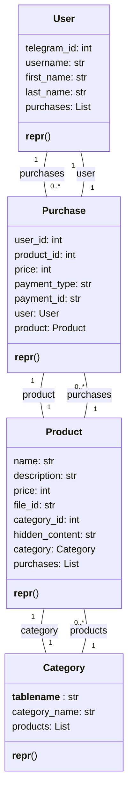

## ИНСТРУКЦИЯ:

Анализируй предоставленный код подробно и объясни его функциональность. Ответ должен включать три раздела:

1.  **<алгоритм>**: Опиши рабочий процесс в виде пошаговой блок-схемы, включая примеры для каждого логического блока, и проиллюстрируй поток данных между функциями, классами или методами.
2.  **<mermaid>**: Напиши код для диаграммы в формате `mermaid`, проанализируй и объясни все зависимости,
    которые импортируются при создании диаграммы.
    **ВАЖНО!** Убедитесь, что все имена переменных, используемые в диаграмме `mermaid`,
    имеют осмысленные и описательные имена. Имена переменных вроде `A`, `B`, `C`, и т.д., не допускаются!

    **Дополнительно**: Если в коде есть импорт `import header`, добавьте блок `mermaid` flowchart, объясняющий `header.py`:\
    ```mermaid\
    flowchart TD\
        Start --> Header[<code>header.py</code><br> Determine Project Root]\
    
        Header --> import[Import Global Settings: <br><code>from src import gs</code>] \
    ```

3.  **<объяснение>**: Предоставьте подробные объяснения:
    -   **Импорты**: Их назначение и взаимосвязь с другими пакетами `src.`.
    -   **Классы**: Их роль, атрибуты, методы и взаимодействие с другими компонентами проекта.
    -   **Функции**: Их аргументы, возвращаемые значения, назначение и примеры.
    -   **Переменные**: Их типы и использование.
    -   Выделите потенциальные ошибки или области для улучшения.

Дополнительно, постройте цепочку взаимосвязей с другими частями проекта (если применимо).

Это обеспечивает всесторонний и структурированный анализ кода.
## Формат ответа: `.md` (markdown)
**КОНЕЦ ИНСТРУКЦИИ**

## <алгоритм>

1.  **Импорт необходимых модулей**:
    *   Импортируются модули `List` из `typing` для определения типов списков.
    *   Импортируются `Mapped`, `mapped_column`, `relationship` из `sqlalchemy.orm` для работы с ORM.
    *   Импортируются `BigInteger`, `Text`, `ForeignKey` из `sqlalchemy` для определения типов столбцов в базе данных.
    *   Импортируется `Base` из `bot.dao.database` для создания базовой модели SQLAlchemy.

2.  **Определение класса `User`**:
    *   **Создание объекта** `User`:  `user = User(telegram_id=12345, username='test_user')`
    *   Определение атрибутов:
        *   `telegram_id`: уникальный идентификатор пользователя (пример: `12345`).
        *   `username`: имя пользователя (пример: `"test_user"`).
        *   `first_name`: имя пользователя (пример: `"John"`).
        *   `last_name`: фамилия пользователя (пример: `"Doe"`).
        *   `purchases`: список покупок пользователя (связь с классом `Purchase`).
            *Пример:* `user.purchases` вернет список объектов класса `Purchase` связанных с этим пользователем.
        *   метод `__repr__`: возвращает строковое представление объекта `User`.
    *   **Связь**: `User` имеет связь "один ко многим" с `Purchase` (один пользователь может иметь много покупок).
3.  **Определение класса `Category`**:
    *   **Создание объекта** `Category`:  `category = Category(category_name='Books')`
    *   Определение атрибутов:
        *   `category_name`: название категории (пример: `"Books"`).
        *   `products`: список продуктов в этой категории (связь с классом `Product`).
            *Пример:* `category.products` вернет список объектов класса `Product` связанных с этой категорией.
        *   метод `__repr__`: возвращает строковое представление объекта `Category`.
    *   **Связь**: `Category` имеет связь "один ко многим" с `Product` (одна категория может содержать много продуктов).

4.  **Определение класса `Product`**:
    *  **Создание объекта** `Product`:  `product = Product(name='The Hitchhiker\'s Guide', description='Science fiction comedy', price=100, category_id=1, hidden_content='Secret Content')`
    *   Определение атрибутов:
        *   `name`: название продукта (пример: `"The Hitchhiker's Guide"`).
        *   `description`: описание продукта (пример: `"Science fiction comedy"`).
        *   `price`: цена продукта (пример: `100`).
        *   `file_id`: идентификатор файла продукта, если есть (пример: `"file123"`).
        *   `category_id`: идентификатор категории, к которой относится продукт (связь с `Category`).
        *   `hidden_content`: скрытый контент продукта (пример: `"Secret Content"`).
        *   `category`: категория продукта (связь с классом `Category`).
        *   `purchases`: список покупок этого продукта (связь с классом `Purchase`).
            *Пример:* `product.purchases` вернет список объектов класса `Purchase` связанных с этим продуктом.
        *   метод `__repr__`: возвращает строковое представление объекта `Product`.
    *   **Связь**: `Product` имеет связь "один ко многим" с `Purchase` (один продукт может быть куплен много раз) и "многие к одному" с `Category` (много продуктов в одной категории).

5.  **Определение класса `Purchase`**:
    *   **Создание объекта** `Purchase`:  `purchase = Purchase(user_id=1, product_id=1, price=100, payment_type='card', payment_id='pay123')`
    *   Определение атрибутов:
        *   `user_id`: идентификатор пользователя, совершившего покупку (связь с `User`).
        *   `product_id`: идентификатор купленного продукта (связь с `Product`).
        *   `price`: цена покупки (пример: `100`).
        *   `payment_type`: тип оплаты (пример: `"card"`).
        *   `payment_id`: уникальный идентификатор платежа (пример: `"pay123"`).
        *    `user`: покупатель (связь с классом `User`).
        *   `product`: купленный продукт (связь с классом `Product`).
            *Пример:* `purchase.product` вернет объект класса `Product`, который был куплен в рамках этой покупки.
        *   метод `__repr__`: возвращает строковое представление объекта `Purchase`.
    *   **Связь**: `Purchase` имеет связь "многие к одному" с `User` и "многие к одному" с `Product` (много покупок может быть от одного пользователя и много покупок одного продукта).

## <mermaid>



### Анализ зависимостей

*   **`User`**:
    *   Имеет отношение "один ко многим" с `Purchase` через атрибут `purchases`.
    *   Атрибуты `telegram_id`, `username`, `first_name`, `last_name` представляют данные пользователя.
*   **`Category`**:
    *   Имеет отношение "один ко многим" с `Product` через атрибут `products`.
    *   Атрибут `category_name` представляет название категории.
*   **`Product`**:
    *   Имеет отношение "многие к одному" с `Category` через атрибут `category`.
    *   Имеет отношение "один ко многим" с `Purchase` через атрибут `purchases`.
    *   Атрибуты `name`, `description`, `price`, `file_id`, `category_id`, `hidden_content` представляют данные продукта.
*   **`Purchase`**:
    *   Имеет отношение "многие к одному" с `User` через атрибут `user`.
    *   Имеет отношение "многие к одному" с `Product` через атрибут `product`.
    *   Атрибуты `user_id`, `product_id`, `price`, `payment_type`, `payment_id` представляют данные о покупке.

## <объяснение>

### Импорты:

*   `from typing import List`: `List` используется для аннотации типов переменных, указывая, что переменная является списком, например, `purchases: Mapped[List['Purchase']]`.
*   `from sqlalchemy.orm import Mapped, mapped_column, relationship`:
    *   `Mapped` используется для определения типа колонки в таблице.
    *   `mapped_column` используется для определения колонки в таблице и ее типа.
    *   `relationship` используется для определения связей между таблицами.
*   `from sqlalchemy import BigInteger, Text, ForeignKey`:
    *   `BigInteger` используется для определения типа колонки, как большого целого числа.
    *   `Text` используется для определения типа колонки, как текста.
    *   `ForeignKey` используется для определения внешнего ключа.
*   `from bot.dao.database import Base`: `Base` это базовый класс для моделей SQLAlchemy. Он используется для декларативного создания классов таблиц.

### Классы:

1.  **`User(Base)`**:
    *   **Роль**: Представляет пользователя в системе, с основными данными и списком покупок.
    *   **Атрибуты**:
        *   `telegram_id: Mapped[int]` - уникальный идентификатор пользователя Telegram.
        *   `username: Mapped[str | None]` - имя пользователя.
        *   `first_name: Mapped[str | None]` - имя пользователя.
        *   `last_name: Mapped[str | None]` - фамилия пользователя.
        *   `purchases: Mapped[List['Purchase']]` - список покупок пользователя, связь с классом `Purchase`.
    *   **Методы**:
        *   `__repr__(self)`: Возвращает строковое представление объекта User, облегчая отладку.
    *   **Взаимодействие**:
        *   Связан с классом `Purchase` через отношение `relationship`.

2.  **`Category(Base)`**:
    *   **Роль**: Представляет категорию продуктов.
    *   **Атрибуты**:
        *   `__tablename__ = 'categories'`: Задает имя таблицы в базе данных.
        *   `category_name: Mapped[str]` - название категории.
        *   `products: Mapped[List["Product"]]` - список продуктов в этой категории, связь с классом `Product`.
    *   **Методы**:
        *   `__repr__(self)`: Возвращает строковое представление объекта `Category`.
    *   **Взаимодействие**:
        *   Связан с классом `Product` через отношение `relationship`.

3.  **`Product(Base)`**:
    *   **Роль**: Представляет продукт в системе, включая его описание, цену и категорию.
    *   **Атрибуты**:
        *   `name: Mapped[str]` - название продукта.
        *   `description: Mapped[str]` - описание продукта.
        *   `price: Mapped[int]` - цена продукта.
        *   `file_id: Mapped[str | None]` - идентификатор файла продукта.
        *   `category_id: Mapped[int]` - идентификатор категории, к которой относится продукт.
        *   `hidden_content: Mapped[str]` - скрытый контент продукта.
        *    `category: Mapped["Category"]` - категория продукта, связь с классом `Category`.
        *   `purchases: Mapped[List['Purchase']]` - список покупок этого продукта, связь с классом `Purchase`.
    *   **Методы**:
        *   `__repr__(self)`: Возвращает строковое представление объекта `Product`.
    *   **Взаимодействие**:
        *   Связан с классом `Category` через отношение `relationship`.
        *   Связан с классом `Purchase` через отношение `relationship`.

4.  **`Purchase(Base)`**:
    *   **Роль**: Представляет покупку, связывает пользователя и продукт, а также хранит информацию о платеже.
    *   **Атрибуты**:
        *   `user_id: Mapped[int]` - идентификатор пользователя, совершившего покупку.
        *   `product_id: Mapped[int]` - идентификатор купленного продукта.
        *   `price: Mapped[int]` - цена покупки.
        *   `payment_type: Mapped[str]` - тип оплаты.
        *   `payment_id: Mapped[str]` - уникальный идентификатор платежа.
        *   `user: Mapped["User"]` - покупатель, связь с классом `User`.
        *   `product: Mapped["Product"]` - купленный продукт, связь с классом `Product`.
    *   **Методы**:
        *   `__repr__(self)`: Возвращает строковое представление объекта `Purchase`.
    *   **Взаимодействие**:
        *   Связан с классом `User` через отношение `relationship`.
        *   Связан с классом `Product` через отношение `relationship`.

### Функции:

*   `__repr__`: Этот метод присутствует во всех классах. Его цель - предоставить удобное строковое представление объекта, что полезно при отладке и логировании.

### Переменные:

*   Атрибуты классов: Все атрибуты классов объявлены с использованием `Mapped`, что делает их столбцами в соответствующих таблицах базы данных.
*   Связи: Атрибуты, которые используют `relationship`, представляют связи между таблицами (например, `purchases` в `User` или `user` в `Purchase`).
*   Типы: Используются типы из `typing` (`List`) и SQLAlchemy (`BigInteger`, `Text`, `ForeignKey`), что обеспечивает корректное определение типов и структуры данных.

### Потенциальные ошибки и улучшения:

*   **Не хватает валидации**: Нет валидации данных, вводимых в поля моделей. Например, цена должна быть неотрицательным числом. Необходимо добавить валидацию данных на уровне модели.
*   **Нет проверок на null**: Некоторые поля (например, `file_id`) могут быть `None`. В зависимости от логики приложения, это может быть проблемой. Необходимо проверять возможность `None` и обрабатывать их.
*   **Нет обработки исключений**: Код не включает обработку исключений при взаимодействии с базой данных. Необходимо добавить блоки `try-except` для отлова ошибок при выполнении запросов.
*   **Улучшение именования**: Некоторые имена переменных могут быть более описательными.
*   **Добавление комментариев**: Необходимо добавить больше комментариев, чтобы код был понятнее другим разработчикам.
*   **Использование enum для `payment_type`**:  Вместо использования `str` для `payment_type` лучше использовать `enum`, чтобы ограничить набор возможных значений.

### Взаимосвязи с другими частями проекта:

*   **`bot.dao.database`**: Этот модуль содержит класс `Base`, который является основой для всех моделей. Он также отвечает за конфигурацию и подключение к базе данных.
*   **Другие модули**: Эти модели используются в других частях проекта, например, в модулях, отвечающих за работу с ботом (запросы от пользователей, обработка покупок, и т.д.).

**Цепочка взаимосвязей**:

1.  Пользователь взаимодействует с Telegram ботом.
2.  Бот отправляет запросы к базе данных используя ORM (SQLAlchemy).
3.  Модели данных (определенные в этом файле) используются для представления данных в базе данных.
4.  Результаты запросов (данные) возвращаются боту и пользователю.

Этот файл определяет структуру таблиц базы данных и обеспечивает возможность взаимодействия с данными через ORM,  являясь ключевой частью проекта.