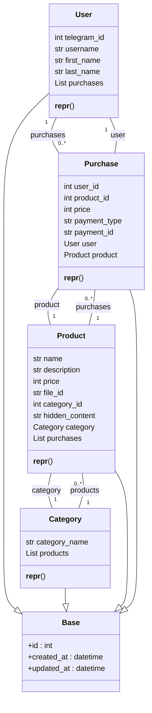

## <алгоритм>

1. **Импорт библиотек**:
   - Импортируются необходимые модули для работы с типами данных (`typing`), ORM SQLAlchemy (`sqlalchemy.orm`, `sqlalchemy`), и базой данных (`bot.dao.database`).
   - `List` используется для аннотации типов списков.
   - `Mapped`, `mapped_column`, и `relationship` из `sqlalchemy.orm` используются для определения структуры таблиц базы данных и связей между ними.
   - `BigInteger`, `Text`, `ForeignKey`, `text` из `sqlalchemy` используются для определения типов данных колонок таблиц.
   - `Base` из `bot.dao.database` представляет базовый класс для моделей SQLAlchemy.

2. **Класс User**:
   - Создается класс `User`, наследующий от `Base`, представляющий таблицу пользователей.
     -  Пример: `user = User(telegram_id=12345, username='test_user', first_name='Test', last_name='User')`.
   - Определяются поля (атрибуты):
     - `telegram_id`: Уникальный идентификатор пользователя в Telegram (`BigInteger`), не может быть `NULL`.
     - `username`, `first_name`, `last_name`: Имя пользователя, имя и фамилия пользователя (могут быть `NULL`).
     - `purchases`: Связь с классом `Purchase` (список покупок пользователя), с использованием обратной связи `back_populates` и каскадного удаления.
   -  Метод `__repr__`: Возвращает строковое представление объекта пользователя для отладки, например: `<User(id=1, telegram_id=12345, username='test_user')>`.

3. **Класс Category**:
   - Создается класс `Category`, наследующий от `Base`, представляющий таблицу категорий товаров.
   -  Пример: `category = Category(category_name='Электроника')`.
   - Определяются поля (атрибуты):
      - `category_name`: Название категории (`Text`), не может быть `NULL`.
      - `products`: Связь с классом `Product` (список продуктов в категории), с использованием обратной связи `back_populates` и каскадного удаления.
   -  Метод `__repr__`: Возвращает строковое представление объекта категории для отладки, например: `<Category(id=1, name='Электроника')>`.

4. **Класс Product**:
   - Создается класс `Product`, наследующий от `Base`, представляющий таблицу товаров.
     -  Пример: `product = Product(name='Смартфон', description='Описание смартфона', price=1000, hidden_content='секретная информация', category_id=1)`.
   - Определяются поля (атрибуты):
     - `name`: Название товара (`Text`).
     - `description`: Описание товара (`Text`).
     - `price`: Цена товара (`int`).
     - `file_id`: Идентификатор файла (например, картинки) (`Text`), может быть `NULL`.
      - `category_id`: Внешний ключ, ссылающийся на `id` из таблицы `categories` (`ForeignKey`).
      - `hidden_content`: Скрытый контент (`Text`).
      - `category`: Связь с классом `Category` (категория товара), с использованием обратной связи `back_populates`.
      - `purchases`: Связь с классом `Purchase` (список покупок товара), с использованием обратной связи `back_populates` и каскадного удаления.
   -  Метод `__repr__`: Возвращает строковое представление объекта продукта для отладки, например: `<Product(id=1, name='Смартфон', price=1000)>`.

5. **Класс Purchase**:
   - Создается класс `Purchase`, наследующий от `Base`, представляющий таблицу покупок.
     -  Пример: `purchase = Purchase(user_id=1, product_id=1, price=1000, payment_type='card', payment_id='123456')`.
   - Определяются поля (атрибуты):
     - `user_id`: Внешний ключ, ссылающийся на `id` из таблицы `users` (`ForeignKey`).
     - `product_id`: Внешний ключ, ссылающийся на `id` из таблицы `products` (`ForeignKey`).
     - `price`: Цена покупки (`int`).
     - `payment_type`: Тип оплаты (`str`).
     - `payment_id`: Уникальный идентификатор платежа (`str`), должен быть уникальным.
     - `user`: Связь с классом `User` (пользователь, совершивший покупку), с использованием обратной связи `back_populates`.
     - `product`: Связь с классом `Product` (купленный продукт), с использованием обратной связи `back_populates`.
   - Метод `__repr__`: Возвращает строковое представление объекта покупки для отладки, например: `<Purchase(id=1, user_id=1, product_id=1, date=2024-10-26 15:30:00)>`.

## <mermaid>

### Анализ зависимостей `mermaid`:
- **`User`**, **`Category`**, **`Product`**, **`Purchase`** - это классы, которые наследуют от базового класса **`Base`**, который содержит общие поля `id`, `created_at` и `updated_at`.
- **`User`** имеет связь "один-ко-многим" с **`Purchase`** (один пользователь может иметь много покупок).
- **`Category`** имеет связь "один-ко-многим" с **`Product`** (одна категория может содержать много продуктов).
- **`Product`** имеет связь "один-ко-многим" с **`Purchase`** (один продукт может быть куплен много раз).
- **`Purchase`** имеет связи "многие-к-одному" с **`User`** и **`Product`** (каждая покупка связана с одним пользователем и одним продуктом).
- **`Product`** имеет связь "многие-к-одному" с **`Category`** (каждый продукт принадлежит к одной категории).
-  Связи описаны с помощью стрелок. Символ `*` означает "много", `1` означает "один", `0..*` означает "ноль или более".

## <объяснение>

### Импорты:
-   `from typing import List`:
    -   `List` используется для определения типа списков в аннотациях типов, например, `List[Product]` означает список объектов типа `Product`. Это помогает улучшить читаемость и надежность кода, позволяя статическим анализаторам кода проверять типы.
-   `from sqlalchemy.orm import Mapped, mapped_column, relationship`:
    -   `Mapped`, `mapped_column` и `relationship` являются частью SQLAlchemy ORM (Object-Relational Mapper) и используются для связывания Python-классов с таблицами базы данных.
        -   `Mapped` используется для аннотации типа колонки в таблице базы данных.
        -  `mapped_column` используется для определения колонки в таблице, с указанием типа данных и ограничений.
        -   `relationship` используется для определения отношений между таблицами (например, "один-ко-многим", "многие-ко-многим").
-   `from sqlalchemy import BigInteger, Text, ForeignKey, text`:
    -   Импортирует типы данных и ограничения из SQLAlchemy для определения колонок в базе данных.
        -  `BigInteger` - целочисленный тип данных большого размера.
        -  `Text` - текстовый тип данных.
        - `ForeignKey` - используется для определения внешних ключей, обеспечивающих целостность данных при связывании таблиц.
        -   `text` - позволяет вставлять SQL-выражения.
-   `from bot.dao.database import Base`:
    -   Импортирует базовый класс `Base` из файла `bot.dao.database`, который используется в качестве родительского для всех моделей SQLAlchemy. Это устанавливает соединение с базой данных и позволяет создавать таблицы.

### Классы:
-   **`User(Base)`**:
    -   Роль: Представляет таблицу пользователей в базе данных.
    -   Атрибуты:
        -   `telegram_id` (`BigInteger`): Уникальный ID пользователя в Telegram.
        -   `username` (`str | None`): Имя пользователя.
        -   `first_name` (`str | None`): Имя.
        -   `last_name` (`str | None`): Фамилия.
        -   `purchases` (`List[Purchase]`): Список покупок пользователя (связь с таблицей `purchases`).
    -   Методы:
        -   `__repr__`: Возвращает строковое представление объекта для отладки.
    -   Взаимодействие: Связан с классом `Purchase` через отношение "один-ко-многим" (один пользователь может иметь много покупок).

-   **`Category(Base)`**:
    -   Роль: Представляет таблицу категорий товаров.
    -   Атрибуты:
        -   `category_name` (`Text`): Название категории.
        -   `products` (`List[Product]`): Список товаров в категории (связь с таблицей `products`).
    -   Методы:
        -   `__repr__`: Возвращает строковое представление объекта для отладки.
    -   Взаимодействие: Связан с классом `Product` через отношение "один-ко-многим" (одна категория может содержать много товаров).

-   **`Product(Base)`**:
    -   Роль: Представляет таблицу товаров.
    -   Атрибуты:
        -   `name` (`Text`): Название товара.
        -   `description` (`Text`): Описание товара.
        -   `price` (`int`): Цена товара.
        -   `file_id` (`str | None`): Идентификатор файла (например, картинки).
        -    `category_id` (`int`): Внешний ключ, ссылающийся на id категории в таблице `categories`.
        -   `hidden_content` (`Text`): Скрытое содержимое товара.
        -    `category`(`Category`): категория товара (связь с таблицей `categories`).
        -   `purchases` (`List[Purchase]`): Список покупок товара (связь с таблицей `purchases`).
    -   Методы:
        -   `__repr__`: Возвращает строковое представление объекта для отладки.
    -   Взаимодействие:
        -   Связан с классом `Category` через отношение "многие-к-одному" (каждый товар принадлежит одной категории).
        -   Связан с классом `Purchase` через отношение "один-ко-многим" (один товар может быть куплен много раз).

-   **`Purchase(Base)`**:
    -   Роль: Представляет таблицу покупок.
    -   Атрибуты:
        -   `user_id` (`int`): Внешний ключ, ссылающийся на id пользователя в таблице `users`.
        -   `product_id` (`int`): Внешний ключ, ссылающийся на id товара в таблице `products`.
        -   `price` (`int`): Цена покупки.
        -   `payment_type` (`str`): Тип оплаты.
        -   `payment_id` (`str`): Уникальный идентификатор платежа.
        -    `user`(`User`): пользователь, совершивший покупку (связь с таблицей `users`).
        -    `product`(`Product`): купленный продукт (связь с таблицей `products`).
    -   Методы:
        -   `__repr__`: Возвращает строковое представление объекта для отладки.
    -   Взаимодействие:
        -   Связан с классом `User` через отношение "многие-к-одному" (каждая покупка совершена одним пользователем).
        -   Связан с классом `Product` через отношение "многие-к-одному" (каждая покупка относится к одному товару).

### Функции:
- `__repr__`:
   -   Аргументы: `self`.
   -   Возвращаемое значение: Строка, представляющая объект класса.
   -   Назначение: Используется для отладки, предоставляя человекочитаемое представление объектов классов.

### Переменные:
-   Все атрибуты классов являются переменными, представляющими поля таблиц базы данных.
-   Типы переменных определены с помощью аннотаций типов и SQLAlchemy.

### Потенциальные ошибки и области для улучшения:
-   **Обработка `NULL` значений:** В коде используются `str | None`, но не везде обрабатывается возможность отсутствия данных. Может потребоваться дополнительная проверка.
-   **Валидация данных:** Код не включает валидацию данных на уровне модели. Валидацию можно добавить с помощью SQLAlchemy Events.
-   **Индексы:** Для повышения производительности можно добавить индексы для часто используемых колонок, например, `telegram_id` в таблице `User`.
-  **Оптимизация запросов:** При большом количестве данных и частых запросах к базе данных, запросы можно оптимизировать.
-  **Использование enum:** `payment_type` можно ограничить, используя перечисление (enum) для задания конкретных типов оплаты.

### Взаимосвязь с другими частями проекта:
-  Модуль `bot.dao.database` отвечает за настройку подключения к базе данных и предоставляет базовый класс `Base` для создания моделей.
-   Модели из `models.py` используются в других частях проекта для работы с данными, например, в бизнес-логике бота и обработчиках запросов.
-   Файл `bot.dao.database.py` необходим для правильной работы данного модуля и для установления соединения с базой данных.

Таким образом, данный код определяет структуру базы данных для хранения информации о пользователях, категориях товаров, самих товарах и покупках. Он устанавливает связи между этими сущностями и предоставляет базовые модели для работы с данными через SQLAlchemy ORM.