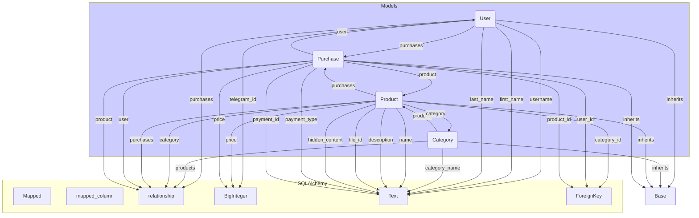

## <алгоритм>

1. **Импорт библиотек и модулей:**
   - Импортируются необходимые модули из `typing` для определения типов, из `sqlalchemy` для работы с базой данных, и `bot.dao.database` для получения базового класса для моделей.
   - `from typing import List`: Импортируется `List` для аннотации типов списков.
   - `from sqlalchemy.orm import Mapped, mapped_column, relationship`: Импортируются инструменты SQLAlchemy ORM для определения маппинга между классами Python и таблицами базы данных.
   - `from sqlalchemy import BigInteger, Text, ForeignKey, text`: Импортируются типы данных и ForeignKey из SQLAlchemy для определения колонок в таблицах базы данных.
   - `from bot.dao.database import Base`: Импортируется базовый класс `Base` для создания таблиц SQLAlchemy.

2. **Определение модели `User`:**
   - **Создание класса `User`:** Наследует от `Base`.
   - **Атрибуты:**
     - `telegram_id`: Целое число (BigInteger), уникальное и обязательное, представляющее идентификатор пользователя в Telegram.
     - `username`: Строка (или `None`), представляющая имя пользователя в Telegram.
     - `first_name`: Строка (или `None`), представляющая имя пользователя.
     - `last_name`: Строка (или `None`), представляющая фамилию пользователя.
     - `purchases`: Список связанных объектов `Purchase` через `relationship`, определяющий обратную связь с таблицей `purchases`.
   - **Метод `__repr__`:** Возвращает строковое представление объекта `User` для удобства отладки.

   *Пример:*
    ```python
    user_example = User(telegram_id=12345, username="testuser", first_name="Test", last_name="User")
    print(user_example) # Output: <User(id=None, telegram_id=12345, username='testuser')>
    ```
3. **Определение модели `Category`:**
   - **Создание класса `Category`:** Наследует от `Base`.
   - **Атрибуты:**
     - `__tablename__ = 'categories'`: Задает имя таблицы в базе данных.
     - `category_name`: Строка (Text), обязательное поле, представляющее имя категории.
     - `products`: Список связанных объектов `Product` через `relationship`.
   - **Метод `__repr__`:** Возвращает строковое представление объекта `Category`.

   *Пример:*
    ```python
    category_example = Category(category_name="Electronics")
    print(category_example) # Output: <Category(id=None, name='Electronics')>
    ```

4. **Определение модели `Product`:**
   - **Создание класса `Product`:** Наследует от `Base`.
   - **Атрибуты:**
     - `name`: Строка (Text), представляющая имя продукта.
     - `description`: Строка (Text), представляющая описание продукта.
     - `price`: Целое число, представляющее цену продукта.
     - `file_id`: Строка (или `None`), представляющая идентификатор файла, связанного с продуктом.
     - `category_id`: Целое число, являющееся внешним ключом к таблице `categories`.
     - `hidden_content`: Строка (Text), представляющая скрытое содержимое продукта.
     - `category`: Связанный объект `Category` через `relationship`.
     - `purchases`: Список связанных объектов `Purchase` через `relationship`.
   - **Метод `__repr__`:** Возвращает строковое представление объекта `Product`.

   *Пример:*
    ```python
    product_example = Product(name="Laptop", description="Powerful laptop", price=1200, category_id=1, hidden_content="some hidden content")
    print(product_example) # Output: <Product(id=None, name='Laptop', price=1200)>
    ```
5. **Определение модели `Purchase`:**
   - **Создание класса `Purchase`:** Наследует от `Base`.
   - **Атрибуты:**
     - `user_id`: Целое число, являющееся внешним ключом к таблице `users`.
     - `product_id`: Целое число, являющееся внешним ключом к таблице `products`.
     - `price`: Целое число, представляющее цену покупки.
     - `payment_type`: Строка, представляющая тип оплаты.
     - `payment_id`: Строка, уникальный идентификатор оплаты.
     - `user`: Связанный объект `User` через `relationship`.
     - `product`: Связанный объект `Product` через `relationship`.
   - **Метод `__repr__`:** Возвращает строковое представление объекта `Purchase`.

    *Пример:*
    ```python
    purchase_example = Purchase(user_id=1, product_id=1, price=1200, payment_type="card", payment_id="unique_payment_id")
    print(purchase_example) # Output: <Purchase(id=None, user_id=1, product_id=1, date=None)>
    ```
   
## <mermaid>



## <объяснение>

### Импорты:
- `from typing import List`:  `List` используется для аннотации типов данных, указывая, что переменная является списком. Это улучшает читаемость и позволяет статическим анализаторам кода находить ошибки типов.
- `from sqlalchemy.orm import Mapped, mapped_column, relationship`: 
    -   `Mapped` - используется для определения типов столбцов в ORM, для статической типизации.
    -   `mapped_column` - используется для определения столбцов таблицы базы данных в ORM, маппинга с классами python.
    -   `relationship` - используется для определения связей между таблицами базы данных (отношение "один ко многим" или "многие ко многим").
- `from sqlalchemy import BigInteger, Text, ForeignKey, text`:
    - `BigInteger` - представляет тип данных для целых чисел большой разрядности в базе данных.
    - `Text` - представляет тип данных для текстовых строк в базе данных.
    - `ForeignKey` - используется для определения внешних ключей между таблицами базы данных.
- `from bot.dao.database import Base`: 
    - `Base` - это базовый класс из файла `bot.dao.database`, от которого наследуются все модели базы данных. Он обеспечивает единую конфигурацию для работы с SQLAlchemy ORM.

### Классы:
- **`User(Base)`:**
    - **Роль:** Представляет пользователя в системе.
    - **Атрибуты:**
        - `telegram_id`: Уникальный идентификатор пользователя в Telegram (целое число).
        - `username`: Имя пользователя в Telegram (строка или `None`).
        - `first_name`: Имя пользователя (строка или `None`).
        - `last_name`: Фамилия пользователя (строка или `None`).
        - `purchases`: Список покупок пользователя. Используется `relationship`, чтобы связать пользователя с его покупками.
    - **Методы:**
        - `__repr__`: Возвращает строковое представление объекта для удобства отладки.
    - **Взаимодействие:**
        - Связан с таблицей `purchases` через отношение "один ко многим" (один пользователь может иметь много покупок).

- **`Category(Base)`:**
    - **Роль:** Представляет категорию товаров.
    - **Атрибуты:**
        - `__tablename__ = 'categories'`: Имя таблицы в БД.
        - `category_name`: Название категории (строка).
        - `products`: Список товаров в этой категории. Используется `relationship`, чтобы связать категорию с ее продуктами.
    - **Методы:**
        - `__repr__`: Возвращает строковое представление объекта.
    - **Взаимодействие:**
        - Связан с таблицей `products` через отношение "один ко многим" (одна категория может иметь много продуктов).

- **`Product(Base)`:**
    - **Роль:** Представляет товар.
    - **Атрибуты:**
        - `name`: Название товара (строка).
        - `description`: Описание товара (строка).
        - `price`: Цена товара (целое число).
        - `file_id`: Идентификатор файла, связанного с товаром (строка или `None`).
        - `category_id`: Идентификатор категории, к которой принадлежит товар (внешний ключ к таблице `categories`).
        - `hidden_content`: Скрытое содержимое товара (строка).
        - `category`: Категория товара. Используется `relationship`, чтобы связать товар с его категорией.
        - `purchases`: Список покупок, в которых участвовал этот товар.
    - **Методы:**
        - `__repr__`: Возвращает строковое представление объекта.
    - **Взаимодействие:**
        - Связан с таблицей `categories` через отношение "многие к одному" (много товаров может принадлежать одной категории).
        - Связан с таблицей `purchases` через отношение "один ко многим" (один продукт может быть в разных покупках).

- **`Purchase(Base)`:**
    - **Роль:** Представляет покупку.
    - **Атрибуты:**
        - `user_id`: Идентификатор пользователя, совершившего покупку (внешний ключ к таблице `users`).
        - `product_id`: Идентификатор продукта, который был куплен (внешний ключ к таблице `products`).
        - `price`: Цена покупки (целое число).
        - `payment_type`: Тип оплаты (строка).
        - `payment_id`: Уникальный идентификатор платежа (строка).
        - `user`: Пользователь, совершивший покупку. Используется `relationship`, чтобы связать покупку с пользователем.
        - `product`: Купленный товар. Используется `relationship`, чтобы связать покупку с товаром.
    - **Методы:**
        - `__repr__`: Возвращает строковое представление объекта.
    - **Взаимодействие:**
        - Связан с таблицей `users` через отношение "многие к одному" (много покупок может принадлежать одному пользователю).
        - Связан с таблицей `products` через отношение "многие к одному" (много покупок может быть для одного продукта).

### Функции:
- В данном коде функции явно не определены, но есть методы `__repr__` в каждом классе, которые отвечают за строковое представление объектов классов.

### Переменные:
- Все атрибуты классов являются переменными, которые хранят данные.
- Атрибуты, объявленные с `Mapped`, маппятся на столбцы базы данных.

### Возможные улучшения и потенциальные ошибки:
- **Обработка `None`**: В полях, где допускается `None` (например, `username`, `first_name`, `last_name` у `User`), стоит предусмотреть логику обработки `None` при работе с этими данными, особенно при отображении пользователю или использовании в логике приложения.
- **Валидация**: Добавление валидации данных перед записью в базу данных (например, проверка корректности формата `telegram_id`, допустимости значения `payment_type`).
- **Индексы**: Для полей, по которым будет вестись поиск, стоит добавить индексы в базу данных, например, `telegram_id` в таблице `User`, чтобы ускорить поиск.
- **Отношение "многие ко многим"**: Если необходимо установить связь "многие ко многим" между `User` и `Product` напрямую, потребуется промежуточная таблица и соответствующее определение `relationship` с использованием `secondary`.
- **Константы:** Желательно использовать константы для строковых значений, например, `payment_type` и других, для уменьшения дублирования кода и облегчения его сопровождения.

### Взаимосвязи с другими частями проекта:

- Файл `models.py` является частью слоя Data Access Object (DAO) и напрямую взаимодействует с базой данных через SQLAlchemy.
- Эти модели используются в других частях проекта для выполнения операций с данными:
    - `bot.dao.database`: Обеспечивает конфигурацию базы данных и базовый класс `Base` для моделей.
    - Другие модули, которые используют эти модели, например, для обработки запросов пользователей, создания покупок и т.д.

Этот код представляет собой важную часть проекта, отвечающую за организацию и хранение данных в базе. Приведенный анализ помогает понять структуру и функциональность кода, а также выявить потенциальные области для улучшения.