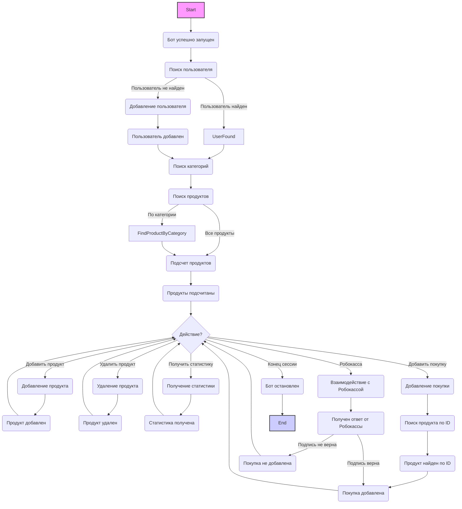

## Анализ кода лог-файла

### <алгоритм>

Данный лог-файл содержит последовательность событий, зарегистрированных во время работы Telegram-бота, который взаимодействует с базой данных. Основные операции, которые можно выделить:

1.  **Запуск бота**:
    -   `INFO | Бот успешно запущен.` - Бот успешно начинает свою работу.
    
2.  **Поиск пользователя (User)**:
    -   `INFO | Поиск одной записи User по фильтрам: {'telegram_id': <telegram_id>}` - Выполняется поиск пользователя в БД по telegram_id.
    -   `INFO | Запись найдена по фильтрам: {'telegram_id': <telegram_id>}` - Пользователь найден.
    -   `INFO | Запись не найдена по фильтрам: {'telegram_id': <telegram_id>}` - Пользователь не найден.
    
    *   Пример:
        *   `INFO | Поиск одной записи User по фильтрам: {'telegram_id': 5127841744}`
        *   `INFO | Запись найдена по фильтрам: {'telegram_id': 5127841744}`
        *   `INFO | Запись не найдена по фильтрам: {'telegram_id': 5321351707}`
        
3.  **Добавление пользователя (User)**:
    -  `INFO | Добавление записи User с параметрами: {'telegram_id': <telegram_id>, 'username': <username>, 'first_name': <first_name>, 'last_name': <last_name>}` - В БД добавляется новый пользователь.
    -  `INFO | Запись User успешно добавлена.` - Запись пользователя успешно добавлена в БД.
    
    *   Пример:
        *   `INFO | Добавление записи User с параметрами: {'telegram_id': 5127841744, 'username': 'yakvenalexx', 'first_name': 'Alexey', 'last_name': 'Yakovenko'}`
        *   `INFO | Запись User успешно добавлена.`

4.  **Поиск категории (Category)**:
    -  `INFO | Поиск всех записей Category по фильтрам: {}` - Поиск всех категорий.
    - `INFO | Найдено 6 записей.` - Найдено 6 категорий.
    
    *   Пример:
        *   `INFO | Поиск всех записей Category по фильтрам: {}`
        *   `INFO | Найдено 6 записей.`

5.  **Поиск продукта (Product)**:
   -  `INFO | Подсчет количества записей Product по фильтру: {}` -  Подсчет всех продуктов.
   -   `INFO | Найдено 0 записей.` - Не найдено продуктов.
   -   `INFO | Найдено 1 записей.` - Найден один продукт.
    - `INFO | Поиск всех записей Product по фильтрам: {'category_id': <category_id>}` - Поиск всех продуктов по категории.
    -   `INFO | Найдено 2 записей.` -  Найдено 2 продукта.
    -  `INFO | Поиск Product с ID: <id>` -  Поиск продукта по ID.
    - `INFO | Запись с ID <id> найдена.` - Продукт найден.
   
   *   Примеры:
      *    `INFO | Подсчет количества записей Product по фильтру: {}`
      *    `INFO | Найдено 0 записей.`
      *   `INFO | Поиск всех записей Product по фильтрам: {'category_id': 2}`
      *   `INFO | Найдено 2 записей.`
      *   `INFO | Поиск Product с ID: 2`
      *   `INFO | Запись с ID 2 найдена.`

6. **Добавление продукта (Product)**:
    -   `INFO | Добавление записи Product с параметрами: {'name': <name>, 'description': <description>, 'price': <price>, 'category_id': <category_id>, 'file_id': <file_id>, 'hidden_content': <hidden_content>}` - В БД добавляется новый продукт.
    -   `INFO | Запись Product успешно добавлена.` - Запись продукта успешно добавлена в БД.
    
    *   Пример:
        *   `INFO | Добавление записи Product с параметрами: {'name': 'Новый товар с файлом', 'description': 'Это товар с файлом для примера', 'price': 234, 'category_id': 2, 'file_id': 'BQACAgIAAxkBAAPWZ2VpdNHxkQVGmnlOD_RRH62b8K0AAs5eAAIf-ylLTIZ6jB_PM0w2BA', 'hidden_content': 'Тут демка контента с <b>форматированием</b>'}`
        *   `INFO | Запись Product успешно добавлена.`
       
7.  **Удаление продукта (Product)**:
    -   `INFO | Удаление записей Product по фильтру: {'id': <id>}` - Продукт удаляется из БД.
    -   `INFO | Удалено 1 записей.` - Запись успешно удалена.
    
    *   Пример:
        *   `INFO | Удаление записей Product по фильтру: {'id': 1}`
        *   `INFO | Удалено 1 записей.`
        
8.  **Получение статистики**:
    - `INFO | Статистика успешно получена: {'total_users': <total_users>, 'new_today': <new_today>, 'new_week': <new_week>, 'new_month': <new_month>}` - Получена статистика по пользователям.
    
   *   Пример:
        *  `INFO | Статистика успешно получена: {'total_users': 2, 'new_today': 2, 'new_week': 2, 'new_month': 2}`
        
9. **Добавление покупки (Purchase)**:
   - `INFO | Добавление записи Purchase с параметрами: {'user_id': <user_id>, 'payment_id': <payment_id>, 'price': <price>, 'product_id': <product_id>, 'payment_type': <payment_type>}` - Добавляется запись о покупке.
   - `INFO | Запись Purchase успешно добавлена.` - Запись покупки успешно добавлена.

   *  Примеры:
       *   `INFO | Добавление записи Purchase с параметрами: {'user_id': 1, 'payment_id': '7575758855_5127841744_473003_7450572901436222140', 'price': 290, 'product_id': 2}`
       *    `INFO | Запись Purchase успешно добавлена.`
       *  `INFO | Добавление записи Purchase с параметрами: {'user_id': 1, 'payment_id': 'stxRozTq6efvIyix5qGuCzjxCIfH4A1G6I0xgS2gqfc52VNtKnObfmx0-wl23FND_zB2SCLamNZ5TWMRKYGt90OAgOKNUewuwtx0YYdEmJGUEI', 'price': 10, 'product_id': 6, 'payment_type': 'stars'}`
        * `INFO | Запись Purchase успешно добавлена.`

10. **Взаимодействие с Робокассой**:
    - `SUCCESS | Получен ответ от Робокассы!` - Получен ответ от Робокассы.
    - `INFO | Ответ: { ... }` - Информация об ответе от Робокассы, включая статус подписи.
    - `WARNING | Неверная подпись для InvId: <id>` - Подпись не совпадает.
    -  `INFO | Успешная проверка подписи для InvId: <id>` - Подпись валидна.
    
    *   Примеры:
        *  `SUCCESS | Получен ответ от Робокассы!`
        * `INFO | Ответ: {'out_summ': '234', 'OutSum': '234', 'inv_id': '18', 'InvId': '18', 'crc': '33C2AB484969A846A689D6B01B7C0090', 'SignatureValue': '33C2AB484969A846A689D6B01B7C0090', 'PaymentMethod': 'BankCard', 'IncSum': '234', 'IncCurrLabel': 'BankCardPSR', 'IsTest': '1', 'EMail': '', 'Fee': '0.0', 'signature_valid': True, 'result': 'OK18'}`
        * `WARNING | Неверная подпись для InvId: 1`
        * `INFO | Успешная проверка подписи для InvId: 1`
        
11. **Остановка бота**:
     -   `ERROR | Бот остановлен!` - Бот завершает свою работу.
    
12. **Различные ошибки**:
    -   `ERROR | Ошибка при получении статистики:` - Ошибка при запросе статистики.
    -   `ERROR | Ошибка при добавлении записи:` - Ошибка при добавлении записи в БД.
    -   `ERROR | Ошибка при обработке вебхука:` - Ошибка при обработке вебхука.

### <mermaid>

**Описание диаграммы:**

1.  `Start`: Начало работы бота.
2.  `BotStart`:  Бот успешно запускается.
3.  `FindUser`:  Производится поиск пользователя в базе данных по `telegram_id`.
4.  `UserFound`:  Пользователь найден в базе данных.
5. `AddUser`: Пользователь не найден, происходит добавление нового пользователя в базу данных.
6. `UserAdded`: Пользователь успешно добавлен в базу данных.
7.  `FindCategory`: Поиск всех категорий в базе данных.
8. `FindProduct`: Поиск продуктов в базе данных. Может выполнятся как поиск всех продуктов так и поиск продуктов по категории.
9.  `CountProducts`:  Подсчет количества продуктов.
10. `ProductCounted`:  Продукты подсчитаны.
11. `CheckActions`: Проверка действия -  куда дальше пойдет бот.
12. `AddProduct`: Если выбранно добавление продукта, выполняется добавление нового продукта в базу данных.
13. `ProductAdded`: Продукт успешно добавлен в базу данных.
14. `DeleteProduct`: Если выбрано удаление продукта, выполняется удаление продукта из базы данных.
15.  `ProductDeleted`: Продукт успешно удален из базы данных.
16. `GetStatistics`: Если выбрано получить статистику, выполняется получения статистики.
17. `StatisticsRecieved`:  Статистика получена.
18. `AddPurchase`:  Если выбрано добавление покупки, выполняется добавление покупки в базу данных.
19. `ProductSearchById`:  Если добавлена покупка, выполняется поиск продукта по id.
20. `ProductFoundById`:  Продукт успешно найден по id.
21. `PurchaseAdded`:  Покупка успешно добавлена в базу данных.
22. `Robokassa`: Если выбрана оплата через Робокассу, происходит взаимодействие с Робокассой.
23. `RobokassaResponse`:  Получен ответ от Робокассы.
24. `PurchaseNotAdded`:  Покупка не добавлена, например, из-за ошибки подписи.
25. `BotStop`: Бот останавливает свою работу.
26.  `End`: Конец работы бота.

**Зависимости (импорты) в диаграмме:**

Диаграмма не показывает импорты напрямую, так как это не является кодом. Но логи показывают, что используются:

*   **База данных (предположительно SQLAlchemy):** Для поиска, добавления, удаления и подсчета записей в таблицах `User`, `Category`, `Product` и `Purchase`.
*  **`robokassa`:** Для обработки ответов от платежной системы.
*  **`yukassa`:** Для обработки ответов от платежной системы.
*  **`stars`:** Для обработки ответов от платежной системы.
*  **`Telegram`:** Для обработки вебхуков.

### <объяснение>

**Импорты:**

Из предоставленного лога импорты явно не видны, но из контекста логических операций можно сделать вывод, что используются:

*   **`sqlalchemy`**:  Библиотека Python для работы с базами данных. Используется для выполнения операций `SELECT`, `INSERT`, `DELETE` и `COUNT` в таблицах `users`, `categories`, `products` и `purchases`.
*   **`requests` или аналогичная библиотека:** Для запросов к API Робокассы.
*  **`telegram`** Библиотека для работы с Telegram bot API.

**Классы:**

Судя по логу, есть следующие классы, которые предположительно используются в коде:

*   **`User`:** Модель для представления пользователя Telegram. Имеет атрибуты:
    *   `telegram_id` (int): Уникальный идентификатор пользователя в Telegram.
    *   `username` (str, optional): Имя пользователя в Telegram.
    *   `first_name` (str): Имя пользователя.
    *  `last_name` (str, optional): Фамилия пользователя.
*   **`Category`:** Модель для представления категории товаров. Вероятно, имеет атрибуты, такие как `id` и `name`.
*   **`Product`:** Модель для представления товара. Имеет атрибуты:
    *   `name` (str): Название товара.
    *   `description` (str): Описание товара.
    *   `price` (int): Цена товара.
    *   `category_id` (int): Идентификатор категории товара.
    *   `file_id` (str, optional): Идентификатор файла в Telegram (если есть).
    *   `hidden_content` (str): Контент, который будет доступен после покупки.
*   **`Purchase`:** Модель для представления покупки. Имеет атрибуты:
    *   `user_id` (int): Идентификатор пользователя, совершившего покупку.
    *   `product_id` (int, optional): Идентификатор купленного товара.
    *   `payment_id` (str): Уникальный идентификатор платежа.
    *   `price` (int): Цена товара.
    *   `payment_type`: (str): Тип оплаты

**Функции:**

В логе не указаны конкретные функции, но на основе операций можно предположить наличие следующих:

*   **`find_user(telegram_id: int) -> User | None`:** Ищет пользователя по `telegram_id` и возвращает объект `User` или `None`, если пользователь не найден.
*   **`add_user(telegram_id: int, username: str, first_name: str, last_name: str) -> User`:** Создаёт нового пользователя и возвращает объект `User`.
*   **`find_all_categories() -> list[Category]`:** Ищет все категории и возвращает список объектов `Category`.
*   **`find_products_by_category(category_id: int) -> list[Product]`:** Ищет все продукты в определённой категории.
*   **`count_products() -> int`:**  Подсчитывает общее количество продуктов.
*    **`find_product_by_id(id: int) -> Product`** : Поиск продукта по id
*   **`add_product(name: str, description: str, price: int, category_id: int, file_id: str, hidden_content: str) -> Product`:** Добавляет новый продукт и возвращает объект `Product`.
*  **`delete_product(id: int) -> None`**: Удаляет продукт по id.
*   **`get_user_statistics() -> dict`:** Возвращает статистику пользователей.
*   **`add_purchase(user_id: int, product_id: int, payment_id: str, price: int) -> Purchase`:** Добавляет новую покупку.
*   **`check_robokassa_signature(data: dict) -> bool, dict`**: Проверяет подпись Robokassa и возвращает результат и данные ответа.

**Переменные:**

*   `telegram_id` (int): Уникальный идентификатор пользователя в Telegram.
*   `username` (str): Имя пользователя в Telegram.
*   `first_name` (str): Имя пользователя.
*   `last_name` (str, optional): Фамилия пользователя.
*   `category_id` (int): Идентификатор категории товара.
*   `name` (str): Название товара.
*   `description` (str): Описание товара.
*   `price` (int): Цена товара.
*   `file_id` (str): Идентификатор файла в Telegram (если есть).
*   `hidden_content` (str): Контент, который будет доступен после покупки.
*  `product_id` (int): Идентификатор товара.
*   `payment_id` (str): Уникальный идентификатор платежа.
*   `total_users` (int): Общее количество пользователей.
*   `new_today` (int): Количество новых пользователей за сегодня.
*   `new_week` (int): Количество новых пользователей за неделю.
*   `new_month` (int): Количество новых пользователей за месяц.
*   `payment_type` (str): Тип оплаты.

**Потенциальные ошибки и области для улучшения:**

*   **Ошибки SQL:** В логе присутствуют ошибки `sqlite3.OperationalError`, связанные с SQL-запросами. Это может быть вызвано некорректным формированием запросов или несоответствием типов данных.
*   **Ошибки Робокассы:** Присутствуют ошибки `WARNING | Неверная подпись для InvId: <id>`. Необходимо убедиться, что ключи для формирования подписи совпадают с настройками Робокассы.
*  **Ошибки Telegram API**: `Telegram server says - Bad Request: query is too old and response timeout expired or query ID is invalid`. Возникают из за того что callback query устаревает.
*  **Ошибка при обработке вебхука:** `product_kb() missing 1 required positional argument: 'stars_price'`. Это говорит о том, что в функцию `product_kb` не передается обязательный аргумент `stars_price`, и ее нужно передать при создании клавиатуры для callback query.
*   **Обработка ошибок:** Необходимо улучшить обработку ошибок, чтобы они не приводили к остановке бота. Например, можно использовать блоки `try-except` и логировать ошибки.
*   **Кеширование:** Поиск категорий выполняется часто. Можно добавить кеширование для оптимизации работы бота.
*  **Неполная обработка ошибок:** В логе встречаются ошибки, связанные с некорректной подписью Робокассы, и при этом не происходит корректного завершения транзакции. Необходимо улучшить обработку таких ситуаций, возможно, добавить повторную проверку или отклонение транзакции.
*   **Повторные запуски бота:** В логе видно много остановок и запусков бота, это может говорить о нестабильной работе или о наличии проблем с обработкой ошибок.
*  **`product_id` в таблице `purchase` является optional по дефолту,** но  в логике работы бота эта колонка является обязательной, поэтому необходимо убрать  `optional=True` и  по дефолту должно быть `product_id: Mapped[int] = mapped_column(ForeignKey("products.id"))` и не `product_id: Mapped[int] = mapped_column(ForeignKey("products.id"), nullable=True)`.

**Взаимосвязи с другими частями проекта:**

*   **База данных:** Бот использует базу данных для хранения информации о пользователях, категориях, товарах и покупках. Это центральный компонент, с которым взаимодействуют все остальные части бота.
*  **Платежные системы (`robokassa`, `yukassa`, `stars`)**: Бот интегрирован с платежными системами для обработки платежей.
*   **Telegram API:** Бот взаимодействует с Telegram API для получения сообщений от пользователей и отправки ответов.
*   **Конфигурация:** Возможно, бот использует файл конфигурации для хранения токена Telegram, ключей Робокассы и других настроек.

Этот подробный анализ предоставляет всестороннее понимание логики работы бота, его взаимосвязей с другими частями проекта и потенциальных областей для улучшения.