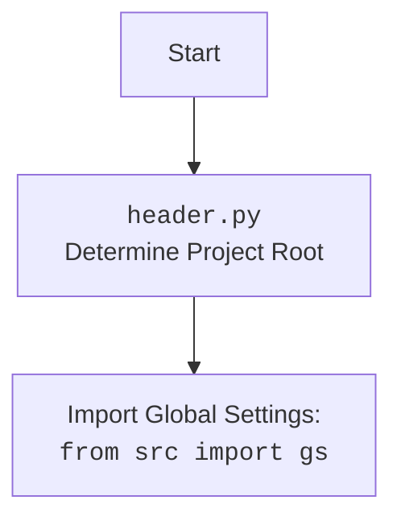

## <алгоритм>

1. **Инициализация:**
   - Запускается `main()`.
   - Регистрируются промежуточные обработчики (`register_middlewares()`) для управления базой данных (с фиксацией и без).
   - Регистрируются маршруты (`register_routers()`) для обработки различных типов запросов (каталог, пользователь, админ).
   - Создается веб-приложение (`create_app()`) на основе `aiohttp`.

2. **Создание Веб-Приложения `create_app()`:**
   - Создается экземпляр `web.Application()`.
   - Настраиваются маршруты:
     - `POST /{settings.BOT_TOKEN}`: Обработка вебхука от Telegram (`handle_webhook`).
     - `POST /robokassa/result/`: Обработка результата платежа Robokassa (`robokassa_result`).
     - `GET /robokassa/fail/`: Обработка неудачного платежа Robokassa (`robokassa_fail`).
     - `GET /`: Вывод главной страницы (`home_page`).
   - Приложение настраивается с использованием `setup_application`, подключая диспетчер (`dp`) и бота (`bot`).
   - Регистрируются функции `on_startup` и `on_shutdown` для обработки событий запуска и остановки приложения.

3. **Запуск приложения `main()`:**
   - Вызывается `create_app()` для создания и настройки веб-приложения.
   - Запускается веб-сервер `web.run_app()`, приложение начинает прослушивание запросов на указанных хосте и порте (`settings.SITE_HOST`, `settings.SITE_PORT`).

4. **`on_startup`:**
    - Вызывается при запуске приложения.
    - Устанавливает команды по умолчанию для бота (`set_default_commands`).
    - Устанавливает вебхук для бота на указанный URL (`settings.get_webhook_url`).
    - Отправляет сообщение об успешном запуске всем администраторам бота.
    - Логгирует сообщение об успешном запуске.

5. **`on_shutdown`:**
    - Вызывается при остановке приложения.
    - Отправляет сообщение об остановке всем администраторам бота.
    - Удаляет вебхук бота.
    - Закрывает сессию бота.
    - Логгирует сообщение об остановке.

6. **`set_default_commands`:**
   - Устанавливает команду `/start` для бота с описанием "Запустить бота".

7. **Обработка запросов:**
   - Когда Telegram отправляет обновление на вебхук, вызывается `handle_webhook` для обработки обновления.
   - При получении уведомления от Robokassa о результате оплаты вызывается `robokassa_result`.
   - При неудачной оплате Robokassa вызывается `robokassa_fail`.
   - При запросе на главную страницу сайта вызывается `home_page`.

### Поток данных
- Приложение запускается, `main()` -> `create_app()` -> `web.run_app()`
- Приложение стартует,  `web.run_app()` -> `on_startup()` -> `set_default_commands()` -> `bot.set_webhook()` -> `bot.send_message()`
- Получение вебхука от Telegram `handle_webhook`
- Получение результата оплаты от Robokassa `robokassa_result`
- Получение уведомления об ошибке оплаты от Robokassa `robokassa_fail`
- Запрос на главную страницу `home_page`
- Приложение останавливается `web.run_app()` -> `on_shutdown()` -> `bot.send_message()` -> `bot.delete_webhook()` -> `bot.session.close()`

## <mermaid>

```mermaid
flowchart TD
    subgraph Web Application
        Start(Start Application) --> CreateApp[create_app(): Create Web Application]
        CreateApp --> SetupRoutes[Setup Routes]
        SetupRoutes --> SetupApp[setup_application(app, dp, bot)]
        SetupApp --> StartupHandler[Register on_startup handler]
        SetupApp --> ShutdownHandler[Register on_shutdown handler]
        StartupHandler --> onStartup[on_startup(app)]
        ShutdownHandler --> onShutdown[on_shutdown(app)]
        CreateApp --> WebRunApp[web.run_app(app)]
    end

    subgraph Startup Handler
      onStartup --> SetCommands[set_default_commands()]
      SetCommands --> BotSetCommands[bot.set_my_commands()]
      onStartup --> BotSetWebhook[bot.set_webhook()]
      BotSetWebhook --> SendAdminMessage[send_message(admin_id, 'Бот запущен 🥳')]
      SendAdminMessage --> LogStartup[logger.info("Бот успешно запущен.")]
    end
  
    subgraph Shutdown Handler
        onShutdown --> SendShutdownMessage[send_message(admin_id, 'Бот остановлен. Почему? 😔')]
        SendShutdownMessage --> BotDeleteWebhook[bot.delete_webhook(drop_pending_updates=True)]
        BotDeleteWebhook --> BotCloseSession[bot.session.close()]
        BotCloseSession --> LogShutdown[logger.error("Бот остановлен!")]
    end

    subgraph Middleware Registration
      Start --> RegisterMiddlewares[register_middlewares()]
      RegisterMiddlewares --> RegisterDBMiddlewareWithoutCommit[dp.update.middleware.register(DatabaseMiddlewareWithoutCommit())]
      RegisterMiddlewares --> RegisterDBMiddlewareWithCommit[dp.update.middleware.register(DatabaseMiddlewareWithCommit())]
    end

   subgraph Router Registration
        Start --> RegisterRouters[register_routers()]
        RegisterRouters --> IncludeCatalogRouter[dp.include_router(catalog_router)]
        RegisterRouters --> IncludeUserRouter[dp.include_router(user_router)]
        RegisterRouters --> IncludeAdminRouter[dp.include_router(admin_router)]
    end

   subgraph Route Handling
        SetupRoutes --> HandleWebhook[POST /{settings.BOT_TOKEN}: handle_webhook]
        SetupRoutes --> RobokassaResult[POST /robokassa/result/: robokassa_result]
        SetupRoutes --> RobokassaFail[GET /robokassa/fail/: robokassa_fail]
        SetupRoutes --> HomePage[GET /: home_page]
   end
   
   style Start fill:#f9f,stroke:#333,stroke-width:2px
```

### Объяснение `mermaid`
1.  **Web Application:**
    -   `Start`: Начальная точка выполнения программы.
    -   `CreateApp`: Функция `create_app()`, создающая веб-приложение `aiohttp`.
    -   `SetupRoutes`: Настройка маршрутов для обработки HTTP запросов.
    -   `SetupApp`: Функция `setup_application()`, связывающая приложение с ботом и диспетчером.
    -   `StartupHandler`:  Регистрация обработчика события запуска приложения.
    -   `ShutdownHandler`: Регистрация обработчика события остановки приложения.
    -   `WebRunApp`: Запуск веб-приложения `web.run_app()`.
2.  **Startup Handler:**
    -   `onStartup`: Функция `on_startup()`, выполняемая при запуске приложения.
    -   `SetCommands`: Функция `set_default_commands()` для установки команд бота.
    -   `BotSetCommands`: Метод `bot.set_my_commands()` для установки команд.
    -   `BotSetWebhook`: Метод `bot.set_webhook()` для установки вебхука.
    -   `SendAdminMessage`: Метод `bot.send_message()` для отправки сообщения администраторам.
    -   `LogStartup`: Логирование сообщения об успешном запуске бота.
3.  **Shutdown Handler:**
    -   `onShutdown`: Функция `on_shutdown()`, выполняемая при остановке приложения.
    -   `SendShutdownMessage`: Метод `bot.send_message()` для отправки сообщения администраторам.
    -   `BotDeleteWebhook`: Метод `bot.delete_webhook()` для удаления вебхука.
    -   `BotCloseSession`: Метод `bot.session.close()` для закрытия сессии бота.
    -   `LogShutdown`: Логирование сообщения об остановке бота.
4. **Middleware Registration:**
    -   `RegisterMiddlewares`: Функция `register_middlewares()` для регистрации middleware.
    -   `RegisterDBMiddlewareWithoutCommit`: Регистрация middleware `DatabaseMiddlewareWithoutCommit()`.
    -   `RegisterDBMiddlewareWithCommit`: Регистрация middleware `DatabaseMiddlewareWithCommit()`.
5. **Router Registration:**
    -   `RegisterRouters`: Функция `register_routers()` для регистрации роутеров.
    -  `IncludeCatalogRouter`: Включение роутера каталога `catalog_router`.
    -   `IncludeUserRouter`: Включение роутера пользователя `user_router`.
    -   `IncludeAdminRouter`: Включение роутера администратора `admin_router`.
6. **Route Handling:**
    -   `HandleWebhook`: Обработчик вебхука от Telegram (`handle_webhook`).
    -   `RobokassaResult`: Обработчик результата от Robokassa (`robokassa_result`).
    -   `RobokassaFail`: Обработчик неудачи от Robokassa (`robokassa_fail`).
    -  `HomePage`: Обработчик запроса на главную страницу (`home_page`).
   
### mermaid `header.py`



## <объяснение>

### Импорты:
- `aiogram.webhook.aiohttp_server`:  Модуль для настройки вебхука aiogram на сервере aiohttp.
- `aiohttp.web`: Модуль aiohttp для создания веб-приложений.
- `aiogram.types`:  Модуль aiogram для работы с типами данных (команды, скоупы).
- `loguru`: Библиотека для логирования.
- `bot.app.app`: Модуль с основными функциями приложения (обработчики вебхука, Robokassa, главная страница).
- `bot.config`: Модуль с настройками бота, включая токен, администраторов и диспетчер.
- `bot.dao.database_middleware`: Модули для работы с базой данных (middleware).
- `bot.admin.admin`: Роутер для административных команд.
- `bot.user.user_router`: Роутер для пользовательских команд.
- `bot.user.catalog_router`: Роутер для каталога.
   
Взаимосвязь с `src`:
-   Все импорты `bot.*` указывают на модули в директории `src/bot`.

### Функции:
-   `set_default_commands()`:
    -   **Назначение**: Устанавливает команды по умолчанию для бота (например, `/start`).
    -   **Аргументы**: Нет.
    -   **Возвращаемое значение**: Нет.
    -   **Пример**:
        ```python
            await set_default_commands()
            # После вызова у бота будет команда /start
        ```
- `on_startup(app)`:
    -   **Назначение**: Выполняется при запуске приложения.
    -   **Аргументы**: `app` - экземпляр веб-приложения aiohttp.
    -   **Возвращаемое значение**: Нет.
    -  **Пример**:
        ```python
            async def on_startup(app):
                await set_default_commands()
                await bot.set_webhook("https://example.com/webhook")
                await bot.send_message(12345, "Бот запущен!")

           # При запуске приложения будут выполнены эти действия
        ```
-   `on_shutdown(app)`:
    -   **Назначение**: Выполняется при остановке приложения.
    -   **Аргументы**: `app` - экземпляр веб-приложения aiohttp.
    -   **Возвращаемое значение**: Нет.
    -   **Пример**:
          ```python
                async def on_shutdown(app):
                      await bot.send_message(12345, "Бот остановлен!")
                      await bot.delete_webhook()
                      await bot.session.close()

                # При остановке приложения будут выполнены эти действия
            ```
-   `register_middlewares()`:
    -   **Назначение**: Регистрирует middleware для обработки запросов к базе данных.
    -   **Аргументы**: Нет.
    -   **Возвращаемое значение**: Нет.
    -  **Пример**:
        ```python
          register_middlewares()
            # При вызове будут зарегистрированы middleware для работы с БД
        ```
-   `register_routers()`:
    -   **Назначение**: Регистрирует маршруты для обработки различных типов запросов.
    -   **Аргументы**: Нет.
    -   **Возвращаемое значение**: Нет.
     -  **Пример**:
        ```python
          register_routers()
            # При вызове будут зарегистрированы роутеры для каталога, пользователя, админа
        ```
-   `create_app()`:
    -   **Назначение**: Создает и настраивает веб-приложение aiohttp.
    -   **Аргументы**: Нет.
    -   **Возвращаемое значение**: Экземпляр `web.Application`.
    -  **Пример**:
        ```python
          app = create_app()
            # app - это сконфигурированное веб-приложение
        ```
-   `main()`:
    -   **Назначение**: Главная функция, запускающая приложение.
    -   **Аргументы**: Нет.
    -   **Возвращаемое значение**: Нет.
    -  **Пример**:
        ```python
          main()
            # При вызове запустится веб-приложение
        ```
   
### Классы:
- `DatabaseMiddlewareWithoutCommit`, `DatabaseMiddlewareWithCommit`:
    -   **Роль**: Промежуточное ПО для управления сессиями базы данных (с фиксацией и без).
    -   **Атрибуты**: Зависят от конкретной реализации в `bot.dao.database_middleware`.
    -   **Методы**: Зависят от конкретной реализации, но обычно включают методы для открытия и закрытия сессии БД, а также управления транзакциями.
    -   **Взаимодействие**: Используются в `dp.update.middleware.register`, чтобы обеспечить работу с БД в контексте обработки запросов.

### Переменные:
- `bot`: Экземпляр бота из `bot.config`.
-   `admins`: Список ID администраторов из `bot.config`.
-   `dp`: Диспетчер aiogram из `bot.config`.
- `settings`: Настройки из `bot.config`.
-   `commands`: Список команд бота типа `BotCommand`.
-   `app`: Экземпляр веб-приложения `web.Application`.

### Потенциальные ошибки и улучшения:
1.  **Обработка ошибок**: В коде есть `try-except` блоки для отправки сообщений администраторам, но общая обработка ошибок не полная, нужно использовать централизованную систему обработки ошибок.
2.  **Конфигурация**: Настройки приложения (токен, URL вебхука и т.д.) должны быть вынесены в переменные окружения для безопасности.
3.  **Логирование**: Логирование используется, но его можно улучшить (формат сообщений, уровни логирования).
4.  **Масштабируемость**: Приложение может быть переработано для масштабирования (например, с использованием асинхронных задач).

### Цепочка взаимосвязей
-   `main.py` → `bot.config.py` (получение настроек, экземпляра бота, диспетчера).
-   `main.py` → `bot.app.app.py` (обработчики запросов).
-   `main.py` → `bot.dao.database_middleware.py` (middleware для работы с БД).
-   `main.py` → `bot.admin.admin.py`, `bot.user.user_router.py`, `bot.user.catalog_router.py` (роутеры).
-   `main.py` → `aiogram`, `aiohttp`, `loguru` (внешние библиотеки).

Этот анализ предоставляет полное понимание кода, его структуры, функциональности и взаимосвязей с другими частями проекта.