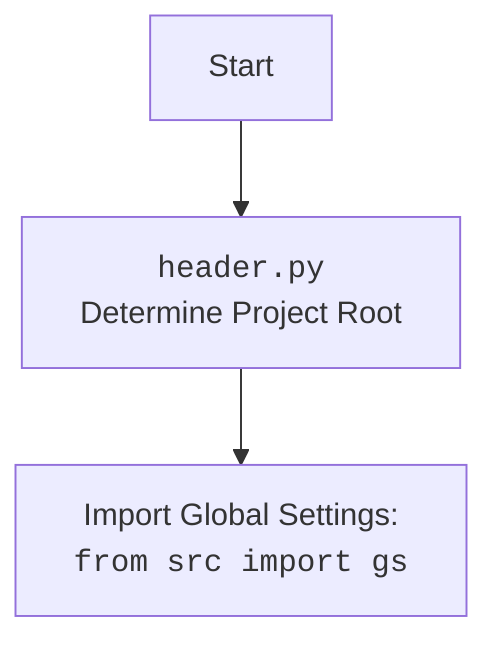

## Анализ кода `hypotez/src/endpoints/bots/telegram/digital_market/bot/main.py`

### 1. <алгоритм>
#### Пошаговая блок-схема:

1.  **Инициализация:**
    *   Запускается `main()`.
    *   Вызывается `register_middlewares()`.
        *   Регистрируются `DatabaseMiddlewareWithoutCommit` и `DatabaseMiddlewareWithCommit` в диспетчере `dp`.
    *   Вызывается `register_routers()`.
        *   Регистрируются маршрутизаторы `catalog_router`, `user_router` и `admin_router` в `dp`.
    *   Вызывается `create_app()`.
        *   Создается экземпляр `aiohttp.web.Application`.
        *   Добавляются обработчики для webhook-ов и страниц:
            *   `/{settings.BOT_TOKEN}` обрабатывается `handle_webhook`.
                *   Пример: `POST /123456:ABC-DEF1234ghIkl-567890` вызывает `handle_webhook`.
            *   `/robokassa/result/` обрабатывается `robokassa_result`.
                *   Пример: `POST /robokassa/result/` вызывает `robokassa_result`.
            *   `/robokassa/fail/` обрабатывается `robokassa_fail`.
                *   Пример: `GET /robokassa/fail/` вызывает `robokassa_fail`.
            *   `/` обрабатывается `home_page`.
                *   Пример: `GET /` вызывает `home_page`.
        *   `setup_application` настраивает приложение с `dp` и `bot`.
        *   Добавляются функции `on_startup` и `on_shutdown` в обработчики событий приложения.
        *   Возвращается сконфигурированное приложение `app`.
2.  **Запуск приложения:**
    *   `web.run_app(app, host=settings.SITE_HOST, port=settings.SITE_PORT)` запускает `aiohttp` сервер.
    *   Запускается `on_startup`.
        *   Вызывается `set_default_commands()`, устанавливая команду `/start`.
        *   Устанавливается webhook на адрес `settings.get_webhook_url`.
            *   Пример: `https://example.com/webhook`.
        *   Бот отправляет сообщение о запуске всем администраторам.
    *   Приложение начинает слушать входящие запросы.
3.  **Обработка запросов:**
    *   Входящие `POST` запросы к `{settings.BOT_TOKEN}` обрабатываются через `handle_webhook` и передаются в `dp`, который распределяет их по зарегистрированным роутерам (сообщения от пользователей, callback-запросы и т.д).
    *   Запросы к `/robokassa/result/` и `/robokassa/fail/` обрабатывают платежные результаты.
    *   Запрос к `/` отображает главную страницу.
4.  **Остановка приложения:**
    *   При остановке сервера вызывается `on_shutdown`.
        *   Бот отправляет сообщение об остановке всем администраторам.
        *   Удаляется webhook.
        *   Закрывается сессия бота.

### 2. <mermaid>

```mermaid
flowchart TD
    Start(Start main()) --> registerMiddlewares[register_middlewares()]
    registerMiddlewares --> registerRouters[register_routers()]
    registerRouters --> createApp[create_app()]
    createApp --> runWebApp[web.run_app()]
    runWebApp --> onStartup[on_startup]
    onStartup --> setCommands[set_default_commands()]
    setCommands --> setWebhook[bot.set_webhook()]
    setWebhook --> sendAdminMessage[Send start message to admins]
    sendAdminMessage --> listenRequests[App listen for requests]
    listenRequests --> handleWebhook{handle_webhook}
    handleWebhook --> dp[dp]
    dp --> routeMessage{Route message to routers}
    routeMessage --> user_router
    routeMessage --> catalog_router
    routeMessage --> admin_router
    listenRequests --> robokassaResult[/robokassa/result/]
     listenRequests --> robokassaFail[/robokassa/fail/]
     listenRequests --> homePage[/]
    runWebApp --> onShutdown[on_shutdown]
    onShutdown --> sendStopMessage[Send stop message to admins]
    sendStopMessage --> deleteWebhook[bot.delete_webhook()]
    deleteWebhook --> closeSession[bot.session.close()]

    style Start fill:#f9f,stroke:#333,stroke-width:2px
    style onStartup fill:#ccf,stroke:#333,stroke-width:2px
    style onShutdown fill:#cff,stroke:#333,stroke-width:2px
    style listenRequests fill:#cfc,stroke:#333,stroke-width:2px
    style dp fill:#ffc,stroke:#333,stroke-width:2px
    style routeMessage fill:#cfc,stroke:#333,stroke-width:2px
```


**Объяснение зависимостей:**

*   **`aiogram.webhook.aiohttp_server`:** Используется для настройки webhook-сервера на базе `aiohttp` для приема обновлений от Telegram.
*   **`aiohttp.web`:** Библиотека для создания асинхронных веб-приложений.
*   **`aiogram.types`:** Содержит типы данных для работы с Telegram API, например, `BotCommand` и `BotCommandScopeDefault`.
*   **`loguru`:** Используется для логирования событий приложения.
*   **`bot.app.app`:** Содержит обработчики webhook-ов (`handle_webhook`), страниц (`home_page`), и обработчики платежных результатов (`robokassa_result`, `robokassa_fail`).
*   **`bot.config`:** Содержит настройки бота, токен, список админов, экземпляр `bot` и диспетчера `dp`, а также общие настройки.
*   **`bot.dao.database_middleware`:**  Содержит мидлвари для работы с базой данных (без и с коммитом транзакции).
*   **`bot.admin.admin`:**  Роутер для административных команд.
*   **`bot.user.user_router`:**  Роутер для пользовательских команд.
*   **`bot.user.catalog_router`:** Роутер для команд каталога.

### 3. <объяснение>

**Импорты:**

*   `from aiogram.webhook.aiohttp_server import setup_application`: Импортирует функцию `setup_application` для связывания `aiogram` и `aiohttp` для обработки webhook.
*   `from aiohttp import web`: Импортирует модуль `web` для создания веб-приложения.
*   `from aiogram.types import BotCommand, BotCommandScopeDefault`: Импортирует классы `BotCommand` и `BotCommandScopeDefault` для управления командами бота.
*   `from loguru import logger`: Импортирует объект `logger` для логирования событий.
*   `from bot.app.app import handle_webhook, robokassa_result, robokassa_fail, home_page`: Импортирует функции, обрабатывающие webhook, результаты оплаты, и главную страницу.
*   `from bot.config import bot, admins, dp, settings`: Импортирует настройки бота, список админов, диспетчер и общие настройки из модуля `config`.
*   `from bot.dao.database_middleware import DatabaseMiddlewareWithoutCommit, DatabaseMiddlewareWithCommit`: Импортирует мидлвари для работы с базой данных.
*   `from bot.admin.admin import admin_router`: Импортирует роутер для административных команд.
*    `from bot.user.user_router import user_router`: Импортирует роутер для пользовательских команд.
*    `from bot.user.catalog_router import catalog_router`: Импортирует роутер для команд каталога.

**Функции:**

*   `set_default_commands()`:
    *   **Назначение**: Устанавливает команды бота по умолчанию.
    *   **Аргументы**: Нет.
    *   **Возвращаемое значение**: Нет.
    *   **Пример**: Устанавливает команду `/start`.
*   `on_startup(app)`:
    *   **Назначение**: Выполняется при запуске приложения.
    *   **Аргументы**: `app` - экземпляр `aiohttp.web.Application`.
    *   **Возвращаемое значение**: Нет.
    *   **Пример**: Устанавливает webhook, отправляет уведомление админам о запуске.
*   `on_shutdown(app)`:
    *   **Назначение**: Выполняется при остановке приложения.
    *   **Аргументы**: `app` - экземпляр `aiohttp.web.Application`.
    *   **Возвращаемое значение**: Нет.
    *   **Пример**: Отправляет уведомление админам об остановке, удаляет webhook.
*   `register_middlewares()`:
    *   **Назначение**: Регистрирует мидлвари для диспетчера `dp`.
    *   **Аргументы**: Нет.
    *   **Возвращаемое значение**: Нет.
    *    **Пример**: Регистрирует `DatabaseMiddlewareWithoutCommit` и `DatabaseMiddlewareWithCommit`.
*    `register_routers()`:
    *    **Назначение**: Регистрирует маршрутизаторы для диспетчера `dp`.
    *   **Аргументы**: Нет.
    *   **Возвращаемое значение**: Нет.
    *   **Пример**: Регистрирует `catalog_router`, `user_router`, и `admin_router`.
*   `create_app()`:
    *   **Назначение**: Создает и настраивает приложение `aiohttp`.
    *   **Аргументы**: Нет.
    *   **Возвращаемое значение**: `aiohttp.web.Application` - сконфигурированное веб-приложение.
    *   **Пример**: Создает приложение, настраивает маршруты, связывает его с `aiogram`, добавляет функции запуска и остановки.
*   `main()`:
    *   **Назначение**: Главная функция запуска приложения.
    *   **Аргументы**: Нет.
    *   **Возвращаемое значение**: Нет.
    *   **Пример**: Вызывает `register_middlewares`, `register_routers`, `create_app` и запускает веб-сервер.

**Переменные:**

*   `commands`: Список объектов `BotCommand` для настройки команд бота.
*   `app`: Экземпляр `aiohttp.web.Application`.
*   `admin_id`: ID администратора Telegram.

**Объяснение работы:**

Данный код представляет собой основу Telegram бота, построенного с использованием `aiogram` и `aiohttp`. Код выполняет следующие задачи:

1.  **Инициализация**: Создается веб-приложение `aiohttp`, регистрируются мидлвари, роутеры, а также обработчики для webhook-ов, страниц, и платежных систем.
2.  **Запуск**: Приложение запускается, устанавливается webhook, бот уведомляет администраторов о запуске.
3.  **Обработка запросов**: Приложение обрабатывает входящие `POST` запросы на адрес вебхука, перенаправляя их в диспетчер `dp` для дальнейшей обработки.
4.  **Остановка**: При остановке приложения бот уведомляет администраторов об остановке, удаляется webhook и закрывается сессия.

**Потенциальные ошибки и области для улучшения:**

*   Обработка ошибок в `try...except` блоках, где отправляются сообщения администраторам, может быть более детализирована, например, логирование конкретных ошибок.
*   Логика обработки платежей (функции `robokassa_result`, `robokassa_fail`) не описана в этом файле, что может потребовать дополнительного анализа.
*   Код не обрабатывает возможные проблемы при установке webhook, которые также стоит обрабатывать через `try...except`.

**Взаимосвязи с другими частями проекта:**
* `bot.config`: Здесь хранятся настройки, включая токен бота, список админов, настройки webhook и другие параметры, которые необходимы для работы приложения.
* `bot.app.app`: Здесь находятся основные функции, которые обрабатывают webhook от Telegram, результаты платежей и запросы на главную страницу.
* `bot.dao.database_middleware`: Эти мидлвари обеспечивают работу с базой данных, обрабатывая транзакции до и после выполнения запроса.
* `bot.admin.admin`, `bot.user.user_router`, `bot.user.catalog_router`:  Это роутеры, которые распределяют входящие сообщения от пользователей и команды по различным модулям и функциональностям бота.
* Все роутеры используют `dp` для обработки сообщений от пользователей.