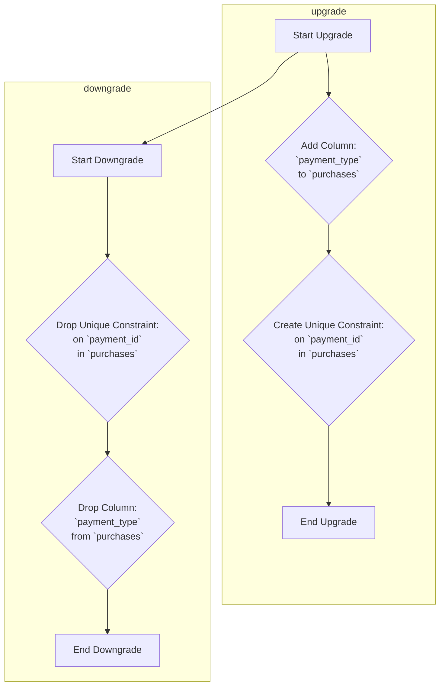

## Анализ кода миграции базы данных

### 1. <алгоритм>

**upgrade()**:

1.  **Начало**: Функция `upgrade` вызывается для применения изменений к базе данных.
2.  **Добавление столбца**: Используется `op.add_column` для добавления нового столбца `payment_type` в таблицу `purchases`. Тип данных столбца - `String`, и он не может быть `NULL`.
    *   _Пример_: Добавление столбца `payment_type` с типом `String` и ограничением `NOT NULL` в таблицу `purchases`.
3.  **Создание уникального ограничения**: Используется `op.create_unique_constraint` для создания уникального ограничения для столбца `payment_id` в таблице `purchases`.
    *   _Пример_: Добавление уникального ключа на колонку `payment_id` таблицы `purchases`.
4.  **Конец**: Функция `upgrade` завершает работу.

**downgrade()**:

1.  **Начало**: Функция `downgrade` вызывается для отмены изменений, внесенных функцией `upgrade`.
2.  **Удаление уникального ограничения**: Используется `op.drop_constraint` для удаления уникального ограничения из таблицы `purchases`. Тип ограничения - `unique`.
    *   _Пример_: Удаление уникального ограничения на колонку `payment_id` таблицы `purchases`.
3.  **Удаление столбца**: Используется `op.drop_column` для удаления столбца `payment_type` из таблицы `purchases`.
    *   _Пример_: Удаление столбца `payment_type` из таблицы `purchases`.
4.  **Конец**: Функция `downgrade` завершает работу.

### 2. <mermaid>

**Описание зависимостей:**

*   `alembic`: Используется для управления миграциями базы данных.
*   `sqlalchemy`: Используется для взаимодействия с базой данных через ORM.
*   `op`: Объект из `alembic`, который предоставляет операции для изменения схемы базы данных.
*   `sa`: Используется для определения типов столбцов.

### 3. <объяснение>

**Импорты:**

*   `from typing import Sequence, Union`: Импортируются типы `Sequence` и `Union` для аннотации типов. Они используются для указания, что переменные `down_revision`, `branch_labels` и `depends_on` могут быть либо строкой, либо списком строк, либо `None`.
*   `from alembic import op`: Импортируется объект `op` из библиотеки `alembic`, который используется для выполнения операций изменения схемы базы данных.
*   `import sqlalchemy as sa`: Импортируется библиотека `sqlalchemy` под псевдонимом `sa`. Используется для определения типов столбцов.

**Переменные:**

*   `revision: str = '5ca0f991801d'`: Идентификатор текущей ревизии миграции.
*   `down_revision: Union[str, None] = '1720ca777755'`: Идентификатор предыдущей ревизии миграции. Может быть строкой или `None`, если это первая миграция.
*   `branch_labels: Union[str, Sequence[str], None] = None`: Метки ветвей, связанные с этой миграцией. В данном случае не используются.
*   `depends_on: Union[str, Sequence[str], None] = None`: Миграции, от которых зависит эта миграция. В данном случае нет зависимостей.

**Функции:**

*   `def upgrade() -> None`: Функция, выполняющая обновление базы данных до текущей ревизии.
    *   `op.add_column('purchases', sa.Column('payment_type', sa.String(), nullable=False))`: Добавляет столбец `payment_type` типа `String` в таблицу `purchases`, который не может быть `NULL`.
    *   `op.create_unique_constraint(None, 'purchases', ['payment_id'])`: Создает уникальное ограничение для столбца `payment_id` в таблице `purchases`. Имя ограничения не задано (`None`), оно сгенерируется автоматически.
*   `def downgrade() -> None`: Функция, выполняющая откат изменений, внесенных `upgrade()`.
    *   `op.drop_constraint(None, 'purchases', type_='unique')`: Удаляет уникальное ограничение из таблицы `purchases`. Тип ограничения задан как `unique`. Имя ограничения не задано, поэтому удаляется первое найденное уникальное ограничение.
    *   `op.drop_column('purchases', 'payment_type')`: Удаляет столбец `payment_type` из таблицы `purchases`.

**Объяснение:**

Этот код представляет собой миграцию базы данных, созданную с помощью Alembic. Миграция добавляет новый столбец `payment_type` в таблицу `purchases` и устанавливает уникальное ограничение на столбец `payment_id`. Функция `upgrade()` применяет изменения, а `downgrade()` откатывает их.

**Потенциальные ошибки и области для улучшения:**

1.  **Имя ограничения:** При создании уникального ограничения не задано имя (используется `None`). Это может затруднить отладку и поддержку. Рекомендуется явно указывать имена ограничений.
2.  **Удаление ограничения**: При откате изменений удаляется первое попавшееся уникальное ограничение. Желательно было бы указывать имя ограничения при удалении.
3.  **Типы данных:** Уточнить тип `String` в SQLAlchemy: можно использовать конкретный тип, например `sa.VARCHAR(255)`.
4.  **Комментарии:**  Добавить более подробные комментарии, объясняющие, зачем добавляется столбец и для каких целей ставится уникальное ограничение.

**Цепочка взаимосвязей:**

Эта миграция является частью системы управления версиями базы данных, которая используется для отслеживания и применения изменений в схеме базы данных. Она является частью процесса развертывания (деплоя) приложения. Данная миграция вероятно используется в Telegram боте для учета транзакций, в части digital market.