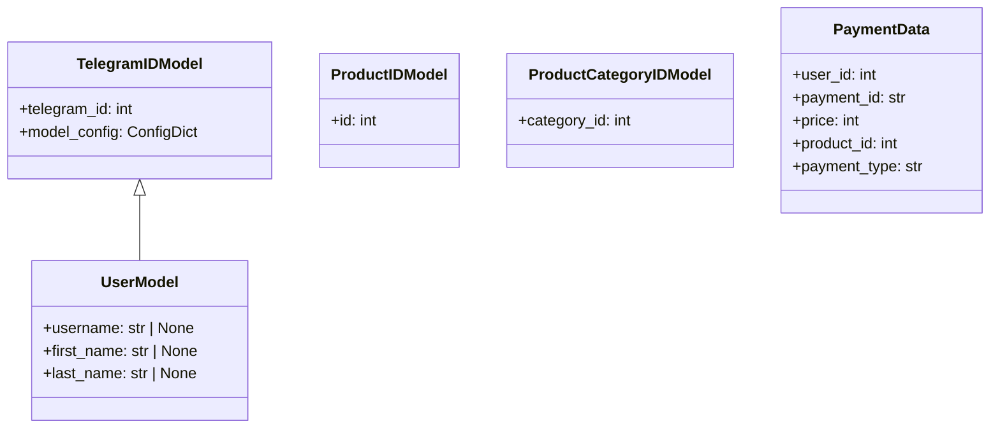

## АНАЛИЗ КОДА

### 1. <алгоритм>

**Блок-схема:**

```mermaid
graph LR
    A[Начало] --> B(TelegramIDModel);
    B --> C{Определение telegram_id:int};
    C --> D(UserModel);
    D --> E{Определение username:str|None, first_name:str|None, last_name:str|None};
    E --> F(ProductIDModel);
    F --> G{Определение id:int};
    G --> H(ProductCategoryIDModel);
    H --> I{Определение category_id:int};
    I --> J(PaymentData);
    J --> K{Определение user_id:int, payment_id:str, price:int, product_id:int, payment_type:str};
    K --> L[Конец];
```

**Примеры:**

1.  **TelegramIDModel:**
    *   Входные данные: `{"telegram_id": 12345}`
    *   Результат: Объект `TelegramIDModel` с `telegram_id = 12345`.
2.  **UserModel:**
    *   Входные данные: `{"telegram_id": 12345, "username": "testuser", "first_name": "Test", "last_name": "User"}`
    *   Результат: Объект `UserModel` с соответствующими атрибутами.
3.  **ProductIDModel:**
    *   Входные данные: `{"id": 10}`
    *   Результат: Объект `ProductIDModel` с `id = 10`.
4.  **ProductCategoryIDModel:**
    *   Входные данные: `{"category_id": 5}`
    *   Результат: Объект `ProductCategoryIDModel` с `category_id = 5`.
5.  **PaymentData:**
    *   Входные данные: `{"user_id": 12345, "payment_id": "abc123xyz", "price": 100, "product_id": 10, "payment_type": "card"}`
    *   Результат: Объект `PaymentData` с атрибутами: `user_id=12345`, `payment_id="abc123xyz"`, `price=100`, `product_id=10`, `payment_type="card"`.

### 2. <mermaid>



**Объяснение зависимостей `mermaid`:**

*   `TelegramIDModel`, `UserModel`, `ProductIDModel`, `ProductCategoryIDModel`, и `PaymentData` - это классы, которые расширяют функциональность `BaseModel` из библиотеки `pydantic`.
*   `TelegramIDModel <|-- UserModel` означает, что `UserModel` наследует от `TelegramIDModel`, т.е. является подклассом. Это означает, что `UserModel` будет иметь все атрибуты `TelegramIDModel`, в данном случае, поле `telegram_id`, а также свои собственные (`username`, `first_name`, `last_name`).

### 3. <объяснение>

**Импорты:**

*   `from pydantic import BaseModel, ConfigDict, Field`:
    *   `BaseModel`: Базовый класс для создания моделей данных с проверкой типов, который используется для всех моделей в этом коде.
    *   `ConfigDict`: Класс конфигурации `pydantic`, используемый для настройки поведения моделей, в данном случае `from_attributes=True` для `TelegramIDModel`, который позволяет создавать экземпляры модели из атрибутов объектов.
    *   `Field`: Используется для задания дополнительных параметров полей, например `description`, `max_length`  в классе `PaymentData`.

**Классы:**

1.  **`TelegramIDModel(BaseModel)`:**
    *   **Роль:**  Базовая модель для хранения идентификатора пользователя Telegram.
    *   **Атрибуты:**
        *   `telegram_id: int`: Уникальный идентификатор пользователя в Telegram.
        *   `model_config`:  Конфигурация модели, здесь `from_attributes=True` позволяет инициализировать модель из атрибутов объекта.
    *   **Методы:** Наследуется от `BaseModel`.
    *   **Взаимодействие:** Является базовым классом для `UserModel`.

2.  **`UserModel(TelegramIDModel)`:**
    *   **Роль:**  Модель для хранения данных пользователя Telegram.
    *   **Атрибуты:**
        *   `username: str | None`:  Имя пользователя в Telegram (может быть `None`).
        *   `first_name: str | None`: Имя пользователя (может быть `None`).
        *   `last_name: str | None`: Фамилия пользователя (может быть `None`).
        *   Наследует атрибут `telegram_id` от `TelegramIDModel`.
    *   **Методы:** Наследуется от `BaseModel`.
    *   **Взаимодействие:** Наследует от `TelegramIDModel`, использует его атрибут `telegram_id`.

3.  **`ProductIDModel(BaseModel)`:**
    *   **Роль:** Модель для хранения идентификатора товара.
    *   **Атрибуты:**
        *   `id: int`: Уникальный идентификатор товара.
    *   **Методы:** Наследуется от `BaseModel`.
    *   **Взаимодействие:** Используется как часть данных в `PaymentData`.

4.  **`ProductCategoryIDModel(BaseModel)`:**
    *   **Роль:** Модель для хранения идентификатора категории товара.
    *   **Атрибуты:**
        *   `category_id: int`: Уникальный идентификатор категории товара.
    *   **Методы:** Наследуется от `BaseModel`.
    *   **Взаимодействие:** Может использоваться для запросов категорий товаров.

5.  **`PaymentData(BaseModel)`:**
    *   **Роль:** Модель для хранения данных об оплате.
    *   **Атрибуты:**
        *   `user_id: int`: Идентификатор пользователя, совершившего оплату, описанный через `Field` как "ID пользователя Telegram".
        *   `payment_id: str`: Уникальный идентификатор платежа, ограниченный длиной 255 символов, описанный через `Field` как "Уникальный ID платежа".
        *   `price: int`: Сумма платежа в рублях, описанная через `Field` как "Сумма платежа в рублях".
        *   `product_id: int`: Идентификатор товара, за который совершена оплата, описанный через `Field` как "ID товара".
        *   `payment_type: str`: Тип оплаты, описанный через `Field` как "Тип оплаты".
    *   **Методы:** Наследуется от `BaseModel`.
    *   **Взаимодействие:** Используется для обработки данных платежей, связан с пользователями, товарами и платежными системами.

**Функции:**

*   В этом коде нет явно определенных функций. Используются только классы.

**Переменные:**

*   Атрибуты классов (например, `telegram_id`, `username`, `price` и т.д.) являются переменными, хранящими данные конкретных типов, такие как `int`, `str` и `None`.

**Потенциальные ошибки и области для улучшения:**

*   **Валидация:** Можно добавить более строгие проверки валидации данных, например, формат `payment_id`, ограничение минимальной и максимальной цены, валидацию типа оплаты, чтобы обеспечить целостность и корректность данных.
*   **Описание:** Можно добавить более подробные описания к полям в `Field`, чтобы документация была более понятной.
*   **Использование:**
    *   Эти модели предназначены для работы с данными, получаемыми из Telegram API, а также для обработки платежных данных. Их можно использовать в функциях бота для обработки данных о пользователях, товарах и оплатах.
    *   Цепочка взаимосвязей: Модели связаны между собой и с внешними системами (Telegram API, платежные системы), т.к. `UserModel` наследуется от `TelegramIDModel`, а `PaymentData` включает в себя атрибуты `user_id`, `product_id`, что создает связи между данными о пользователях и товарах.

**Цепочка взаимосвязей с другими частями проекта (если применимо):**

*   **Telegram Bot:** Эти модели используются для обработки данных, получаемых от Telegram (пользователи, команды, сообщения), а также для формирования ответов.
*   **База данных:** Модели могут быть использованы для сохранения данных в базу данных (например, пользователей, товаров, транзакции) и для извлечения данных из базы.
*   **Платежная система:** `PaymentData` используется для обработки платежных транзакций. Данные о платежах могут быть переданы в сторонние платежные системы для обработки и верификации.

Этот код представляет собой набор моделей данных для работы с пользователями, товарами и платежами в контексте Telegram-бота, и является важной частью проекта для обеспечения корректной работы с этими данными.