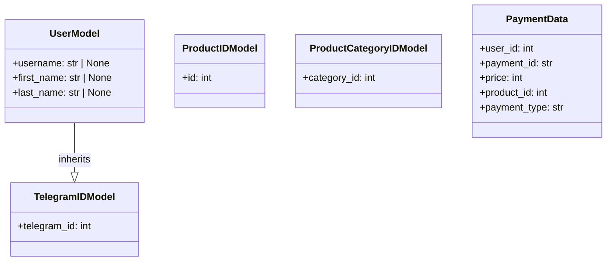

## АНАЛИЗ КОДА

### <алгоритм>

1.  **TelegramIDModel:**
    *   **Вход:** `telegram_id` (целое число).
    *   **Проверка:** Валидация, что `telegram_id` является целым числом.
    *   **Выход:** Объект `TelegramIDModel` с атрибутом `telegram_id`.
    *   *Пример:*
        *   Ввод: `telegram_id=123456789`
        *   Выход: `TelegramIDModel(telegram_id=123456789)`

2.  **UserModel:**
    *   **Вход:** `telegram_id` (целое число), `username` (строка или None), `first_name` (строка или None), `last_name` (строка или None).
    *   **Проверка:** Валидация, что `telegram_id` является целым числом, остальные поля являются строками или None.
    *   **Выход:** Объект `UserModel`, наследующий от `TelegramIDModel`, с атрибутами `telegram_id`, `username`, `first_name`, `last_name`.
    *   *Пример:*
        *   Ввод: `telegram_id=987654321`, `username='testuser'`, `first_name='Test'`, `last_name='User'`
        *   Выход: `UserModel(telegram_id=987654321, username='testuser', first_name='Test', last_name='User')`

3.  **ProductIDModel:**
    *   **Вход:** `id` (целое число).
    *   **Проверка:** Валидация, что `id` является целым числом.
    *   **Выход:** Объект `ProductIDModel` с атрибутом `id`.
    *   *Пример:*
        *   Ввод: `id=123`
        *   Выход: `ProductIDModel(id=123)`

4.  **ProductCategoryIDModel:**
    *   **Вход:** `category_id` (целое число).
    *   **Проверка:** Валидация, что `category_id` является целым числом.
    *   **Выход:** Объект `ProductCategoryIDModel` с атрибутом `category_id`.
    *   *Пример:*
        *   Ввод: `category_id=456`
        *   Выход: `ProductCategoryIDModel(category_id=456)`

5.  **PaymentData:**
    *   **Вход:** `user_id` (целое число), `payment_id` (строка, max_length=255), `price` (целое число), `product_id` (целое число), `payment_type` (строка).
    *   **Проверка:** Валидация, что `user_id`, `price`, `product_id` являются целыми числами; `payment_id` является строкой с максимальной длиной 255, `payment_type` строка.
    *   **Выход:** Объект `PaymentData` с атрибутами `user_id`, `payment_id`, `price`, `product_id`, `payment_type`.
    *   *Пример:*
        *   Ввод: `user_id=111`, `payment_id='1a2b3c'`, `price=1000`, `product_id=789`, `payment_type='card'`
        *   Выход: `PaymentData(user_id=111, payment_id='1a2b3c', price=1000, product_id=789, payment_type='card')`

### <mermaid>

### <объяснение>

**Импорты:**
*   `from pydantic import BaseModel, ConfigDict, Field`:
    *   `BaseModel`: Базовый класс для создания моделей данных с валидацией типов.
    *   `ConfigDict`: Используется для конфигурации модели (например, извлечение данных из атрибутов).
    *   `Field`: Используется для настройки отдельных полей модели, например, добавить описание или ограничения.

**Классы:**

1.  **`TelegramIDModel`**:
    *   **Роль:** Представляет модель для хранения идентификатора Telegram пользователя.
    *   **Атрибуты:**
        *   `telegram_id`: `int` - ID пользователя в Telegram.
    *   **Методы**:
        *   Не имеет собственных методов, наследует методы `BaseModel`.
    *   **Взаимодействие:**  Используется как базовый класс для `UserModel`.

2.  **`UserModel`**:
    *   **Роль:** Представляет модель для хранения информации о пользователе Telegram.
    *   **Атрибуты:**
        *   `telegram_id`: `int` - ID пользователя в Telegram (унаследован от `TelegramIDModel`).
        *   `username`: `str | None` - username пользователя в Telegram (может быть `None`).
        *   `first_name`: `str | None` - Имя пользователя (может быть `None`).
        *   `last_name`: `str | None` - Фамилия пользователя (может быть `None`).
    *   **Методы**:
        *   Не имеет собственных методов, наследует методы `BaseModel`.
    *   **Взаимодействие:**  Наследует от `TelegramIDModel`, используется для хранения данных пользователя.

3.  **`ProductIDModel`**:
    *   **Роль:** Модель для хранения идентификатора продукта.
    *   **Атрибуты:**
        *   `id`: `int` - ID продукта.
    *   **Методы**:
        *   Не имеет собственных методов, наследует методы `BaseModel`.
    *   **Взаимодействие:** Используется для идентификации продукта.

4.  **`ProductCategoryIDModel`**:
    *   **Роль:** Модель для хранения идентификатора категории продукта.
    *   **Атрибуты:**
        *   `category_id`: `int` - ID категории продукта.
    *   **Методы**:
        *   Не имеет собственных методов, наследует методы `BaseModel`.
    *   **Взаимодействие:** Используется для идентификации категории продукта.

5.  **`PaymentData`**:
    *   **Роль:** Модель для хранения данных о платеже.
    *   **Атрибуты:**
        *   `user_id`: `int` - ID пользователя, совершившего платеж.
        *   `payment_id`: `str` - Уникальный ID платежа.
        *   `price`: `int` - Сумма платежа.
        *   `product_id`: `int` - ID купленного продукта.
        *   `payment_type`: `str` - Тип оплаты (например, "card", "crypto").
    *    **Методы:**
         *   Не имеет собственных методов, наследует методы `BaseModel`.
    *   **Взаимодействие:**  Используется для хранения данных о платеже.

**Переменные:**
*   Все переменные определены как атрибуты классов, используются для хранения данных.

**Потенциальные ошибки и области для улучшения:**

*   В `UserModel` поля `username`, `first_name`, `last_name` объявлены как `str | None`, что допускает отсутствие этих данных.  Возможно, стоит рассмотреть, какие поля являются обязательными.
*   В `PaymentData` отсутствует информация о дате или времени платежа.  Возможно стоит добавить поля `created_at` или `paid_at`.
*   Код не содержит проверки на отрицательные значения там, где они не уместны, например, в `price`.  Было бы полезно добавить валидацию для этого.
*   Отсутствует документация к классам и полям (используются описания в `Field`, но можно добавить докстринги).

**Взаимосвязи с другими частями проекта:**

*   Данные классы используются в рамках Telegram-бота для обработки и валидации данных, поступающих от пользователей или от платежных шлюзов.
*   `TelegramIDModel` и `UserModel` могут использоваться для хранения данных о пользователе в базе данных.
*   `PaymentData` используется для записи данных об успешных платежах в базу данных.
*   `ProductIDModel` и `ProductCategoryIDModel` используются для связи с товарами в магазине.